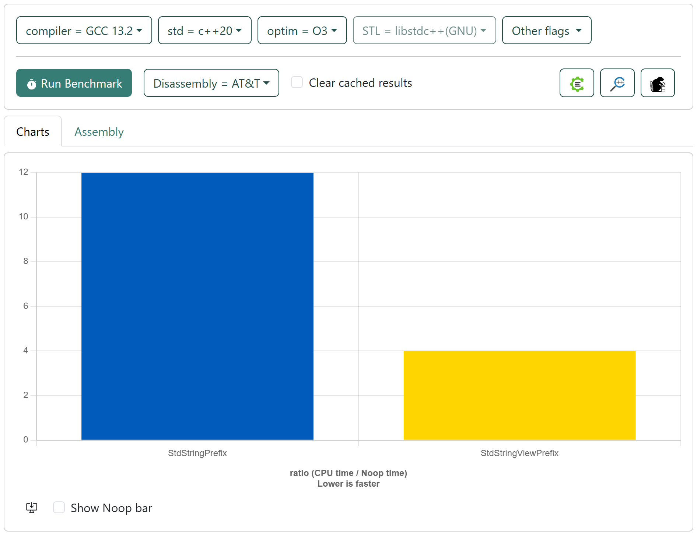
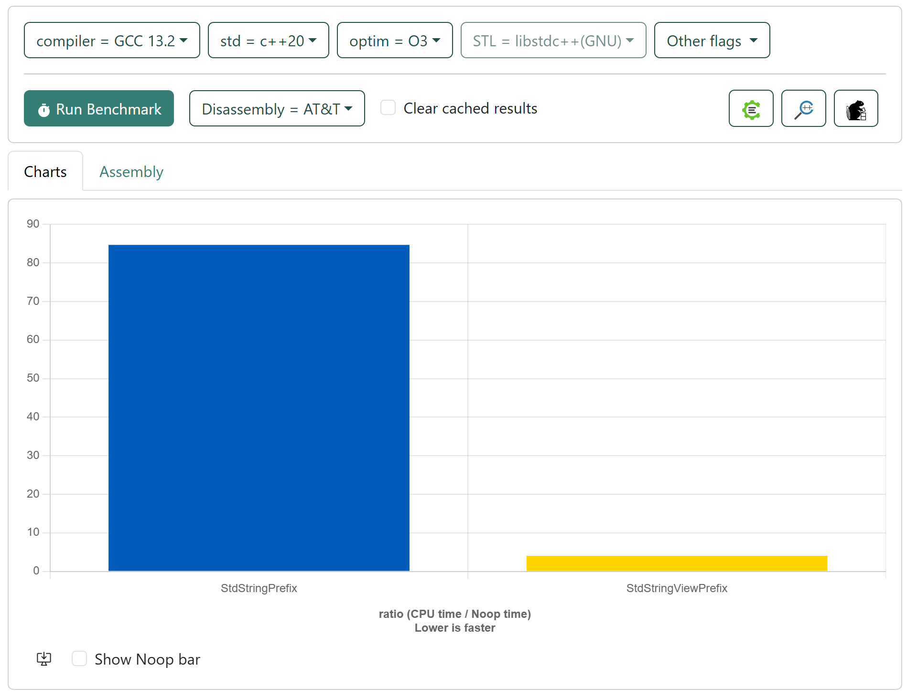
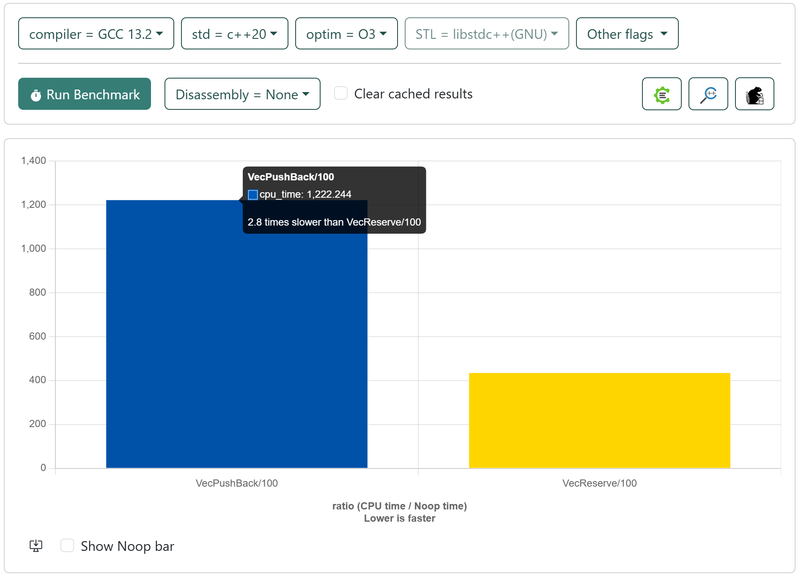

# Benchmarking

[Zurück](../Performance_Optimization/Readme_Performance_Optimization.md)

---

## Inhalt

  * [Allgemeines](#link1)
  * [Vergleich `const std::string&` versus `std::string_view`](#link2)
  * [Klasse `std::vector`: Bedeutung der `reserve`-Methode](#link3)

---

#### Quellcode

[*Benchmarking.cpp*](Benchmarking.cpp)<br />

---

## Allgemeines <a name="link1"></a>

In diesem Projekt setzen wir das Tool [Quick C++ Benchmark](https://quick-bench.com/) von *Fred Tingaud* ein.

Eine gute und vor allem ergänzende Tool-Beschreibung finden
wir [hier](https://jaredmil.medium.com/micro-benchmarking-c-with-quick-bench-8788b1edcf79).

Eine ganze Reihe von Vergleichsbeispielen hat *Mathieu Mallet* entwickelt
und [hier](https://gist.github.com/mathieumallet/22c8fa248b9d260b79f92090ffcd42f3) publiziert.

Der zu testende Code kann in zwei syntaktischen Formen geschrieben werden:

```cpp
for( auto _ : state)
{
    // code to be benchmarked
}
```

oder


```cpp
while( state.KeepRunning() )
{
    // code to be benchmarked
}
```

Auf die Schnelle betrachtet, ist die Variante mit der *Range-based for loop*
eine Neuerung gegenüber der klassischen Wiederholungsschleife mit `while`.

Wie man [hier](https://github.com/google/benchmark/pull/454) nachlesen kann,
ist die `while`-Variante jedoch mit einer Reihe von Nachteilen verbunden.

Eine Messung sollte also in dieser Schreibweise formiert werden:

```cpp
void BM_Foo(benchmark::State& state) {
	for (auto _ : state) {
		[...]  // code to be benchmarked
	}
}
```

---

## Vergleich `const std::string&` versus `std::string_view` <a name="link2"></a>

*Beispiel*:

```cpp
01: // prefix version using std::string
02: static std::string prefix(const std::string& str) {
03:     if (str.length() >= 5) {
04:         // extract a part of string
05:         auto substr = str.substr(1, 4);  // substr is a std::string
06:         return substr;
07:     }
08:     return {};
09: }
10: 
11: // prefix version using std::string_view
12: static std::string_view prefix(std::string_view str) {
13:     if (str.length() >= 5) {
14:         // extract a part of string
15:         auto substr = str.substr(1, 4);  // substr is a std::string_view
16:         return substr;
17:     }
18:     return {};
19: }
20: 
21: // Note: take care of SSO
22: auto StringArgument1 = "1234567890";
23: auto StringArgument2 = "The quick brown fox jumps over the lazy dog";
24: auto StringArgument = StringArgument1;
25: 
26: static void StdStringPrefix(benchmark::State& state) {
27: 
28:     for (auto _ : state) {
29: 
30:         std::string s{ StringArgument };
31:         auto result{ prefix(s) };
32: 
33:         benchmark::DoNotOptimize(result);
34:     }
35: }
36: 
37: BENCHMARK(StdStringPrefix); // register StdStringPrefix as a benchmark
38: 
39: static void StdStringViewPrefix(benchmark::State& state) {
40: 
41:     for (auto _ : state) {
42: 
43:         std::string_view s{ StringArgument };
44:         auto result{ prefix(s) };
45: 
46:         benchmark::DoNotOptimize(result);
47:     }
48: }
49: 
50: BENCHMARK(StdStringViewPrefix); // register StdStringViewPrefix as a benchmark
```

#### Erste Ausführung

Es wird bei dieser Ausführung die Zeichenkette `1234567890` zu Grunde gelegt.
Hier kommt es zur Anwendung der *SSO* (*Small String Optimization*):



*Abbildung* 1: Aufruf der `prefix`-Funktion mit `std::string`-Klasse.

#### Zweite Ausführung

Im zweiten Vergleich wurde eine sehr lange Zeichenkette verwendet.
Diese wird &ndash; bei Verwendung der `std::string`-Klasse &ndash;
auf dem Heap abgelegt. Ein `std::string_view`-Objekt hingegen
benutzt eine `const char*`-Adresse. In diesem Fall entscheiden der Compiler/Linker,
in welchem Datensegment des Prozesses diese Zeichenkette abgelegt wird.

Man kann in jedem Fall sagen, das es *nicht* die Halde ist.



*Abbildung* 2: Aufruf der `prefix`-Funktion mit `std::string_view`-Klasse.

---

## Klasse `std::vector`: Bedeutung der `reserve`-Methode <a name="link3"></a>

Instanzen der Klasse `std::vector` belegen nach ihrer Erzeugung
mit dem Standardkonstruktor zunächst keinen Speicherplatz auf dem Heap.

Dieser wird sukzessive bei entsprechenden `push_back`-Aufrufen reserviert.
Hier wird sehr viel unnütze Rechenzeit verbraucht, wenn man die &ndash; gerne auch ungefähre &ndash; 
Kapazität des `std::vector`-Objekts vorab weiß.

Mit der `reserve`-Methode lässt sich die *Kapazität* (benötigter Speicherplatz) des `std::vector`-Objekts
vorab reservieren.

Das folgende Code-Snippet stellt eine Vergleich mit und ohne Aufruf
der `reserve`-Methode an:

```cpp
01: static constexpr int VectorSize = 100;
02: 
03: static void VecPushBack(benchmark::State& state) {
04:   
05:   const auto size = state.range(0);
06: 
07:   for (auto _ : state) {
08:     std::vector<char> vec;    
09:     for (auto i = 0; i < size; ++i) 
10:       vec.push_back(' ');
11: 
12:     benchmark::DoNotOptimize(vec);
13:   }
14: }
15: 
16: BENCHMARK(VecPushBack)->Arg(VectorSize);
17: 
18: static void VecReserve(benchmark::State& state) {
19:   
20:   const auto size = state.range(0);
21: 
22:   for (auto _ : state) {
23:     std::vector<char> vec;
24:     vec.reserve(size);
25:     for (auto i = 0; i < size; ++i) 
26:       vec.push_back(' ');
27: 
28:     benchmark::DoNotOptimize(vec);
29:   }
30: }
31: 
32: BENCHMARK(VecReserve)->Arg(VectorSize);
```

Betrachten Sie die Zeilen 16 und 5 des Listings:
In Zeile 16 wird durch

```cpp
BENCHMARK(VecPushBack)->Arg(VectorSize);
```

ein Parameter &ndash; hier: `VectorSize` ist gleich `100` (siehe Zeile 1) &ndash; 
an die Benchmark-Funktion übergeben. Mit `state.range(0)`
kann man aus einem `State`-Objekt den Wert des Parameters abholen.



*Abbildung* 3: `std::vector`-Objekt mit und ohne Aufruf der `reserve`-Methode.

---

[Zurück](../Performance_Optimization/Readme_Performance_Optimization.md)

---
