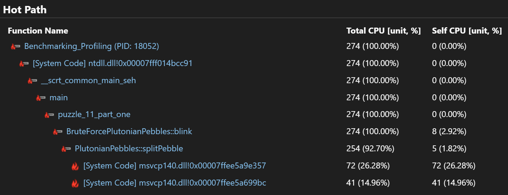
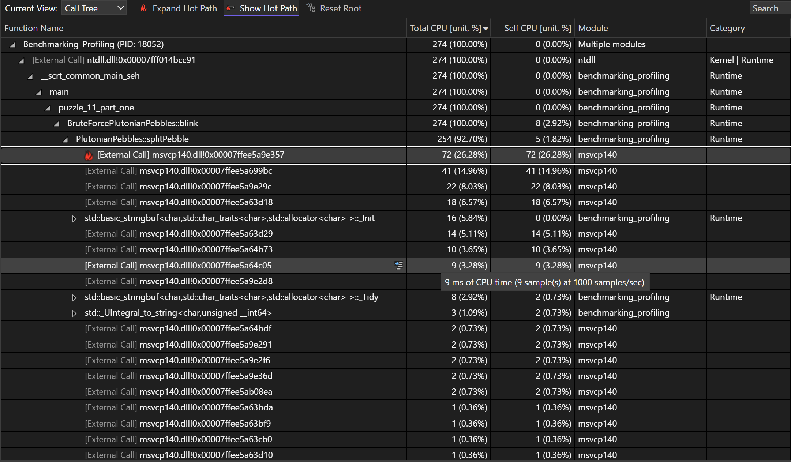
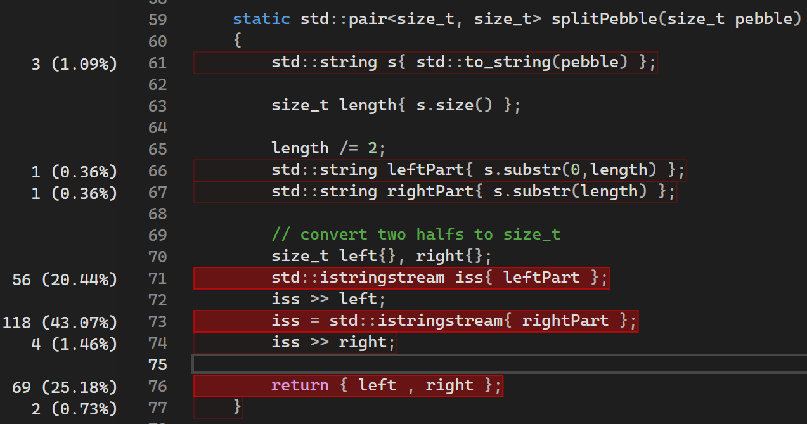
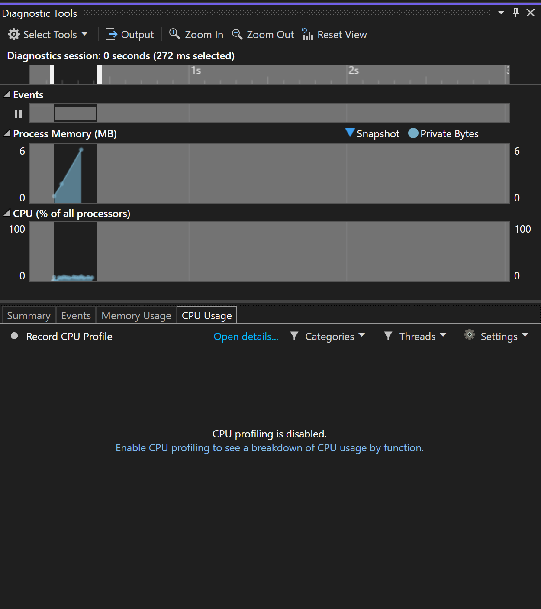
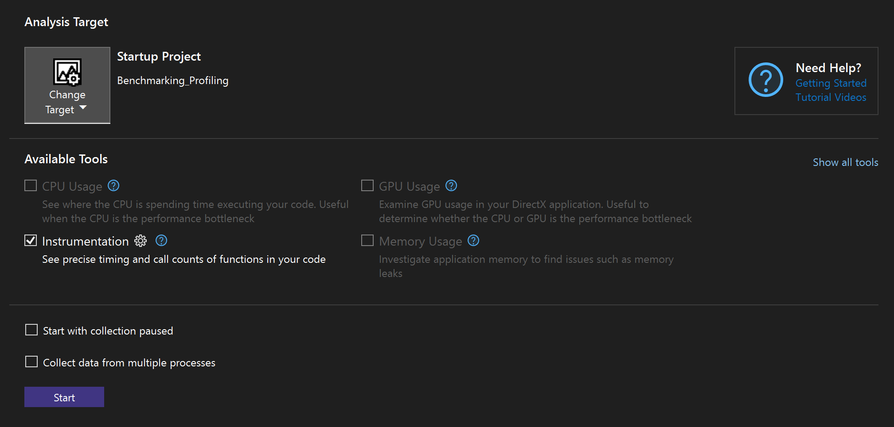
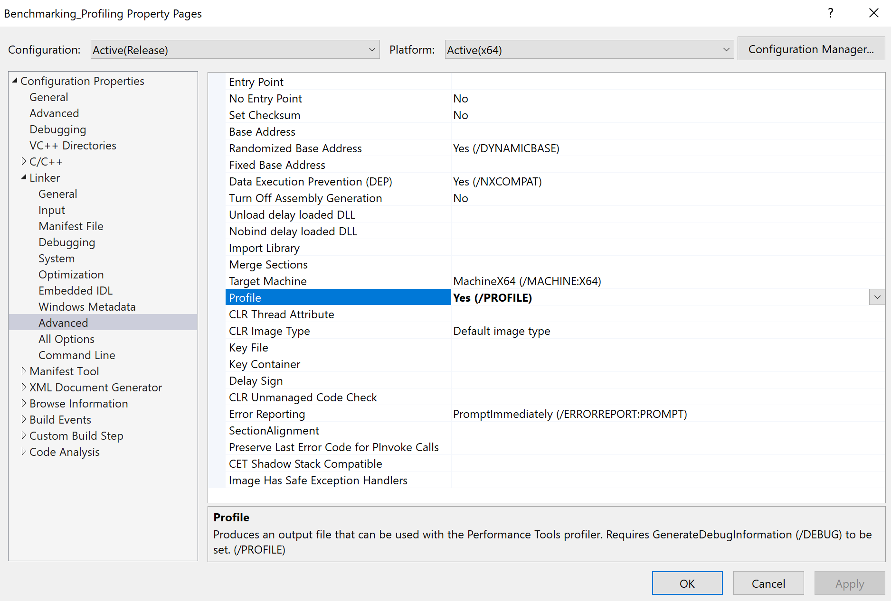
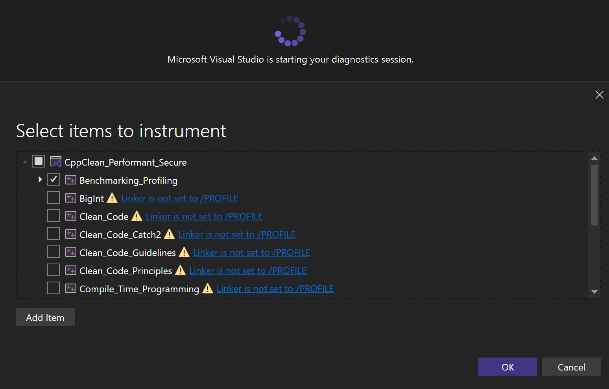
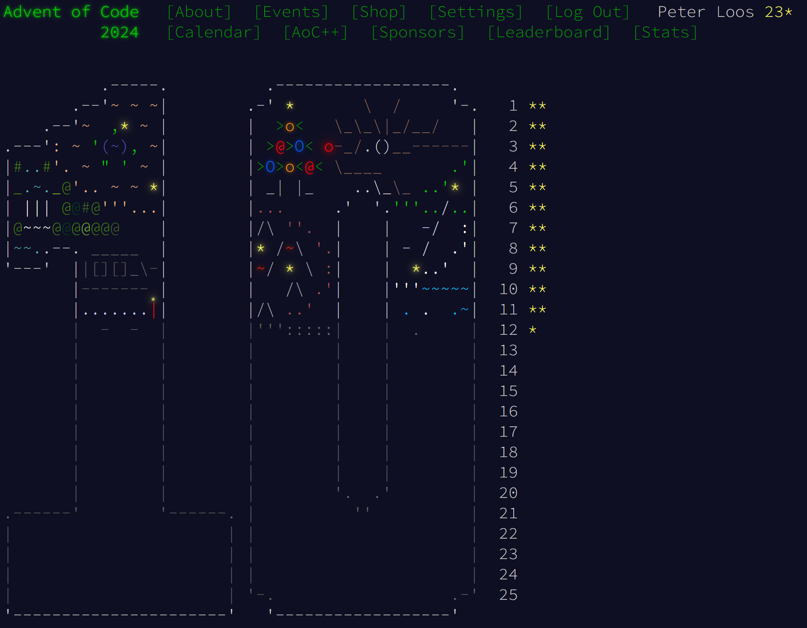

# Profiling

[Zurück](../Performance_Optimization/Readme_Performance_Optimization.md)

---

## Inhalt

  * [Allgemeines](#link1)
  * [*Visual Studio Diagnostic Tools*](#link2)
  * [Aktivieren der *Visual Studio Diagnostic Tools*](#link3)
  * [Instrumentierung einer C++ Anwendung mit Visual Studio](#link4)
  * [Ein Beispiel: &bdquo;*Plutonian Pebbles*&rdquo;](#link5)

---

#### Quellcode

[*Advent_of_Code_2024_No_11.cpp*](Advent_of_Code_2024_No_11.cpp) 

---

## Allgemeines 

Aus dem Buch &bdquo;[*Professional C++*](https://www.amazon.de/Professional-C-Marc-Gregoire/dp/1394193173)&rdquo; von Marc Gregoire zitiert:

&bdquo;Es ist ratsam, beim Entwerfen und Programmieren an die Effizienz zu denken.
Es macht keinen Sinn, offensichtlich ineffiziente Programme zu schreiben, wenn dies mit gesundem Menschenverstand oder erfahrungsbasierter Intuition vermieden werden kann.

Ich rate Ihnen jedoch dringend, sich in der Design- und Programmierphase nicht zu sehr auf die Leistung zu konzentrieren.

Es empfiehlt sich, zunächst ein sauberes, gut strukturiertes Design und eine gut strukturierte Implementierung zu erstellen,
dann einen Profiler zu verwenden und nur die Teile zu optimieren, die vom Profiler als Leistungsengpässe gekennzeichnet werden.

Denken Sie an die in dem Buch
&bdquo;[*Computer Architecture: A Quantitative Approach*](https://www.amazon.de/Computer-Architecture-Quantitative-Approach-Kaufmann/dp/0443154066)&rdquo;
von John L. Hennessy, David A. Patterson, Christos Kozyrakis
eingeführte &bdquo;90/10&rdquo;-Regel, die besagt, dass 90 Prozent der Laufzeit der meisten Programme
auf nur 10 Prozent des Codes entfallen.

Das bedeutet, dass Sie 90 Prozent Ihres Codes optimieren könnten, die Laufzeit des Programms aber dennoch nur um 10 Prozent verbessern würden.

Natürlich möchten Sie die am häufigsten beanspruchten Codeteile für die spezifische Arbeitslast optimieren, die das Programm voraussichtlich ausführen wird.&rdquo;

Und weiter:

&bdquo;Daher ist es oft hilfreich, ein Programm zu &bdquo;*profilen*&rdquo;, um festzustellen, welche Codeteile optimiert werden müssen.

Es gibt viele Profiling-Tools, die Programme während der Ausführung analysieren und Daten zur Leistung generieren.

Die meisten Profiling-Tools ermöglichen Analysen auf Funktionsebene, indem sie die für jede Funktion im Programm benötigte Zeit (oder den Prozentsatz der gesamten Ausführungszeit) angeben.

Nachdem Sie ein Profiling für Ihr Programm ausgeführt haben, können Sie in der Regel sofort erkennen, welche Programmteile optimiert werden müssen.

Profiling vor und nach der Optimierung ist unerlässlich, um den Erfolg Ihrer Optimierungen nachzuweisen.&rdquo;

---

## Visual Studio Diagnostic Tools 

Abhängig von Ihrer Version von VC++ stehen Ihnen verschiedene Analysetools zur Verfügung.
Wir geben in den folgenden drei Abbildungen einen Überblick über deren Funktionalität:

In *Abbildung* 1 finden Sie eine Darstellung des *Hot Path*:

*Abbildung* 1: Darstellung des *Hot Path*.

Die Drilldown-Ansicht in *Abbildung* 2 (*Call-Tree*) zeigt die Ausführungszeiten der einzelnen Funktions-/Methodenaufrufe
der kritischsten Funktion/Methode des *Hot Path*.

*Abbildung* 2: Der *Call-Tree* mit Ausführungszeiten: *Total CPU* und *Self CPU*.

Die Codeansicht in *Abbildung* 3 zeigt den prozentualen Anteil der Ausführungszeit, den eine Codezeile benötigt.

Die rechenintensivsten Zeilen werden rot dargestellt. Diese Ansicht macht deutlich, dass das
Einlesen des linken Teils (`leftpart`) in etwa halb so lange dauert
wie das des rechten Teils (`rightPart`).

*Abbildung* 3: Quelltext mit Hervorhebung der rechenintensivsten Zeilen.

---

## Aktivieren der *Visual Studio Diagnostic Tools* 

Das Profiling einer C++ Anwendung innerhalb von Visual Studio aktiviert man mit folgenden Schritten:

  * Das Profiling sollte sowohl im Debug-Modus als auch im Release-Modus funktionieren,
    es ist hier &ndash; zumindest bei Verwendung einer aktuellen Version von Visual Studio &ndash; nichts zu tun.
    In früheren Versionen von Visual Studio wurde eine &bdquo;Release-Variante mit Debug-Symbolen&rdquo; vorausgesetzt.

  * Zwei Haltepunkte setzen &ndash; in Bezug auf den zu analysierenden Codeabschnitt.

  * Die Anwendung starten und beim ersten Haltepunkt anhalten.

  * Das Fenster &bdquo;*Show Diagnostic Tools*&rdquo; aktivieren:
    Dieses findet man im Menü &bdquo;Debug&rdquo; &Rightarrow; &bdquo;Window&rdquo; &Rightarrow; &bdquo;Show Diagnostic Tools&rdquo;.

  * Das Programm solange ausführen (*Continue*), bis es beim zweiten Haltepunkt anhält.

  * Nun lassen sich die Ergebnisse im Fenster &bdquo;Show Diagnostic Tools&rdquo; betrachten.

*Hinweis*: 
Es kann sein, dass das CPU Profiling nicht aktiviert ist (siehe *Abbildung* 4):

*Abbildung* 4: Aktivieren der *Visual Studio Diagnostic Tools*.

Mit einem Mausclick im unteren Bereich des Fensters lässt sich das Profiling aktivieren,
man muss die Ausführung des Programms noch einmal von vorne beginnen.

---

## Instrumentierung einer C++ Anwendung mit Visual Studio 

Neben den *Visual Studio Diagnostic Tools* gibt es auch die Möglichkeit,
eine Anwendung im Ganzen zu *instrumentieren*. 

Das Tool ähnelt den *Diagnostic Tools* mit der Ausnahme,
dass es auf der Wanduhrzeit anstelle der CPU-Auslastung basiert. 

Dieses Tool zeigt die genaue Anzahl der Aufrufe Ihrer Funktionen an.

Folgende Schritt sind notwendig:

  * Menü &bdquo;Debug&rdquo; &Rightarrow; &bdquo;Performance Profiler ...&rdquo;: 
   Bei Anwahl dieses Menüs erscheint in etwas das folgende Fenster:

   

   *Abbildung* 5: Auswahl eines Instrumentierungstools.

  * Linker-Einstellung `/Profile`: 
  In den Projekteinstellungen muss das Flag `Profile` auf `Yes` gesetzt sein (`/Profile`).

   

   *Abbildung* 6:  Linker-Einstellung `/Profile`.

  * Start der Programms: 
  Nun kann das Programm ausgeführt werden, die Instrumentierung erfolgt.

   

   *Abbildung* 7: Auswahl und Start der zu instrumentierenden Anwendung.

---

## Ein Beispiel: &bdquo;*Plutonian Pebbles*&rdquo; 

Wir benötigen ein geeignetes Beispiel, um Profiling Tools anzuwenden.

Beim &bdquo;[Advent of Code](https://adventofcode.com/2024)&rdquo; handelt es sich um ein jährliches Event im Dezember, bei dem es darum geht, kleinere bis größere Programmier-Aufgaben
(&bdquo;*Puzzles*&rdquo;) zu lösen. Definitiv sind diese Aufgaben nicht einfach, stellen eine Herausforderung für jeden Entwickler dar
und eignen sich sehr gut, um möglicherweise zu laufzeitintensive Lösungen mit einem Blick hinter die Kulissen zu tunen.

*Abbildung* 4: Startseite des &bdquo;[Advent of Code 2024](https://adventofcode.com/2024)&rdquo;.

Genaue Beobachter und Kenner des Wettbewerbs können in *Abbildung* 4 erkennen,
dass ich bis zur 12. Aufgabe mithalten konnte. Okay, Fairness muss sein:
Es hat mir an der Zeit gemangelt, um mich den restlichen Puzzles zuzuwenden.
Vielleicht sieht es in diesem Jahr besser aus :)

Im Quellcode zu diesem Abschnitt habe ich eine &bdquo;*quick-and-dirty*&rdquo; Realisierung des so genannten &bdquo;*Plutonian Pebbles*&rdquo;&ndash;Puzzles beigefügt.
Um es vorweg zu sagen: Diese Lösung ist weit davon entfernt, gut zu sein.
Deshalb soll sie mit den *Visual Studio Profiling Tools* analysiert werden:

  * Finden Sie den *Hot Path* der vorliegenden Lösung?
  * Wie könnte ein Redesign des gefundenen Engpasses aussehen?

---

[Zurück](../Performance_Optimization/Readme_Performance_Optimization.md)

---
