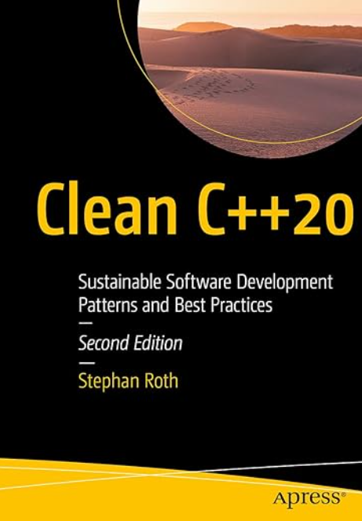
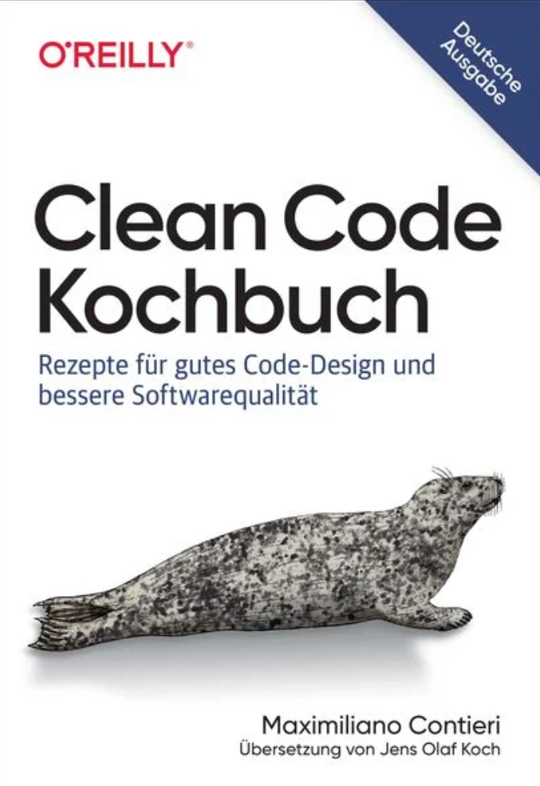

# Literatur

[Zurück](./Readme_Clean_Code.md)

---

## Bücher

---

  * Stephan Roth: &bdquo;Clean C++ 20&rdquo;. 
    Apress (18. Juni 2021), 508 Seiten. Sprache: Englisch. ISBN-10: 1484259483, ISBN-13: 978-1484259481.

    Dieses Buch vermittelt weniger die Merkmale der Programmiersprache C++ (Lexikon, Syntax, ...),
    sondern vielmehr allgemeingültige Prinzipien für eine moderne Softwareentwicklung mit C++.

    Die Beispiele sind vergleichsweise einfach gehalten, besitzen deshalb eine starke Prägnanz
    und bringen das jeweilige zu veranschaulichende Konzept auf den Punkt. Ein absolut empfehlenswertes Buch!

    

---

  * Maximiliano Contieri: &bdquo;Clean Code Kochbuch&rdquo;. 
    O'Reilly (27. Juni 2024), 424 Seiten. Sprache: Deutsch. ISBN-10: 3960092431, ISBN-13: 978-3960092438.

    Anhand von Beispielen in unterschiedlichen Programmiersprachen bietet dieses Kochbuch bewährte Rezepte, die Sie bei der Erweiterung und Wartung größerer Systeme unterstützen. Contieri beschreibt grundlegende Konzepte wie Lesbarkeit, Kopplung, Testbarkeit, Sicherheit und Erweiterbarkeit sowie Code Smells und Rezepte zu deren Beseitigung.

    Die Beispiele sind in JavaScript, PHP, Python und Java geschrieben.

    

---

  * [*Google C++ Style Guide*](https://google.github.io/styleguide/cppguide.html) 
    (abgerufen am 26.02.2022).

    Ein aus meiner Sicht sehr interessantes und hilfreiches Dokument,
    um die Sprachfeatures von C++ besser einordnen und verstehen zu können.

    Es soll nicht verschwiegen werden,
    dass das Dokument zum Zeitpunkt seiner Einführung auf seine Nützlichkeit hin überprüft wurde.
    So gesehen sollte man das Dokument mit einer gewissen gesunden Skepsis lesen,
    da manche Sprachkonstrukte von C++ heutzutage durchaus als veraltet bezeichnet werden können.
    Also was &bdquo;damals&rdquo; als nützlich galt,
    kann &bdquo;heute&rdquo; möglicherweise eine schlechte Idee sein, entweder weil es
    bessere Alternativen gibt oder weil sich herausgestellt hat, dass das Feature Mängel hat.

---

  * [*C++ Core Guidelines*](https://isocpp.github.io/CppCoreGuidelines/CppCoreGuidelines) 
    (abgerufen am 26.02.2022).

    Die C++ Core Guidelines sind ein portabler Satz von Richtlinien, Regeln und
    Best Practices zum Programmieren in C++, der von C++&ndash;Experten und &ndash;Designern erstellt wurde.

    Einziger Wermutstropfen dieser exzellenten Website:
    Nicht alle Guidelines sind einfach zu Lesen, eine gewisse Erfahrung
    in der C++&ndash;Programmierung ist Vorraussetzung.

---

## Artikel

---

  * [How to Write Clean Code in C++: An Expert Guide](https://www.bomberbot.com/clean-code/how-to-write-clean-code-in-c-an-expert-guide/)

---

[Zurück](./Readme_Clean_Code.md)

---
