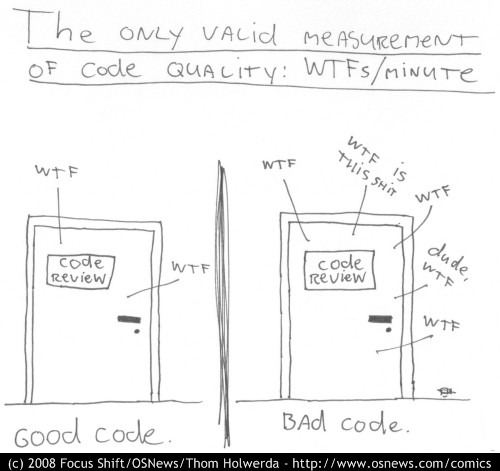

# Clean Code Richtlinien für C++ Entwickler

[Zurück](../../Readme.md)

---

## Was ist Clean Code?

```c
#include "stdio.h"
#define e 3
#define g (e/e)
#define h ((g+e)/2)
#define f (e-g-h)
#define j (e*e-g)
#define k (j-h)
#define l(x) tab2[x]/h
#define m(n,a) ((n&(a))==(a))

long tab1[]={ 989L,5L,26L,0L,88319L,123L,0L,9367L };
int tab2[]={ 4,6,10,14,22,26,34,38,46,58,62,74,82,86 };

main(m1,s) char *s; {
    int a,b,c,d,o[k],n=(int)s;
    if(m1==1){ char b[2*j+f-g]; main(l(h+e)+h+e,b); printf(b); }
    else switch(m1-=h){
        case f:
            a=(b=(c=(d=g)<<g)<<g)<<g;
            return(m(n,a|c)|m(n,b)|m(n,a|d)|m(n,c|d));
        case h:
            for(a=f;a<j;++a)if(tab1[a]&&!(tab1[a]%((long)l(n))))return(a);
        case g:
            if(n<h)return(g);
            if(n<j){n-=g;c='D';o[f]=h;o[g]=f;}
            else{c='\r'-'\b';n-=j-g;o[f]=o[g]=g;}
            if((b=n)>=e)for(b=g<<g;b<n;++b)o[b]=o[b-h]+o[b-g]+c;
            return(o[b-g]%n+k-h);
        default:
            if(m1-=e) main(m1-g+e+h,s+g); else *(s+g)=f;
            for(*s=a=f;a<e;) *s=(*s<<e)|main(h+a++,(char *)m1);
        }
}
```

<sup>[Hier gefunden](https://www.cise.ufl.edu/~manuel/obfuscate/obfuscate.html)</sup>

Auch wenn Sie es nicht für möglich halten:
Dieses Programm ist &ndash; mit einigen Schmerzen &ndash; übersetzungsfähig,
die Ausgabe lautet

```
hello world!
```

#### Warum sollten wir Clean Code schreiben?

&bdquo;Anyone can write a code that computer can understand.<br />
But only good programmer can write a code that human can understand.&rdquo;


<br />
    
<sup>[Hier gefunden](https://www.osnews.com/story/19266/wtfsm/)</sup>

#### Das Wichtigste ist:

  * Wenn Dein Code sauber ist, findest Du Fehler leicht.
  * Wenn Dein Code schmutzig ist, tummeln sich die Fehler überall!


---

## [Grundlegende Richtlinien für C++ Clean Code](../../Clean_Performant_Code/Guidelines/Guidelines.md)

## [Klassische Prinzipien der Clean Code Programmierung](../../Clean_Performant_Code/Principles/Principles.md)

## [Besserer Code mit der `std::ranges`-Bibliothek](../../Clean_Performant_Code/Ranges/Ranges.md)

---

## [Literatur](./Literature.md)

---

[Zurück](../../Readme.md)

---
