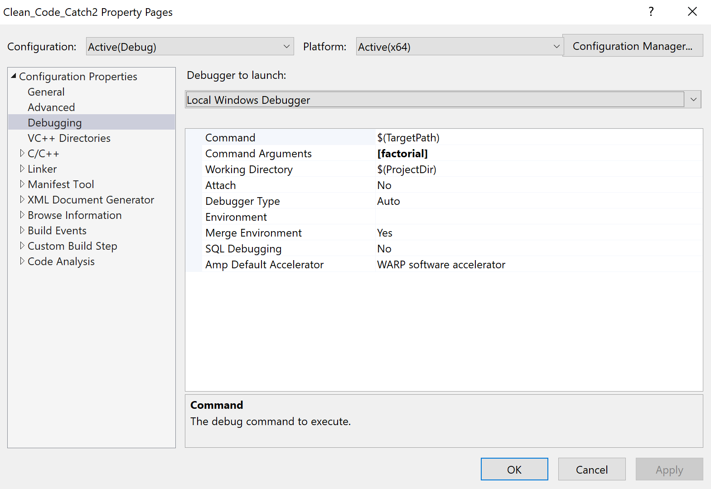

# Einige Hinweise zu *Catch2*

[Zurück](./Readme_Catch2.md)

---

## Inhalt

  * [Dokumentation zu *Catch2*](#link1)
  * [*Catch2* kann über die Kommandozeile gesteuert werden](#link2)
  * [`TEST_CASE` und `SECTION`](#link3)
  * [`REQUIRE` und `CHECK`](#link4)
  * [Testfälle im BDD-Stil (*Behaviour Driven Development*)](#link5)
  * [Typparametrisierte Testfälle](#link6)
  * [*Test Fixtures*](#link7)
  * [*Matchers*](#link8)

---

#### Quellcode

[*Catch_Demo_Getting_Started.cpp*](Catch_Demo_Getting_Started.cpp) 

---

## Dokumentation zu *Catch2* 

Informationenen zu *Catch2* findet man [hier](https://github.com/catchorg/Catch2).

## *Catch2* kann über die Kommandozeile gesteuert werden 

*Abbildung* 1: Visual Studio und Kommandozeilen Argumente.

## `TEST_CASE` und `SECTION` 

  * **TEST_CASE** ( *test_name* [, *tags* ] )

  * **SECTION** ( *section_name*, [, *section_description* ] )

Die *section_description* kann verwendet werden, um eine ausführliche Beschreibung eines Abschnitts bereitzustellen,
während *section_name* für die Verwendung mit der Kommandozeile vorgesehen ist.

## `REQUIRE` und `CHECK` 

  * **REQUIRE** ( *expression* ) und
  * **CHECK** ( *expression* )

`REQUIRE` testet einen Ausdruck und bricht den Testfall ab, wenn dieser fehlschlägt.

`CHECK` ist gleichwertig zu `REQUIRE`, die Ausführung wird jedoch im selben Testfall fortgesetzt, auch wenn die Assertion fehlschlägt.

## Testfälle im BDD-Stil (*Behaviour Driven Development*) 

Zusätzlich zu Catch's Schreibweise des klassischen Testfallstils
unterstützt Catch eine alternative Syntax, die es ermöglicht,
Tests als &bdquo;ausführbare Spezifikationen&rdquo; zu schreiben,
quasi im Sinne des *Behaviour Driven Development*.

  * **SCENARIO** ( *scenario_name* [, *tags* ] )

Dieses Makro wird auf `TEST_CASE` abgebildet und funktioniert auf die gleiche Weise,
außer dass dem Testfallnamen das Präfix SCENARIO vorangestellt wird.

  * **GIVEN** ( *something* )
  * **WHEN** ( *something* )
  * **THEN** ( *something* )

## Typparametrisierte Testfälle 

Zusätzlich zu `TEST_CASE` unterstützt Catch2 auch nach Typen parametrisierte Testfälle
in Form von `TEMPLATE_TEST_CASE`:

  * **TEMPLATE_TEST_CASE** ( *test_name* , *tags*, *type_1*, *type_2*, ... , *type_n* )

## *Test Fixtures* 

Im Kontext von Software wird ein Test-Fixture (auch &bdquo;Testkontext&rdquo; genannt) verwendet,
um den Systemzustand und die Eingabedaten einzurichten, die für die Testausführung erforderlich sind.

Für wiederverwendbares Setup/Teardown bieten sich du eine Fixture-Klasse definieren.
Konstruktor = Setup, Destruktor = Teardown

  * **TEST_CASE_METHOD**(  *class_name* , *unique_test_name_name*, *tags* )
  

## *Matchers* 

Matcher sind eine alternative Möglichkeit, Assertions zu schreiben,
nützlich für Tests, bei denen Sie mit komplexen Typen arbeiten oder komplexere Eigenschaften überprüfen müssen:

Matcher werden am häufigsten zusammen mit den Makros `REQUIRE_THAT` oder CHECK_THAT verwendet.

---

[Zurück](./Readme_Catch2.md)

---
