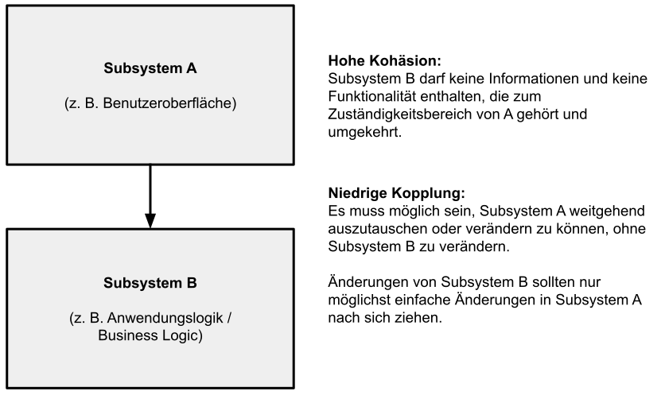

# Clean Code Entwicklungsprinzipien

[Zurück](../Clean_Code/Readme_Clean_Code.md)

---

## Inhalt

  * [KISS](#link1)
  * [YAGNI](#link2)
  * [DRY](#link3)
  * [POLS](#link4)
  * [Starke *Kohäsion* und niedrige *Kopplung* (*High Cohesion* and *Lose Coupling*)](#link5)
  * [Ein Beispiel zu *Lose Coupling*](#link6)
  * [RAII](#link7)
  * [Literatur](#link8)

---

#### Quellcode

[*Principles.cpp*](Principles.cpp)<br />

---

## KISS <a name="link1"></a>

KISS ist ein Akronym für &bdquo;*Keep it simple and stupid*&rdquo;.

Das KISS-Prinzip besagt, dass Einfachheit ein Hauptziel bei der Softwareentwicklung sein sollte
und dass unnötige Komplexität vermieden werden sollte.

KISS ist eines der Prinzipien ist, die Entwickler bei der Softwareentwicklung oft vergessen.

Es ist ratsam, nicht jedes ausgefallene Feature einer Programmiersprache oder coole Designmuster zu verwenden,
nur weil Sie es können.

Halten Sie Ihren Code so einfach wie möglich! Wenn hohe Qualitätsanforderungen an Flexibilität und Erweiterbarkeit gestellt werden,
müssen Sie natürlich Komplexität hinzufügen, um diese Anforderungen zu erfüllen.

Sie können beispielsweise das bekannte Entwurfsmuster &bdquo;Strategy Design Pattern&rdquo; verwenden,
um einen flexiblen Variationspunkt in Ihren Code einzuführen, wenn die Anforderungen dies erfordern.

Aber seien Sie vorsichtig und fügen Sie nur so viel Komplexität hinzu, dass solche Dinge einfacher werden.

---

## YAGNI <a name="link2"></a>

YAGNI ist ein Akronym für &bdquo;You ain’t gonna need it!&rdquo;.

Das Prinzip besagt, dass Sie keinen Code schreiben sollten, der im Moment nicht erforderlich ist, aber in Zukunft erforderlich sein könnte.

Viele Entwickler denken bei der Programmierung eines Programms gerne ein paar Schritte voraus
und programmieren einige zusätzliche Funktionen, &bdquo;nur für den Fall, dass wir sie brauchen&rdquo;
oder zumindest &bdquo;irgendwann einmal brauchen werden&rdquo;.

Nur 5 Wörter: „*You Aren’t Gonna Need It*“.

Halten Sie sich an YAGNI: Schreiben Sie Quellcode erst, wenn Sie wissen, dass sie ihn wirklich benötigen, nicht vorher.

#### Dem Yagni-Prinzip folgen: Ein Selbsttest

Folgen Sie dem Yagni-Prinzip? Wenn ja, wie genau machen Sie das?
Hier ist ein einfacher Test, der Ihnen dabei helfen kann, das zu beurteilen.
Nehmen Sie den Test aber nicht allzu ernst.

*Aufgabe*: Erstellen Sie eine Funktion, die die Summe von 2 und 3 berechnet. Wie würden Sie diese Funktion implementieren?

*Erste Antwort*:

So würden die meisten Entwickler vorgehen:

```cpp
01: static int sum(int x, int y)
02: {
03:     return x + y;
04: }
```

Sehen Sie hier ein Problem? In diesem Code gibt es eine voreilige Verallgemeinerung:
Statt einer Methode, die die Summe von 2 und 3 berechnet, wie es in der Problemdefinition gefordert wurde,
haben wir eine Funktion implementiert, die die Summe zweier beliebiger Zahlen zurückgibt.

Hier ist die Version, die dem Yagni-Prinzip folgt:

```cpp
01: static int sumTwoAndThree()
02: {
03:     return 2 + 3;
04: }
```

Natürlich ist das nur ein Spielzeugbeispiel, aber es zeigt, wie tief in unserem Geist die Gewohnheit verankert ist,
Verallgemeinerungen vorzunehmen.

---

## DRY <a name="link3"></a>

Wie oft entdeckt man ähnlichen Quellcode in verschiedenen Teilen innerhalb eines Programms?

Genau hier kommt DRY ins Spiel, was im Deutschen so viel bedeutet wie &bdquo;Wiederhole Dich nicht&rdquo; &ndash; &bdquo; Don’t Repeat Yourself&rdquo;.

Das DRY-Prinzip, formuliert von Andrew Hunt und David Thomas, besagt, das Code-Wiederholungen zu vermeiden sind.

Also Finger weg von Copy&Paste.

Die DRY-Programmierung kann besonders in großen Anwendungen nützlich sein, in denen Code ständig von vielen Programmierern gepflegt, geändert und erweitert wird.

---

## POLS <a name="link4"></a>

Das &bdquo;Principle of Least Surprise&rdquo; (&bdquo;Prinzip der geringsten Überraschung&rdquo;),
auch unter der Abkürzung POLS bekannt, ist eine goldene Regel in der Software-Ergonomie, der Mensch-Computer-Interaktion und dem Interfacedesign.

Diese Regel wurde z. B. 1987 von *Geoffrey James* in seinem Buch *The Tao of Programming* als &bdquo;*Law of Least Astonishment*&rdquo; formuliert.
Sie besagt, dass eine Benutzerschnittstelle so ausgelegt werden sollte, dass der Benutzer möglichst wenige Überraschungen erlebt.

Das &bdquo;Principle of Least Surprise&rdquo; wird auch auf den Quellcode von Anwendungen erweitert.
Hierbei sollen Objekte wie Variablen, Funktionen, Methoden, Klassen und dergleichen so benannt werden,
dass deren Funktion und mögliche Nebenwirkungen klar erkenntlich sind.

*Beispiel*:

```cpp
std::shared_ptr<Customer> getCustomer(int customerId);
```

Gibt einen Kunden anhand einer eindeutigen Identifikationsnummer zurück.
Sollte der Kunde nicht gefunden werden, tritt eine Ausnahme auf. Die Methode besitzt keine Nebenwirkungen.

```cpp
std::shared_ptr<Customer> getCustomerOrEmpty(int customerId);
```

Gibt einen Kunden anhand einer eindeutigen Identifikationsnummer zurück.
Sollte der Kunde nicht gefunden werden, wird ein leeres `std::shared_ptr<Customer>`-Objekt zurückgeliefert.
Die Methode besitzt keine Nebenwirkungen.

---

## Starke *Kohäsion* und niedrige *Kopplung* (*High Cohesion* and *Lose Coupling*) <a name="link5"></a>

Wir wenden uns zunächst einer Erklärung der beiden Begrifflichkeiten zu:

Während *Kopplung* ein ziemlich intuitives Konzept ist, das heißt, dass fast niemand Schwierigkeiten hat, es zu verstehen,
ist der Begriff der *Kohäsion* schwieriger zu begreifen.

Darüber hinaus scheinen die Unterschiede zwischen den beiden Begriffen oft unklar zu sein.
Das ist nicht überraschend: Die Ideen hinter diesen Begriffen sind tatsächlich ähnlich.
Dennoch unterscheiden sie sich:

#### *Kohäsion*

  * *Kohäsion* stellt den Grad dar, in dem ein Teil einer Codebasis eine logisch einzelne, atomare Einheit bildet.

  * Sie kann auch als Anzahl der Verbindungen innerhalb einer Codeeinheit ausgedrückt werden.

  * Wenn die Anzahl niedrig ist, sind die Grenzen für die Einheit wahrscheinlich schlecht gewählt,
  der Code innerhalb der Einheit ist nicht logisch verbunden.

  * Eine Einheit ist hier nicht unbedingt eine Klasse.
  Es könnte eine Methode, eine Klasse, eine Gruppe von Klassen oder sogar ein Modul oder eine Baugruppe sein:


Der Begriff der Kohäsion (sowie der Kopplung) ist auf verschiedenen Ebenen anwendbar,
wir führen unsere Betrachtungen des Begriffs der *Kohäsion*
mit Klassen fort:

  * Klassen sollten eine kleine Anzahl von Instanzvariablen haben.
  * Jede Methode einer Klasse sollte eine oder mehrere dieser Variablen verändern.
  * Im Allgemeinen gilt: Je mehr Variablen eine Methode verändert, desto kohäsiver ist diese Methode für ihre Klasse.
  * Eine Klasse, in der jede Variable von jeder Methode verwendet wird, ist maximal kohäsiv.
  * Im Allgemeinen ist es weder ratsam noch möglich, solche maximal kohäsiven Klassen zu erstellen.
  * Andererseits kann eine eine starke Kohäsion auch von Vorteil sein:
   Eine starke Kohäsion hat zur Folge,
   dass die Methoden und Variablen der Klasse voneinander abhängig sind und als logisches Ganzes zusammenhängen.

#### *Kopplung*

  * Die *Kopplung* hingegen stellt den Grad dar, in dem eine einzelne Einheit von anderen abhängig bzw. unabhängig ist.

  * Mit anderen Worten handelt es sich um die Anzahl der Verbindungen zwischen zwei oder mehr Einheiten.

  * Je geringer die Anzahl, desto geringer die Kopplung.

#### Richtlinien für starke Kohäsion und geringe Kopplung

  * Starke Kohäsion bedeutet im Wesentlichen, dass Teile einer Codebasis, die miteinander in Beziehung stehen,
  an einem einzigen Ort aufbewahrt werden.

  * Geringe Kopplung bedeutet gleichzeitig, nicht miteinander in Beziehung stehende Teile der Codebasis
  so weit wie möglich voneinander zu trennen.




*Abbildung* 1: Richtlinien für starke Kohäsion und geringe Kopplung.

Betrachten Sie in *Abbildung* 1:<br />
Eine Komponente (Subsystem) im allgemeinen Sinne ist eine Wiederverwendungseinheit:

  * die Funktionalität mit hoher Kohäsion gruppiert
  * die ein oder mehrere Schnittstellen anbietet, um lose Kopplung zu unterstützen

---

## Ein Beispiel zu *Lose Coupling* <a name="link5"></a>


Betrachten Sie das Beispiel aus *Abbildung* 2:


*Abbildung* 2: Ein Klassendiagramm für einen Schalter und eine Lampe.

```cpp
01: class Lamp {
02: public:
03:     void on() { std::println("On"); }
04:     void off() { std::println("Off"); }
05: };
06: 
07: class Switch {
08: private:
09:     Lamp& m_lamp;
10:     bool  m_state;
11: 
12: public:
13:     Switch(Lamp& lamp) : m_lamp(lamp), m_state{ false } {}
14:     void toggle() {
15:         if (m_state) {
16:             m_state = false;
17:             m_lamp.off();
18:         }
19:         else {
20:             m_state = true;
21:             m_lamp.on();
22:         }
23:     }
24: };
25: 
26: static void principles_lose_coupling_violating()
27: {
28:     Lamp lamp;
29:     Switch switcher{ lamp };
30:     switcher.toggle();
31:     switcher.toggle();
32:     switcher.toggle();
33: }
```


Das Beispiel funktioniert grundsätzlich.
Zuerst wird eine Instanz der Klasse `Lamp` erstellt.
Diese wird dann bei der Instanziierung der Klasse `Switch` per Referenz an den Schalter übergeben.

Was ist das Problem bei diesem Design?
Das Problem ist, dass der Schalter einen direkten Verweis auf die konkrete Klasse `Lamp` enthält.
Mit anderen Worten: Der Schalter weiß, dass eine Lampe vorhanden ist.

In diesem Beispiel sind Schalter und Lampe **eng** gekoppelt.

Der Schlüssel zur **losen** Kopplung in objektorientiertem Softwaredesign liegt in der Verwendung von *Schnittstellen*.

Eine Schnittstelle deklariert öffentlich zugängliche Verhaltensmerkmale einer Klasse,
ohne sich auf eine bestimmte Implementierung dieser Klasse festzulegen.

Eine Schnittstelle ist wie ein Vertrag. Klassen, die eine Schnittstelle implementieren, sind verpflichtet,
den Vertrag zu erfüllen.
Das heißt, diese Klassen müssen Implementierungen für die Methodensignaturen der Schnittstelle bereitstellen.


*Abbildung* 3: Lose gekoppelter Schalter und Lampe unter Zuhilfenahme einer Schnittstelle.

```cpp
01: class ISwitchable {
02: public:
03:     virtual void on() = 0;
04:     virtual void off() = 0;
05: };
06: 
07: class Switch {
08: private:
09:     ISwitchable& m_switcherable;
10:     bool         m_state;
11: 
12: public:
13:     Switch(ISwitchable& switchable) 
14:         : m_switcherable(switchable), m_state{ false } 
15:     {}
16:     void toggle() {
17:         if (m_state) {
18:             m_state = false;
19:             m_switcherable.off();
20:         }
21:         else {
22:             m_state = true;
23:             m_switcherable.on();
24:         }
25:     }
26: };
27: 
28: class Lamp : public ISwitchable {
29: public:
30:     void on() override { std::println("On"); }
31:     void off() override { std::println("Off"); }
32: };
33: 
34: static void principles_lose_coupling_respecting()
35: {
36:     Lamp lamp;
37:     Switch switcher{ lamp };
38:     switcher.toggle();
39:     switcher.toggle();
40:     switcher.toggle();
41: }
```

Die Vorteile eines solchen Designs liegen auf der Hand. Der Schalter (Klasse `Switch`) ist völlig unabhängig
von den konkreten Klassen, die von ihm gesteuert werden.

Sie möchten einen Ventilator statt einer Lampe steuern? Kein Problem, denn dieses Design ist erweiterbar.
Erstellen Sie einfach eine `Fan`-Klasse oder andere Klassen, die elektrische Geräte repräsentieren,
die die `ISwitchable`-Schnittstelle implementieren, so wie es in *Abbildung* 4 dargestellt wird:


*Abbildung* 4: Mit Hilfe einer Schnittstelle kann ein Schalter verschiedene elektrische Geräte ansteuern.

---

## RAII <a name="link7"></a>

Siehe Repository *Entwurfsmuster*.

---

## Literatur <a name="link8"></a>

Eine gute Beschreibung der Begriffe *Kohäsion* und *Kopplung*  
wird in [Cohesion and Coupling: the difference](https://enterprisecraftsmanship.com/posts/cohesion-coupling-difference/) gegeben.

---

[Zurück](../Clean_Code/Readme_Clean_Code.md)

---
