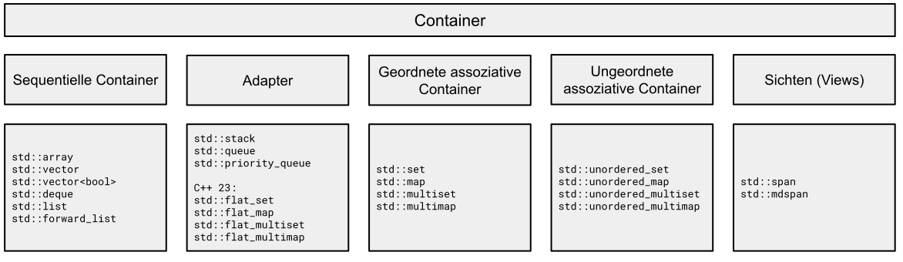

# Datenstrukturen und Algorithmen

[Zurück](../../Readme.md)

// https://github.com/PacktPublishing/Cpp-High-Performance-Second-Edition

WEITER:

https://www.sandordargo.com/blog/2022/10/05/cpp23-flat_map

https://schmollf.github.io/2022/10/26/cpp-flat-map.html

https://simontoth.substack.com/p/daily-bite-of-c-optimizing-code-to


---

## Inhalt

  * [Allgemeines](#link1)
  
  * [CPU-Cache-Speicher](#link1)
  
  * [Performanzbetrachtungen bei Objekten unterschiedlicher Größe](#link1)

  * [Datenstrukturen / STL Container](#link1)

  * [Hashing in C++ Standard Library](#link1)
  
  * [Literatur](#link7)

---

#### Quellcode

[*DataStructuresAndAlgorithms.cpp*](DataStructuresAndAlgorithms.cpp)<br />

---

## Allgemeines <a name="link1"></a>

---

## CPU-Cache-Speicher <a name="link2"></a>

CPU-Cache-Speicher ist eine Art temporärer Datenspeicher, der sich auf dem Prozessor befindet.
Er wird verwendet, um die Verarbeitungseffizienz der CPU zu steigern, indem er kleine, oft angeforderte Datenbytes bereithält, die mit hoher Geschwindigkeit abgerufen werden können.

Cache-Speicher besteht aus verschiedenen Speicherebenen. Diese Ebenen werden üblicherweise als L1, L2, L3 und gelegentlich als L4 bezeichnet und unterscheiden sich in Position, Geschwindigkeit und Größe.

Um besser zu verstehen, warum die CPU ihren eigenen Speichercache benötigt,
müssen wir uns die Entwicklung von Prozessoren und RAM ansehen.
Der Geschwindigkeitsunterschied zwischen Prozessor und RAM war in der Vergangenheit minimal.
Es bestand kaum Besorgnis darüber, dass die Verarbeitung durch den Speicher verlangsamt werden könnte.
Dies ist heutzutage nicht mehr der Fall: Aktuell übertrifft die Betriebsgeschwindigkeit von Zentralprozessoren die RAM-Geschwindigkeit bei weitem.
Es bestand folglich eine Notwendigkeit, diese Diskrepanz irgendwie zu verringern.
Die Antwort war Cache-Speicher.

Cache-Speicher ist extrem schnell (oft 10- bis 100-mal schneller als DRAM) und befindet sich physisch nahe an den Prozessorkernen.
Moderne, schnelle Prozessoren werden nicht dadurch ausgebremst, dass sie Daten aus dem relativ langsamen Systemspeicher anfordern müssen, da sie die Daten stattdessen aus dem Cache abrufen können.

In der Regel arbeiten Prozessoren mit mehrstufigen Caches, die unterschiedlich groß und schnell sind. Je näher der Cache am Rechenkern ist,
desto kleiner und schneller arbeitet er:

  * L1-Cache (klein, sehr schnell)
  * L2-Cache
  * L3-Cache (groß, langsam)


### L1-Cache / First-Level-Cache

Der L1-Cache, manchmal auch Primärcache genannt, ist die kleinste und schnellste Speicherebene.

Im L1-Cache werden die am häufigsten benötigten Befehle und Daten zwischengespeichert, damit möglichst wenige Zugriffe auf den langsamen Arbeitsspeicher erforderlich sind.
Dieser Cache vermeidet Verzögerungen und hilft dabei den Rechenkern optimal auszulasten.

Ein L1-Cache ist in zwei weitere Ebenen unterteilt:

  * L1-I (*Instructions* &ndash; Anweisungen) und
  * L1-D (*Data* &ndash; Daten).

Der L1-Anweisungscache verarbeitet Informationen, die dem Prozessor zugeführt werden, während der Datencache Informationen enthält, die in den Hauptspeicher geschrieben werden sollen.

Jeder Kern des Prozessors verfügt über einen eigenen integrierten L1-Cache.

### L2-Cache / Second-Level-Cache

L2-Cache ist ein sekundärer Speichercache, der ebenfalls in jeden einzelnen Kern der CPU eingebettet ist.
Er hat fast immer mehr Speicherplatz als ein L1-Cache, arbeitet aber langsamer, aber immer noch viel schneller als die RAM-Geschwindigkeit.

### L3-Cache / Third-Level-Cache 

Anstatt in jeden CPU-Kern eingebettet zu sein, fungiert der Level-3-Cache als gemeinsam genutzter Speicherpool,
auf den der gesamte Prozessor zugreifen kann. Er ist viel langsamer als L1- und L2-Cache, vielleicht nur doppelt so schnell wie RAM,
ist aber die größte aller drei Speicherebenen.

In *Abbildung* 1 finden Sie die Cache-Größen auf meinem Rechner auf meinem Rechner vor:


*Abbildung* 1: Cache-Größen auf meinem Rechner

### *Cache Lines*

Beim Zugriff auf ein Byte im Speicher holt die CPU nicht nur das angeforderte Byte,
sondern immer eine so genannte *Cache Line*.

Häufig besteht eine *Cache Line* aus 64 Bytes.
Die verschiedenen Caches zwischen der CPU und dem Hauptspeicher (L1-, L2- und L3-Cache) tauschen 64-Byte-Blöcke statt einzelner Bytes aus.

Einige wichtige Faktoren, die die Leistung eines Computerprogramms, das den CPU-Cache nutzt, beeinträchtigen können, besteht darin,
in einem Programm zwischen verschiedenen *Cache Lines* &bdquo;hin- und her zu springen&rdquo;,
an Stelle die Daten einer einzelnen Cache Line im Stück auszuwerten (solange das Programm eine derartige Funktionalität natürlich hergibt).

Die Größe einer Cache Line ist in C++ einfach bestimmbar:

*Beispiel*:

```cpp
01: void test() {
02:     constexpr auto cachelineSize = std::hardware_destructive_interference_size;
03:     std::println("Cache Line Size: {}", cachelineSize);
04: }
```

*Ausgabe*: 

```
Cache Line Size: 64
```

### Größe des L1 Caches

Wir berechnen nun die Größe des L1 Caches auf meinem Rechner (Windows Betriebssystem).
Dazu kommen einige Win32-API Betriebssystemfunktionen ins Spiel: `GetModuleHandle`, `GetProcAddress` und `GetLogicalProcessorInformation`.

*Beispiel*:

```cpp
01: void test() {
02: 
03:     typedef BOOL(WINAPI* LPFN_GLPI)(PSYSTEM_LOGICAL_PROCESSOR_INFORMATION, PDWORD);
04: 
05:     auto handle = GetModuleHandle(L"kernel32");
06: 
07:     auto glpi = (LPFN_GLPI) GetProcAddress(handle, "GetLogicalProcessorInformation");
08:     if (glpi == NULL)
09:         return;
10: 
11:     DWORD bufferBytes = 0;
12:     int cacheSize = 0;
13: 
14:     // calculate buffer length
15:     BOOL ret = glpi(0, &bufferBytes);
16: 
17:     std::size_t size = bufferBytes / sizeof(SYSTEM_LOGICAL_PROCESSOR_INFORMATION);
18:             
19:     SYSTEM_LOGICAL_PROCESSOR_INFORMATION* buffer = new SYSTEM_LOGICAL_PROCESSOR_INFORMATION[size];
20:             
21:     // retrieve array of SYSTEM_LOGICAL_PROCESSOR_INFORMATION structures
22:     ret = glpi(buffer, &bufferBytes);
23: 
24:     for (std::size_t i = 0; i < size; i++)
25:     {
26:         if (buffer[i].Relationship == RelationCache && buffer[i].Cache.Level == 1)
27:         {
28:             cacheSize = (int)buffer[i].Cache.Size;
29:             break;
30:         }
31:     }
32: 
33:     delete[] buffer;
34: 
35:     auto cacheSizeKB = cacheSize / 1024;
36:     std::println("L1 Cache Size: {}", cacheSizeKB);
37: }
```

*Ausgabe*: 

```
L1 Cache Size: 32 kB
```

Wie passt das Ergbnis mit *Abbildung* 1 zusammen? Ganz einfach,
mein Rechner hat 8 Kerne, jeder Kern hat einen L1-Anweisungs- und Datencache.
Macht zusammen 8 * 2 * 32 Kb = 512 kB.

### Cache-Fehler (*Cache Misses*)

Wenn die CPU die benötigten Daten nicht im Cache-Speicher findet, muss sie die Daten stattdessen aus dem langsameren Systemspeicher anfordern.
Dies wird als *Cache-Fehler* (*cache miss*) bezeichnet.
Die Einführung des L3-Cache verringerte die Wahrscheinlichkeit eines Fehlers und trug somit zur Leistungssteigerung bei.


*Abbildung* 2: Übliche CPU-Architektur mit L1-, L2- und L3-Cache.

Wir betrachten nun ein Beispiel,
in dem wir auf viele Daten im Speicher zugreifen.

Dies kann vor den soeben gestellten Überlegungen &ndash; Stichwort *Cache Misses* &ndash;
geschickt oder ungeschickt erfolgen.

*Beispiel*:

```cpp
01: constexpr auto capacityL1CacheSize = 32768;  // L1 Data Cache Size
02:         
03: constexpr auto Size = capacityL1CacheSize / sizeof(int);
04: 
05: using MatrixType = std::array<std::array<size_t, Size>, Size>;
06: 
07: static MatrixType matrix;
08: 
09: static auto initMatrix(MatrixType& matrix) {
10: 
11:     ScopedTimer watch{};
12: 
13:     size_t value{};
14: 
15:     for (size_t i{}; i != Size; ++i) {
16:         for (size_t j{}; j != Size; ++j) {
17:             matrix[i][j] = value++;          // no "cache thrashing"
18:         }
19:     }
20: }
21: 
22: void test() {
23:     initMatrix(matrix);
24: }
```

*Ausgabe*: Ohne &bdquo;Cache Thrashing&bdquo;

```
Elapsed time: 87 [milliseconds]   87  // 612
```

*Ausgabe*: Mit &bdquo;Cache Thrashing&bdquo;

```
Elapsed time: 612 [milliseconds]
```

Beide Ausführungen beziehen sich auf den *Release*-Mode.

---

## Datenstrukturen / STL Container

---

### Ein Überblick



*Abbildung* 3: Überblick über alle STL Standardcontainer.


7 Gründe für die Verwendung von STL Standardcontainern:

  * Durch den Einsatz von STL Standardcontainern eliminiert man einen Großteil des Boilerplate-Codes,
  den zu schreiben wäre, wenn man derartige Klassen selbst schreibt.

  * STL Container vereinfachen die Entwicklung.

  * STL Container sind korrekt implementiert und man muss keine Zeit mit dem Debuggen der Container verbringen.

  * STL Container sind schnell und wahrscheinlich effizienter als alles, was man selbst implementieren kann.

  * STL Container teilen eine (weitesgehend) gemeinsame Schnittstellendefinition.
  Dadurch ist es einfacher, verschiedene Container zu verwenden bzw. diese bei Bedarf auszutauschen.
  Auch macht es die Sache einfacher, wenn man nicht bei jedem STL Container eine andere Schnittstellendefinition
  nachschlagen und verstehen muss.

  * STL Container sind gut dokumentiert und für andere Entwickler leicht verständlich,
  was die Verständlichkeit und Wartbarkeit eines Projekts verbessert.

  * Durch die Verwendung von STL Containern wird man ein produktiverer SW-Entwickler.


### Die *Big-O Notation*


*Abbildung* 4: Die *Big-O Notation*.


| Typ | Notation | Beschreibung |
|:-|:-|:-|
| Konstant      | *O(1)*               | Die Laufzeit ist unabhängig von der Anzahl der Elemente. |
| Linear        | *O(n)*               | Die Laufzeit wächst linear mit der Anzahl der Elemente. |
| Logarithmisch | *O(log(n))*          | Die Laufzeit wächst logarithmisch mit der Anzahl der Elemente. |
| Quadratisch   | *O(n<sup>2</sup>)*   | Die Laufzeit wächst quadratisch mit der Anzahl der Elemente. |
| Kubisch       | *O(n<sup>3</sup>)*   | Die Laufzeit wächst proportional zur dritten Potenz der Anzahl der Elemente. |
| Exponentiell  | *O(2<sup>*n*</sup>)* | Die Laufzeit verdoppelt sich mit der Anzahl der Elemente. |
| Faktoriell    | *O(n!)*              |  Die Laufzeit wächst faktoriell mit der Anzahl der Elemente. |

*Tabelle* 1: Einige Beispiele für die *Big-O Notation*.

Einen guten Überblick zur Performanz der einzelnen Container samt deren Operationen findet sich
[hier](https://users.cs.northwestern.edu/~riesbeck/programming/c++/stl-summary.html).

---

### Wählen Sie einen STL Container mit Bedacht aus

Beachten Sie folgende Hinweise bei der Wahl eines Containers:

  * Müssen Sie in der Lage sein, ein neues Element an einer beliebigen Position im Container einzufügen?<br />Wenn ja, benötigen Sie einen sequentiellen Container.

  * Ist Ihnen wichtig, wie die Elemente im Container angeordnet sind (Reihenfolge)?<br />Wenn nicht, sind Hash-basioerte Container eine praktikable Wahl, andernfalls verwenden Sie geordnete assoziative Container.

  * Wollen Sie Kopiertätigkeiten vorhandener Containerelemente vermeiden, wenn Einfügungen und Löschungen stattfinden?<br />Vermeiden Sie die Verwendung sequentiellen (zusammenhängender / konsekutiver) Container.

  * Verfügt Ihr Code über viele `push_back()`-Methodenaufrufe?<br />Verwenden Sie `std::deque` an Stelle von `std::vector`, da `std::deque` intern in Summe weniger Datenblöcke umkopiert / verschiebt.

  * Bestehen strenge Anforderungen an die Speichernutzun?<br />Ein Einsatz von Hash-Tabelle ist mit Vorsicht zu genießen, da derartige Container intern zusätzlichen, für Nutzdaten nicht verfügbaren Speicherplatz benötigen.

  * Müssen Sie einen *Map*-Container traversieren?<br />Verwende `std::map` an Stelle von `std::unordered__map`.

  * Soll die Größe eines Container fest (unveränderlich) sein?<br />Wähle `std::array` an Stelle von `std::vector`.

  * Gibt es häufig Einfüge- und Lösch-Operationen in der Mitte des Containers?<br />Verwende `std::list` statt `std::vector` oder `std::deque`.


---

### Ein Überblick

---

### Sequentielle Container (*Sequence Container*)

Unter einem &bdquo;sequentiellen Container&rdquo; verstehen wir, 
dass auf die Elemente des Containers sequenziell zugegriffen werden kann.

Die STL kennt folgende sequentielle Container:

  * `std::array`
  * `std::vector`
  * `std::list`
  * `std::forward_list`
  * `std::deque`

---

### Vektor (`std::vector`)

Die Klasse `std::vector` ist der am häufigsten verwendete STL Container.

Intern, also in Bezug auf die Ablage seiner Daten im Speicher, verhält sich ein Vektor wie ein Array,
das allerdings bei Bedarf dynamisch wächst.

Die einem Vektor hinzugefügten Elemente werden zusammenhängend im Speicher angeordnet.
Dies bedeutet, dass man in konstanter Zeit auf jedes Element im Vektor über einen Index zugreifen kann.


```cpp
auto vec = std::vector{ 1, 2, 3 };
vec.push_back(4);
vec.push_back(5);
std::println("Size: {} - Capacity: {}", vec.size(), vec.capacity());
```

*Ausgabe*:

```
Size: 5 - Capacity: 6
```

Die Daten eines Vektors befinden sich auf dem *Heap* (Halde).

Will man die Elemente eines Vektors in der Reihenfolge durchlaufen,
in der sie angeordnet sind, erzielt man eine sehr gute Performanz.

Ein Vektor besitzt eine *Größe* (`length()`) und eine *Kapazität* (`capacity()`).
Die Größe beschreibt die Anzahl der Elemente, die aktuell im Container enthalten sind,
die Kapazität beschreibt die Anzahl der Elemente, die der Vektor enthalten kann,
bis er mehr Speicherplatz anfordern muss.


*Abbildung* 5: Ein `std::vector`-Objekt mit den beiden Eigenschaften *Size* und *Capacity*.

---

### Array (`std::array`)

Ein Feld (Array) ist ähnlich zu einem Vektor, nur ist sein Größe fest.

Die Elemente eines Arrays liegen je nach Örtlichkeit der Definition 
im globalen Datensegment oder auf dem Stack. Damit ist gesagt, dass sich ein `std::array`-Objekt
*per se* nicht auf dem Heap befindet (es sein denn, es wird mittels `new` explizit dort hingelegt).

In der STL ist die Klasse `std::array` ein Klassentemplate.
Dies hat zur Folge, dass sowohl die Größe als auch der Typ der Elemente Teil des konkreten Typs sind.

```cpp
auto a = std::array<int, 5>{ 1, 2, 3, 4, 5 };
```


Auf Grund der *Class Template Argument Deduction* (*CTAD*) 
kann man auch schreiben:

```cpp
auto a = std::array{ 1, 2, 3, 4, 5 };
```


*Abbildung* 6: Ein `std::array`-Objekt, die Länge *Size* (hier: 7) ist unveränderbar.

---

### Double-ended Queue (`std::deque`)

Muss man häufig Elemente sowohl am Anfang als auch am Ende eines Containers hinzufügen,
ist ein `std::vector`-Objekt nicht die erste Wahl.

Es bietet sich in diesem Fall die Klasse `std::deque` an,
was als Abkürzung für &bdquo;*Double-Ended Queue*&rdquo; steht.

Intern wird ein `std::deque`-Objekt normalerweise als Sammlung von Arrays mit fester Größe implementiert,
was es ermöglicht, in konstanter Zeit auf Elemente über einen Index zuzugreifen.

Es werden aber nicht alle Elemente zusammenhängend im Speicher gespeichert,
so wie dies bei den Klassen `std::vector` und `std::array` der Fall ist,
siehe dazu auch *Abbildung* 7:


*Abbildung* 7: Mögliche interne Repräsentation eines `std::deque`-Objekts.

---

### Doppelt verkettete Liste (`std::list`)

Die Klasse `std::list` ist eine doppelt verkettete Liste, was bedeutet,
dass jedes Element eine Verknüpfung zum nächsten Element und eine Verknüpfung zu seinem vorherigen Element hat.

Dadurch ist es möglich, die Liste sowohl vorwärts als auch rückwärts zu durchlaufen.

Beachten Sie, dass die Elemente, selbst wenn sie in einer Sequenz angeordnet sind,
nicht wie bei einem Vektor und einem Array zusammenhängend im Speicher angeordnet sind.
Das bedeutet, dass das Iterieren einer verketteten Liste im Vergleich
zum Vektor höchstwahrscheinlich viel mehr Cache-Fehler erzeugt und damit langsamer ist.


*Abbildung* 8: Beispiel eines `std::list`-Objekts mit Zeigern auf das jeweils nächste und vorherige Element.

---

### Vorwärts verkettete Liste (`std::forward_list`)

Es gibt auch eine einfach verkettete Liste namens `std::forward_list`.

Der Grund, warum Sie die doppelt verkettete Listen nicht immer der `std::forward_list` vorziehen sollten,
ist der übermäßige Speicher, der von den *Previous*-Zeigern (Zeiger auf das vorherige Element) in der doppelt verkettete Liste belegt wird.

Wenn Sie die Liste also nicht rückwärts durchlaufen müssen, verwenden Sie die Klasse `std::forward_list`.

Ein weiteres interessantes Merkmal der Klasse `std::forward_list` ist,
dass sie für sehr kurze Listen optimiert ist.


*Abbildung* 9: Beispiel eines `std::forward_list`-Objekts mit Zeigern auf das jeweils nächste Element.

---

### Klasse `std::string`

---

### Assoziative Container (*Associative Container*)

Assoziative Container werden in der Informatik auch *assoziative Arrays* oder *Maps* oder *Dictionaries* genannt.

Ein assoziativer Container stellt ein spezielle Variante eines Arrays dar,
bei dem der Index nicht numerisch, sondern auch ein beliebiger anderer Datentyp (wie z. B. `std::string`) sein kann.

Dies bedeutet anders herum gesagt:
In einem assoziativen Container ist es nicht möglich,
ein Element hinten oder vorne hinzuzufügen,
so wie wir es mit `push_back()` (Klasse `std::vector`) oder `push_front()` (Klasse `std::list`) tun würden.

Stattdessen werden die Elemente so hinzugefügt, dass es möglich ist, ein Element zu finden,
ohne den gesamten Container sequentiell durchlaufen zu müssen.

Die Indizes werden als Schlüssel (*Keys*) bezeichnet und die an dieser Position gespeicherten Daten
als Wert (*Value*).

Ein assoziativer Container repräsentiert folglich eine Menge von *Key*&ndash;*Value*-Paaren.

Man unterscheidet zwei Kategorien von assoziativen Containern:

  * Geordnete assoziative Container
  * Ungeordnete assoziative Container


Folgende geordnete assoziative Container gibt es in der STL:

  * `std::set`
  * `std::map`
  * `std::multiset`
  * `std::multimap`

Dazu gesellen sich die folgenden ungeordneten assoziativen Container:

  * `std::unordered_set`
  * `std::unordered_map`
  * `std::unordered_multiset`
  * `std::unordered_multimap`

---

### Geordnete assoziative Container (`std::set`, `std::map`)

Die geordneten assoziativen Container garantieren, dass die Operationen Einfügen, Löschen und Suchen
in logarithmischer Zeit, *O(log n)*, durchgeführt werden können.

Wie das erreicht wird, hängt von der jeweiligen Implementierung der Klassen in der STL ab.

Die bekanntesten Implementierungen verwenden eine Art 
&bdquo;*Self-balancing Binary Search Tree*&rdquo; (selbstbalancierender binärer Suchbaum).

Die Tatsache, dass der Baum in ungefähr ausgeglichen bleibt,
ist notwendig, um die Höhe des Baums und damit auch die Laufzeit beim Zugriff
auf Elemente auch im schlimmsten Fall kontrollieren zu können.

Der Baum muss keinen Speicher vorab reservieren.

Daher reserviert ein Baum normalerweise jedes Mal, wenn ein Element eingefügt wird,
Speicher in der Freispeicherverwaltung (*Heap*) und gibt auch Speicher frei, wenn Elemente gelöscht werden.

Die folgende *Abbildung* 10 soll symbolisch einen balancierten Baum mit Höhe *O(log n)* demonstrieren:


*Abbildung* 10: Die Höhe des Baumes ist *O(log n)*, wenn er balanciert ist.

---

### Ungeordnete assoziative Container (`std::unordered_set`, `std::unordered_map`)

Die ungeordneten Versionen von *Sets* und *Maps* bieten in der STL
hashbasierte Alternativen zu den baumbasierten Versionen.

Die Datenstrukturen, die sich hinter den Klassen `std::unordered_set` und `std::unordered_map` verbergen,
werden als *Hash-Tabellen* bezeichnet.

Hash-Tabellen stellen Einfüge-, Such- und Löschvorgänge in konstanter Zeit zur Verfügung,
was im Mittel einen konstanten Zeitaufwand (*O(1)*) bedeutet.

Einige Hinweise zu den Details einer *Hash-Tabelle*:

  * Eine Hash-Tabelle speichert ihre Elemente in einer Art Array bestehend aus so genannten *Buckets*.

  * Wenn ein Element zur Hash-Tabelle hinzugefügt wird, wird mithilfe einer Hash-Funktion ein `int`-Wert für das Element berechnet.

  * Dieser Wert wird normalerweise als &bdquo;Hash-Wert&rdquo; des Elements bezeichnet.

  * Der Hash-Wert wird dann auf die Größe des Arrays begrenzt (beispielsweise mithilfe der Modulo-Operation),
   sodass der neue begrenzte Wert als Index im Array verwendet werden kann.

  * Sobald der Index berechnet ist, kann die Hash-Tabelle das Element im Array an diesem Index speichern.

  * Die Suche nach einem Element funktioniert auf ähnliche Weise, indem zuerst ein Hash-Wert für das gesuchte Element berechnet
   und dann auf das Array zugegriffen wird.

  * Abgesehen von der Berechnung des Hash-Werts ist nur noch ein unscheinbares Problem zu lösen:
  Was passiert, wenn zwei verschiedene Elemente denselben Index generieren, entweder weil sie denselben Hash-Wert erzeugt haben oder weil zwei verschiedene Hash-Werte auf denselben Index heruntergerechnet werden?

  * Man nennt diese Beobachtung eine *Hash-Kollision*:
  Derartige Kollisionen können häufig passieren, zum Beispiel dann,
  wenn das Array klein ist im Vergleich zur Anzahl der Elemente, die man zur Tabelle hinzufügen möchte.

  * Es gibt verschiedene Möglichkeiten, mit Hash-Kollisionen umzugehen.
  Ein bekannte Lösungsstrategie ist das so genannte *Separate Chaining* (*Separate Verkettung*).

  * *Separate Chaining* löst das Problem dadurch, dass ein Bucket als eine Art Container angesehen wird, z.B. als eine verkettete Liste.

  * Das Auffinden eines Elements in einem bestimmten Bucket erfolgt dann so,
  dass die Elemente eines Buckets linear betrachtet werden, bis das gesuchte Element gefunden wurde.


Die folgende *Abbildung* 11 zeigt eine Hash-Tabelle mit acht Buckets. Die Elemente sind in drei separaten Buckets gelandet.
Der Bucket mit Index 2 enthält vier Elemente, der Bucket mit Index 4 enthält zwei Elemente und der Bucket mit Index 5 enthält nur ein Element.
Die anderen Buckets sind leer.


*Abbildung* 11: Jeder Bucket enthält 0 oder mehr Elemente.


---

### Berechnung von Hash-Werten für benutzerdefinierte Typen

Eine gute Hashfunktion sorgt dafür, dass die Elemente gleichmäßig auf die Buckets verteilt werden, um Hashkollisionen zu minimieren.

Für die elementaren Datentypen in C++ (`int`, `long`, `char`, ...) stellt die STL Hashfunktionen zur Verfügung.
Für benutzerdefinierte Typen ist dies nicht der Fall.

Dies erklärt Fehlermeldungen der Gestalt 

```
'std::_Uhash_compare<_Kty,_Hasher,_Keyeq>::_Uhash_compare(const std::_Uhash_compare<_Kty,_Hasher,_Keyeq> &)':
attempting to reference a deleted function
```

wenn wir ein `std::unordered_map<Person, size_t>`-Objekt mit einer &ndash; aus Sicht der Sprache C++ &ndash; unbekannten Klasse `Person` anlegen wollen.

Diese Fehlermeldung ist zunächst einmal sehr schwer zu lesen als auch zu verstehen,
der Umstand des Fehlers ist aber vergleichsweise einfach zu erklären.

Wollten wir eine benutzerdefinierte Klasse, wie zum Beispiel besagte Klasse `Person`

```cpp
01: struct Person
02: {
03:     std::string m_firstName;
04:     std::string m_lastName;
05:     size_t      m_age;
06: };
```

als Schlüssel für eine Hashtabelle verwenden, also etwa auf die Weise

```cpp
std::unordered_map<Person, size_t> phoneBook;
```

dann ist der C++ Compiler nicht in der Lage, Hash-Werte für `Person`-Objekte zu berechnen.

Die Lösung des Problems besteht darin, dass wir im Namensraum `std` eine Spezialisierung
der Klasse `hash` vornehmen müssen. Diese Spezialsierung muss den Aufrufoperator `operator()`
mit `Person`-Objekten als Parameter überschreiben, zum Beispiel so:


```cpp
01: namespace std
02: {
03:     template <>
04:     struct hash<Person>
05:     {
06:         size_t operator()(const Person& p) const {
07: 
08:             auto hash1{ std::hash<std::string>() (p.m_firstName) };
09:             auto hash2{ std::hash<size_t>() (p.m_age) };
10:             auto hash3{ std::hash<std::string>() (p.m_lastName) };
11: 
12:             size_t hash{ hash1 ^ (hash2 << 1) ^ (hash3 << 2) };
13:             return hash;
14:         }
15:     };
16: }
```

Nun lassen sich `std::unordered_map<Person, size_t>`-Objekte erzeugen:

```cpp
01: void test()
02: {
03:     std::unordered_map<Person, size_t> phoneBook;
04: 
05:     Person sepp = { "Sepp", "Meier", 30 };
06:     phoneBook[sepp] = 123456;
07: 
08:     // retrieving phone number of sepp
09:     auto phone{ phoneBook[sepp] };
10:     std::println("{} - Phone Number: {}", sepp, phone);
11: }
```

*Ausgabe*:

```
Person Sepp Meier [Age: 30] - Phone Number: 123456
```


---

### Container Adapter

In der STL gibt es drei so genannte *Container Adapter*:

  * `std::stack`
  * `std::queue`
  * `std::priority_queue`

Containeradapter unterscheiden sich erheblich von sequentiellen und assoziativen Containern,
da sie abstrakte Datentypen darstellen, die von einem zugrunde liegenden sequentiellen Container implementiert werden können.

Beispielsweise kann ein Stapel (`std::stack`), eine **Last-In-First-Out**-Datenstruktur (LIFO),
mit den beiden Operationen *Push* und *Pop* mithilfe eines Vektors
oder eines beliebigen anderen benutzerdefinierten sequentiellen Containers implementiert werden.

Dasselbe gilt für eine Warteschlange (`std::queue`), die eine **First-In-First-Out**-Datenstruktur (FIFO) ist.

Nicht vergessen sollten wir die dritte Datenstruktur, eine so genannte *Prioritätswarteschlange*.
Jedes Element in einer Prioritätswarteschlange hat eine zugeordnete Priorität.
In einer Prioritätswarteschlange werden Elemente mit hoher Priorität vor Elementen mit niedriger Priorität bedient.


---

### Container Adapter `std::stack`

In der Realisierung der Klasse `std::stack` (*Visual C++*)
finden wir einen Hinweis vor, dass diese als zu Grunde liegende Adapterklasse die Klasse `std::deque`
verwendet:

```cpp
01: template <class T>
02: class stack {
03: public:
04:     using container_type = deque<T>;
05: ...
```


*Beispiel*:

```cpp
01: void test()
02: {
03:     std::stack<int> s;
04: 
05:     s.push(1);
06:     s.push(2);
07:     s.push(3);
08:     s.push(4);
09:     s.push(5);
10: 
11:     std::println("Size of stack: {} ", s.size());
12:     std::println("Elements:");
13: 
14:     while (!s.empty()) {
15:         std::print("{} ", s.top());
16:         s.pop();
17:     }
18: }
```

*Ausgabe*:

```
Size of stack: 5
Elements:
5 4 3 2 1
```


*Abbildung* 12: Container Adapter `std::stack`

---

### Container Adapter `std::queue`

In der Realisierung der Klasse `std::queue` (*Visual C++*)
finden wir einen Hinweis vor, dass diese als zu Grunde liegende Adapterklasse die Klasse `std::deque`
verwendet:

```cpp
01: template <class T>
02: class queue {
03: public:
04:     using container_type = deque<T>;
05: ...
```

*Beispiel*:

```cpp
01: void test()
02: {
03:     std::queue<int> q;
04: 
05:     q.push(1);
06:     q.push(2);
07:     q.push(3);
08:     q.push(4);
09:     q.push(5);
10: 
11:     std::println("Size of queue: {} ", q.size());
12:     std::println("Elements:");
13: 
14:     while (! q.empty()) {
15:         std::print("{} ", q.front());
16:         q.pop();
17:     }
18: }
```

*Ausgabe*:

```
Size of queue: 5
Elements:
1 2 3 4 5
```


*Abbildung* 13: Container Adapter `std::queue`

---

### Container Adapter `std::priority_queue`

In der Realisierung der Klasse `std::priority_queue` (*Visual C++*)
finden wir einen Hinweis vor, dass diese als zu Grunde liegende Adapterklasse die Klasse `std::vector`
verwendet:

```cpp
01: template <class T>
02: class priority_queue {
03: public:
04:     using container_type = vector<T>;
05: ...
```

*Beispiel*:

```cpp
01: static void test_priority_queue()
02: {
03:     std::priority_queue<int> pq;
04: 
05:     pq.push(3);
06:     pq.push(1);
07:     pq.push(2);
08:     pq.push(5);
09:     pq.push(4);
10: 
11:     std::println("Size of priority queue: {} ", pq.size());
12:     std::println("Elements:");
13: 
14:     while (! pq.empty()) {
15:         std::print("{} ", pq.top());
16:         pq.pop();
17:     }
18: }
```

*Ausgabe*:

```
Size of priority queue: 5
Elements:
5 4 3 2 1
```

---


WEITER: Adaptoren


flat_set
flat_multiset
flat_map
flat_multimap


 

### Performanzbetrachtungen bei Objekten unterschiedlicher Größe

```cpp
01: template <size_t Size>
02: class Object {
03: private:
04:     std::array<char, Size> m_data{};
05:     int m_score{ std::rand() };
06: public:
07:     auto getScore() const { return m_score; }
08: };
09: 
10: using SmallObject = Object<4>;
11: using BigObject = Object<256>;
12: 
13: constexpr auto Size = 1'000'000;
14: 
15: auto smallObjects = std::vector<SmallObject>(Size);
16: auto bigObjects = std::vector<BigObject>(Size);
17: 
18: template <class T>
19: auto sumScores(const std::vector<T>& objects) {
20: 
21:     ScopedTimer watch{};
22: 
23:     size_t sum{ 0 };
24: 
25:     for (const auto& obj : objects) {
26:         sum += obj.getScore();
27:     }
28: 
29:     return sum;
30: }
31: 
32: static void test_parallel_arrays_02() {
33: 
34:     size_t sum{ 0 };
35:     sum += sumScores(smallObjects);
36:     sum += sumScores(bigObjects);
37: }
```

---

## Literatur <a name="link6"></a>

### Cache

Ein interessanter Artikel zum Thema *Demystifying CPU Caches with Examples*
findet sich [hier](https://mecha-mind.medium.com/demystifying-cpu-caches-with-examples-810534628d71).

Eine *Gallery of Processor Cache Effects* beschreibt *Igor Ostrovsky*
in seinem [Blog](https://igoro.com/archive/gallery-of-processor-cache-effects/).

Die Anregungen zur Berechnung der L1 Cache Größe finden Sie unter dem Github Gist<br />
[Get L1 data cache size on most operating systems](https://gist.github.com/kimwalisch/16c34ae16447b245464a)

### Überblick über STL Container

Embedded Artistry Artikel Serie:

[An Overview of C++ STL Containers](https://embeddedartistry.com/blog/2017/08/02/an-overview-of-c-stl-containers/)

### STL Containers und Big-O Notation

Ein interessanter Artikel zum Thema *STL Containers und Big-O Notation*
findet sich [hier](https://dev.to/pratikparvati/c-stl-containers-choose-your-containers-wisely-4lc4).

Eine spezifische Auflistung aller Big-O Notationen für alle wesentlichen Methoden
der STL-Container ist [hier](https://users.cs.northwestern.edu/~riesbeck/programming/c++/stl-summary.html)
gegeben.


### Flache STL Container (*Flat Container*)


---

[Zurück](../../Readme.md)

---
