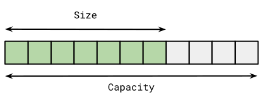
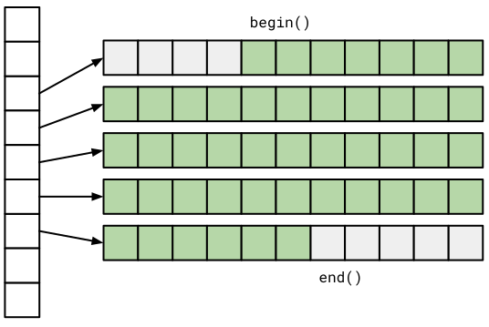
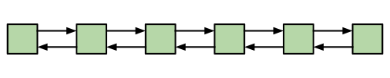

# Datenstrukturen und Algorithmen

[Zurück](../../Readme.md)

---

## Inhalt

  * [Allgemeines](#link1)
  
  * [CPU-Cache-Speicher](#link1)
  
  * [Performanzbetrachtungen bei Objekten unterschiedlicher Größe](#link1)

  * [Datenstrukturen / STL Container](#link1)

  * [Hashing in C++ Standard Library](#link1)
  
  * [Literatur](#link7)

---

#### Quellcode

[*DataStructuresAndAlgorithms.cpp*](DataStructuresAndAlgorithms.cpp)<br />

---

Fehlermeldung


'std::_Uhash_compare<_Kty,_Hasher,_Keyeq>::_Uhash_compare(const std::_Uhash_compare<_Kty,_Hasher,_Keyeq> &)':
attempting to reference a deleted function


Hierzu ist Text ui unordered map zu machen .....

---

## Allgemeines <a name="link1"></a>

---

## CPU-Cache-Speicher <a name="link2"></a>

CPU-Cache-Speicher ist eine Art temporärer Datenspeicher, der sich auf dem Prozessor befindet.
Er wird verwendet, um die Verarbeitungseffizienz der CPU zu steigern, indem er kleine, oft angeforderte Datenbytes bereithält, die mit hoher Geschwindigkeit abgerufen werden können.

Cache-Speicher besteht aus verschiedenen Speicherebenen. Diese Ebenen werden üblicherweise als L1, L2, L3 und gelegentlich als L4 bezeichnet und unterscheiden sich in Position, Geschwindigkeit und Größe.

Um besser zu verstehen, warum die CPU ihren eigenen Speichercache benötigt,
müssen wir uns die Entwicklung von Prozessoren und RAM ansehen.
Der Geschwindigkeitsunterschied zwischen Prozessor und RAM war in der Vergangenheit minimal.
Es bestand kaum Besorgnis darüber, dass die Verarbeitung durch den Speicher verlangsamt werden könnte.
Dies ist heutzutage nicht mehr der Fall: Aktuell übertrifft die Betriebsgeschwindigkeit von Zentralprozessoren die RAM-Geschwindigkeit bei weitem.
Es bestand folglich eine Notwendigkeit, diese Diskrepanz irgendwie zu verringern.
Die Antwort war Cache-Speicher.

Cache-Speicher ist extrem schnell (oft 10- bis 100-mal schneller als DRAM) und befindet sich physisch nahe an den Prozessorkernen.
Moderne, schnelle Prozessoren werden nicht dadurch ausgebremst, dass sie Daten aus dem relativ langsamen Systemspeicher anfordern müssen, da sie die Daten stattdessen aus dem Cache abrufen können.

In der Regel arbeiten Prozessoren mit mehrstufigen Caches, die unterschiedlich groß und schnell sind. Je näher der Cache am Rechenkern ist,
desto kleiner und schneller arbeitet er:

  * L1-Cache (klein, sehr schnell)
  * L2-Cache
  * L3-Cache (groß, langsam)


### L1-Cache / First-Level-Cache

Der L1-Cache, manchmal auch Primärcache genannt, ist die kleinste und schnellste Speicherebene.

Im L1-Cache werden die am häufigsten benötigten Befehle und Daten zwischengespeichert, damit möglichst wenige Zugriffe auf den langsamen Arbeitsspeicher erforderlich sind.
Dieser Cache vermeidet Verzögerungen und hilft dabei den Rechenkern optimal auszulasten.

Ein L1-Cache ist in zwei weitere Ebenen unterteilt:

  * L1-I (*Instructions* &ndash; Anweisungen) und
  * L1-D (*Data* &ndash; Daten).

Der L1-Anweisungscache verarbeitet Informationen, die dem Prozessor zugeführt werden, während der Datencache Informationen enthält, die in den Hauptspeicher geschrieben werden sollen.

Jeder Kern des Prozessors verfügt über einen eigenen integrierten L1-Cache.

### L2-Cache / Second-Level-Cache

L2-Cache ist ein sekundärer Speichercache, der ebenfalls in jeden einzelnen Kern der CPU eingebettet ist.
Er hat fast immer mehr Speicherplatz als ein L1-Cache, arbeitet aber langsamer, aber immer noch viel schneller als die RAM-Geschwindigkeit.

### L3-Cache / Third-Level-Cache 

Anstatt in jeden CPU-Kern eingebettet zu sein, fungiert der Level-3-Cache als gemeinsam genutzter Speicherpool,
auf den der gesamte Prozessor zugreifen kann. Er ist viel langsamer als L1- und L2-Cache, vielleicht nur doppelt so schnell wie RAM,
ist aber die größte aller drei Speicherebenen.

In *Abbildung* 1 finden Sie die Cache-Größen auf meinem Rechner auf meinem Rechner vor:


*Abbildung* 1: Cache-Größen auf meinem Rechner

### *Cache Lines*

Beim Zugriff auf ein Byte im Speicher holt die CPU nicht nur das angeforderte Byte,
sondern immer eine so genannte *Cache Line*.

Häufig besteht eine *Cache Line* aus 64 Bytes.
Die verschiedenen Caches zwischen der CPU und dem Hauptspeicher (L1-, L2- und L3-Cache) tauschen 64-Byte-Blöcke statt einzelner Bytes aus.

Einige wichtige Faktoren, die die Leistung eines Computerprogramms, das den CPU-Cache nutzt, beeinträchtigen können, besteht darin,
in einem Programm zwischen verschiedenen *Cache Lines* &bdquo;hin- und her zu springen&rdquo;,
an Stelle die Daten einer einzelnen Cache Line im Stück auszuwerten (solange das Programm eine derartige Funktionalität natürlich hergibt).

Die Größe einer Cache Line ist in C++ einfach bestimmbar:

*Beispiel*:

```cpp
01: void test() {
02:     constexpr auto cachelineSize = std::hardware_destructive_interference_size;
03:     std::println("Cache Line Size: {}", cachelineSize);
04: }
```

*Ausgabe*: 

```
Cache Line Size: 64
```

### Größe des L1 Caches

Wir berechnen nun die Größe des L1 Caches auf meinem Rechner (Windows Betriebssystem).
Dazu kommen einige Win32-API Betriebssystemfunktionen ins Spiel: `GetModuleHandle`, `GetProcAddress` und `GetLogicalProcessorInformation`.

*Beispiel*:

```cpp
01: void test() {
02: 
03:     typedef BOOL(WINAPI* LPFN_GLPI)(PSYSTEM_LOGICAL_PROCESSOR_INFORMATION, PDWORD);
04: 
05:     auto handle = GetModuleHandle(L"kernel32");
06: 
07:     auto glpi = (LPFN_GLPI) GetProcAddress(handle, "GetLogicalProcessorInformation");
08:     if (glpi == NULL)
09:         return;
10: 
11:     DWORD bufferBytes = 0;
12:     int cacheSize = 0;
13: 
14:     // calculate buffer length
15:     BOOL ret = glpi(0, &bufferBytes);
16: 
17:     std::size_t size = bufferBytes / sizeof(SYSTEM_LOGICAL_PROCESSOR_INFORMATION);
18:             
19:     SYSTEM_LOGICAL_PROCESSOR_INFORMATION* buffer = new SYSTEM_LOGICAL_PROCESSOR_INFORMATION[size];
20:             
21:     // retrieve array of SYSTEM_LOGICAL_PROCESSOR_INFORMATION structures
22:     ret = glpi(buffer, &bufferBytes);
23: 
24:     for (std::size_t i = 0; i < size; i++)
25:     {
26:         if (buffer[i].Relationship == RelationCache && buffer[i].Cache.Level == 1)
27:         {
28:             cacheSize = (int)buffer[i].Cache.Size;
29:             break;
30:         }
31:     }
32: 
33:     delete[] buffer;
34: 
35:     auto cacheSizeKB = cacheSize / 1024;
36:     std::println("L1 Cache Size: {}", cacheSizeKB);
37: }
```

*Ausgabe*: 

```
L1 Cache Size: 32 kB
```

Wie passt das Ergbnis mit *Abbildung* 1 zusammen? Ganz einfach,
mein Rechner hat 8 Kerne, jeder Kern hat einen L1-Anweisungs- und Datencache.
Macht zusammen 8 * 2 * 32 Kb = 512 kB.


### Cache-Fehler (*Cache Misses*)

Wenn die CPU die benötigten Daten nicht im Cache-Speicher findet, muss sie die Daten stattdessen aus dem langsameren Systemspeicher anfordern.
Dies wird als *Cache-Fehler* (*cache miss*) bezeichnet.
Die Einführung des L3-Cache verringerte die Wahrscheinlichkeit eines Fehlers und trug somit zur Leistungssteigerung bei.


*Abbildung* 2: Übliche CPU-Architektur mit L1-, L2- und L3-Cache.

Wir betrachten nun ein Beispiel,
in dem wir auf viele Daten im Speicher zugreifen.

Dies kann vor den soeben gestellten Überlegungen &ndash; Stichwort *Cache Misses* &ndash;
geschickt oder ungeschickt erfolgen.


*Beispiel*:

```cpp
01: constexpr auto capacityL1CacheSize = 32768;  // L1 Data Cache Size
02:         
03: constexpr auto Size = capacityL1CacheSize / sizeof(int);
04: 
05: using MatrixType = std::array<std::array<size_t, Size>, Size>;
06: 
07: static MatrixType matrix;
08: 
09: static auto initMatrix(MatrixType& matrix) {
10: 
11:     ScopedTimer watch{};
12: 
13:     size_t value{};
14: 
15:     for (size_t i{}; i != Size; ++i) {
16:         for (size_t j{}; j != Size; ++j) {
17:             matrix[i][j] = value++;          // no "cache thrashing"
18:         }
19:     }
20: }
21: 
22: void test() {
23:     initMatrix(matrix);
24: }
```

*Ausgabe*: Ohne &bdquo;Cache Thrashing&bdquo;

```
Elapsed time: 87 [milliseconds]   87  // 612
```

*Ausgabe*: Mit &bdquo;Cache Thrashing&bdquo;

```
Elapsed time: 612 [milliseconds]
```

Beide Ausführungen beziehen sich auf den *Release*-Mode.

---

## Datenstrukturen / STL Container

### Sequentielle Container (*Sequence Container*)

Unter einem &bdquo;sequentiellen Container&rdquo; verstehen wir, 
dass auf die Elemente des Containers sequenziell zugegriffen werden kann.

Die STL kennt folgende sequentielle Container:

  * `std::array`
  * `std::vector`
  * `std::list`
  * `std::forward_list`
  * `std::deque`

---

### Vektoren (`std::vector`)

Die Klasse `std::vector` ist der am häufigsten verwendete STL Container.

Intern, also in Bezug auf die Ablage seiner Daten im Speicher, verhält sich ein Vektor wie ein Array,
das allerdings bei Bedarf dynamisch wächst.

Die einem Vektor hinzugefügten Elemente werden zusammenhängend im Speicher angeordnet.
Dies bedeutet, dass man in konstanter Zeit auf jedes Element im Vektor über einen Index zugreifen kann.

Die Daten eines Vektors befinden sich auf dem *Heap* (Halde).

Will man die Elemente eines Vektors in der Reihenfolge durchlaufen,
in der sie angeordnet sind, erzielt man eine sehr gute Performanz.

Ein Vektor besitzt eine *Größe* (`length()`) und eine *Kapazität* (`capacity()`).
Die Größe beschreibt die Anzahl der Elemente, die aktuell im Container enthalten sind,
die Kapazität beschreibt die Anzahl der Elemente, die der Vektor enthalten kann,
bis er mehr Speicherplatz anfordern muss.



*Abbildung* 3: Ein `std::vector`-Objekt mit den beiden Eigenschaften *Size* und *Capacity*.

### Arrays (`std::array`)

Ein Feld (Array) ist ähnlich zu einem Vektor, nur ist sein Größe fest.

Die Elemente eines Arrays liegen je nach der Örtlichkeit der Definition 
im globalen Datensegment oder auf dem Stack. Damit ist gesagt, dass sich ein `std::array`-Objekt
*per se* nicht auf dem Heap befindet (es sein denn, es wird mittels `new` explizit dort hingelegt).

In der STL ist die Klasse `std::array` ein Klassentemplate.
Dies hat zur Folge, dass sowohl die Größe als auch der Typ der Elemente Teil des konkreten Typs sind.

```cpp
auto a = std::array<int, 5>{ 1, 2, 3, 4, 5 };
```


*Abbildung* 4: Ein `std::array`-Objekt, die Länge *Size* (hier: 7) ist unveränderbar.


### Double-ended Queue (`std::deque`)

Muss man häufig Elemente sowohl am Anfang als auch am Ende eines Containers hinzufügen,
ist ein `std::vector`-Objekt nicht die erste Wahl.

Es bietet sich in diesem Fall die Klasse `std::deque` an,
was die Abkürzung für &bdquo;*Double-Ended Queue*&rdquo; ist.

Intern wird ein `std::deque`-Objekt normalerweise als Sammlung von Arrays mit fester Größe implementiert,
was es ermöglicht, in konstanter Zeit auf Elemente über einen Index zuzugreifen.

Es werden aber nicht alle Elemente zusammenhängend im Speicher gespeichert,
so wie dies bei den Klassen `std::vector` und `std::array` der Fall ist,
siehe dazu auch *Abbildung* 5:



*Abbildung* 5: Mögliche interne Repräsentation eines `std::deque`-Objekts.


### Doppelt verkettete Liste (`std::list`)

Die `std::list` ist eine doppelt verkettete Liste, was bedeutet,
dass jedes Element eine Verknüpfung zum nächsten Element und eine Verknüpfung zu seinem vorherigen Element hat.

Dadurch ist es möglich, die Liste sowohl vorwärts als auch rückwärts zu durchlaufen.

Beachten Sie, dass die Elemente, selbst wenn sie in einer Sequenz angeordnet sind,
nicht wie bei einem Vektor und einem Array zusammenhängend im Speicher angeordnet sind.
Das bedeutet, dass das Iterieren einer verketteten Liste im Vergleich
zum Vektor höchstwahrscheinlich viel mehr Cache-Fehler erzeugt und damit langsamer ist.




*Abbildung* 6: Beispiel eines `std::list`-Objekts mit Zeigern auf die jeweils nächste und vorherige Elemente.


### Vorwärts verkettete Liste (`std::forward_list`)


Es gibt auch eine einfach verkettete Liste namens `std::forward_list`.

Der Grund, warum Sie die doppelt verknüpfte Liste nicht immer der `std::forward_list` vorziehen sollten,
ist der übermäßige Speicher, der von den *Previous*-Zeigern in der doppelt verkettete Liste belegt wird.

Wenn Sie die Liste also nicht rückwärts durchlaufen müssen, verwenden Sie die Klasse `std::forward_list`.

Ein weiteres interessantes Merkmal der Klasse `std::forward_list` ist,
dass sie für sehr kurze Listen optimiert ist.


*Abbildung* 7: Beispiel eines `std::forward_list`-Objekts mit Zeigern auf das jeweils nächste Element.


### Performanzbetrachtungen bei Objekten unterschiedlicher Größe

```cpp
01: template <size_t Size>
02: class Object {
03: private:
04:     std::array<char, Size> m_data{};
05:     int m_score{ std::rand() };
06: public:
07:     auto getScore() const { return m_score; }
08: };
09: 
10: using SmallObject = Object<4>;
11: using BigObject = Object<256>;
12: 
13: constexpr auto Size = 1'000'000;
14: 
15: auto smallObjects = std::vector<SmallObject>(Size);
16: auto bigObjects = std::vector<BigObject>(Size);
17: 
18: template <class T>
19: auto sumScores(const std::vector<T>& objects) {
20: 
21:     ScopedTimer watch{};
22: 
23:     size_t sum{ 0 };
24: 
25:     for (const auto& obj : objects) {
26:         sum += obj.getScore();
27:     }
28: 
29:     return sum;
30: }
31: 
32: static void test_parallel_arrays_02() {
33: 
34:     size_t sum{ 0 };
35:     sum += sumScores(smallObjects);
36:     sum += sumScores(bigObjects);
37: }
```


---

## Literatur <a name="link6"></a>

Ein interessanter Artikel zum Thema *Demystifying CPU Caches with Examples*
findet sich [hier](https://mecha-mind.medium.com/demystifying-cpu-caches-with-examples-810534628d71).

Eine *Gallery of Processor Cache Effects* beschreibt *Igor Ostrovsky*
in seinem [Blog](https://igoro.com/archive/gallery-of-processor-cache-effects/).

Die Anregungen zur Berechnung der L1 Cache Größe finden Sie unter dem Github Gist<br />
[Get L1 data cache size on most operating systems](https://gist.github.com/kimwalisch/16c34ae16447b245464a)

---

[Zurück](../../Readme.md)

---
