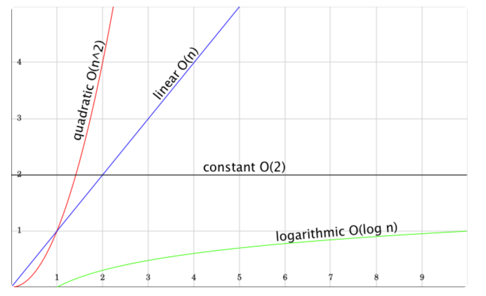

# Die *Big-O Notation*

[Zurück](Readme_Data_Structures_and_Algorithms.md)

---

## Allgemeines 

*Abbildung* 4: Die *Big-O Notation*.

| Typ | Notation | Beschreibung |
|:-|:-|:-|
| Konstant      | *O(1)*               | Die Laufzeit ist unabhängig von der Anzahl der Elemente. |
| Linear        | *O(n)*               | Die Laufzeit wächst linear mit der Anzahl der Elemente. |
| Logarithmisch | *O(log(n))*          | Die Laufzeit wächst logarithmisch mit der Anzahl der Elemente. |
| Quadratisch   | *O(n2)*   | Die Laufzeit wächst quadratisch mit der Anzahl der Elemente. |
| Kubisch       | *O(n3)*   | Die Laufzeit wächst proportional zur dritten Potenz der Anzahl der Elemente. |
| Exponentiell  | *O(2*n*)* | Die Laufzeit verdoppelt sich mit der Anzahl der Elemente. |
| Faktoriell    | *O(n!)*              |  Die Laufzeit wächst faktoriell mit der Anzahl der Elemente. |

*Tabelle* 1: Einige Beispiele für die *Big-O Notation*.

Einen guten Überblick zur Performanz der einzelnen Container samt deren Operationen findet sich
[hier](https://users.cs.northwestern.edu/~riesbeck/programming/c++/stl-summary.html).

---

[Zurück](Readme_Data_Structures_and_Algorithms.md)

---
