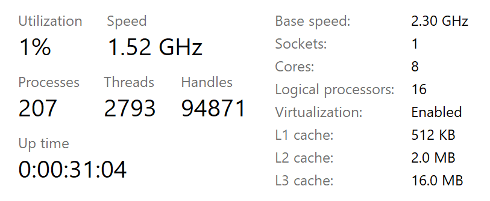
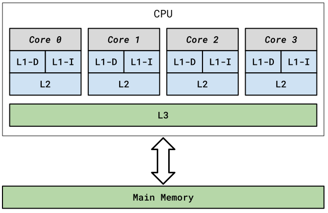
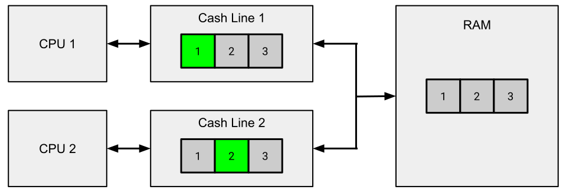
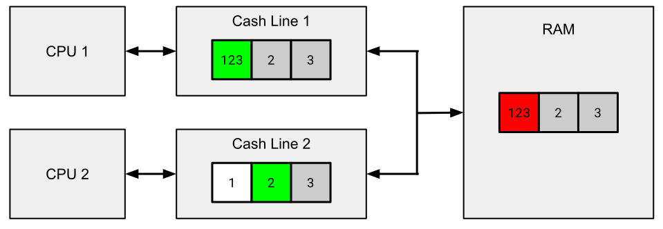
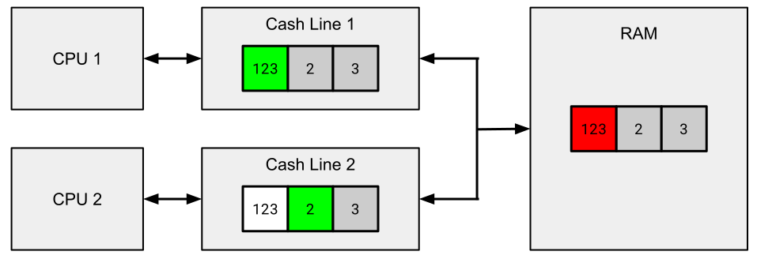

# CPU-Cache-Speicher

[Zurück](Readme_Data_Structures_and_Algorithms.md)

---

## Inhalt

  * [Allgemeines](#link1)
  * [L1-Cache / First-Level-Cache](#link2)
  * [L2-Cache / Second-Level-Cache](#link3)
  * [L3-Cache / Third-Level-Cache](#link4)
  * [*Cache Lines*](#link5)
  * [Größe des L1 Caches](#link6)
  * [Cache-Fehler (*Cache Misses*)](#link7)
  * [*False Sharing*](#link8)
  * [Literatur](#link9)

---

#### Quellcode

[*Caches.cpp*](Caches.cpp)<br />

---

## Allgemeines <a name="link1"></a>

CPU-Cache-Speicher ist eine Art temporärer Datenspeicher, der sich auf dem Prozessor befindet.
Er wird verwendet, um die Verarbeitungseffizienz der CPU zu steigern, indem er kleine, oft angeforderte Datenbytes bereithält, die mit hoher Geschwindigkeit abgerufen werden können.

Cache-Speicher besteht aus verschiedenen Speicherebenen. Diese Ebenen werden üblicherweise als L1, L2, L3 und gelegentlich als L4 bezeichnet und unterscheiden sich in Position, Geschwindigkeit und Größe.

Um besser zu verstehen, warum die CPU ihren eigenen Speichercache benötigt,
müssen wir uns die Entwicklung von Prozessoren und RAM ansehen.
Der Geschwindigkeitsunterschied zwischen Prozessor und RAM war in der Vergangenheit minimal.
Es bestand kaum Besorgnis darüber, dass die Verarbeitung durch den Speicher verlangsamt werden könnte.
Dies ist heutzutage nicht mehr der Fall: Aktuell übertrifft die Betriebsgeschwindigkeit von Zentralprozessoren die RAM-Geschwindigkeit bei weitem.
Es bestand folglich eine Notwendigkeit, diese Diskrepanz irgendwie zu verringern.
Die Antwort war Cache-Speicher.

Cache-Speicher ist extrem schnell (oft 10- bis 100-mal schneller als DRAM) und befindet sich physisch nahe an den Prozessorkernen.
Moderne, schnelle Prozessoren werden nicht dadurch ausgebremst, dass sie Daten aus dem relativ langsamen Systemspeicher anfordern müssen, da sie die Daten stattdessen aus dem Cache abrufen können.

In der Regel arbeiten Prozessoren mit mehrstufigen Caches, die unterschiedlich groß und schnell sind. Je näher der Cache am Rechenkern ist,
desto kleiner und schneller arbeitet er:

  * L1-Cache (klein, sehr schnell)
  * L2-Cache
  * L3-Cache (groß, langsam)

### L1-Cache / First-Level-Cache <a name="link2"></a>

Der L1-Cache, manchmal auch Primärcache genannt, ist die kleinste und schnellste Speicherebene.

Im L1-Cache werden die am häufigsten benötigten Befehle und Daten zwischengespeichert, damit möglichst wenige Zugriffe auf den langsamen Arbeitsspeicher erforderlich sind.
Dieser Cache vermeidet Verzögerungen und hilft dabei den Rechenkern optimal auszulasten.

Ein L1-Cache ist in zwei weitere Ebenen unterteilt:

  * L1-I (*Instructions* &ndash; Anweisungen) und
  * L1-D (*Data* &ndash; Daten).

Der L1-Anweisungscache verarbeitet Informationen, die dem Prozessor zugeführt werden, während der Datencache Informationen enthält, die in den Hauptspeicher geschrieben werden sollen.

Jeder Kern des Prozessors verfügt über einen eigenen integrierten L1-Cache.

### L2-Cache / Second-Level-Cache <a name="link3"></a>

Der L2-Cache ist ein sekundärer Speichercache, der ebenfalls in jeden einzelnen Kern der CPU eingebettet ist.
Er hat fast immer mehr Speicherplatz als ein L1-Cache, arbeitet aber langsamer,
aber immer noch viel schneller als die Geschwindigkeit des RAMs ist.

### L3-Cache / Third-Level-Cache <a name="link4"></a>

Anstatt in jeden CPU-Kern eingebettet zu sein, fungiert der Level-3-Cache als gemeinsam genutzter Speicherpool,
auf den der gesamte Prozessor zugreifen kann. Er ist viel langsamer als L1- und L2-Cache, vielleicht nur doppelt so schnell wie RAM,
ist aber die größte aller drei Speicherebenen.

In *Abbildung* 1 finden Sie die Cache-Größen auf meinem Rechner vor:



*Abbildung* 1: Cache-Größen auf meinem Rechner.

## *Cache Lines* <a name="link5"></a>

Beim Zugriff auf ein Byte im Speicher holt die CPU nicht nur das angeforderte Byte,
sondern immer eine so genannte *Cache Line*.

Häufig besteht eine *Cache Line* aus 64 Bytes.
Die verschiedenen Caches zwischen der CPU und dem Hauptspeicher (L1-, L2- und L3-Cache) tauschen 64-Byte-Blöcke statt einzelner Bytes aus.

Ein wichtiger Faktor, der die Leistung eines Computerprogramms, das den CPU-Cache nutzt, beeinträchtigen kann, besteht darin,
in einem Programm zwischen verschiedenen *Cache Lines* &bdquo;hin- und her zu springen&rdquo;,
an Stelle die Daten einer einzelnen *Cache Line* im Stück auszuwerten (solange das Programm eine derartige Funktionalität natürlich hergibt).

Die Größe einer Cache Line ist in C++ einfach bestimmbar:

*Beispiel*:

```cpp
01: void test() {
02:     constexpr auto cachelineSize = std::hardware_destructive_interference_size;
03:     std::println("Cache Line Size: {}", cachelineSize);
04: }
```

*Ausgabe*: 

```
Cache Line Size: 64
```

## Größe des L1 Caches <a name="link6"></a>

Wir berechnen nun die Größe des L1 Caches auf meinem Rechner (Windows Betriebssystem).
Dazu kommen einige Win32-API Betriebssystemfunktionen ins Spiel: `GetModuleHandle`, `GetProcAddress` und `GetLogicalProcessorInformation`.

*Beispiel*:

```cpp
01: void test() {
02: 
03:     typedef BOOL(WINAPI* LPFN_GLPI)(PSYSTEM_LOGICAL_PROCESSOR_INFORMATION, PDWORD);
04: 
05:     auto handle = GetModuleHandle(L"kernel32");
06: 
07:     auto glpi = (LPFN_GLPI) GetProcAddress(handle, "GetLogicalProcessorInformation");
08:     if (glpi == NULL)
09:         return;
10: 
11:     DWORD bufferBytes = 0;
12:     int cacheSize = 0;
13: 
14:     // calculate buffer length
15:     BOOL ret = glpi(0, &bufferBytes);
16: 
17:     std::size_t size = bufferBytes / sizeof(SYSTEM_LOGICAL_PROCESSOR_INFORMATION);
18:             
19:     SYSTEM_LOGICAL_PROCESSOR_INFORMATION* buffer = new SYSTEM_LOGICAL_PROCESSOR_INFORMATION[size];
20:             
21:     // retrieve array of SYSTEM_LOGICAL_PROCESSOR_INFORMATION structures
22:     ret = glpi(buffer, &bufferBytes);
23: 
24:     for (std::size_t i = 0; i < size; i++)
25:     {
26:         if (buffer[i].Relationship == RelationCache && buffer[i].Cache.Level == 1)
27:         {
28:             cacheSize = (int)buffer[i].Cache.Size;
29:             break;
30:         }
31:     }
32: 
33:     delete[] buffer;
34: 
35:     auto cacheSizeKB = cacheSize / 1024;
36:     std::println("L1 Cache Size: {}", cacheSizeKB);
37: }
```

*Ausgabe*: 

```
L1 Cache Size: 32 kB
```

Wie passt das Ergebnis mit *Abbildung* 1 zusammen? Ganz einfach,
mein Rechner hat 8 Kerne, jeder Kern hat einen L1-Anweisungs- und Datencache.
Macht zusammen 8 * 2 * 32 Kb = 512 kB.

## Cache-Fehler (*Cache Misses*) <a name="link7"></a>

Wenn die CPU die benötigten Daten nicht im Cache-Speicher findet, muss sie die Daten stattdessen aus dem langsameren Systemspeicher anfordern.
Dies wird als *Cache-Fehler* (*cache miss*) bezeichnet.
Die Einführung des L3-Cache verringerte die Wahrscheinlichkeit eines Fehlers und trug somit zur Leistungssteigerung bei.



*Abbildung* 2: Übliche CPU-Architektur mit L1-, L2- und L3-Cache.

Wir betrachten nun ein Beispiel,
in dem wir auf viele Daten im Speicher zugreifen.

Dies kann vor den soeben gestellten Überlegungen &ndash; Stichwort *Cache Misses* &ndash;
geschickt oder ungeschickt erfolgen.

*Beispiel*:

```cpp
01: constexpr auto capacityL1CacheSize = 32768;  // L1 Data Cache Size
02:         
03: constexpr auto Size = capacityL1CacheSize / sizeof(int);
04: 
05: using MatrixType = std::array<std::array<size_t, Size>, Size>;
06: 
07: static MatrixType matrix;
08: 
09: static auto initMatrix(MatrixType& matrix) {
10: 
11:     ScopedTimer watch{};
12: 
13:     size_t value{};
14: 
15:     for (size_t i{}; i != Size; ++i) {
16:         for (size_t j{}; j != Size; ++j) {
17:             matrix[i][j] = value++;          // no "cache thrashing"
18:         }
19:     }
20: }
21: 
22: void test() {
23:     initMatrix(matrix);
24: }
```

*Ausgabe*: Ohne &bdquo;Cache Thrashing&rdquo;.

```
Elapsed time: 87 [milliseconds]   87  // 612
```

*Ausgabe*: Mit &bdquo;Cache Thrashing&rdquo;.

```
Elapsed time: 612 [milliseconds]
```

Beide Ausführungen beziehen sich auf den *Release*-Mode.

---


## *False Sharing* <a name="link8"></a>

Wir beginnen mit dem *Sharing*-Aspekt von *False Sharing*:

Beim Lesen von Daten aus dem RAM lädt die CPU einen Speicherblock (*Cache Line*)
in ihren eigenen Cache.

Dadurch soll die *Datenlokalität* optimal genutzt werden:
Wenn Sie auf Daten zugreifen, greifen Sie höchstwahrscheinlich auch auf andere Daten zu,
die sich in der Nähe befinden.
Deshalb ist es sinnvoll, die gesamte Cache Line in den Cache zu laden, um sie schneller abrufen zu können.

Was passiert, wenn eine CPU den Inhalt einer Cache Line ändert, die aktuell mit anderen CPUs geteilt wird?
Die Caches der anderen CPUs müssen **neu geladen** werden,
bevor die auf diesen CPUs laufenden Prozesse fortgesetzt werden können, wodurch diese **blockiert** werden.

Dieser Mechanismus ermöglicht den verschiedenen Threads in einem Prozess eine zusammenhängende Ansicht des Speichers.

Betrachten wir nun den *False*-Aspekt von *False Sharing*:

Dieser tritt auf, wenn zwei oder mehr Prozesse (Threads) **unabhängige** Daten in **derselben** Cache Line lesen und ändern.
In diesem Fall wird der zuvor beschriebene Cache-Kohärenzmechanismus zum Problem:
Eine CPU wird blockiert und wartet auf ein völlig nutzloses Update.

Betrachten Sie zu diesem Zweck nachfolgend die *Abbildungen* 3, 4 und 5:



*Abbildung* 3: Ausgangsszenario zweier CPUs mit *Cache Lines*.

In *Abbildung* 3 arbeitet CPU 1 ausschließlich auf der Zelle, die den Wert &bdquo;1&rdquo; enthält,
CPU 2 wiederum ausschließlich auf der Zelle, die den Wert &bdquo;2&rdquo; enthält.



*Abbildung* 4: CPU 1 andert eine Zelle in ihrem Cache.

CPU 1 hat den Wert in &bdquo;ihrer&rdquo; Zelle von &bdquo;1&rdquo; auf &bdquo;123&rdquo; geändert.

CPU 2 erleidet einen Cache-Fehler (*Cache Miss*), der Cache muss neu geladen werden.



*Abbildung* 5: Der Cache von CPUs muss aktualisiert werden.

Der Cache von CPU 2 wurde neu geladen. CPU 2 kann nun die Arbeit fortsetzen.

*False Sharing* kann in der Regel auf zwei Arten behoben werden:

  * Stellen Sie sicher, dass Daten, die nicht zueinander in Beziehung stehen, in unterschiedlichen Cache Lines gespeichert werden.
  * Verwenden Sie lokale Daten für Zwischenberechnungen und greifen Sie erst am Ende auf den gemeinsam genutzten Speicher zu.


### *False Sharing* und C++ 17

Mit C++ 17 gibt es Unterstützung für *False Sharing*,
der Header <new> enthält neue Konstanten:

```cpp
inline constexpr size_t hardware_destructive_interference_size  = 64;
inline constexpr size_t hardware_constructive_interference_size = 64;
```

Die Konstante `std::hardware_destructive_interference_size` gibt den garantierten Mindestabstand
in Bytes zwischen zwei Speicherpositionen an,
um einen *False Sharing* Zugriff zu vermeiden.

Mit `alignas` lassen sich Variablen an diesem Mindestabstand entsprechend ausrichten.

*Beispiel*:

```cpp
01: struct DataWithAlignment {
02:     alignas(std::hardware_destructive_interference_size) int x{};
03:     alignas(std::hardware_destructive_interference_size) int y{};
04: };
```

Neben `std::hardware_destructive_interference_size` gibt es eine zweite Konstante: `std::hardware_constructive_interference_size`:

Diese Konstante gibt den garantierten Mindestabstand in Bytes zwischen zwei Speicherorten an,
der &bdquo;*konstruktive Interferenz*&rdquo; gewährleistet.

&bdquo;*konstruktive Interferenz*&rdquo; tritt auf,
wenn zwei Speicherorte nahe beieinander liegen, aber Zugriffe sich nicht gegenseitig stören.


### Beispiele zu *False Sharing*

*Beispiel* 1:

```cpp
01: const std::size_t Iterations = 100'000'000;  // 10000000
02: 
03: struct Data {
04:     int x{};
05:     int y{};
06: };
07: 
08: struct DataWithAlignment {
09:     alignas(std::hardware_destructive_interference_size) int x{};
10:     alignas(std::hardware_destructive_interference_size) int y{};
11: };
12: 
13: template <typename TData>
14: void updateData(TData& data, int id) {
15: 
16:     for (int i = 0; i < Iterations; ++i) {
17:         if (i % 2 == 0) {
18:             data.x += id;
19:         }
20:         else {
21:             data.y += id;
22:         }
23:     }
24: }
25: 
26: void test_false_sharing_with_false_sharing()
27: {
28:     Data data1;
29:     Data data2;
30: 
31:     std::thread t1(updateData<Data>, std::ref(data1), 1);
32:     std::thread t2(updateData<Data>, std::ref(data2), 2);
33: 
34:     {
35:         ScopedTimer watch{};
36: 
37:         t1.join();
38:         t2.join();
39:     }
40: }
41: 
42: void test_false_sharing_no_false_sharing()
43: {
44:     DataWithAlignment data1;
45:     DataWithAlignment data2;
46: 
47:     std::thread t1(updateData<DataWithAlignment>, std::ref(data1), 1);
48:     std::thread t2(updateData<DataWithAlignment>, std::ref(data2), 2);
49: 
50:     {
51:         ScopedTimer watch{};
52: 
53:         t1.join();
54:         t2.join();
55:     }
56: }
```


*Beispiel* 2:

```cpp
01: void test() {
02: 
03:     constexpr std::size_t numProcessors = 8;
04:     constexpr std::size_t numIter = 40'000'000;
05: 
06: #if FALSE_SHARING
07:     std::cout << "With false sharing \n";
08:     struct resultType {
09:         int val;
10:     };
11: #else
12:     std::cout << "Without false sharing\n";
13:     struct resultType {
14:         alignas(std::hardware_destructive_interference_size) int val;
15:     };
16: #endif
17:     std::println("Sizeof: {}", sizeof(struct resultType));
18: 
19:     std::array<resultType, numProcessors> results{ 0 };
20:     std::array<std::thread, numProcessors> threads;
21: 
22:     {
23:         ScopedTimer watch{};
24: 
25:         for (std::size_t i = 0; i < numProcessors; ++i) {
26: 
27:             auto& result = results[i];
28: 
29:             threads[i] = std::thread{
30:                 [&result, numIter]() mutable {
31:                     for (std::size_t j = 0; j < numIter; ++j) {
32:                         result.val = (result.val + std::rand() % 10) % 50;
33:                         // std::println("val: {}", result.val);
34:                     }
35:                 }
36:             };
37:         }
38: 
39:         std::for_each(
40:             begin(threads),
41:             end(threads),
42:             [](std::thread& t) { t.join(); }
43:         );
44:     }
45: }
```

---

## Literatur <a name="link9"></a>


Anregungen zum *False Sharing* finden Sie beispielsweise unter

[Caches and the problem of false sharing, a primer in C++17](https://medium.com/@joao_vaz/caches-and-the-problem-of-false-sharing-a-primer-in-c-17-1177ad07a625)

[Understanding False Sharing](https://parallelcomputing2017.wordpress.com/2017/03/17/understanding-false-sharing/)

und

[C++17 and False Sharing](https://curiouslyrecurringthoughts.home.blog/2019/06/10/c17-and-false-sharing/)

---

[Zurück](Readme_Data_Structures_and_Algorithms.md)

---
