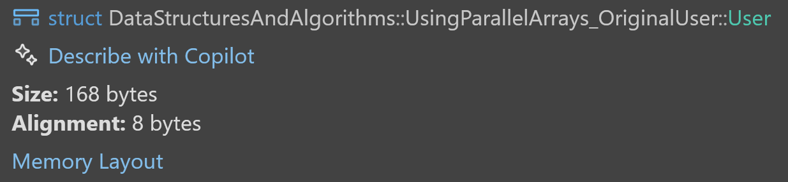
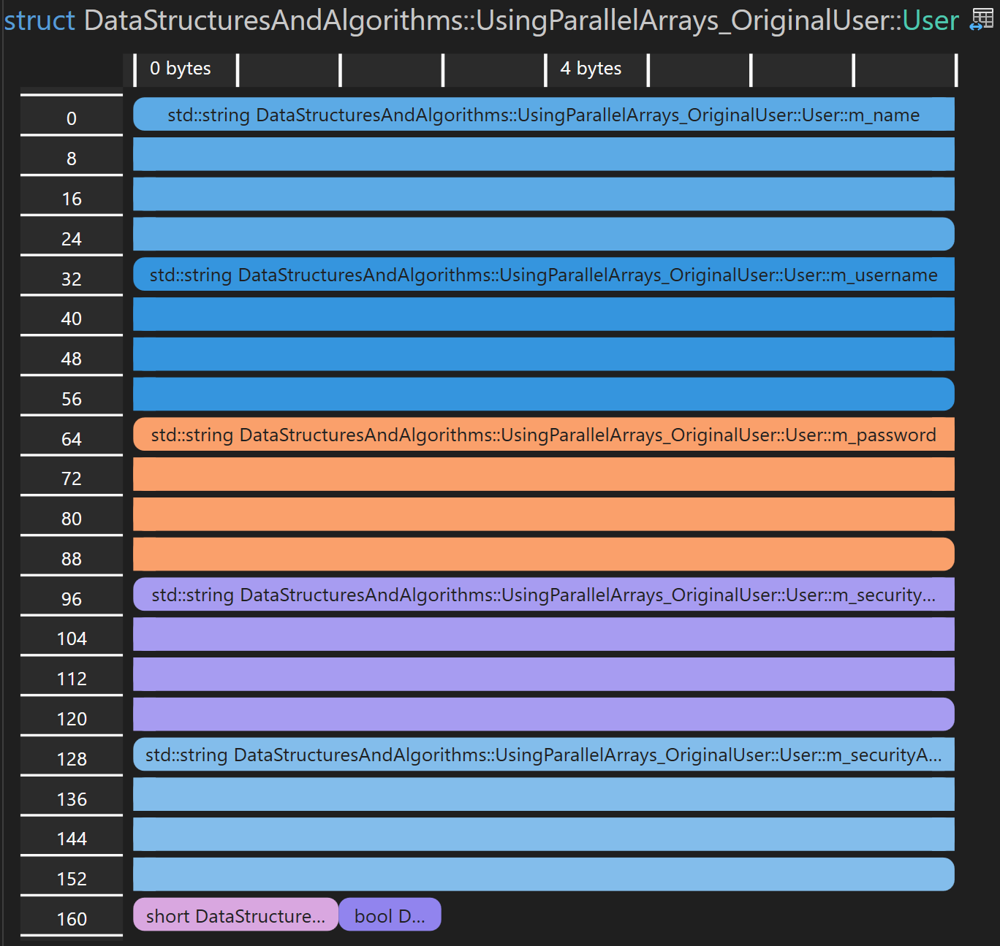
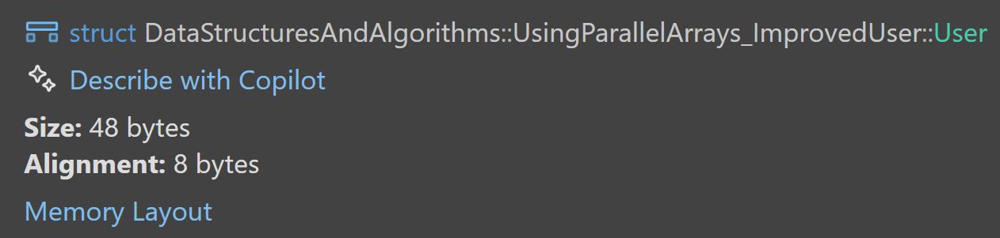
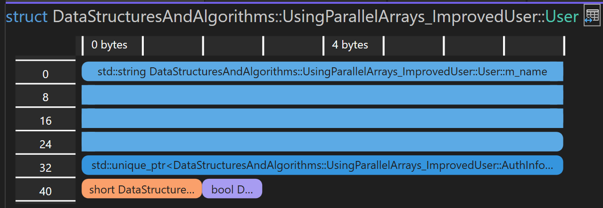
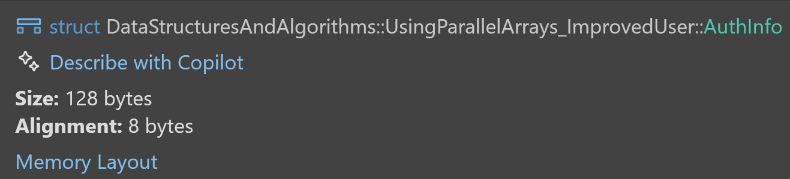
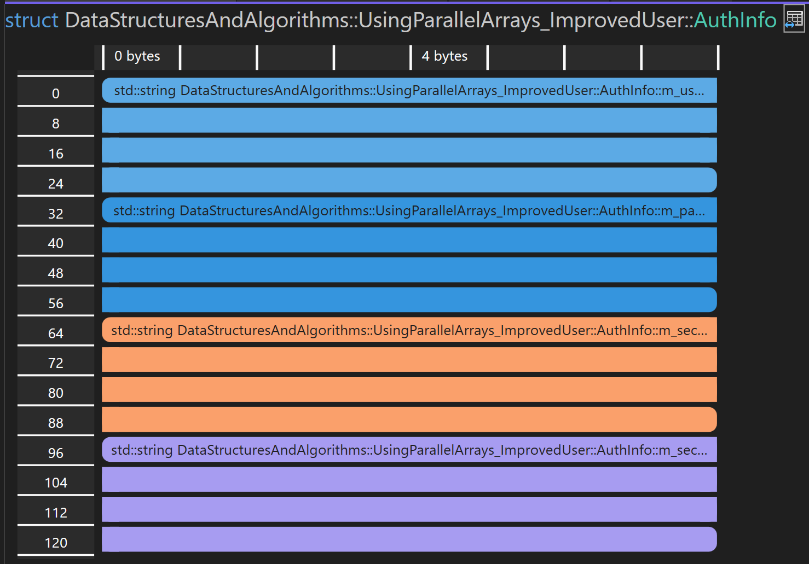
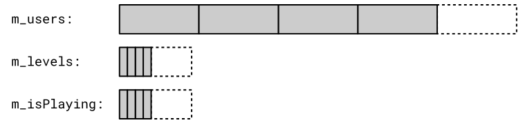

# Performanzbetrachtungen bei Objekten unterschiedlicher Größe: Parallele Arrays

[Zurück](Readme_Data_Structures_and_Algorithms.md)

---

## Inhalt

  * [Allgemeines](#link1)
  * [Erstes Beispiel: Vergleich von `SmallObject`- und `BigObject`-Objekten](#link2)
  * [Zweites Beispiel: Zerlegung größerer Objekte](#link3)
  * [Drittes Beispiel: Vergleich Array von Strukturen (AoS) versus Struktur von Arrays (SoA)](#link4)
  * [Literatur](#link5)

---

#### Quellcode

[*ParallelArrays.cpp*](ParallelArrays.cpp)<br />

---

## Allgemeines <a name="link1"></a>

Wir betrachten als Beispiel Iterationen über array-ähnliche Datenstrukturen,
die aus Objekten bestehen.

Zwei Faktoren spielen eine Rolle:

  * räumliche Lokalität (*spatial locality*).
  * zeitliche Lokalität (*temporal locality*).

Bei der Iteration über zusammenhängend im Speicher abgelegte Daten
erhöht sich die Wahrscheinlichkeit, dass die benötigten Werte bereits zwischengespeichert sind,
wenn es uns dank räumlicher Lokalität gelingt, unsere Objekte klein zu halten.

Dies hat bisweilen erhebliche Auswirkungen auf die Performance.

---

## Erstes Beispiel: Vergleich von `SmallObject`- und `BigObject`-Objekten <a name="link2"></a>

Wir betrachten in diesem Beispiel die Iteration
von `std::vector`-Containern, die aus
`SmallObject`- und `BigObject`-Objekten bestehen.


Die beiden Klassen `SmallObject` und `BigObject` sind bis auf die Größe eines enthaltenen Datenarrays identisch.
Beide Klassen enthalten einen `int`-Wert namens `m_score`,
den wir zu Testzwecken mit einem zufälligen Wert initialisieren.

Nun können wir vergleichen, wie lange es dauert,
die `m_score`-Werte von `SmallObject`-Objekten im Vergleich zu `BigObject`-Objekten
zu summieren:


```cpp
01: template <size_t Length>
02: class Object {
03: private:
04:     std::array<char, Length> m_data{};
05:     int m_score{ std::rand() };
06: public:
07:     auto getScore() const { return m_score; }
08: };
09: 
10: using SmallObject = Object<4>;
11: using BigObject = Object<256>;
12: 
13: constexpr auto Size = 1'000'000;
14: 
15: auto smallObjects = std::vector<SmallObject>(Size);
16: auto bigObjects = std::vector<BigObject>(Size);
17: 
18: template <class T>
19: auto sumScores(const std::vector<T>& objects) {
20: 
21:     ScopedTimer watch{};
22: 
23:     size_t sum{ 0 };
24: 
25:     for (const auto& obj : objects) {
26:         sum += obj.getScore();
27:     }
28: 
29:     return sum;
30: }
31: 
32: void test() {
33: 
34:     size_t sum{ 0 };
35:     sum += sumScores(smallObjects);
36:     sum += sumScores(bigObjects);
37: }
```

---

## Zweites Beispiel: Zerlegung größerer Objekte <a name="link3"></a>

Wir haben gesehen, dass es von Vorteil ist,
die Größe unserer Klassen klein zu halten,
auch wenn dies oft leichter gesagt als getan ist.

Wir betrachten nun eine Klasse `User` und überlegen,
wie wir sie in kleinere Teile aufteilen können.

### *Variante* 1:

```cpp
struct User
{
    std::string m_name;
    std::string m_username;
    std::string m_password;
    std::string m_securityQuestion;
    std::string m_securityAnswer;
    short       m_level{};
    bool        m_isPlaying{};
};
```



*Abbildung* 1: Struktur `User` in einem ersten Entwurf: Übersichtsdarstellung.



*Abbildung* 2: Struktur `User` in einem ersten Entwurf: Detaildarstellung.

### *Variante* 2:

Um bessere Laufzeiten zu erzielen, sollte man die Struktur `User` aufteilen.
In einem ersten Blick könnte man meinen, das Programm wird auf diese Weise zwingend langsamer,
da man bei mehreren Objekten/Strukturen mehr indirekte Zugriffe hat.
Das ist prinzipiell auch richtig beobachtet. Eine Aufteilung sollte diejenigen Informationen auslagern,
auf die man zur Laufzeit eher seltener zugreift.

In unserem Beispiel werden vier Elemente der `User`-Struktur in eine zweite Struktur `AuthInfo` ausgelagert.
Das Passwort als auch die Namen spielen während der Laufzeit eine eher untergeordnetere Rolle:

```cpp
struct User {
    std::string m_name;
    std::unique_ptr<AuthInfo> auth_info_;
    short m_level{};
    bool m_isPlaying{};
};
```

```cpp
struct AuthInfo {
    std::string m_username;
    std::string m_password;
    std::string m_securityQuestion;
    std::string m_securityAnswer;
};
```




*Abbildung* 3: Struktur `User` nach einem Redesign: Übersichtsdarstellung.



*Abbildung* 4: Struktur `User` nach einem Redesign: Detaildarstellung.

Es kommt nun neben Struktur `User` eine zweite Struktur `AuthInfo` ins Spiel:



*Abbildung* 5: Struktur `AuthInfo`: Übersichtsdarstellung.



*Abbildung* 6: Struktur `AuthInfo`: Detaildarstellung.

### *Variante* 3:

Die dritte Variante beherbergt den radikalsten Ansatz.
Es wird auf die Objektorientierung verzichtet!
Stattdessen kommen mehrere Arrays zum Einsatz.
Datentechnisch könnten dies `std::array`- oder `std::vector`-Objekte sein,
in jedem Fall sollten sie ihre Daten im Speicher konsekutiv abgelegt haben:



*Abbildung* 7: Speicherlayout bei Verwendung von drei parallelen Arrays.

Vergleichen Sie die Ausführungszeiten dieser drei Varianten!

---

## Drittes Beispiel: Vergleich Array von Strukturen (AoS) versus Struktur von Arrays (SoA) <a name="link4"></a>

Die Strukturierung und der Zugriff auf Daten können sich auf die Qualität ihrer Platzierung im Cache auswirken:

  * Array von Strukturen (AoS): Jedes Element ist eine Struktur, die alle Attribute enthält. Dies kann beim Zugriff auf einzelne Attribute zu Cache-Fehlern führen, da möglicherweise nicht zusammenhängende Daten in den Cache gelangen.
  * Struktur von Arrays (SoA): Attribute werden in separaten Arrays gespeichert. Dadurch wird in engen Schleifen nur auf die relevanten Daten zugegriffen, was die Cache-Auslastung verbessert.


Vergleichen Sie die Ausführungszeiten des Beispiels im Quellcode:

```cpp
struct Pixel
{
    uint8_t m_red;
    uint8_t m_green;
    uint8_t m_blue;
};

std::vector<Pixel> pixels(Width * Height);
```

versus

```cpp
struct Pixels
{
    std::vector<uint8_t> red;
    std::vector<uint8_t> green;
    std::vector<uint8_t> blue;
};

Pixels pixels;

pixels.red.resize(Width * Height);
pixels.green.resize(Width * Height);
pixels.blue.resize(Width * Height);
```

---

## Literatur <a name="link5"></a>

Die Anregungen zum Vergleich von
Arrays von Strukturen (AoS) und Strukturen von Arrays (SoA)
finden sich 
[hier](https://medium.com/@AlexanderObregon/optimizing-c-code-for-performance-a6b89e2b09bf)

---

[Zurück](Readme_Data_Structures_and_Algorithms.md)

---


