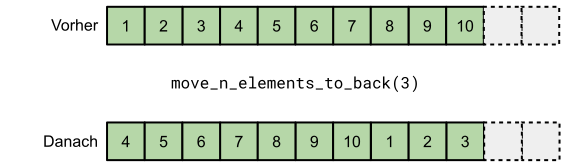
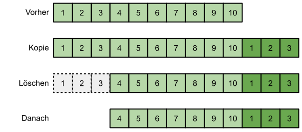

# STL Algorithmen

[Zurück](Readme_Data_Structures_and_Algorithms.md)

---

## Inhalt
  
  * [Allgemeines](#link1)
  * [Überblick über die populärsten STL-Algorithmen](#link2)
  * [`std::all_of`, `std::any_of` und `std::none_of` im Vergleich](#link3)
  * [Best Practice: Nicht-generische versus generische Funktionen](#link4)
  * [Best Practice: Benutzerdefinierte Datentypen mit `begin()` und `end()`](#link5)
  * [Best Practice: Verwenden Sie Standardalgorithmen anstelle von einfachen `for`-Schleifen](#link6)
  * [Best Practice: Unerwartete Ausnahmen und Performanzprobleme](#link7)
  * [Best Practice: Optimierungstechniken der STL](#link8)

---

#### Quellcode

[*STL_Algorithms.cpp*](STL_Algorithms.cpp)<br />

---

## Allgemeines <a name="link1"></a>

Die Verwendung von Containern aus der Standardbibliothek ist unter C++-Programmierern weit verbreitet.
Es ist selten, C++-Codebasen ohne Verweise auf `std::vector` oder `std::string` zu finden.

Interessanterweise kann man jedoch die Beobachtung machen, dass Algorithmen aus der Standardbibliothek viel seltener verwendet werden,
obwohl sie dieselben Vorteile wie Container bieten:

  * Sie können als Bausteine zur Lösung komplexer Probleme verwendet werden.
  * Ihre Speicherplatz- und Laufzeitaufwände sind bekannt (Komplexitätsgarantien).
  * Ihre Implementierungen sind gut ausgearbeitet und effizient.
  * Sie sind gut dokumentiert.

---

## Überblick über die populärsten STL-Algorithmen <a name="link2"></a>

Es werden die folgenden STL-Algorithmen an Hand von einfachen Beispielen vorgestellt:

  * `std::fill`
  * `std::for_each`
  * `std::generate`
  * `std::iota`
  * `std::copy`
  * `std::transform`
  * `std::accumulate`
  * `std::sort`
  * `std::find`
  * `std::is_sorted`
  * `std::binary_search`
  * `std::none_of`
  * `std::all_of`
  * `std::any_of`
  * `std::count`
  * `std::equal_range`
  * `std::distance`
  * `std::min`
  * `std::max`
  * `std::clamp`
  * `std::minmax_element`

---

## `std::all_of`, `std::any_of` und `std::none_of` im Vergleich <a name="link3"></a>

<table>
 <thead>
   <tr>
    <th>Has <i>true</i> element</th>
    <th colspan="2">Yes</th>
    <th colspan="2">No</th>
  </tr>
  <tr>
    <td><b>Has false element</b></td>
    <td><b>Yes</b></td>
    <td><b>No</b></td>
    <td><b>Yes</b></td>
    <td><b>No</b></td>
  </tr>
 </thead>
 <tbody>
   <tr>
    <td style='text-align:center;'><pre>std::all_of</pre></td>
    <td><i>false</i></td>
    <td><i>true</i></td>
    <td><i>false</i></td>
    <td><i>true</i></td>
  </tr>
  <tr>
    <td style='text-align:center;'><pre>std::any_of</pre></td>
    <td><i>true</i></td>
    <td><i>true</i></td>
    <td><i>false</i></td>
    <td><i>false</i></td>
  </tr>
  <tr>
    <td style='text-align:center;'><pre>std::none_of</pre></td>
    <td><i>false</i></td>
    <td><i>false</i></td>
    <td><i>true</i></td>
    <td><i>true</i></td>
  </tr>
 </tbody>
</table>

---

## Best Practice: Nicht-generische versus generische Funktionen <a name="link4"></a>

Betrachten Sie die folgende Funktion `contains`:

```cpp
01: auto contains(const std::vector<int>& vec, int elem) {
02: 
03:     for (size_t i{}; i != vec.size(); ++i) {
04:         if (vec[i] == elem) {
05:             return true;
06:         }
07:     }
08:     return false;
09: }
```

Um das gesuchte Element zu finden, verlassen wir uns auf die Schnittstelle von `std::vector`,
die uns die Funktion `size()` und den Indexoperator (`operator[]`) zur Verfügung stellt.

Allerdings stellen uns nicht alle Container diese Funktionen zur Verfügung,
damit ist eine derartige `for`-Wiederholungsschleife nicht sehr empfehlenswert!

Stattdessen können wir ein Funktionstemplate erstellen, das mit Iteratoren arbeitet.
Auf diese Weise erhalten wir eine `contains`-Funktion, die mit unterschiedlichen STL-Containertypen arbeiten kann:

```cpp
01: template <typename T, typename V>
02: static auto contains(T begin, T end, const V& elem) {
03: 
04:     for (auto it{ begin }; it != end; ++it) {
05:         if (*it == elem) {
06:             return true;
07:         }
08:     }
09:     return false;
10: }
```

*Anwendungsbeispiel*:

```cpp
01: void test()
02: {
03:     auto values1 = std::vector{ 1, 2, 3, 4, 5, 6, 7, 8, 9, 10 };
04:     auto values2 = std::list{ 1, 2, 3, 4, 5, 6, 7, 8, 9, 10 };
05:     auto values3 = std::list<std::string>{ "1.5", "2.5", "3.5", "4.5", "5.5" };
06: 
07:     bool found1{ contains(values1.begin(), values1.end(), 3) };
08:     bool found2{ contains(values2.begin(), values2.end(), 3) };
09:     bool found3{ contains(values3.begin(), values3.end(), "3.5")};
10: }
```

---

## Best Practice: Benutzerdefinierte Datentypen mit `begin()` und `end()` <a name="link5"></a>

Wie wir im letzten Abschnitt gesehen haben, können neue benutzerdefinierte Datentypen,
die wir erstellen, von den standardmäßigen generischen Algorithmen verwendet werden,
solange sie die beiden Methoden `begin()` und `end()` zur Verfügung stellen.

Als einfaches Beispiel implementieren wir eine zweidimensionale `Grid`-Struktur wie folgt,
die ihre Zeilen durch ein Iteratorenpaar veröffentlicht:

```cpp
01: class Grid
02: {
03: public:
04:     Grid() : Grid{ 0, 0} {}
05: 
06:     Grid(size_t width, size_t height) : m_width{ width }, m_height{ height }
07:     {
08:         m_data.resize(width * height);
09:     }
10: 
11:     auto getData() // returns whole grid as iterator pair
12:     {
13:         auto left = m_data.begin();
14:         auto right = m_data.begin() + m_width * m_height;
15:         return std::make_pair(left, right);
16:     }
17: 
18:     auto getRow(size_t i) // returns iterator pair for corresponding row
19:     {
20:         auto left = m_data.begin() + m_width * i;
21:         auto right = left + m_width;
22:         return std::make_pair(left, right);
23:     }
24:         
25:     auto print() 
26:     {
27:         std::for_each(
28:             m_data.begin(),
29:             m_data.end(),
30:             [this, i=0, j=0] (auto elem) mutable {
31:                 
32:                 std::print("[{}:{}] {:2}  ", i, j, m_data[m_width * i + j]);
33: 
34:                 ++j;
35:                 if (j == m_width) {
36:                     ++i;
37:                     j = 0;
38:                     std::println();
39:                 }
40:             }
41:         );
42:     }
43: 
44:     auto getWidth() const { return m_width; }
45:     auto getHeight() const { return m_height; }
46: 
47: private:
48:     std::vector<int> m_data;
49:     size_t           m_width;
50:     size_t           m_height;
51: };
```

---

## Best Practice: Verwenden Sie Standardalgorithmen anstelle von einfachen `for`-Schleifen <a name="link6"></a>

Wir stellen einen Vergleich an:

#### Beispiel einer Funktion mit einfacher `for`-Schleife

```cpp
01: void test (const auto& infos, const auto& output) {
02: 
03:     // original version using a for-loop
04:     auto conflicting = false;
05:     for (const auto& info : infos) {
06:         if (info.params() == output.params()) {
07:             if (varies(info.flags())) {
08:                 conflicting = true;
09:                 break;
10:             }
11:         }
12:         else {
13:             conflicting = true;
14:             break;
15:         }
16:     }
17: }
```


#### Beispiel einer Funktion unter Verwendung von Standardalgorithmen


```cpp
01: void test (const auto& infos, const auto& output) {
02: 
03:     // version using standard algorithms
04:     const auto in_conflict = [&](const auto& info) {
05:         return info.params() != output.params() || varies(info.flags());
06:     };
07: 
08:     const auto conflicting = std::any_of(infos.begin(), infos.end(), in_conflict);
09: }
```

---

## Best Practice: Unerwartete Ausnahmen und Performanzprobleme <a name="link7"></a>

Um die Bedeutung der Verwendung von Algorithmen anstelle von einfachen `for`-Schleifen noch weiter zu unterstreichen,
zeigen wir einige weitere, nicht ganz so offensichtliche Probleme auf,
auf die man stoßen kann, wenn man handgefertigte `for`-Schleifen anstelle von Standardalgorithmen verwendet.

Nehmen wir an, wir benötigen eine Funktion, die die ersten *n* Elemente vom Anfang des Containers
an das Ende verschiebt, und zwar wie folgt:



*Abbildung* 1: Verschieben der ersten drei Elemente an das Ende eines Containers.

Ein naiver Ansatz wäre, die ersten *n* Elemente während einer Iteration nach hinten zu kopieren
und dann die ersten *n* Elemente zu löschen:



*Abbildung* 2: Speicherzuweisung und -freigabe, um Elemente an das Ende eines Containers zu verschieben.


*Quellcode*:

```cpp
01: template <typename TContainer>
02: auto move_n_elements_to_back(TContainer& cont, std::size_t n) {
03: 
04:     // copy the first n elements to the end of the container
05:     for (auto it = cont.begin(); it != std::next(cont.begin(), n); ++it) {
06:         cont.emplace_back(std::move(*it));
07:     }
08: 
09:     // erase the copied elements from front of container
10:     cont.erase(cont.begin(), std::next(cont.begin(), n));
11: }
```

Auf den ersten Blick mag das plausibel erscheinen, aber bei näherer Betrachtung offenbart sich ein schwerwiegendes Problem:
Wenn der Container während der Iteration aufgrund von `emplace_back()` intern neuen Speicher allokiert,
ist der im Einsatz befindliche Iterator (`it`) nicht mehr gültig!

Wenn der Algorithmus versucht, auf einen ungültigen Iterator zuzugreifen,
liegt *Undefined Behavior* vor, das Programm stürzt im besten Fall ab.
Wir schreiben Funktion `move_n_elements_to_back` neu &ndash; Variante `move_n_elements_to_back_safe`:

*Quellcode*:

```cpp
01: template <typename TContainer>
02: auto move_n_elements_to_back_safe(TContainer& cont, std::size_t n) {
03: 
04:     // copy the first n elements to the end of the container
05:     for (size_t i{}; i != n; ++i) {
06: 
07:         auto pos{ std::next(cont.begin(), i) };
08:         auto value = *pos;
09:         cont.emplace_back(std::move(value));
10:     }
11: 
12:     // erase the copied elements from front of container
13:     cont.erase(cont.begin(), std::next(cont.begin(), n));
14: }
```

Die Lösung funktioniert &ndash; sie stürzt nicht mehr ab. Aber jetzt hat sie ein subtiles Leistungsproblem.

Der Algorithmus agiert auf Containerobjekten des Typs `std::list` deutlich langsamer als auf `std::vector`-Objekten.

Der Grund dafür ist, dass *std::next(it, n)* in Verbindung mit `std::list::iterator` *O(n)* im Gegensatz zu
*O(1)* bei Einsatz eines `std::vector::iterator`-Objekts ist.

Da *std::next(it, n)* in jedem Schritt der `for`-Schleife aufgerufen wird,
hat dieser Algorithmus bei Verwendung von Containern wie `std::list` eine Zeitkomplexität von *O(n<sup>2</sup>)*.

Abgesehen von dieser Leistungsbeschränkung hat der vorangehende Code auch noch die folgenden Einschränkungen:

  * Er funktioniert aufgrund von `emplace_back()` nicht mit Containern mit statischer Größe, wie z. B. `std::array`.

  * Die Funktion kann eine Ausnahme auslösen, da `emplace_back()` Speicher allokiert und fehlschlagen kann
   (auch wenn dies möglicherweise selten der Fall ist).

Wenn wir dieses Stadium erreicht haben, sollten wir die Standardbibliothek durchsuchen und prüfen,
ob sie einen geeigneten Algorithmus enthält, der als Baustein verwendet werden kann.

Praktischerweise stellt der <algorithm>-Header einen Algorithmus namens `std::rotate()` bereit,
der genau das tut, was wir suchen, und dabei alle zuvor genannten Nachteile vermeidet.

Hier ist unsere endgültige Version mit dem `std::rotate()`-Algorithmus &ndash; Variante `move_n_elements_to_back_safe_and_fast`:


*Quellcode*:

```cpp
01: template <typename TContainer>
02: auto move_n_elements_to_back_safe_and_fast(TContainer& cont, std::size_t n) {
03: 
04:     auto newBegin = std::next(cont.begin(), n);
05:     std::rotate(cont.begin(), newBegin, cont.end());
06: }
```

Schauen wir uns die Vorteile von `std::rotate()` an:

  * Der Algorithmus löst keine Ausnahmen aus, da er keine Speicherallokationen vornimmt (das enthaltene Objekt kann jedoch Ausnahmen auslösen).
  * Er funktioniert auch mit Containern, deren Größe nicht änderbar ist, wie z. B. `std::array`.
  * Die Leistung ist *O(n)*, unabhängig vom Container, auf dem er ausgeführt wird.
  * Die Implementierung kann unter Berücksichtigung spezifischer Hardware weiter optimiert werden.

---

## Best Practice: Optimierungstechniken der STL <a name="link8"></a>

Die Realisierung der STL ist immer für Überraschungen gut:

Selbst scheinbar sehr einfache Algorithmen können Optimierungen enthalten,
die man normalerweise nicht in Betracht ziehen würde.

Wir betrachten als Beispiel den Algorithmus `std::find()`:

*Quellcode*: Klassische Realisierung

```cpp
01: template <typename T, typename V>
02: static auto find_slow(T first, T last, const V& value) {
03:     for (auto it = first; it != last; ++it) {
04:         if (*it == value) {
05:             return it;
06:         }
07:     }
08:     return last;
09: }
```

*Quellcode*: Optimierte Realisierung

```cpp
01: template <typename T, typename V>
02: static auto find_fast(T first, T last, const V& value) {
03:         
04:     // main loop unrolled into chunks of four (std::random_access_iterator needed)
05:     auto num_trips = (last - first) / 4;
06: 
07:     for (auto trip_count = num_trips; trip_count > 0; --trip_count) {
08: 
09:         if (*first == value) { return first; } ++first;
10:         if (*first == value) { return first; } ++first;
11:         if (*first == value) { return first; } ++first;
12:         if (*first == value) { return first; } ++first;
13:     }
14: 
15:     // handle the remaining elements
16:     switch (last - first) {
17:         case 3: if (*first == value) { return first; } ++first;
18:         case 2: if (*first == value) { return first; } ++first;
19:         case 1: if (*first == value) { return first; } ++first;
20:         case 0:
21:         default: return last;
22:     }
23: }
```

Worin liegt der Unterschied der beiden Realisierungen?

Bei genauerer Betrachtung der optimierten Implementierung ist festzustellen,
dass diese bei Verwendung mit `std::random_access_iterator` (also `std::vector`, `std::string`, `std::deque` und `std::array`)
die Hauptschleife in Abschnitte von jeweils vier Blöcken aufteilt,
was dazu führt, dass der Vergleich (`it != last`) nur ein Viertel so oft ausgeführt wird.

*Ausgabe*:

```
find_slow: Elapsed time: 445 [milliseconds]
find_fast: Elapsed time: 249 [milliseconds]
```

---

[Zurück](Readme_Data_Structures_and_Algorithms.md)

---
