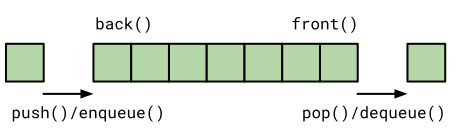

# STL Container

[Zurück](Readme_Data_Structures_and_Algorithms.md)

---

## Inhalt

  * [Allgemeines](#link1)
  * [Wählen Sie einen STL Container mit Bedacht aus](#link2)
  * [Sequentielle Container (*Sequence Container*)](#link3)
  * [Vektor (`std::vector`)](#link4)
  * [Array (`std::array`)](#link5)
  * [Double-ended Queue (`std::deque`)](#link6)
  * [Doppelt verkettete Liste (`std::list`)](#link7)
  * [Vorwärts verkettete Liste (`std::forward_list`)](#link8)
  * [Assoziative Container (*Associative Container*)](#link9)
  * [Geordnete assoziative Container (`std::set`, `std::map`)](#link10)
  * [Ungeordnete assoziative Container (`std::unordered_set`, `std::unordered_map`)](#link11)
  * [Berechnung von Hash-Werten für benutzerdefinierte Typen](#link12)
  * [Container Adapter](#link13)
  * [Container Adapter `std::stack`](#link14)
  * [Container Adapter `std::queue`](#link15)
  * [Container Adapter `std::priority_queue`](#link16)
  * [Vier weitere &bdquo;*flache*&rdquo; Container Adapter in C++ 23](#link17)
  * [Ansichten (*Views*)](#link18)

---

#### Quellcode

[*STL_Container.cpp*](STL_Container.cpp)<br />

---

## Allgemeines <a name="link1"></a>


*Abbildung* 1: Überblick über alle STL Standardcontainer.


7 Gründe für die Verwendung von STL Standardcontainern:

  * Durch den Einsatz von STL Standardcontainern eliminiert man einen Großteil des Boilerplate-Codes,
  der zu schreiben wäre, wenn man derartige Klassen selbst schreibt.

  * STL Container vereinfachen die Entwicklung.

  * STL Container sind korrekt implementiert und man muss keine Zeit mit dem Debuggen der Container verbringen.

  * STL Container sind schnell und wahrscheinlich effizienter als alles, was man selbst implementieren kann.

  * STL Container teilen eine (weitestgehend) gemeinsame Schnittstellendefinition.
  Dadurch ist es einfacher, verschiedene Container zu verwenden bzw. diese bei Bedarf auszutauschen.
  Auch macht es die Sache einfacher, wenn man nicht bei jedem STL Container eine andere Schnittstellendefinition
  nachschlagen und verstehen muss.

  * STL Container sind gut dokumentiert und für andere Entwickler leicht verständlich,
  was die Verständlichkeit und Wartbarkeit eines Projekts verbessert.

  * Durch die Verwendung von STL Containern wird man ein produktiverer SW-Entwickler.

---

## Wählen Sie einen STL Container mit Bedacht aus <a name="link2"></a>

Beachten Sie folgende Hinweise bei der Wahl eines Containers:

  * Verwenden Sie einen sequentiellen Container, wenn Sie auf die Elemente per Position (Index) zugreifen müssen/können.

  * Verwenden Sie assoziative Container, wenn Sie auf die Elemente per Schlüssel zugreifen müssen/können.


### Sollte die Wahl auf einen sequentiellen Container fallen:

  * Verwenden Sie die Klasse `std:vector` als quasi standardmäßigen (sequentiellen) Container,
  insbesondere als Alternative zu C-Style Arrays.
  * Wenn die Größe im Voraus bekannt ist, verwenden Sie die Klasse `std::array`.
  Vermeiden Sie C-Style Arrays.
  * Wenn Sie häufig Elemente sowohl am Anfang als auch am Ende eines Containers hinzufügen oder entfernen, verwenden Sie die Klasse `std::deque`.
  * Verwenden Sie ein `std::list`-Objekt (nicht: `std::deque`), wenn Sie häufig Elemente in der Mitte des Containers einfügen/entfernen müssen.
  * Verwenden Sie nicht die Klasse `std::list`, wenn Sie wahlfreien Zugriff auf Objekte benötigen (Zugriff mit einem Index).
  * Bevorzugen Sie die Klasse `std::vector` gegenüber der Klasse `std::list`, wenn Ihr System einen Cache verwendet &ndash;
  siehe hierzu auch [CPU-Cache-Speicher](Readme_Caches.md).
  * Die Klasse `std::string` ist fast immer besser als eine  C-Style Zeichenkette.


### Sollte die Wahl auf einen assoziativen Container fallen:


  * Für Schlüssel/Wert-Paare verwenden Sie standardmäßig die Klasse `std::unordered_map` oder,
  wenn die Reihenfolge der Elemente wichtig ist, die Klasse `std::map`.
  * Wenn Sie mehrere Einträge für denselben Schlüssel benötigen, verwenden Sie `std::unordered_multimap` oder,
  wenn die Reihenfolge der Elemente wichtig ist, `std::multimap`.


### `std::map` versus `std::unordered_map`

Eine der am häufigsten gestellten Fragen im Umfeld von assoziativen Containern lautet:<br />
&bdquo;Wann soll ich die Klasse `std::map` und wann die Klasse `std::unordered_map` verwenden?&rdquo;

#### Sie sollten einen geordneten assoziativen Container verwenden, wenn:

  * Sie bevorzugen eine baumartige Datenstruktur.
  * Sie möchten den Speicheroverhead, der beim Speichern einer Hash-Tabelle entsteht, vermeiden.
  * Die Reihenfolge oder eine Traversierung durch einen geordneten Datensatz ist wichtig.
  * Die Realisierung einer guten Hash-Funktion für die Schlüsseldaten ist nicht möglich oder zu kompliziert.
  * Sie bevorzugen die Realisierung eines Vergleichsoperators für Ihre benutzerdefinierten Datentypen an Stelle des Aufwands, eine gute Hashing-Funktion schreiben zu müssen.
  * Sie benötigen eine garantierte Performanz (z. B. Software für Embedded Systems).
  * Ungeordnete Container haben im schlimmsten Fall bei Kollisionen eine Worst-Case-Komplexität von O(*n*).

#### Sie sollten einen ungeordneten assoziativen Container verwenden, wenn:
 
  * Der Speicherplatzaufwand für die Hash-Tabelle spielt keine Rolle.
  * Das Programm kann gelegentliche längere Operationen akzeptieren<br />(Auflösen von Hash-Kollisionen).
  * Sie verfügen über eine gute Hash-Funktion, um Kollisionen zu reduzieren.
  * Sie können den Datentyp `std::string` für die Schlüsseldaten verwenden.


#### Und noch einige Hinweise bei der Wahl eines Containers:

  * Müssen Sie in der Lage sein, ein neues Element an einer beliebigen Position im Container einzufügen?<br />Wenn ja, benötigen Sie einen sequentiellen Container.
  * Ist Ihnen wichtig, wie die Elemente im Container angeordnet sind (Reihenfolge)?<br />Wenn nicht, sind Hash-basierte Container eine praktikable Wahl, andernfalls verwenden Sie geordnete assoziative Container.
  * Wollen Sie Kopiertätigkeiten vorhandener Containerelemente vermeiden, wenn Einfügungen und Löschungen stattfinden?<br />Vermeiden Sie die Verwendung sequentieller (zusammenhängender / konsekutiver) Container.
  * Verfügt Ihr Code über viele `push_back()`-Methodenaufrufe?<br />Verwenden Sie `std::deque` an Stelle von `std::vector`, da `std::deque` intern in Summe weniger Datenblöcke umkopiert / verschiebt.
  * Bestehen strenge Anforderungen an die Speichernutzung?<br />Ein Einsatz einer Hash-Tabelle ist mit Vorsicht zu genießen, da derartige Container intern zusätzlichen &ndash; für Nutzdaten nicht verfügbaren &ndash; Speicherplatz allokieren.
  * Müssen Sie einen *Map*-Container traversieren?<br />Verwende `std::map` an Stelle von `std::unordered_map`.
  * Soll die Größe eines Containers fest (unveränderlich) sein?<br />Wähle `std::array` an Stelle von `std::vector`.
  * Gibt es häufig Einfüge- und Lösch-Operationen in der Mitte des Containers?<br />Verwende `std::list` statt `std::vector` oder `std::deque`.

### Rolle des Speicherplatzmanagements bei der Wahl eines Containers

Hier sind die allgemeinen Faustregeln für das Speicherplatzmanagement in den verschiedenen sequentiellen Containern:

  * `std:vector`, `std::array` und `std::string` besitzen für ihre Daten zusammenhängenden (konsekutiven) Speicher.
  Sie sind mit APIs im C-Stil kompatibel (siehe zum Beispiel die `data()`-Methode an den zuvor erwähnten Klassen).
  * `std::deque` weist Speicher in Blöcken zu.
  * `std::list` weist Speicher pro Knoten zu.

---

## Sequentielle Container (*Sequence Container*) <a name="link3"></a>

Unter einem &bdquo;sequentiellen Container&rdquo; verstehen wir, 
dass auf die Elemente des Containers sequenziell zugegriffen werden kann.

Die STL kennt folgende sequentielle Container:

  * `std::array`
  * `std::vector`
  * `std::list`
  * `std::forward_list`
  * `std::deque`

*Beachte*:<br />
Die Klassen `std::array` und `std::vector` ermöglichen einen schnellen Zugriff auf ihre Elemente (*O(1)*).

---

### Vektor (`std::vector`) <a name="link4"></a>

Die Klasse `std::vector` ist der am häufigsten verwendete STL Container.

Intern, also in Bezug auf die Ablage seiner Daten im Speicher, verhält sich ein Vektor wie ein Array,
das allerdings bei Bedarf dynamisch wächst.

Die einem Vektor hinzugefügten Elemente werden zusammenhängend im Speicher angeordnet.
Dies bedeutet, dass man in konstanter Zeit auf jedes Element im Vektor über einen Index zugreifen kann.


```cpp
auto vec = std::vector{ 1, 2, 3 };
vec.push_back(4);
vec.push_back(5);
std::println("Size: {} - Capacity: {}", vec.size(), vec.capacity());
```

*Ausgabe*:

```
Size: 5 - Capacity: 6
```

Die Daten eines Vektors befinden sich auf dem *Heap* (Halde).

Will man die Elemente eines Vektors in der Reihenfolge durchlaufen,
in der sie angeordnet sind, erzielt man eine sehr gute Performanz.

Ein Vektor besitzt eine *Größe* (`length()`) und eine *Kapazität* (`capacity()`).
Die Größe beschreibt die Anzahl der Elemente, die aktuell im Container enthalten sind,
die Kapazität beschreibt die Anzahl der Elemente, die der Vektor enthalten kann,
bis er mehr Speicherplatz anfordern muss.


*Abbildung* 2: Ein `std::vector`-Objekt mit den beiden Eigenschaften *Size* und *Capacity*.

---

### Array (`std::array`) <a name="link5"></a>

Ein Feld (Array) ist ähnlich zu einem Vektor, nur ist seine Größe fest.

Die Elemente eines Arrays liegen je nach Örtlichkeit der Definition 
im globalen Datensegment oder auf dem Stack. Damit ist gesagt, dass sich ein `std::array`-Objekt
*per se* nicht auf dem Heap befindet (es sein denn, es wird mittels `new` explizit dort hingelegt).

In der STL ist die Klasse `std::array` ein Klassentemplate.
Dies hat zur Folge, dass sowohl die Größe als auch der Typ der Elemente Teil des konkreten Typs sind.

```cpp
auto a = std::array<int, 5>{ 1, 2, 3, 4, 5 };
```


Auf Grund der *Class Template Argument Deduction* (*CTAD*) 
kann man auch schreiben:

```cpp
auto a = std::array{ 1, 2, 3, 4, 5 };
```


*Abbildung* 3: Ein `std::array`-Objekt, die Länge *Size* (hier: 7) ist unveränderbar.

---

### Double-ended Queue (`std::deque`) <a name="link6"></a>

Muss man häufig Elemente sowohl am Anfang als auch am Ende eines Containers hinzufügen,
ist ein `std::vector`-Objekt nicht die erste Wahl.

Es bietet sich in diesem Fall die Klasse `std::deque` an,
was als Abkürzung für &bdquo;*Double-Ended Queue*&rdquo; steht.

Intern wird ein `std::deque`-Objekt normalerweise als Sammlung von Arrays mit fester Größe implementiert,
was es ermöglicht, in konstanter Zeit auf Elemente über einen Index zuzugreifen.

Es werden aber nicht alle Elemente zusammenhängend im Speicher gespeichert,
so wie dies bei den Klassen `std::vector` und `std::array` der Fall ist,
siehe dazu auch *Abbildung* 4:


*Abbildung* 4: Mögliche interne Repräsentation eines `std::deque`-Objekts.

---

### Doppelt verkettete Liste (`std::list`) <a name="link7"></a>

Die Klasse `std::list` ist eine doppelt verkettete Liste, was bedeutet,
dass jedes Element eine Verknüpfung zum nächsten Element und eine Verknüpfung zu seinem vorherigen Element hat.

Dadurch ist es möglich, die Liste sowohl vorwärts als auch rückwärts zu durchlaufen.

Beachten Sie, dass die Elemente, selbst wenn sie in einer Sequenz angeordnet sind,
nicht wie bei einem Vektor und einem Array zusammenhängend im Speicher angeordnet sind.
Das bedeutet, dass das Iterieren einer verketteten Liste im Vergleich
zum Vektor höchstwahrscheinlich viel mehr Cache-Fehler erzeugt und damit langsamer ist.


*Abbildung* 5: Beispiel eines `std::list`-Objekts mit Zeigern auf das jeweils nächste und vorherige Element.

---

### Vorwärts verkettete Liste (`std::forward_list`) <a name="link8"></a>

Es gibt auch eine vorwärts verkettete Liste namens `std::forward_list` (auch als einfach verkettete Liste bekannt).

Der Grund, warum Sie die doppelt verkettete Listen nicht immer der `std::forward_list` vorziehen sollten,
ist der übermäßige Speicher, der von den *Previous*-Zeigern (Zeiger auf das vorherige Element) in der doppelt verkettete Liste belegt wird.

Wenn Sie die Liste also nicht rückwärts durchlaufen müssen, verwenden Sie die Klasse `std::forward_list`.

Ein weiteres interessantes Merkmal der Klasse `std::forward_list` ist,
dass sie für sehr kurze Listen optimiert ist.


*Abbildung* 6: Beispiel eines `std::forward_list`-Objekts mit Zeigern auf das jeweils nächste Element.

---

## Assoziative Container (*Associative Container*) <a name="link9"></a>

Assoziative Container werden in der Informatik auch *assoziative Arrays* oder *Maps* oder *Dictionaries* genannt.

Ein assoziativer Container stellt ein spezielle Variante eines Arrays dar,
bei dem der Index nicht numerisch, sondern auch ein beliebiger anderer Datentyp (wie z. B. `std::string`) sein kann.

Dies bedeutet anders herum gesagt:
In einem assoziativen Container ist es nicht möglich,
ein Element hinten oder vorne hinzuzufügen,
so wie wir es mit `push_back()` (Klasse `std::vector`) oder `push_front()` (Klasse `std::list`) tun würden.

Stattdessen werden die Elemente so hinzugefügt, dass es möglich ist, ein Element zu finden,
ohne den gesamten Container sequentiell durchlaufen zu müssen.

Die Indizes werden als Schlüssel (*Keys*) bezeichnet und die an dieser Position gespeicherten Daten
als Wert (*Value*).

Ein assoziativer Container repräsentiert folglich eine Menge von *Key*&ndash;*Value*-Paaren.

Man unterscheidet zwei Kategorien von assoziativen Containern:

  * Geordnete assoziative Container
  * Ungeordnete assoziative Container

Folgende geordnete assoziative Container gibt es in der STL:

  * `std::set`
  * `std::map`
  * `std::multiset`
  * `std::multimap`

Dazu gesellen sich die folgenden ungeordneten assoziativen Container:

  * `std::unordered_set`
  * `std::unordered_map`
  * `std::unordered_multiset`
  * `std::unordered_multimap`


*Beachte*:<br />
Assoziative geordnete Container ermöglichen mit Hilfe der Schlüssel (*Keys*) einen schnellen Zugriff auf ihre Elemente (*O(log(n))*).

---

### Geordnete assoziative Container (`std::set`, `std::map`) <a name="link10"></a>

Die geordneten assoziativen Container garantieren, dass die Operationen Einfügen, Löschen und Suchen
in logarithmischer Zeit, *O(log n)*, durchgeführt werden können.

Wie das erreicht wird, hängt von der jeweiligen Implementierung der Klassen in der STL ab.

Die bekanntesten Implementierungen verwenden eine Art 
&bdquo;*Self-balancing Binary Search Tree*&rdquo; (selbstbalanzierender binärer Suchbaum).

Die Tatsache, dass der Baum in ungefähr ausgeglichen bleibt,
ist notwendig, um die Höhe des Baums und damit auch die Laufzeit beim Zugriff
auf Elemente auch im schlimmsten Fall kontrollieren zu können.

Der Baum muss keinen Speicher vorab reservieren.

Daher reserviert ein Baum normalerweise jedes Mal, wenn ein Element eingefügt wird,
Speicher in der Freispeicherverwaltung (*Heap*) und gibt auch Speicher frei, wenn Elemente gelöscht werden.

Die folgende *Abbildung* 7 soll symbolisch einen balancierten Baum mit Höhe *O(log n)* demonstrieren:


*Abbildung* 7: Die Höhe des Baumes ist *O(log n)*, wenn er balanciert ist.

---

### Ungeordnete assoziative Container (`std::unordered_set`, `std::unordered_map`) <a name="link11"></a>

Die ungeordneten Versionen von *Sets* und *Maps* bieten in der STL
hashbasierte Alternativen zu den baumbasierten Versionen.

Die Datenstrukturen, die sich hinter den Klassen `std::unordered_set` und `std::unordered_map` verbergen,
werden als *Hash-Tabellen* bezeichnet.

Hash-Tabellen stellen Einfüge-, Such- und Löschvorgänge in konstanter Zeit zur Verfügung,
was im Mittel einen konstanten Zeitaufwand (*O(k)*) bedeutet.
*k* ist im optimalen Fall gleich 1, kann aber auch schlechter sein &ndash; im Extremfall gilt *k* = *n*.

Einige Hinweise zu den Details einer *Hash-Tabelle*:

  * Eine Hash-Tabelle speichert ihre Elemente in einer Art Array, bestehend aus so genannten *Buckets*, ab.

  * Wenn ein Element zur Hash-Tabelle hinzugefügt wird, wird mithilfe einer Hash-Funktion ein `size_t`-Wert für das Element berechnet.

  * Dieser Wert wird normalerweise als &bdquo;Hash-Wert&rdquo; des Elements bezeichnet.

  * Der Hash-Wert wird dann auf die Größe des Arrays begrenzt (beispielsweise mithilfe der Modulo-Operation),
   sodass der neue begrenzte Wert als Index im Array verwendet werden kann.

  * Sobald der Index berechnet ist, kann die Hash-Tabelle das Element im Array an diesem Index speichern.

  * Die Suche nach einem Element funktioniert auf ähnliche Weise, indem zuerst ein Hash-Wert für das gesuchte Element berechnet
   und dann auf das Array zugegriffen wird.

  * Abgesehen von der Berechnung des Hash-Werts ist nur noch ein unscheinbares Problem zu lösen:
  Was passiert, wenn zwei verschiedene Elemente denselben Index generieren, entweder weil sie denselben Hash-Wert erzeugt haben oder weil zwei verschiedene Hash-Werte auf denselben Index heruntergerechnet werden?

  * Man nennt diese Beobachtung eine *Hash-Kollision*:
  Derartige Kollisionen können häufig passieren, zum Beispiel dann,
  wenn das Array klein ist im Vergleich zur Anzahl der Elemente, die man der Tabelle hinzufügen möchte.

  * Es gibt verschiedene Möglichkeiten, mit Hash-Kollisionen umzugehen.
  Ein bekannte Lösungsstrategie ist das so genannte *Separate Chaining* (*Separate Verkettung*).

  * *Separate Chaining* löst das Problem dadurch, dass ein Bucket als eine Art Container angesehen wird, z.B. als eine verkettete Liste.

  * Das Auffinden eines Elements in einem bestimmten Bucket erfolgt dann so,
  dass die Elemente eines Buckets linear betrachtet werden, bis das gesuchte Element gefunden wurde.


Die folgende *Abbildung* 8 zeigt eine Hash-Tabelle mit acht Buckets. Die Elemente sind in drei separaten Buckets gelandet.
Der Bucket mit Index 2 enthält vier Elemente, der Bucket mit Index 4 enthält zwei Elemente und der Bucket mit Index 5 enthält nur ein Element.
Die anderen Buckets sind leer.


*Abbildung* 8: Jeder Bucket enthält 0 oder mehr Elemente.

---

## Berechnung von Hash-Werten für benutzerdefinierte Typen <a name="link12"></a>

Eine gute Hashfunktion sorgt dafür, dass die Elemente gleichmäßig auf die Buckets verteilt werden, um Hashkollisionen zu minimieren.

Für die elementaren Datentypen in C++ (`int`, `long`, `char`, ...) stellt die STL Hashfunktionen zur Verfügung.
Für benutzerdefinierte Typen ist dies nicht der Fall.

Dies erklärt Fehlermeldungen der Gestalt 

```
'std::_Uhash_compare<_Kty,_Hasher,_Keyeq>::_Uhash_compare(const std::_Uhash_compare<_Kty,_Hasher,_Keyeq> &)':
attempting to reference a deleted function
```

wenn wir ein `std::unordered_map<Person, size_t>`-Objekt mit einer &ndash; aus Sicht der Sprache C++ &ndash; unbekannten Klasse `Person` anlegen wollen.

Diese Fehlermeldung ist zunächst einmal sehr schwer zu lesen als auch zu verstehen,
der Umstand des Fehlers ist aber vergleichsweise einfach zu erklären.

Wollten wir eine benutzerdefinierte Klasse, wie zum Beispiel besagte Klasse `Person`

```cpp
01: class Person
02: {
03: private:
04:     std::string m_first;
05:     std::string m_last;
06:     size_t      m_age;
07:     ...
08: 
```

als Schlüssel für eine Hashtabelle verwenden, also etwa auf die Weise

```cpp
std::unordered_map<Person, size_t> phoneBook;
```

dann ist der C++ Compiler nicht in der Lage, Hash-Werte für `Person`-Objekte zu berechnen.

Die Lösung des Problems besteht darin, dass wir im Namensraum `std` eine Spezialisierung
der Klasse `hash` vornehmen müssen. Diese Spezialisierung muss den Aufrufoperator `operator()`
mit `Person`-Objekten als Parameter überschreiben, zum Beispiel so:


```cpp
01: namespace std
02: {
03:     template <>
04:     struct hash<Person>
05:     {
06:         size_t operator()(const Person& p) const {
07: 
08:             auto hash1{ std::hash<std::string>() (p.getFirstname()) };
09:             auto hash2{ std::hash<size_t>() (p.getAge()) };
10:             auto hash3{ std::hash<std::string>() (p.getLastname()) };
11: 
12:             size_t hash{ hash1 ^ (hash2 << 1) ^ (hash3 << 2) };  // combine these hash values
13:             return hash;
14:         }
15:     };
16: }
```

Nun lassen sich `std::unordered_map<Person, size_t>`-Objekte erzeugen:

```cpp
01: void test()
02: {
03:     std::unordered_map<Person, size_t> phoneBook;
04: 
05:     Person sepp = { "Sepp", "Meier", 30 };
06:     phoneBook[sepp] = 123456;
07: 
08:     // retrieving phone number of sepp
09:     auto phone{ phoneBook[sepp] };
10:     std::println("{} - Phone Number: {}", sepp, phone);
11: }
```

*Ausgabe*:

```
Person Sepp Meier [Age: 30] - Phone Number: 123456
```

---

## Container Adapter <a name="link13"></a>

In der STL gibt es drei so genannte *Container Adapter*:

  * `std::stack`
  * `std::queue`
  * `std::priority_queue`

Containeradapter unterscheiden sich erheblich von sequentiellen und assoziativen Containern,
da sie abstrakte Datentypen darstellen, die von einem zugrunde liegenden sequentiellen Container implementiert werden können.

Beispielsweise kann ein Stapel (`std::stack`), eine **Last-In-First-Out**-Datenstruktur (LIFO),
mit den beiden Operationen *Push* und *Pop* mithilfe eines Vektors
oder eines beliebigen anderen benutzerdefinierten sequentiellen Containers implementiert werden.

Dasselbe gilt für eine Warteschlange (`std::queue`), die eine **First-In-First-Out**-Datenstruktur (FIFO) ist.

Nicht vergessen sollten wir die dritte Datenstruktur, eine so genannte *Prioritätswarteschlange*.
Jedes Element in einer Prioritätswarteschlange hat eine zugeordnete Priorität.
In einer Prioritätswarteschlange werden Elemente mit hoher Priorität vor Elementen mit niedriger Priorität bedient.

---

### Container Adapter `std::stack` <a name="link14"></a>

In der Realisierung der Klasse `std::stack` (*Visual C++*)
finden wir einen Hinweis vor, dass diese als zu Grunde liegende Adapterklasse die Klasse `std::deque`
verwendet:

```cpp
01: template <class T>
02: class stack {
03: public:
04:     using container_type = deque<T>;
05: ...
```


*Beispiel*:

```cpp
01: void test()
02: {
03:     std::stack<int> s;
04: 
05:     s.push(1);
06:     s.push(2);
07:     s.push(3);
08:     s.push(4);
09:     s.push(5);
10: 
11:     std::println("Size of stack: {} ", s.size());
12:     std::println("Elements:");
13: 
14:     while (!s.empty()) {
15:         std::print("{} ", s.top());
16:         s.pop();
17:     }
18: }
```

*Ausgabe*:

```
Size of stack: 5
Elements:
5 4 3 2 1
```


*Abbildung* 9: Container Adapter `std::stack`.

---

### Container Adapter `std::queue` <a name="link15"></a>

In der Realisierung der Klasse `std::queue` (*Visual C++*)
finden wir einen Hinweis vor, dass diese als zu Grunde liegende Adapterklasse die Klasse `std::deque`
verwendet:

```cpp
01: template <class T>
02: class queue {
03: public:
04:     using container_type = deque<T>;
05: ...
```

*Beispiel*:

```cpp
01: void test()
02: {
03:     std::queue<int> q;
04: 
05:     q.push(1);
06:     q.push(2);
07:     q.push(3);
08:     q.push(4);
09:     q.push(5);
10: 
11:     std::println("Size of queue: {} ", q.size());
12:     std::println("Elements:");
13: 
14:     while (! q.empty()) {
15:         std::print("{} ", q.front());
16:         q.pop();
17:     }
18: }
```

*Ausgabe*:

```
Size of queue: 5
Elements:
1 2 3 4 5
```



*Abbildung* 10: Container Adapter `std::queue`.

---

### Container Adapter `std::priority_queue` <a name="link16"></a>

In der Realisierung der Klasse `std::priority_queue` (*Visual C++*)
finden wir einen Hinweis vor, dass diese als zu Grunde liegende Adapterklasse die Klasse `std::vector`
verwendet:

```cpp
01: template <class T>
02: class priority_queue {
03: public:
04:     using container_type = vector<T>;
05: ...
```

*Beispiel*:

```cpp
01: static void test_priority_queue()
02: {
03:     std::priority_queue<int> pq;
04: 
05:     pq.push(3);
06:     pq.push(1);
07:     pq.push(2);
08:     pq.push(5);
09:     pq.push(4);
10: 
11:     std::println("Size of priority queue: {} ", pq.size());
12:     std::println("Elements:");
13: 
14:     while (! pq.empty()) {
15:         std::print("{} ", pq.top());
16:         pq.pop();
17:     }
18: }
```

*Ausgabe*:

```
Size of priority queue: 5
Elements:
5 4 3 2 1
```

---

## Vier weitere &bdquo;*flache*&rdquo; Container Adapter in C++ 23 <a name="link17"></a>

Ab C++ 23 definiert der Standart vier weitere Container Adapter:

  * `std::flat_map`
  * `std::flat_set`
  * `std::flat_multimap`
  * `std::flat_multiset`

Was ist der Unterschied zu den herkömmlichen Adapterklassen?
Wir betrachten dies am Beispiel der Klasse `std::flat_map`:

Wie `std::map` ist `std::flat_map` ein assoziativ geordneter Container. Es lassen sich Schlüssel-Wert-Paare einfügen, über die Schlüssel kann man später die Werte nachschlagen.

Während `std::map`-Objekte mithilfe ausgeglichener Binärbäume implementiert sind, verwaltet `std::flat_map` ein Paar sortierter Vektoren,
einen ersten für Schlüssel und einen zweiten für Werte.

Das bedeutet, dass `std::map` eine bessere *asymptotische Komplexität* (Laufzeitverhalten eines Algorithmus in Bezug auf den Umfang seiner Eingabedaten) hat,
aber `std::flat_map` aufgrund der Cachefreundlichkeit des zusammenhängenden Speichers möglicherweise immer noch eine bessere Performanz bietet.

Wie wird `std::flat_map` implementiert?

`std::flat_map` wird mithilfe von zwei sequentiellen Containern implementiert (typischerweise `std::vector`).

Ein Container enthält die Schlüssel in sortierter Reihenfolge und der zweite Container verwaltet alle Werte in der entsprechenden Reihenfolge.

Das bedeutet, dass das Einfügen ein Laufzeitverhalten von *O(n)* hat, denn wenn man vorne einfügt, müssen wir alle vorherigen Elemente nach hinten verschoben werden.

Fügt man hinten ein, hat man *O(1)* &ndash; wenn intern keine Speicher-Reallokation erfolgen muss.

Sollten die Eingabedaten bereits sortiert vorliegen, ist die Performanz ebenfalls erheblich besser.

Ähnliche Überlegungen gelten für das Löschen von Schlüssel-Wert-Paaren.


*Beispiel*:

```cpp
01: void test() {
02: 
03:     std::flat_map<std::string, int> people;
04: 
05:     people["Alice"] = 25;
06:     people["Bob"] = 30;
07:     people["Carol"] = 35;
08: 
09:     for (const std::pair<std::string, int>& pair : people) {
10:         std::println("{} is {} years old.", pair.first, pair.second);
11:     }
12: 
13:     int aliceAge{ people["Alice"] };
14:     std::println("Alice is {} years old.", aliceAge);
15: 
16:     people.erase("Alice");
17: 
18:     bool aliceExists{ people.contains("Alice") };
19:     std::println("Alice exists in the flat_map: {}.", aliceExists);
20: }
```

*Ausgabe*:

```
Alice is 25 years old.
Bob is 30 years old.
Carol is 35 years old.
Alice is 25 years old.
Alice exists in the flat_map: false.
```

---

## Ansichten (*Views*) <a name="link18"></a>

Die Klasse `std::span` ist ein leichtgewichtiger Wrapper um 
ein Array im C-Stil, ein `std::array`- oder ein `std::vector`-Objekt.

*Beachte*:<br />
`std::span`-Objekte verweisen auf die tatsächlichen Daten mit Zeigervariablen.
Werden beispielsweise im Falle von `std::vector`-Objekten derartige Zeigervariablen
auf Grund einer Neuallokation der Daten im Vektor ungültig, wird das `std::span`-Objekt ebenfalls ungültig.

Man spricht deshalb auch von so genanten &bdquo;*Non-Owning*&rdquo;-Objekten.


*Abbildung* 11: Sicht `std::span`.


*Beispiel*:

```cpp
01: void func(double buffer[], size_t n) {
02: 
03:     for (auto i = 0u; i < n; ++i) {                // using classic for-loop - indices necessary
04:         std::println("{}: {}.", i, buffer[i]);
05:     }
06: }
07: 
08: void test_array() {
09: 
10:     double a[5] = { 1.5, 2.5, 3.5 , 4.5 , 5.5 };
11: 
12:     func(a, 5);                              // smells (length 5 is explicitly used)
13:     func(a, sizeof(a) / sizeof(a[0]));       // correct, but a tedious pattern
14:     func(a, std::size(a));                   // better
15: }
16: 
17: void funcSpan(std::span<double> buffer) {       // Pass by value - one single parameter
18: 
19:     for (auto elem : buffer) {                  // Range-based for-loop
20:         std::print("{} ", elem);
21:     }
22:     std::println();
23: }
24: 
25: void test_span() {
26: 
27:     double a[5] { 1.5, 2.5, 3.5 , 4.5 , 5.5 };
28:     auto arr = std::array{ 6.5, 7.5, 8.5 , 9.5 , 10.5 };
29:     auto vec = std::vector{ 1.1, 2.2, 3.3, 4.4, 5.5 };
30: 
31:     std::span sp{ a };       // constructs span from array
32:     funcSpan(sp);
33:     // or shorter
34:     funcSpan(a);
35: 
36:     std::span spa{ arr };    // constructs span from std::array
37:     funcSpan(spa);
38:     // or shorter
39:     funcSpan(arr);
40: 
41:     std::span spv{ vec };    // constructs span from std::vector
42:     funcSpan(spv);
43:     // or shorter
44:     funcSpan(vec);
45: }
```

*Ausgabe*:

```
0: 1.5.
1: 2.5.
2: 3.5.
3: 4.5.
4: 5.5.
0: 1.5.
1: 2.5.
2: 3.5.
3: 4.5.
4: 5.5.
0: 1.5.
1: 2.5.
2: 3.5.
3: 4.5.
4: 5.5.
1.5 2.5 3.5 4.5 5.5
1.5 2.5 3.5 4.5 5.5
6.5 7.5 8.5 9.5 10.5
6.5 7.5 8.5 9.5 10.5
1.1 2.2 3.3 4.4 5.5
1.1 2.2 3.3 4.4 5.5
```

---

[Zurück](Readme_Data_Structures_and_Algorithms.md)

---
