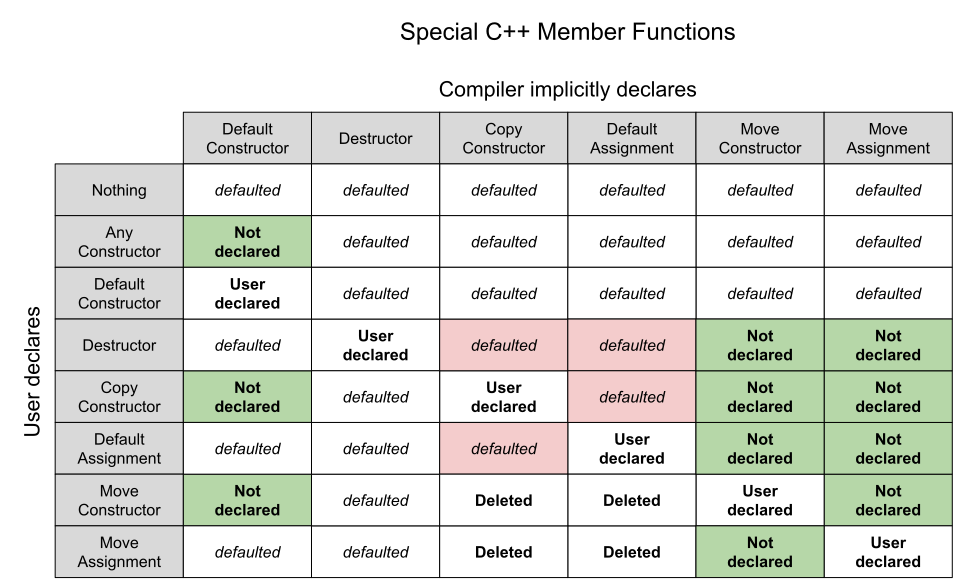

# Guidelines Core C++

[Zurück](./Readme_Guidelines.md)

---

## Inhalt

  * [Zum Ersten: Klasse (`class`) oder Struktur (`struct`)?](#link1)
  * [Zum Zweiten: Klasse (`class`) oder Struktur (`struct`)?](#link2)
  * [Zum Dritten: Klasse (`class`) oder Struktur (`struct`)?](#link3)
  * [Interfaces (Schnittstellen): Wozu?](#link4)
  * [Minimieren Sie die Sichtbarkeit von Mitgliedern einer Klasse](#link5)
  * [Lebenszyklus eines Objekts: Spezielle Member-Funktionen](#link6)
  * [Automatische Erzeugung der speziellen Member-Funktionen: Wann?](#link7)
  * [Automatische Erzeugung der speziellen Member-Funktionen: Wie?](#link8)
  * [*Explicitly defaulted* Standardkonstruktor](#link9)
  * [*Explicitly deleted* Standardkonstruktor](#link10)
  * [Automatische Erzeugung spezieller Member-Funktionen: *Rule-of-Zero*](#link11)
  * [Initialisierung von Strukturen](#link12)
  * [Initialisierung von Objekten](#link13)
  * [Das Copy-and-Swap-Idiom](#link14)
  * [Verschiebeoperationen](#link15)
  * [Schreiben Sie kleine, fokussierte Funktionen (Methoden)](#link16)
  * [Verwenden Sie `const` großzügig](#link17)
  * [Ausnahmen (*Exceptions*) sind Fehlercodes (*Error Codes*) vorzuziehen](#link18)
  * [Rückgabetyp einer Methode](#link19)
  * [Bevorzuge Komposition der Vererbung](#link20)
  * [Implizite Konvertierungen vermeiden](#link21)
  * [Schlüsselwort `auto` verwenden oder nicht?](#link22)

---

### Zum Ersten: Klasse (`class`) oder Struktur (`struct`)? <a name="link1"></a>

  * Verwenden Sie Strukturen (`struct`), wenn der zu konzipierende Datentyp
   hauptsächlich ein Halter von Daten ist.
  * Verwenden Sie Klassen (`class`), wenn für den zu konzipierenden Datentyp
   die Daten eher als Implementierungsdetails anzusehen sind
   und es das Verhalten (Methoden) ist, was man nach außen zeigen möchte.

*Beispiel*:

```cpp
01: struct Point2D
02: {
03:     int m_x;
04:     int m_y;
05: 
06:     Point2D() : Point2D{ 0, 0 } {}
07:     Point2D(int x, int y) : m_x{ x }, m_y{ y } {}
08: };
```

---

### Zum Zweiten: Klasse (`class`) oder Struktur (`struct`)? <a name="link2"></a>

Eine Richtlinie stammt von Bjarne Stroustrup *himself*:

  * Verwenden Sie Klasse (`class`), wenn es *Invarianten* gibt.
  * Verwenden Sie Strukturen (`struct`), wenn alle Datenelemente sich unabhängig voneinander verändern können.

Es bleibt nur noch zu klären, was man unter einer *Invarianten* versteht?
Dazu ein Beispiel einer Klasse `Game`,
das eine Instanzvariable `m_position` hat, die sich bestimmten Grenzwerten
(hier: `m_width` und `m_height`) unterwerfen muss.

*Beispiel*:

```cpp
01: class Game
02: {
03: private:
04:     int     m_width;       // right bound 
05:     int     m_height;      // height bound 
06:     Point2D m_position;    // position of a figure on the game board
07: 
08: public:
09:     Game(int width, int height, Point2D position)
10:         : m_width{}, m_height{}, m_position{ m_position }
11:     {
12:         // ensure that the object was constructed correctly 
13:         checkInvariant();
14:     }
15: 
16:     void moveTo(Point2D inc)
17:     {
18:         m_position.m_x += inc.m_x;
19:         m_position.m_y += inc.m_y;
20: 
21:         // ensure that the figure wasn't moved out of play bounds 
22:         checkInvariant();
23:     }
24: 
25:     // calling 'checkInvariant' is unnecessary because this is an accessor method 
26:     Point2D getLoc() const
27:     {
28:         return m_position;
29:     }
30: 
31: private:
32:     void checkInvariant() const
33:     {
34:         if (!(m_position.m_x >= 0 && m_position.m_x <= m_width)) {
35:             throw std::out_of_range("Position exceeds width of game board!");
36:         }
37:                  
38:         if (!(m_position.m_y >= 0 && m_position.m_y <= m_height)) {
39:             throw std::out_of_range("Position exceeds height of game board!");
40:         }
41:     }
42: };
```

---

### Zum Dritten: Klasse (`class`) oder Struktur (`struct`)? <a name="link3"></a>

Wenn ein (oder mehrere Elemente) mit `private` zu kennzeichnen sind,
sollte man `class` verwenden.


---

### Interfaces (Schnittstellen): Wozu? <a name="link4"></a>

*Interfaces* stellen nicht nur eine Beschreibung von Methoden dar, sie bewirken damit
auch eine *Hervorhebung*:

  * Zur Implementierung in einer Klasse wird ein Bezug zur Schnittstelle gegeben.
  * In einer Klasse lassen sich Daten kapseln, die relevanten Methoden der Schnittstell sind hervorgehoben.

*Beispiel*:

```cpp
01: struct ICloneable
02: {
03:     virtual ~ICloneable() {};
04:     virtual std::shared_ptr<ICloneable> clone() const = 0;
05: };
```


---

### Minimieren Sie die Sichtbarkeit von Mitgliedern einer Klasse <a name="link5"></a>

Ohne Worte :)

---

### Lebenszyklus eines Objekts: Spezielle Member-Funktionen <a name="link6"></a>

C++ definiert für den Lebenszyklus eines Objekts eine Reihe von Methoden/Operatoren,
die eine besondere Rolle einnehmen.

Die Schnittstellen dieser Operationen sehen so aus:

| Beschreibung | Schnittstelle |
| :-------- | :------- |
| Standardkonstruktor (Default Constructor) | `X()` |
| Kopierkonstruktor (Copy Constructor) | `X(const X&)` |
| Kopierende Zuweisung (Assignment Operator) | `X& operator=(const X&)` |
| Verschiebekonstruktor (Move Constructor) | `X(X&&) noexcept` |
| Verschiebende Zuweisung (Move Assignment) | `X& operator=(X&&) noexcept` |
| Destruktor (Destructor) | `~X()` |

*Tabelle* 1: Spezielle Member-Funktionen eines C++ Objekts.

---

### Automatische Erzeugung der speziellen Member-Funktionen: Wann? <a name="link7"></a>

In manchen Situationen nimmt der Compiler einem Entwickler die Arbeit ab und 
erzeugt für eine oder mehrere der speziellen Member-Funktionen eine Realisierung.

Das gesamte Regelwerk in diesem Umfeld ist nicht ganz trivial,
einen Überblick versucht das folgende Bild zu geben ([hier](https://howardhinnant.github.io/classdecl.html) vorgefunden):



*Abbildung* 1: Überblick über die automatische Erzeugung spezieller Member-Funktionen.

Aus *Abbildung* 1 kann man einige wesentliche Aussagen ableiten:

  * Standardkonstruktor:<br/>Der Standardkonstruktor wird automatisch generiert, wenn Sie in der betroffenen Klasse selbst *überhaupt keinen* Konstruktor implementiert haben.
  * Kopierkonstruktor:<br/>Der Kopierkonstruktor wird automatisch generiert, wenn Sie keine der beiden Verschiebeoperationen implementieren.
  * Kopierende Zuweisung:<br/>Die Kopierzuweisung wird automatisch generiert, wenn Sie keine der beiden Verschiebeoperationen implementieren.
  * Verschiebekonstruktor:<br/>Der Verschiebekonstruktor wird automatisch generiert, wenn Sie keine der beiden Kopieroperationen implementieren und alle Elemente verschoben werden können.
  * Verschiebende Zuweisung:<br/>Die verschiebende Zuweisung wird automatisch generiert, wenn Sie keine der beiden Kopieroperationen implementieren und alle Elemente verschoben werden können.
  * Destruktor:<br/>Der Destruktor wird automatisch generiert, wenn Sie keinen Destruktor implementiert haben.

Was erkennen wir an diesen Aussagen?

  * Die beiden *Kopieroperationen* sind unabhängig voneinander:
  Wenn in einer Klasse eine der beiden Kopieroperationen definiert ist,
  könnte der Übersetzer immer noch die andere Operation automatisch erzeugen.

  * Für die beiden *Verschiebeoperationen* gilt das Gegenteil:
  Wird vom Entwickler eine der beiden Operationen implementiert,
  stellt der Compiler *keine* Realisierung der anderen Operation bereit.

---

### Automatische Erzeugung der speziellen Member-Funktionen: Wie? <a name="link8"></a>

Natürlich wäre es interessant zu wissen, wie der Quellcode von automatisch erzeugten Member-Funktionen aussieht.
Das ist keine triviale Frage, dennoch kann man ein paar Richtlinien erkennen:

  * Standardkonstruktor:<br/>
    * Für alle Instanzvariablen, die Objekte sind, wird deren Standardkonstruktor aufgerufen.
    * Für alle Instanzvariablen, die elementar sind (`int`, `double`), erfolgt **keine** Initialisierung, also auch keine Vorbelegung mit einem datentypspezifischen Null-Wert!

  * Kopierende Operationen:<br/>
    * Das Objekt wird elementweise kopiert.<br/>
    * Darunter ist zu verstehen, dass für jedes Element, das selbst wieder ein Objekt
    oder eine Variable elementaren Datentyps ist, der zugehörige Zuweisungsoperator aufgerufen wird.
    Für Variablen elementaren Datentyps (und dazu zählen auch Zeigervariablen) bewirkt dies eine bitweise Kopie.
    * Falls Konstanten oder Referenzen vorhanden sind, geschieht dies jedoch nicht, weil sie
    nur initialisiert, aber nicht durch Zuweisung verändert werden können.
    Der Zuweisungsoperator wird vom System in diesem Fall *nicht* erzeugt.
    * *Hinweis*:<br/>Im Falle  von (klassischen) Zeigervariablen entstehen in diesem Fall Probleme (Stichwort: flache versus tiefe Kopie).

  * Verschiebende Operationen:<br/>
    * Für alle Instanzvariablen, die Objekte sind, wird deren entsprechende Verschiebeoperation aufgerufen, falls vorhanden. Anderenfalls erfolgt eine Kopie.
    * Für alle Instanzvariablen, die elementar sind (`int`, `double`), erfolgt eine bitweise Kopie.


---

### *Explicitly defaulted* Standardkonstruktor <a name="link9"></a>

Um das manuelle Schreiben leerer Standardkonstruktoren zu vermeiden,
unterstützt C++ das Konzept von *explicitly defaulted* Standardkonstruktoren (*Explicitly defaulted Default Constructors*).

Dadurch können Sie die Klassendefinition wie folgt schreiben,
ohne eine leere Implementierung für den Standardkonstruktor bereitstellen zu müssen:

```cpp
class X
{
public:
    X() = default;
    X(double initialValue);
    X(std::string initialValue);
    // ...
};
```

Klasse `X` definiert zwei benutzerdefinierte Konstruktoren.

Der Compiler generiert jedoch weiterhin einen vom Standardcompiler generierten Standardkonstruktor,
da dieses mithilfe des Schlüsselworts `default` explizit festgelegt wird.

Sie können das `= default` direkt in die Klassendefinition einfügen,
damit kann man sich in der Klassenimplementierung eine leere Implementierung für den Standardkonstruktor sparen.

Zur Vermeidung von Missverständnissen:<br />
Die Implementierung des automatisch erzeugten Standardkonstruktors ist so,
als hätte man `= default` in der Klassendefinition geschrieben.
Diese Aussage gilt für alle speziellen Member-Funktionen.

---

### *Explicitly deleted* Standardkonstruktor <a name="link10"></a>

Auch das Gegenteil von *Explicitly defaulted Default Constructors* ist möglich
und wird als *Explicitly deleted Default Constructor* bezeichnet.

Sie können beispielsweise eine Klasse mit nur statischen Memberfunktionen definieren,
für die Sie keine Konstruktoren schreiben möchten und für die Sie auch nicht möchten,
dass der Compiler den Standardkonstruktor automatisch generiert.

In diesem Fall müssen Sie den Standardkonstruktor explizit löschen:

```cpp
class X
{
public:
    X() = delete;
};
```

---

### Automatische Erzeugung spezieller Member-Funktionen: *Rule-of-Zero* <a name="link11"></a>

Was sieht die einfachste Strategie aus:

**Rule-of-Zero**

  * Alles sechs speziellen Member-Funktionen dürfen weder implementiert noch mit `= delete` gelöscht werden.
  * Der Compiler generiert alle Member-Funktionen so, wie es benötigt wird.
  * Das funktioniert natürlich nur dann, wenn die automatisch erzeugten Operationen das tun, was sie müssen:
    Korrekt initialisieren, kopieren und verschieben &ndash; und keine Ressourcen übrig lassen.
  * Wann funktioniert das? Wenn man sich auf folgenden Member-Variablen einschränkt:
    * Standard Datentypen
    * Aggregate (Strukturen)
    * STL Standard Container
    * Smart Pointer
 * Was geht nicht:
    * Wenn in den Instanzvariablen klassische Zeiger, die auf mit `new` allokierte Daten zeigen, vorhanden sind.
    * Wenn Referenzen in den Instanzvariablen vorhanden sind.

Wenn keine der sechs speziellen Member-Funktionen selbst geschrieben werden (*Rule-of-Zero*),
weil Sie geschickt auf `new` usw. verzichten, werden diese sämtlich vom Compiler erzeugt,
einschließlich des verschiebenden Konstruktors und des verschiebenden Zuweisungsoperators.

Damit wird Ihr Programmcode performant, einfacher und wartbarer &ndash; und es spart Schreibarbeit.

---

### Initialisierung von Strukturen <a name="link12"></a>

Wir starten eine Reihe von Überlegungen zu folgender Struktur `Point2D`:

```cpp
01: struct Point2D
02: {
03:     double m_x;
04:     double m_y;
05: };
06: 
07: void test_variant_01() {
08: 
09:     Point2D point;
10:     std::println("x: {} - y: {}", point.m_x, point.m_y);
11: }
```

#### Variante 1

Im letzten Listing starten wir mit der schlechtesten aller Möglichkeiten:
Die Struktur `Point2D` besitzt keine Vorkehrungen, um ihre Membervariablen vorzubelegen &ndash;
und in Zeile 9 ist es sogar möglich, eine Strukturvariable `point` anzulegen, deren Werte
nicht vorbelegt sind.

#### Variante 2

```cpp
01: struct Point2D
02: {
03:     double m_x{};
04:     double m_y{};
05: };
06: 
07: void test_variant_02() {
08: 
09:     Point2D point;
10: 
11:     point.m_x = 1.0;
12:     point.m_y = 2.0;
13: 
14:     Point2D copy{ point };   // automatically generated copy-c'tor
15: 
16:     Point2D anotherPoint;
17:     anotherPoint = copy;     // automatically generated assignment operator
18: }
```

In dieser Variante besitzen alle Membervariablen so genannte &bdquo;Default Initializer&rdquo;.
Eine Variable ` Point2D point;` repräsentiert damit den Punkt (0,0) und alle sechs speziellen
Membermethoden funktionieren wie erwartet.

*1. Bemerkung*:<br />
Ein Destruktor tut hier nichts, da es nichts zu tun gibt.

*2. Bemerkung*:<br />
Die zwei verschiebenden Methoden (Verschiebe-Konstruktor, verschiebende Wertzuweisung)
verhalten sich wie ihre kopierenden Pendants, da es nicht wirklich etwas zu verschieben gibt
(alle Membervariablen sind elementaren Typs).

#### Variante 3

Was fällt Ihnen an dieser dritten Variante auf?

```cpp
01: struct Point2D
02: {
03:     double m_x{};
04:     double m_y{};
05: 
06:     Point2D(double x, double y) : m_x{ x }, m_y{ y } {}
07: };
08: 
09: void test_variant_03() {
10: 
11:     // Point2D point;  // error: does not compile
12:     Point2D anotherPoint{ 1.0, 2.0 };
13: }
```

Die Struktur weist nun einen benutzerdefinierten Konstruktor auf.
Damit ist Zeile 11 des letzten Listings nicht mehr übersetzungsfähig,
es gibt also keinen Default-Konstruktor mehr.

Das sollte so nicht sein, eine Abhilfe finden Sie in der nächsten Variante 4 vor:

#### Variante 4

```cpp
01: struct Point2D
02: {
03:     double m_x;   // no more need for default initialization
04:     double m_y;   // no more need for default initialization
05: 
06:     Point2D() : m_x{}, m_y{} {}
07:     Point2D(double x, double y) : m_x{ x }, m_y{ y } {}
08: };
09: 
10: void test_variant_04() {
11: 
12:     Point2D point; 
13:     Point2D anotherPoint{ 1.0, 2.0 };
14: }
```

Die aktuelle Version der Struktur `Point2D` definiert nun alle erwünschten Konstruktoren explizit;
damit besteht keine Notwendigkeit mehr, die Membervariablen mit Hilfe von
&bdquo;Default Initializern&rdquo; vorzubelegen.
 

#### Variante 5

Die zwei benutzerdefinierten Konstruktoren aus dem letzten Beispiel kann man auch eleganter
mit dem sprachlichen Mittel des &bdquo;*Constructor Chainings*&rdquo; zusammenfassen:


```cpp
01: struct Point2D
02: {
03:     double m_x;
04:     double m_y;
05: 
06:     Point2D() : Point2D{ 0.0, 0.0 }  {}   // delegate work to another constructor
07:     Point2D(double x, double y) : m_x{ x }, m_y{ y } {}
08: };
09: 
10: void test_variant_05() {
11: 
12:     Point2D point;
13:     Point2D anotherPoint{ 1.0, 2.0 };
14: }
```

#### Variante 6

Wir kommen noch einmal auf eine Version der Struktur `Point2D` zu sprechen,
die den Standardkonstruktor verloren hatte. Mit dem Schlüsselwort `default` kann man diesen wieder hinzufügen.
Dazu müssen alle Membervariablen aber mit &bdquo;Default Initializern&rdquo; vorbelegt werden,
sonst funktioniert diese Variante nicht:


```cpp
01: struct Point2D
02: {
03:     double m_x{};
04:     double m_y{};
05: 
06:     Point2D() = default;
07:     Point2D(double x, double y) : m_x{ x }, m_y{ y } {}
08: };
09: 
10: void test_variant_06() {
11: 
12:     Point2D point;
13:     Point2D anotherPoint{ 1.0, 2.0 };
14: }
```

Häufig kann man die Beobachtung machen, dass diese Art des Entwurfs zu gutem Maschinencode führt.

#### Variante 7

Zum Abschluss stellen wir einen letzen, aber alternativen Ansatz vor:
Die Struktur `Point2D` besitzt weder Konstruktoren noch &bdquo;Default Initializer&rdquo; für ihre Membervariablen.
Dafür kommt bei Verwendung der Struktur die Aggregat-Initialisierung zum Einsatz:


```cpp
01: struct Point2D
02: {
03:     double m_x;
04:     double m_y;
05: };
06: 
07: void test_variant_07() {
08: 
09:     // taking advantage of struct Point2D beeing an 'aggregate' type
10:     Point2D point{};
11:     Point2D anotherPoint{ 1.0, 2.0 };
12: }
```

Dazu muss der beteiligte Strukturtyp allerdings die Vorrausetzungen eines
&bdquo;Aggregat-Typs&rdquo; aufweisen.

Kompakt formuliert lauten diese:

  * Keine benutzerdeklarierten Konstruktoren
  * Keine geerbten Konstruktoren
  * Keine privaten, nicht statischen Datenelemente
  * Keine virtuellen Basisklassen
  * ... einige weitere mehr detailliertere Eigenschaften


---

### Initialisierung von Objekten <a name="link13"></a>

Wie bei Strukturen betrachten wir nun eine Reihe von Entwicklungsschritten
in der Entwicklung einer Klasse `SimpleString`.

#### Variante 1

Diese Variante stellt den Rohentwurf einer Klasse `SimpleString` dar &ndash;
und ist mit mehreren Fehlern behaftet. Erkennen Sie diese?

```cpp
01: class SimpleString
02: {
03: private:
04:     char*       m_data{};   // pointer to the characters of the string (nullptr)
05:     std::size_t m_elems{};  // number of elements (zero)
06:             
07: public:
08:     // c'tors / d'tor
09:     SimpleString() = default; // empty string
10: 
11:     SimpleString(const char* s)
12:         : m_elems{ std::strlen(s) }
13:     {
14:         m_data = new char[size() + 1];      // need space for terminating '\0'
15:         std::copy(s, s + size(), m_data);
16:         m_data[size()] = '\0';
17:     }
18: 
19:     ~SimpleString() {
20:         delete[] m_data;
21:     }
22: 
23:     // getter
24:     std::size_t size() const { return m_elems; }
25:     bool empty() const { return size() == 0; }
26:     const char* data() const { return m_data; }
27: 
28:     // operators (no index-checking intentionally)
29:     char operator[](std::size_t n) const { return m_data[n]; }
30:     char& operator[](std::size_t n) { return m_data[n]; }
31: };
```

#### Variante 2

Für Klasse `SimpleString` werden die speziellen Member-Funktionen wie bei Strukturen automatisch
erzeugt &ndash; nur funktionieren diese nicht! Die `SimpleString`-Klasse enthält Zeiger,
die durch `new` erzeugt worden sind. Prinzipiell sind derartige Zeiger kopierbar &ndash;
nur dürfen derartige Zeiger nicht zweimal mit `delete` freigegeben werden.

Ungeachtet dessen sollte man auch nicht übersehen, dass eine Kopie eines Zeigers nicht zu einer
Kopie der Daten führt, auf die ein Zeiger zeigt. Also auch diese Schwachstelle wird von den
automatisch generierten speziellen Member-Funktionen nicht berücksichtigt.

Damit kommen wir zum zweiten Entwicklungsschritt der Klasse `SimpleString`,
es sind die Kopieroperationen (Kopier-Konstruktor, kopierender Zuweisungsoperator) explizit realisiert:


```cpp
01: class SimpleString
02: {
03: private:
04:     char*       m_data{};   // pointer to the characters of the string (nullptr)
05:     std::size_t m_elems{};  // number of elements (zero)
06: 
07: public:
08:     // c'tors / d'tor
09:     SimpleString() = default; // empty string
10: 
11:     SimpleString(const char* s)
12:         : m_elems{ std::strlen(s) }
13:     {
14:         m_data = new char[size() + 1];      // need space for terminating '\0'
15:         std::copy(s, s + size(), m_data);
16:         m_data[size()] = '\0';
17:     }
18: 
19:     // copy-constructor
20:     SimpleString(const SimpleString& other)
21:         : m_data{ new char[other.size() + 1] }, m_elems{ other.size() }
22:     {
23:         std::copy(other.m_data, other.m_data + other.size(), m_data);
24:         m_data[size()] = '\0';
25:     }
26: 
27:     ~SimpleString() {
28:         delete[] m_data;
29:     }
30: 
31:     // assignment operator
32:     SimpleString& operator=(const SimpleString& other)
33:     {
34:         delete[] m_data;
35:         m_data = new char[other.size() + 1];
36:         std::copy(other.m_data, other.m_data + other.size(), m_data);
37:         m_elems = other.size();
38:         m_data[size()] = '\0';
39:         return *this;
40:     }
41: 
42:     // getter
43:     std::size_t size() const { return m_elems; }
44:     bool empty() const { return size() == 0; }
45:     const char* data() const { return m_data; }
46: 
47:     // operators (no index-checking intentionally)
48:     char operator[](std::size_t n) const { return m_data[n]; }
49:     char& operator[](std::size_t n) { return m_data[n]; }
50: };
```

Die vorgestelle Realisierung läuft &ndash; in den meisten Fällen &ndash;,
dennoch weist sie einen schweren Entwurfsfehler auf! Erkennen Sie die Schwachstellen?

#### Variante 3

Die Schwachstellen im Listing von Variante 2 sind die Zeilen 34 und 35.
Wirft der Aufruf des `new`-Operators eine Exception (`std::bad_alloc`),
so befindet sich das `SimpleString`-Objekt in einem inkorrekten Zustand.
Der Zeiger `m_data` zeigt auf falsche Daten, jeglicher Zugriff auf das Objekt zieht *Undefined Behavior* nach sich.

Wir versuchen es mit einem Redesign des Zuweisungsoperators `operator=`:

```cpp
01: SimpleString& operator=(const SimpleString& other)
02: {
03:     char* tmp = new char[other.size() + 1];
04:     delete[] m_data;
05:     m_data = tmp;
06:     std::copy(other.m_data, other.m_data + other.size(), m_data);
07:     m_elems = other.size();
08:     m_data[size()] = '\0';
09:     return *this;
10: }
```

Diese Version ruiniert zumindest kein Objekt, wenn es während der Ausführung zu einer Ausnahme kommt.
Dennoch weist auch diese Realisierung einen &ndash; subtilen &ndash; Fehler auf! Welchen?


#### Variante 4

Betrachten Sie hierzu folgendes Beispiel, dass Sie mit der Realisierung aus Variante 3 aufrufen:


```cpp
01: SimpleString s{ "Hello World" };
02: s = s;
03: std::println("{}", s.data());
```

Das Programm enthält eine Selbstzuweisung. Das ergibt zwar keinen Sinn, in *Production-Ready* Quellcode 
sollte das aber berücksichtigt werden. Außerdem darf nicht übersehen werden, dass das Beispiel zwar nicht abstürzt,
aber zu einem unerwarteten Ergebnis führt, da auf Grund der Freigabe von `s` auf der rechten Seite der Wertzuweisung
keine Daten mehr für den Kopiervorgang zur linken Seite vorhanden sind:

*Ausgabe*:

```
═══════════
```

Damit kommen wir zur nächsten Überarbeitung des Zuweisungsoperators:


```cpp
01: SimpleString& operator=(const SimpleString& other)
02: {
03:     // prevent self-assignment
04:     if (this == &other) {
05:         return *this;
06:     }
07: 
08:     char* tmp = new char[other.size() + 1];
09:     delete[] m_data;
10:     m_data = tmp;
11:     std::copy(other.m_data, other.m_data + other.size(), m_data);
12:     m_elems = other.size();
13:     m_data[size()] = '\0';
14:     return *this;
15: }
```

Diese Variante des Zuweisungsoperators ist nun fehlerfrei. Okay, sie zeichnet sich nicht gerade durch Übersichtlichkeit aus, 
und die Zeilen 4 bis 6 schmerzen etwas: Sie werden *immer* ausgeführt, und damit eben auch in fast allen Fällen,
in denen die beiden Objekte links und rechts von der Wertzuweisung verschieden sind.
Wir haben es mit einem Fall von &bdquo;*Pessimization*&rdquo; zu tun:


##### *Pessimization*

Das Wort *Pessimization* wird im Allgemeinen als Gegenteil von *Optimierung* verwendet und bezeichnet
ein Programmiermanöver oder eine Technik, die das Programmverhalten weniger effizient macht als es sein sollte.

Der obige Fall ist ein bekanntes Beispiel für ein solches Manöver: Jeder zahlt für eine potenzielle Sprung-Anweisung (Assembler: `jmp`-Befehl),
der durch die `if`-Anweisung eingeleitet wird, obwohl dieser nur in seltenen und ungünstigen Fällen erforderlich ist.

Bei einer *Pessimization*-Situation lohnt es sich oft, einen Schritt zurückzutreten und zu überdenken.
Vielleicht haben wir das Problem aus dem falschen Blickwinkel angegangen.

Und damit sind wir beim nächsten Thema angekommen: Das *Copy-and-Swap-Idiom*.

---

### Das *Copy-and-Swap-Idiom* <a name="link14"></a>

Das *Copy-and-Swap-Idiom* wurde eingeführt, um zwei Ziele zu erreichen:

  * Realisierung der Kopier-Konstruktoren und Zuweisungsoperatoren (sowohl &bdquo;kopierende&rdquo; als auch &bdquo;verschiebende&rdquo; Semantik) auf eine einfache Weise (Vermeidung von Code-Duplikationen).
  * Bereitstellung der so genannten *Strong Exception Guarantee*.

Auf die *Strong Exception Guarantee* gehen wir später ein, wir verweilen beim *Copy-and-Swap-Idiom*:
Dieses besteht im Wesentlichen aus zwei Teilen:


  * Einem destruktiven Teil, der den bestehenden Zustand des Zielobjekts aufräumt (die linke Seite der Zuweisung).
  * Einem konstruktiven Teil, der den Zustand vom Quellobjekt (rechte Seite der Zuweisung) zum Zielobjekt kopiert.

Der destruktive Teil entspricht im Allgemeinen dem Code im Destruktor des Typs, der konstruktive Teil im Allgemeinen dem Code im Kopierkonstruktor des Typs.


Der Name *Copy-and-Swap* für diese Technik rührt daher,
dass sie üblicherweise durch eine Kombination aus dem Kopierkonstruktor des Typs,
seinem Destruktor und einer `swap`()-Memberfunktion implementiert wird,
die die Membervariablen einzeln austauscht.

Mit dem *Copy-and-Swap*-Idiom können wir nun folgende Realisierung des 
Zuweisungsoperators betrachten:

```cpp
01: void swap(SimpleString& other) noexcept
02: {
03:     std::swap(m_data, other.m_data);      // swap data member
04:     std::swap(m_elems, other.m_elems);    // swap data member
05: }
06: 
07: // refined copy assignment operator
08: SimpleString& operator=(SimpleString other) {
09: 
10:     this->swap(other);
11:     return *this;
12: }
```

*Hinweise*:

  * Am Beispiel des Parameters `other` wenden wir eine äußerst nützliche Richtlinie an:
  Wenn Sie in einer Funktion eine Kopie erstellen, lassen Sie den Compiler dies in der Parameterliste tun.

  * Nachdem (durch den Aufruf) die Kopie erstellt ist, können wir mit dem Tauschen der Membervariableninhalte beginnen.

  * Beachten Sie, dass beim Aufrufen der Funktion alle neuen Daten bereits allokiert, kopiert und einsatzbereit sind.
  Dadurch erhalten wir kostenlos eine *Strong Exception Guarantee* &ndash; dazu später noch mehr.

  * An diesem Punkt sind wir quasi schon fertig, da `swap` keine Fehler auslöst.
  Wir tauschen unsere aktuellen Daten mit den kopierten aus, ändern unseren Zustand sicher und legen die alten Daten in einem temporären Objekt ab.
  
  * Die alten Daten werden dann freigegeben, wenn die Funktion verlassen wird:
  Es endet der Gültigkeitsbereich des Parameterobjekts und sein Destruktor wird aufgerufen!

  * Beachten Sie, dass die Notwendigkeit einer Selbstzuweisungsprüfung beseitigt wurde
  und eine einheitliche Implementierung des `operator=` ermöglicht wurde.
  Darüberhinaus gibt es keine Leistungseinbußen mehr bei Nicht-Selbstzuweisungen.

---

### Verschiebeoperationen <a name="link15"></a>

Wir haben bislang in der Klasse `SimpleString` die
traditionellen Regel der drei speziellen Methoden
Kopier-Konstruktor, Zuweisungsoperator und Destruktor betrachtet.

Seit C++ 11 können wir solchen Code durch die so genannte *Move-Semantik* effizienter (performanter) gestalten.
Es gesellen sich zwei weitere spezielle Methoden (Verschiebe-Konstruktor, Verschiebe-Zuweisungsoperator) zur Klasse hinzu.

Ihr Aufruf wird vom Compiler implizit aktiviert, wenn der Compiler Objekte bearbeitet,
von denen er weiß, dass sie nicht mehr verwendet werden. Das sind beispielsweise Objekte im Programm,
die keinen Namen haben (temporäre Objekte, Objekte, die als Zwischenergebnis fungieren).

Am Beispiel der Klasse `SimpleString` könnten diese beiden Methoden so aussehen:

```cpp
01: SimpleString(SimpleString&& other) noexcept
02: {
03:     m_data = std::move(other.m_data);
04:     m_elems = std::move(other.m_elems);
05:     other.m_data = nullptr;
06:     other.m_elems = 0;
07: }
08: 
09: SimpleString& operator=(SimpleString&& other) noexcept {
10: 
11:     SimpleString tmp{ std::move(other) };
12:     tmp.swap(*this);
13:     return *this;
14: }
```

Mit Hilfe von `std::exchange` kann man den verschiebenden Konstruktor noch
etwas kompakter realisieren:

```cpp
SimpleString(SimpleString&& other) noexcept
{
    m_data = std::exchange(other.m_data,  nullptr);
    m_elems = std::exchange(other.m_elems, 0);
}
```

Die freie Funktion `std::exchange` funktioniert dabei wie folgt:

```cpp
int z = std::exchange(x, y);
```

Nach der Ausführung dieser Anweisung hat

  * `x` den Wert von `y` zugewiesen bekommen und
  * `z` den ursprüngliche Wert von `x` zugewiesen bekommen.


---

### Schreiben Sie kleine, fokussierte Funktionen (Methoden) <a name="link16"></a>

Funktionen (Methoden) sind die Bausteine der *Clean Code* Programmierung.
Eine gute Funktion sollte klein und fokussiert sein und genau eine Sache tun.
Kleine Funktionen sind leichter zu verstehen, zu testen und wiederzuverwenden.

Einige Richtlinien zum Schreiben sauberer Funktionen:

  * Halten Sie Funktionen kurz, normalerweise unter 50 Zeilen Code.
  * Geben Sie Funktionen beschreibende Namen, die klar vermitteln, was sie tun.
  * Vermeiden Sie Nebeneffekte &ndash; eine Funktion sollte entweder einen Wert berechnen oder eine Aktion ausführen, nicht beides.
  * Bevorzugen Sie &bdquo;reine&rdquo; (*pure*) Funktionen, die bei denselben Eingaben immer das gleiche Ergebnis liefern.
  * Verwenden Sie Parameter für die Eingabe und Rückgabewerte für die Ausgabe zurück, anstatt sich auf den globalen Status zu verlassen.
  * Halten Sie die Anzahl der Parameter niedrig, normalerweise unter 5.


Stellen Sie sich beispielsweise eine Funktion `isValidUsername` vor,
die einen Benutzernamen validiert. Eine saubere Version könnte so aussehen:

```cpp
01: bool isValidUsername(const std::string& username) {
02: 
03:     const auto MinLength{ 8 };
04:     const auto MaxLength{ 30 };
05:         
06:     const std::string ValidCharacters {
07:         "abcdefghijklmnopqrstuvwxyz0123456789_-."
08:     };
09: 
10:     if (username.length() < MinLength || username.length() > MaxLength) {
11:         return false;
12:     }
13: 
14:     for (char ch : username) {
15:         if (ValidCharacters.find(ch) == std::string::npos) {
16:             return false;
17:         }
18:     }
19: 
20:     return true;
21: }
```

Diese Funktion ist kurz (weniger als 20 Zeilen), hat einen eindeutigen Namen, nimmt einen einzigen Eingabeparameter an,
gibt ein boolesches Ergebnis zurück und hat keine Nebenwirkungen. Sie ist leicht zu verstehen und kann ausführlichen Unit-Tests unterzogen werden.

---

### Verwenden Sie `const` großzügig <a name="link17"></a>

`const` ist ein leistungsstarkes Sprachfeature in C++, um Absichten auszudrücken und potenzielle Fehler zur Kompilierzeit abzufangen:

    * Wird es auf eine Variable angewendet, zeigt es an, dass der Wert nicht geändert wird.
    * Wird es auf eine Methode angewendet, zeigt es an, dass die Methode das aufgerufene Objekt nicht ändert.

Einige Richtlinien zur Verwendung von `const`:

  * Deklarieren Sie Funktionsparameter mit `const`, wenn diese von der Funktion nicht geändert werden.
  * Deklarieren Sie Methoden mit `const`, wenn sie den Zustand des gerufenen Objekts nicht ändern.
  * Deklarieren Sie Variablen mit `const`, wenn sich ihre Werte nach der Initialisierung nicht ändern sollen.
  * Verwenden Sie `const`-Referenzen, um unnötiges Kopieren großer Objekte zu vermeiden.

*Beispiel*:

```cpp
01: class Rectangle
02: {
03: private:
04:     double m_width;
05:     double m_height;
06: 
07: public:
08:     Rectangle(double width, double height) 
09:         : m_width(width), m_height(height) 
10:     {}
11: 
12:     double area() const {
13:         return  m_width * m_height;
14:     }
15: 
16:     void scale(double factor) {
17:         m_width *= factor;
18:         m_height *= factor;
19:     }
20: };
21: 
22: void printArea(const Rectangle& rect) {
23:     std::println("Area: {}", rect.area());
24: }
```

In diesem Beispiel wird die Methode `area()` als `const` deklariert, da sie den Zustand des Rechtecks ​​nicht ändert.

Die Funktion `printArea` nimmt ihren Parameter per `const`-Referenz, was bedeutet,
dass sie das Rechteck nicht ändert und ein unnötiges Kopieren vermeidet.

Die konsequente Verwendung von `const` macht Ihren Code selbstdokumentierender und hilft,
potenzielle Fehler zu erkennen, wie z. B. versehentliche Änderungen an Werten, die konstant sein sollten.

---

### Ausnahmen (*Exceptions*) sind Fehlercodes (*Error Codes*) vorzuziehen <a name="link18"></a>

Ausnahmen (*Exceptions*) sind die bevorzugte Methode zum Melden und Behandeln von Fehlern in Modern C++.
Sie haben mehrere Vorteile gegenüber herkömmlichen Fehlercodes:

  * Ausnahmen können nicht ignoriert werden, Fehlercodes hingegen schon.
  * Ausnahmen werden automatisch an rufende Methoden weitergegeben, während Fehlercodes an jeder Aufrufstelle manuell überprüft und manuell weitergegeben werden müssen.
  * Ausnahmen trennen den Fehlerbehandlungscode vom normalen Kontrollfluss und machen den Code übersichtlicher

Einige Richtlinien zur Verwendung von Ausnahmen:

  * Verwenden Sie Ausnahmen für außergewöhnliche Bedingungen, nicht für den normalen Kontrollfluss.
  * Werfen Sie Ausnahmen *by value* aus und fangen Sie sie *by reference*.
  * Verwenden Sie nach Möglichkeit Standardausnahmetypen wie `std::runtime_error`, `std::out_of_range` usw.
  * Definieren Sie Ihre eigenen Ausnahmetypen für domänenspezifische Fehler.
  * Vermeiden Sie das Auslösen von Ausnahmen in Destruktoren.
  * Verwenden Sie RAII, um sicherzustellen, dass Ressourcen bei Ausnahmen aufgeräumt werden.

So könnten Sie beispielsweise einen Dateifehler mit Ausnahmen behandeln:

```cpp
01: try {
02:     std::ifstream file("data.txt");
03:             
04:     if (!file.is_open()) {
05:         throw std::runtime_error("Could not open file");
06:     }
07:             
08:     // process the file
09: }
10: catch (const std::exception& e) {
11:     std::cerr << "Error: " << e.what() << std::endl;
12: }
```

Vergleichen Sie dies mit einer Version, die Fehler Codes hantiert:

```cpp
01: std::ifstream file("data.txt");
02: 
03: if (!file.is_open()) {
04:     // handle the error, maybe return an error code  
05: }
06: 
07: // process the file
```

Die Version mit *Exception Handling* trennt die Fehlerbehandlung vom normalen Ablauf
und der Fehler kann nicht ignoriert werden.

---

### Rückgabetyp einer Methode <a name="link19"></a>

Wir betrachten folgendes Beispiel:

```cpp
01: class Person
02: {
03: private:
04:     std::string   m_name;
05:     size_t        m_age;
06: 
07: public:
08:     Person() = default;
09:     Person(const std::string& name, size_t age)
10:         : m_name{ name }, m_age{ age }
11:     {}
12: 
13:     std::string getName() const { return m_name; }
14:     size_t getAge() const { return m_age; }
15: };
```

*Vorgehensweise*: &bdquo;*Copied to Caller*&rdquo;

Es gibt auch eine zweite Möglichkeit:

```cpp
01: class Person
02: {
03: private:
04:     std::string   m_name;
05:     size_t        m_age;
06: 
07: public:
08:     Person() = default;
09:     Person(const std::string& name, size_t age)
10:         : m_name{ name }, m_age{ age }
11:     {}
12: 
13:     const std::string& getName() const { return m_name; }
14:     size_t getAge() const { return m_age; }
15: };
```

*Vorgehensweise*: &bdquo;*Lifetime by Voucher*&rdquo;

---

### Bevorzuge Komposition der Vererbung <a name="link20"></a>

  * Vererbung ist ein leistungsstarkes Feature der objektorientierten Programmierung,
  wird aber oft überstrapaziert.

  * Vererbung koppelt die abgeleitete Klasse eng an die Basisklasse
  (Stichwort &bdquo;*Strong Coupling*&rdquo; versus &bdquo;*Lose Coupling*&rdquo;),
  wodurch der Code starrer und schwerer zu ändern wird.

  * Sie führt außerdem tendenziell zu tiefen und komplexen Vererbungshierarchien,
  die schwer zu verstehen sind.

  * Komposition hingegen ist eine Technik, bei der eine Klasse Instanzen anderer Klassen enthält,
  anstatt von ihnen zu erben.

  * Dies führt zu einem flexibleren und modulareren Design.

*Beispiel*:

Wenn beispielsweise viele unterschiedliche Klassen in einem 3D-Szenario
ein *Transformations*-Eigenschaft (also eine Position, eine Rotation und eine Skalierung) benötigen,
könnten Sie alle Ihre Klassen von einer Klasse `Transform` ableiten.

Sie könnten eine *Transform*-Eigenschaft aber auch als Attribut den Klassen hinzufügen:

```cpp
01: class Vector3D{};
02: 
03: class Transform {
04:     Vector3D m_position;
05:     Vector3D m_rotation;
06:     Vector3D m_scale;
07: };
08: 
09: class Character
10: {
11: public:
12:     // functions that might use *m_transform* if they need it
13: 
14: private:
15:     Transform m_transform;
16: };
17: 
18: class Obstacle
19: {
20: public:
21:     // functions that might use *m_transform* if they need it
22: 
23: private:
24:     Transform m_transform;
25: };
```

  * Dadurch haben Sie mehr Kontrolle über die Schnittstelle der &bdquo;untergeordneten&rdquo; Klassen.

  * Denn wenn Sie eine übergeordnete Klasse ändern, wird die Änderung zwangsläufig in allen untergeordneten Klassen widergespiegelt, was oft nicht erwünscht ist.

  * Oft müssen Sie der übergeordneten Klasse etwas hinzufügen, weil eine bestimmte untergeordnete Klasse es braucht. Indem Sie dies tun, zwingen Sie es allen anderen untergeordneten Klassen auf, die es nicht unbedingt brauchen oder wollen.

  * Mit Komposition haben Sie mehr Kontrolle darüber.

  * Komposition ermöglicht es auch, kleinere Klassen zu schreiben, anstatt von einer großen übergeordneten Klasse zu erben.

---

### Implizite Konvertierungen vermeiden <a name="link21"></a>

In der Sprache C++ gibt es des Feature so genannter &bdquo;impliziter Typkonvertierungen&rdquo;.

Hierunter versteht man Konvertierungen, die der Übersetzer automatisch durchführt:

  * Sie werden immer dann durchgeführt, wenn ein Ausdruck eines Typs `T1` in einem Kontext verwendet wird,
  der diesen Typ nicht akzeptiert, aber einen anderen Typ `T2`.

  * Obwohl diese nützlich sein können, können sie auch zu unerwarteten Ergebnissen und Fehlern führen.

Daher ist es manchmal wünschenswert, implizite Konvertierungen zu vermeiden.

*Beispiel*:

```cpp
01: class Distance
02: {
03: private:
04:     int m_meters;
05: 
06: public:
07:     Distance(int meters) : m_meters{ meters } {}
08: 
09:     void display() const {
10:         std::println("Distance: {}", m_meters);
11:     }
12: };
13: 
14: void printDistance(const Distance& d) {
15:     d.display();
16: }
17: 
18: void test() {
19:     auto meters{ 10 };
20:     printDistance(meters);
21: }
```

In diesem Beispiel gibt es neben der Klasse `Distance` eine Funktion `printDistance`,
die ein Objekt vom Typ `Distance` als Argument annimmt.

In der rufenden Funktion haben wir jedoch eine `int`-Variable an die Funktion übergeben
und dennoch wird der Quellcode fehlerfrei übersetzt und korrekt ausgeführt:

Der Compiler hat eine implizite Konvertierung von `int` nach `Distance` durchgeführt!

Um implizite Konvertierungen in C++ zu vermeiden, können wir das Schlüsselwort `explicit` verwenden.

Wenn das Schlüsselwort `explicit` mit einem Konstruktor oder einer Konvertierungsfunktion verwendet wird,
verhindert es implizite Konvertierungen, die automatisch vom Compiler durchgeführt werden.

*Hinweis*:
Mit einer expliziten Typwandlung könnte man die Konvertierung wieder aktivieren,
aber dieses Mal eben nicht versteckt, sondern sichtbar für den Entwickler!

*Frage*:


---

### Schlüsselwort `auto` verwenden oder nicht? <a name="link22"></a>

Empfielt sich der Einsatz des Schlüsselworts `auto` oder nicht?

`auto`: **You totally know what you’re doing, or you totally don’t**

*Frage*:

Warum ist dieses Code-Fragment nicht übersetzungsfähig?

```cpp
01: void test()
02: {
03:     std::map<int, std::string> aMap{ { 1, "Hello"  } };
04: 
05:     std::map<int, std::string>::iterator it{ aMap.begin() };
06: 
07:     std::pair<int, std::string>& entry1{ *it };  // Why this line DOES NOT compile ???
08: 
09:     auto& entry2{ *it };                         // This line compiles :)
10: }
```

*Zwei Empfehlungen*:

  * Verwenden Sie es prinzipiell großzügig. Es kann die Lesbarkeit verbessern.
    Der Compiler kann Typen für uns besser ableiten (*Type Deduction*) als wir selbst.

  * Ist der Typ einer Variablen von entscheidender Natur, dann sollte man diesen auch explizit hinschreiben.

*Achtung*:

Verlust von `const` und `&` bei Verwendung von `auto`:

```cpp
01: class Person
02: {
03: private:
04:     std::string   m_name;
05: 
06: public:
07:     Person() = default;
08:     Person(const std::string& name) : m_name{ name } {}
09: 
10:     const std::string& getName() const { return m_name; }
11: };
12: 
13: void guidelines_keyword_auto_02()
14: {
15:     Person jack{ "Jack", 50 };
16:     auto name = jack.getName();
17: }
```

Es gibt  hier nur eine Warnung:<br />
*auto does not deduce references a possibly unintended copy is being made*.

---

[Zurück](./Readme_Guidelines.md)

---
