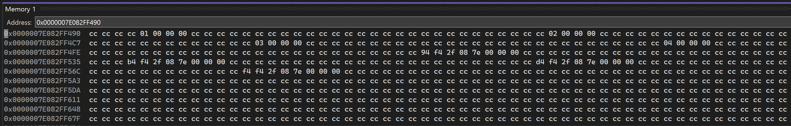
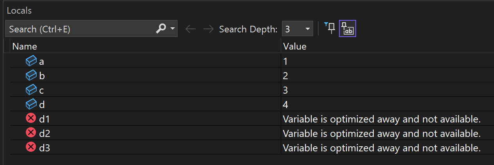
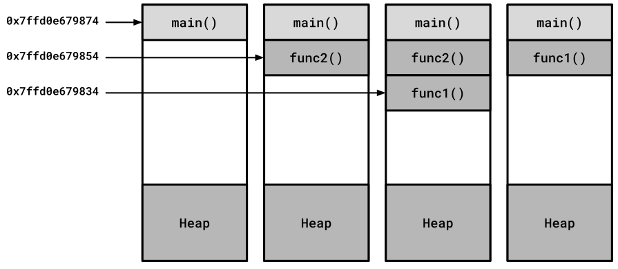
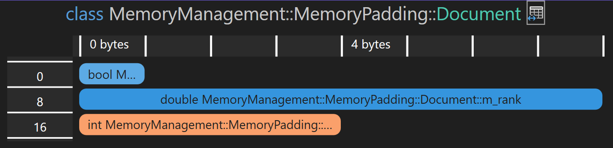

# Memory Management

[Zurück](../Performance_Optimization/Readme_Performance_Optimization.md)

---

## Inhalt

  * [Allgemeines](#link1)
  * [Der Stack (Stapel)](#link2)
    * [Unterschiede des Stapels im Debug- und Relase-Modus](#link3) 
    * [Ausdehnung des Stapels](#link4)
    * [Größe des Stapels bestimmen](#link5)
  * [Ausrichtung von Variablen im Speicher (Memory Alignment)](#link6)
    * [`alignof()`](#link7)
    * [`alignas`](#link8)
    * [`std::align`](#link9)
    * [`std::max_align_t` ](link10)
  * [Padding](#link11)
  * [Der Heap (Halde)](#link12)
    * [*Low-level* Speicherverwaltungsfunktionen](#link13)
    * [*Placement new*](#link14)
    * [&bdquo;*Zeigerwäsche*&rdquo;: `std::launder`](#link15)
  * [Literatur](#link16)

---

#### Quellcode

[*MemoryManagement.cpp*](MemoryManagement.cpp)<br />

[*Arena.h*](Arena.h).<br />
[*Arena.cpp*](Arena.cpp).<br />

---

## Allgemeines <a name="link1"></a>

---

## Der Stack (Stapel) <a name="link2"></a>

### Unterschiede des Stapels im Debug- und Relase-Modus <a name="link3"></a>

Bei der Suche nach Fehlern versorgt uns die Visual Stdio IDE mit einer Reihe von unterstützenden Tools.
Ein simples Tool sind *Memory Windows*:

```cpp
01: int a = 1;
02: int b = 2;
03: int c = 3;
04: int d = 3;
05: 
06: int* ap = &a;
07: int* bp = &b;
08: int* cp = &c;
09: int* dp = &d;
10: 
11: unsigned long long d1 = (unsigned long long)bp - (unsigned long long)ap;
12: unsigned long long d2 = (unsigned long long)cp - (unsigned long long)bp;
13: unsigned long long d3 = (unsigned long long)dp - (unsigned long long)cp;
14: 
15: std::cout << "&a:  " << &a << std::endl;
16: std::cout << "&b:  " << &b << std::endl;
17: std::cout << "&c:  " << &c << std::endl;
18: std::cout << "&d:  " << &d << std::endl;
19: 
20: std::println("Diff a <=> b: {}", d1);
21: std::println("Diff b <=> c: {}", d2);
22: std::println("Diff c <=> d: {}", d3);
```

Die Inhalte der Variablen `a`, `b`, `c`, und `d` kann man in einem solchen *Memory Window* ansehen:



*Abbildung* 1: &bdquo;*Memory*&rdquo;-Fenster für lokale Variablen.

Hmmm, fällt Ihnen an der Ausgabe im Fenster etwas auf?
Richtig gesehen, die vier `int`-Variablen liegen in einem Abstand von 32-Bytes voneinander entfernt im Speicher.

Die Ausgaben in der Konsole bestätigen uns in dieser Vermutung:

```
&a:  0000003A9CEFF7E4
&b:  0000003A9CEFF804
&c:  0000003A9CEFF824
&d:  0000003A9CEFF844
Diff a <=> b: 32
Diff b <=> c: 32
Diff c <=> d: 32
```

Im Release-Modus haben die Variablen den erwarteten Abstand von 8 Bytes.
Dies lässt sich nicht ohne Weiteres durch die Ausgaben bestätigen, da der Compiler/Optimizer
offensichtlich an der Reihenfolge der Variablen bzgl. ihrer Ablage im Speicher Änderungen vornimmt.
Damit werden die Ausgaben sinnlos,
dies bestätigt auch ein Blick in das Fenster der lokalen Variablen:



*Abbildung* 2: Nicht jede im Programm deklarierte Variable findet Einzug in das endgültige Programm (*Release*-Modus).

Aber bleiben wir beim Debug-Modus. Warum ist das so? Hierzu finden sich wenige Hinweise im Netz,
immerhin gibt es bei [SO](https://stackoverflow.com/questions/60419126/why-does-vs-debug-build-allocates-variables-so-far-apart) eine Erklärung hierzu:

&bdquo;Die Debug-Version allokiert den Speicher anders als die Release-Version.
Insbesondere allokiert die Debug-Version zusätzlich Speicherplatz am Anfang und Ende jedes Speicherblocks,
den eine Variable benötigt, und füllt diesen mit einem bestimmten Allokationsmuster,
dass man auf etwaige Beschädigungen hin überprüfen kann&rdquo;.

In *Abbildung* 1 kann man erkennen, dass im &bdquo;toten&rdquo; Bereich der Wert `0xCC` vorhanden ist.

Die Speicherallokation erfolgt in quantisierten Blöcken, wobei die Länge eines Quantums nicht dokumentiert ist,
sie könnte 16 oder 32 Bytes betragen.

Wenn Sie beispielsweise vier `int`-Variablen auf dem Stack allokieren
(Größe = 4 * `sizeof(int)` Bytes = 4 * 4 = 16 Bytes),
belegt der Allokator im Debug-Modus tatsächlich 128 Bytes (vier 32-Byte Quanten).

Wenn Sie nun über den zulässigen Speicherplatz hinausschreiben
(das ginge in diesem Beispiel nur mit Typwandlungsoperationen),
überschreiben Sie einen Teil des &bdquo;toten Speicherplatzes&rdquo; und beschädigen das vorhandene Bitmuster. 

Beim Verlassen eines Unterprogramms im Debug-Modus können Testroutinen des Debuggers überprüfen,
ob Beschädigungen in den flankierenden Speicherbereichen vorhanden sind und, wenn ja,
Laufzeitfehlermeldungen generieren.


### Ausdehnung des Stapels <a name="link4"></a>

Wir analysieren den Stack an einem kleinen Beispiel, um herausfinden,
in welche Richtung er wächst. Dazu vergleichen wir die Adressen von Variablen, die sich auf dem Stapel befinden.

Das folgende Beispiel zeigt, auf welche Weise der Stapel beim Betreten und Verlassen von Funktionen wächst und schrumpft:

```cpp
01: static void func1()
02: {
03:     auto i{ 1 };
04:     std::cout << "func1(): " << std::addressof(i) << " - i: " << i << '\n';
05: }
06: 
07: static void func2()
08: {
09:     auto i{ 2 };
10:     std::cout << "func2(): " << std::addressof(i) << " - i: " << i << '\n';
11:     func1();
12: }
13: 
14: static void test_examine_stack() {
15: 
16:     auto i{ 0 };
17:     std::cout << "main():  " << std::addressof(i) << " - i: " << i << '\n';
18:     func2();
19:     func1();
20: }
```

*Bemerkung*:<br />
Die Ausgaben wurden mit dem GCC-Compiler erzeugt.

*Ausgabe*:

```
main():  0x7ffd0e679874 - i: 0
func2(): 0x7ffd0e679854 - i: 2
func1(): 0x7ffd0e679834 - i: 1
func1(): 0x7ffd0e679854 - i: 1
```

Indem wir die Adressen der auf dem Stapel abgelegten `int`-Variablen als ganze Zahl ausgeben,
können wir analysieren, wie stark und in welche Richtung der Stapel auf einem Rechner wächst.

Wir beobachten jedes Mal 32 Bytes, wenn wir entweder `func1()` oder `func2()` aufrufen.
Die `int`-Variable `i`, die auf Stapel liegt, ist allerdings nur 4 Bytes (auf meinem Rechner) groß.

Die verbleibenden 28 Bytes enthalten Daten, die benötigt werden, wenn die Funktion endet, wie etwa die Rücksprungadresse und möglicherweise etwas *Padding*-Bytes zur Ausrichtung.



*Abbildung* 3: Der Stapel wächst und schrumpft, wenn Funktionen aufgerufen und verlassen werden.

---

### Die Größe des Stapels bestimmen <a name="link5"></a>

Wir versuchen, ein Programm zu schreiben, das die Größe des Stacks auf einem Rechner bestimmt.
Dies lässt sich allerdings nur im Rahmen einer Schätzung durchführen.

Wir schreiben zu diesem Zweck eine Funktion `func`, an die wir beim Aufruf die Adresse einer Variablen übergeben,
die auf dem Stack abgelegt ist.
Die Funktion `func` selbst tut zwei Dinge: Zum einen allokiert sie pro Aufruf 1024 Bytes auf dem Stack,
zum anderen berechnet sie &ndash; pro rekursivem Aufruf &ndash; den Abstand dieses Felds zur ursprünglichen Variablen,
deren Adresse wir uns beim ersten Aufruf gemerkt haben und die wir an jeden Aufruf von `func` weiterreichen.

Auf diese Weise nähern wir uns der tatsächlichen Größe des Stapels, bis es auf Grund eines Stacküberlaufs
zu einem Absturz des Programms kommt. Dies entspricht nicht ganz der feinen englischen Art,
ist aber eine unkonventionelle Vorgehensweise, um die ungefähre Größe des Stapels zu berechnen.


```cpp
01: void func (const std::byte* stack_bottom_addr) {
02:     std::byte data[1024] = {};
03:     std::cout << stack_bottom_addr - data << '\n';
04: 
05:     func(stack_bottom_addr);
06: }
07: 
08: void test() {
09: 
10:     std::byte b{};
11:     func(&b);
12: }
```

Auf einem Windows Rechner erhalten wir folgende Ausgaben &ndash; im Mittelteil der Ausführung verkürzt dargestellt:


```
1684
3380
5076
6772
8468
10164
11860
13556
15252
16948
18644
20340
...
993844
995540
997236
998932
1000628
1002324
1004020
1005716
1007412
1009108
1010804
1012500
1014196
1015892
1017588
1019284
1020980
```

Unter Windows ist die Standardgröße des Stacks normalerweise auf 1 MB eingestellt.
Die Ausgaben des Programms bestätigen dies in etwa &ndash; der Wert 1.020.980 ist
nicht weit von 1.048.576 (1.024 * 1.024) entfernt.

---

## Ausrichtung von Variablen im Speicher (Memory Alignment) <a name="link6"></a>

Vorab einige Begrifflichkeiten:

Jedes Objekt im Speicher besitzt eine so genannte *Ausrichtung* (*Alignment*),
die ihm durch Anforderungen des entsprechenden Typs auferlegt werden.

Die Ausrichtung ist immer eine Potenz von 2 und Objekte mit einer entsprechenden Ausrichtung
können immer nur an Speicheradressen platziert werden,
die ein Vielfaches dieser Ausrichtung sind.

### `alignof()` <a name="link7"></a>

Liefert die Ausrichtung des Arguments (Datentyp) `alignof()` im Speicher zurück.

Für elementare Datentypen `T` kann man die Aussage treffen, dass stets `sizeof(T)` gleich `alignof(T)` gilt:

*Beispiel*:

```cpp
01: void test() {
02: 
03:     std::println("alignof (char)        {}", alignof (char));
04:     std::println("alignof (short)       {}", alignof (short));
05:     std::println("alignof (int)         {}", alignof (int));
06:     std::println("alignof (long)        {}", alignof (long));
07:     std::println("alignof (long long)   {}", alignof (long long));
08:     std::println("alignof (float)       {}", alignof (float));
09:     std::println("alignof (double)      {}", alignof (double));
10:     std::println("alignof (long double) {}", alignof (long double));
11: }
```

*Ausführung*:

```
alignof (char)        1
alignof (short)       2
alignof (int)         4
alignof (long)        4
alignof (long long)   8
alignof (float)       4
alignof (double)      8
alignof (long double) 8
```

Etwas komplizierter wird es, wenn wir die Ausrichtung von Strukturen betrachten,
siehe hierzu weiter unten den Abschnitt zu [Padding](#link11).


*Bemerkung*:

In der &bdquo;*Type Traits*&rdquo;-Metaprogramming Bibliothek der STL gibt es ein Klassentemplate `std::alignment_of<T>`.
Dessen Arbeitsweise ist weitestgehend identisch mit dem des Operators `alignof()`, es wird die Ausrichtung des Typs `T` zurückgeliefert.
Von Ausnahmen abgesehen kann man also immer mit dem Operator `alignof()` arbeiten.

### `alignas` <a name="link8"></a>

Legt die Anforderung an die Ausrichtung eines Typs oder Objekts im Speicher fest.

`alignas` ist ein *Spezifizierer*, d. h. er findet Anwendung zur Übersetzungszeit.


*Beispiel*:

```cpp
01: void test()
02: {
03:     alignas(16) int a {};
04:     alignas(1024) int b {};
05: 
06:     std::cout << &a << std::endl;
07:     std::cout << &b << std::endl;
08: 
09:     printBinary("a", &a);
10:     printBinary("b", &b);
11: }
```

*Ausführung*:

```
00000092387BE810
00000092387BEC00
a: 0000000000000000000000001001001000111000011110111110100000010000
b: 0000000000000000000000001001001000111000011110111110110000000000
```

Man beachte bei der Ausgabe die letzten Stellen der Adressen in binärer Darstellung:
Bei einer Ausrichtungsanforderung von 16 (entspricht 2<sup>4</sup>) finden wir 4 Nullen am Ende vor,
bei der Ausrichtungsanforderung von 1024 (entspricht 2<sup>10</sup>) entsprechend 10 Nullen.

### `std::align` <a name="link9"></a>

Legt die Anforderung an die Ausrichtung eines Typs oder Objekts im Speicher fest.

`std::align` ist eine STL-Bibliotheksfunktion, sie berechnet ausgerichtete Adressen
in vorgegebenen Pufferbereichen zur Laufzeit.

```cpp
01: static void test_examine_alignment_07()
02: {
03:     std::byte buffer[32] = {};
04: 
05:     std::cout << "Buffer Address:                 " << buffer << std::endl;
06:     std::cout << "Buffer Size:                    " << sizeof(buffer) << std::endl;
07: 
08:     size_t alignof_int64_t{ alignof(int64_t) };     // requested alignment
09:     size_t sizeof_int64_t{ sizeof(int64_t) };       // requested storage size
10: 
11:     void* ptr{ buffer + 2 };     // not properly aligned for int64_t
12:     size_t size{ 32 - 2 };       // remaining space in place3
13: 
14:     std::cout << "Modified Buffer Address:        " << ptr << std::endl;
15: 
16:     size_t oldSize{ size };      // want to compare old size with new calculated size
17:     void* oldPtr{ ptr };         // want to compare old ptr with new calculated pointer
18: 
19:     void* p = std::align(
20:         alignof_int64_t,         // desired alignment
21:         sizeof_int64_t,          // size of the storage to be aligned
22:         ptr,                     // pointer to contiguous storage(a buffer) in which to operate
23:         size                     // buffer size
24:     );
25: 
26:     std::cout << "Aligned Buffer Address:         " << ptr << std::endl;
27:     std::cout << "Size of new Buffer :            " << size << std::endl;
28: 
29:     assert(p == ptr);
30: 
31:     auto diff = reinterpret_cast<uint8_t*>(ptr) - reinterpret_cast<uint8_t*>(oldPtr);
32: 
33:     std::cout << "Number of skipped Bytes:        " << diff << std::endl;
34: }
```

*Ausführung*:

```
Buffer Address:                 000000A73F38F548
Buffer Size:                    32
Modified Buffer Address:        000000A73F38F54A
Aligned Buffer Address:         000000A73F38F550
Size of new Buffer :            24
Number of skipped Bytes:        6
```


### `std::max_align_t` <a name="link10"></a>


`std::max_align_t` beschreibt eine Ausrichtungsanforderung,
die mindestens so streng ist wie die von skalaren Typen.

Auf meinem Rechner ist `std::max_align_t` wie folgt definiert:

```cpp
using max_align_t = double; // most aligned type
```

Der typische Anwendungsfall im Gebrauch von `std::max_align_t`
besteht beim Deklarieren einer Variablen mit dem Spezifizierer `alignas`.
Hier kann man nun eine benutzerdefinierte Ausrichtungsanforderung angeben,
die strenger ist als die Standardausrichtung.

*Beispiel*:

```cpp
01: void test()
02: {
03:     alignas(std::max_align_t) char buffer[512] = {};  // typical use
04:     printBinary("a", buffer);
05: }
```

*Ausführung*:

```
a: 0000000000000000000000001100101010001101000110111111001000111000
```

Man beachte wiederum die Anzahl der Nullen am Ende der Binärdarstellung.

---

## Padding <a name="link11"></a>

In benutzerdefinierten Typen (Klassen, Strukturen) muss der Übersetzer manchmal zusätzliche Bytes (Padding) hinzufügen.
Zunächt einmal muss der Übersetzer die Elemente in der im Quellcode definierten Reihenfolge platzieren.

Er muss jedoch auch sicherstellen, dass die Datenelemente innerhalb der Klasse (Struktur) korrekt ausgerichtet sind.
Daher fügt er bei Bedarf *Padding* (Füllbytes) zwischen den Datenelementen hinzu.

*Beispiel*:

```cpp
01: class Document
02: {
03:     bool       m_isCached;
04:     double     m_rank;
05:     int        m_id;
06: };
```

Mit der Anweisung

```cpp
std::println("sizeof(Document): {}", sizeof(Document));
```

erhalten wir die Ausgabe:

```
sizeof(Document): 24
```

Der Grund für die mögliche Ausgabe von 24 liegt darin, dass der Compiler nach `bool` und `int` Füllbytes einfügt,
um die Alignment-Anforderungen der einzelnen Datenelemente und der gesamten Klasse zu erfüllen.

Der Compiler konvertiert die Klasse `Dokument` in etwa wie folgt:


```cpp
01: class Document_Behind_the_Scenes {
02:     bool       m_isCached;
03:     std::byte  m_padding1[7]; // invisible padding inserted by compiler
04:     double     m_rank_;
05:     int        m_id_;
06:     std::byte  m_padding2[4]; // invisible padding inserted by compiler
07: };
```

Im Visual Stdio gibt es für Klassen einen &bdquo;*Memory Layout Viewer*&rdquo;, der uns von der Original-Klasse folgende Darstellung liefert:



*Abbildung* 4: &bdquo;*Memory Layout Viewer*&rdquo; auf Klasse `Document` angewendet.


  * Der erste Abstand zwischen `bool` und `double` beträgt 7 Byte, da das `m_rank`-Datenelement
  des Typs `double` eine Ausrichtung von 8 Byte hat.
  * Der zweite Abstand nach `int` beträgt 4 Byte.
  * Dies ist erforderlich, um die Ausrichtungsanforderungen der Klasse `Document` selbst zu erfüllen.
  * Das Element mit der größten Ausrichtungsanforderung bestimmt auch die Ausrichtungsanforderung für die gesamte Datenstruktur.

In unserem Beispiel bedeutet dies, dass die Gesamtgröße der Klasse `Document` ein Vielfaches von 8 sein muss,
da sie einen `double`-Wert mit 8-Byte-Ausrichtung enthält.

Natürlich können wir die Reihenfolge der Datenelemente in der Klasse `Document` auch ändern,
um die vom Compiler eingefügten Füllbytes zu minimieren.

Wir beginnen hierzu am besten mit den Datentypen, die die größten Ausrichtungsanforderungen besitzen.
Wir erstellen eine neue Version der Klasse `Document`:

```cpp
01: class Document_V2
02: {
03:     double     m_rank;
04:     int        m_id;
05:     bool       m_isCached;
06: };
```


*Abbildung* 5: Die Datenelemente der `Document`-Klasse neu arrangiert.

Die Größe der neuen `Document`-Klasse beträgt nun nur noch 16 Bytes, verglichen mit 24 Bytes in der ersten Version.

**Generell** gilt:<br />Die größten Datenelemente sollten am Anfang und die kleinsten am Ende platziert werden.
Auf diese Weise lässt sich der durch das Padding verursachte Speicheraufwand minimieren.


---

## Der Heap (Halde) <a name="link12"></a>

---

### TO BE DONE:

// Beachte:
// https://medium.com/@simontoth/daily-bit-e-of-c-std-make-unique-for-overwrite-std-make-shared-for-overwrite-and-34875c161fbd
// Simon Toth


// Beachte:
// https://stackoverflow.com/questions/21377360/proper-way-to-create-unique-ptr-that-holds-an-allocated-array


### *Low-level* Speicherverwaltungsfunktionen <a name="link13"></a>

Die manuelle Lebensdauerverwaltung und das Erstellen von Objekten in nicht initialisierten Speicherblöcken
ist ein spezielleres Thema.

Es gibt Situationen, in denen `std::vector` nicht die Performanz bietet, die man benötigt
oder die vielleicht in C machbar wäre. Ein Umstieg von C auf C++ sollte generell nicht angestrebt werden,
aber eine Erweiterung der STL um neue, performantere Funktionen könnte Abhilfe schaffen.

Die C++-Standardbibliothek STL bietet eine Reihe neuer, *low-level* Algorithmen,
die Standard-, Kopier-, Verschiebe- und Wertkonstruktion sowie deren Freigabe
auf der Grundlage nicht initialisierten Speichers ermöglichen.

### Ein Beispiel: `std::uninitialized_copy`

Wir betrachten eine häufig in der Praxis auftretende Situation:

Es liegen Daten in einem Container vor. Diese sollen &ndash; nach einer entsprechenden Verarbeitung &ndash;
in einen zweiten Container umkopiert werden. `std::copy` oder `std::transform` wären die naheliegenden Algorithmen aus der STL,
um dies durchzuführen:

*Beispiel* 1:

```cpp
01: class Integer
02: {
03: public:
04:     Integer() : m_value{} {}
05:     Integer(int value) : m_value{ value } {}
06:     int get() const{ return m_value; }
07: 
08: private:
09:     int m_value;
10: };
11: 
12: void test() {
13: 
14:     const size_t Size = 10;
15: 
16:     std::array<int, Size> numbers{};
17:     std::iota(numbers.begin(), numbers.end(), 1);
18: 
19:     std::vector<Integer> vec;
20:     vec.resize(Size);
21: 
22:     auto last = std::copy(
23:         numbers.begin(),
24:         numbers.end(),
25:         vec.begin()
26:     );
27: 
28:     for (auto it{ vec.begin()}; it != vec.end(); ++it) {
29:         std::print("{} ", (*it).get());
30:     }
31:     std::println();
32: }
```

Was ist in puncto Performanz kritisch an diesem Beispiel?

Der Ziel-Container &ndash; in diesem Beispiel ein `std::vector`-Container mit `Integer`-Objekten &ndash; 
wird zunächste mit &bdquo;leeren&rdquo; `Integer`-Objekten angelegt.
Der Speicher des `std::vector`-Containers wird natürlich benötigt,
aber die Vorbelegung (Initialisierung) der entsprechenden Anzahl von `Integer`-Objekten wird umsonst durchgeführt,
da ja in der unmittelbar folgenden Anweisung ein Kopier-Vorgang mit dem `std::vector`-Container als Ziel eingeleitet wird.

Was man bräuchte, wäre eine Möglichkeit, einen `std::vector`-Container mit `Integer`-Objekten anlegen zu können,
aber eben ohne den gesamten Speicherbereich zu initialisieren.

Dazu gibt es nun den Algorithmus `std::uninitialized_copy`.

Der Wehrmutstropfen bei diesem Ansatz ist, dass wir Speicher benötigen, der nicht initialisiert wird.
Das geht, aber nicht mit der Klasse `std::vector`. Wir müssen auf Funktionen wie beispielsweise

  * `std:malloc` / `std::free`
  * `std::aligned_alloc` / `std::free` (`std::aligned_alloc` wird von Visual C++ nicht unterstützt)
  * `_aligned_malloc` / `_aligned_free` (Alternative Funktionen, von Visual C++ bereitgestellt)

zurückgreifen.

*Beispiel* 2:

```cpp
01: void static test_uninitialized_copy_03_01() {
02: 
03:     const size_t Size = 10;
04: 
05:     std::array<int, Size> numbers{};
06:     std::iota(numbers.begin(), numbers.end(), 1);
07: 
08:     void* buffer = std::malloc(Size * sizeof(Integer));
09:     if (buffer == nullptr) {
10:         return;
11:     }
12: 
13:     auto first = static_cast<Integer*>(buffer);
14: 
15:     Integer* last = std::uninitialized_copy(
16:         numbers.begin(),
17:         numbers.end(),
18:         first
19:     );
20: 
21:     for (auto it{ first }; it != last; ++it) {
22:         std::print("{} ", (*it).get());
23:     }
24:     std::println();
25: 
26:     std::free(buffer);
27: }
```

Wenn wir uns auf diese Ebene begeben, kommt neben `std::uninitialized_copy` noch eine zweite Funktion
ins Spiel:

  * `std::destroy`

Im letzten Beispiel hatten wir einen Speicherbereich mit `Integer`-Objekten ausgebreitet.
Derartige Objekt haben keinen Destruktor, es ist bzgl. der Freigabe des Speichers der benutzen Objekte also nichts zu tun.
Anders sieht das aus, wenn Objekte mit dynamischen Daten umkopiert werden.
Diese haben einen Destruktor &ndash; und dieser muss aufgerufen werden.

Hierzu folgen nun zwei weitere Beispiele, wir wechseln von der Klasse `Integer` zur Klasse `std::string`:

*Beispiel* 3:

```cpp
01: void test() {
02: 
03:     const size_t Size = 6;
04:     std::array<std::string, Size> strings {"This", "is", "an", "array", "of", "strings"};
05: 
06:     std::vector<std::string> vec;
07:     vec.resize(Size);
08: 
09:     auto last = std::copy(
10:         strings.begin(),
11:         strings.end(),
12:         vec.begin()
13:     );
14: 
15:     for (auto it{ vec.begin() }; it != vec.end(); ++it) {
16:         std::print("{} ", *it);
17:     }
18:     std::println();
19: }
```


*Beispiel* 3:

```cpp
01: void test() {
02: 
03:     const size_t Size = 6;
04:     std::array<std::string, Size> strings{ "This", "is", "an", "array", "of", "strings" };
05: 
06:     void* buffer = std::malloc(Size * sizeof(std::string));
07:     if (buffer == nullptr) {
08:         return;
09:     }
10: 
11:     auto first = static_cast<std::string*>(buffer);
12: 
13:     std::string* last = std::uninitialized_copy(      // <=====
14:         strings.begin(),
15:         strings.end(),
16:         first
17:     );
18: 
19:     for (auto it{ first }; it != last; ++it) {
20:         std::print("{} ", *it);
21:     }
22:     std::println();
23: 
24:     std::destroy(first, last);                        // <=====
25: 
26:     std::free(buffer);
27: }
```


---

### *Placement new* <a name="link14"></a>

C++ ermöglicht es uns, die Bereitstellung von Speicher (Speicherallokation)
von der Objekterstellung zu trennen.

Wir könnten beispielsweise mit `malloc()` ein Byte-Array reservieren
und in diesem Speicherbereich ein neues benutzerdefiniertes Objekt erstellen.

*Beispiel*:

Die möglicherweise ungewohnte Syntax, die `::new (memory)` verwendet, heißt *Placement new*.

Es handelt sich um eine nicht allokierende Form von `new`, die nur ein Objekt konstruiert.

Der doppelte Doppelpunkt (`::`) vor `new` stellt sicher,
dass die Auflösung aus dem globalen Namensraum erfolgt, um zu vermeiden,
dass eine überladene Version des Operators `new` verwendet wird.

*Beispiel*:

```cpp
01:  void test() {
02: 
03:     auto* memory = std::malloc(sizeof(Person));
04:     auto* person = ::new (memory) Person{ "Sepp", "Mueller", (size_t)30 };
05: 
06:     person->~Person();
07:     std::free(memory);
08: }
```

*Ausführung*:

```
c'tor Person
d'tor Person
```

Es gibt kein *Placement delete*.
Um das Objekt zu zerstören und den Speicher freizugeben, müssen wir also den Destruktor explizit aufrufen
und dann den Speicher separat freigeben.

C++17 führt eine Reihe von Hilfsfunktionen in der STL (Include-Datei `<memory>`) ein,
um Objekte zu konstruieren und zu zerstören, ohne Speicher zuzuweisen oder freizugeben.

Anstatt *Placement new* zu verwenden, ist es jetzt also möglich,
einige der Funktionen aus der STL zu verwenden,
deren Namen mit `std::uninitialized_` beginnen, um Objekte in einen nicht initialisierten Speicherbereich
zu konstruieren, zu kopieren und zu verschieben.

Und anstatt den Destruktor explizit aufzurufen, können wir jetzt `std::destroy_at()` verwenden,
um ein Objekt an einer bestimmten Speicheradresse zu zerstören, ohne den Speicher freizugeben.

Das vorherige Beispiel könnte mit diesen neuen Funktionen so geschrieben werden:

*Beispiel*:

```cpp
01: void test() {
02: 
03:     auto* memory = std::malloc(sizeof(Person));
04:     auto* person = reinterpret_cast<Person*>(memory);
05: 
06:     std::uninitialized_fill_n(person, 1, Person{ "Sepp", "Mueller", (size_t) 30 });
07:         
08:     std::destroy_at(person);
09:     std::free(memory);
10: }
```

*Ausführung*:

```
c'tor Person
d'tor Person
d'tor Person
```


Der Aufruf der `std::uninitialized_fill_n`-Funktion kann ab C++ 20 auch
durch einen  Aufruf der `std::construct_at`-Funktion ersetzt werden.
Diese Funktion ist bzgl. ihres Aufrufs etwas einfacher in der Handhabung:


*Beispiel*:

```cpp
01: void test() {
02: 
03:     auto* memory = std::malloc(sizeof(Person));
04:     auto* person = reinterpret_cast<Person*>(memory);
05: 
06:     std::construct_at(person, Person{ "Sepp", "Mueller", (size_t)30 }); // C++20
07: 
08:     std::destroy_at(person);
09:     std::free(memory);
10: }
```

*Ausführung*:

```
c'tor Person
d'tor Person
d'tor Person
```


Bitte beachte, dass wir diese *Low-Level*-Speicherfunktionen betrachten,
um ein besseres Verständnis der Speicherverwaltung in C++ zu vermitteln.

Die Verwendung von `reinterpret_cast` und die hier gezeigten Speicherverwaltungsfunktionen
sollte in einer C++-Codebasis auf ein absolutes Minimum beschränkt werden.


### Ein zweites Beispiel

Wir betrachten in diesem Beispiel eine Klasse `BigData`:
Das Klassentemplate soll für Daten unterschiedlichen Typs `T`
eine Art Container sein.

#### Erster Ansatz

Eine erste einfache Realisierung, die nur die Deklaration der Instanzvariablen
und einen benutzerdefinierten Konstruktur zeigt, könnte so aussehen:

```cpp
01: template <typename T>
02: class BigData
03: {
04: private:
05:     T*          m_elems{};
06:     std::size_t m_size{};
07: 
08: public:
09:     // c'tor(s) / d'tor
10:     BigData() = default;
11: 
12:     BigData(std::size_t size, const T& init)
13:         : m_elems{ new T[size] }, m_size{ size }
14:     {
15:         std::fill(m_elems, m_elems + m_size, init);
16:     }
17: 
18:     ~BigData()
19:     {
20:         delete[] m_elems;
21:     }
22: 
23:     // ...
24: };
```

Was ist schlecht in puncto &bdquo;Performanz&rdquo; an dieser Implementierung?

Okay, es hängt ein wenig von der konkreten Wahl des Datentyps `T` ab.
Stellen wir uns vor, `T` repräsentiert *keinen* elementaren Datentyp,
also zum Beispiel die Klasse `std::string` oder einen anderen benutzerdefinierten Typ.

Der Konstruktor reserviert zunächst auf der Halde dynamisch Speicher für `size` Elemente des Typs `T` (mittels `new T[size]`).
Das bedeutet insbesondere, dass `size` Mal der Standardkonstruktor des Typs `T` ausgeführt wird.

Nun gibt es aber einen Vorbelegungswert `init`, mit dem alle Objekte im Speicherbereich `m_elems` vorbelegt werden sollen.
Es kommt also noch zusätzlich `size` Mal der Kopierkonstruktor der Klasse `T` mit `init` als Vorlage zur Ausführung.

Im Prinzip belegen wir den Speicherbereich `m_elems` zweimal vor:
Zum Ersten mit dem Standardkonstruktor des Typs `T` und zum Zweiten mit seinem Kopierkonstruktor.
Wie könnte man dies vermeiden?

#### Zweiter Ansatz

Mit Hilfe von *Placement new* können wir eine Vereinfachung erreichen:

```cpp
01: template <typename T>
02: class BigData
03: {
04: private:
05:     T* m_elems{};
06:     std::size_t m_size{};
07: 
08: public:
09:     // c'tor(s)
10:     BigData() = default;
11: 
12:     BigData(std::size_t size, const T& init)
13:     {
14:         m_elems = static_cast<T*> (std::malloc(size * sizeof(T)));
15:         m_size = size;
16: 
17:         for (auto pBegin = m_elems; pBegin != m_elems + m_size; ++pBegin) {
18:             ::new (static_cast<void*>(pBegin)) T{ init };
19:         }
20:     }
21: 
22:     ~BigData()
23:     {
24:         std::for_each(
25:             m_elems,
26:             m_elems + m_size,
27:             [](const T& obj) { obj.~T(); }
28:         );
29: 
30:         std::free(m_elems);
31:     }
32: 
33:     // ...
34: };
```

In Zeile 14 reservieren wir den Speicher mit `std::malloc`. Dies erspart uns die unnütze Ausführung des Standardkonstruktors
für alle `T`-Objekte.

Um die `T`-Objekte wie gefordert vorzubelegen (mit dem Wert `init`),
wenden wir den *Placement new*&ndash;Mechanismus an (Zeile 18).

Wir dürfen in dieser Variante nicht übersehen, dass wir den Destruktor der Klasse `T` explizit aufrufen müssen.
Dies erfolgt in Zeile 27.

#### Dritter Ansatz

Für die *Placement new*&ndash;Techniken aus dem letzten Beispiel gibt es Low-Level-Funktionen, 
die deren Schreibweise vereinfachen:

```cpp
01: template <typename T>
02: class BigData
03: {
04: private:
05:     T*          m_elems{};
06:     std::size_t m_size{};
07: 
08: public:
09:     // c'tor(s)
10:     BigData() = default;
11: 
12:     BigData(std::size_t size, const T& init)
13:     {
14:         m_elems = static_cast<T*> (std::malloc(size * sizeof(T)));
15:         m_size = size;
16:         std::uninitialized_fill(m_elems, m_elems + m_size, init);
17:     }
18: 
19:     ~BigData()
20:     {
21:         std::destroy(m_elems, m_elems + m_size);
22:         std::free(m_elems);
23:     }
24: 
25:     // ...
26: };
```

*Hinweis*:<br />
Zwischen `std::fill` und `std::uninitialized_fill` gibt es folgenden Unterschied in der Ausführung:


  * `std::fill`:<br />
  Es wird ein gültig vorbelegter Speicherbereich erwartet. Das letzte Argument von `std::fill` wird mit dem `=`-Operator
  an alle vorhandenen Elemente im Speicherbereich zugewiesen. Folglich erwartet der `operator=` einen Speicherbereich,
  der gültige Werte enthält.

  * `std::uninitialized_fill`:<br />
  Der zu belegende Speicherbereich kann beliebige Werte enthalten.
  Es wird der gesamte Speicherbereich im Stile des *Placement new*&ndash;Mechanismus mit dem letzten Argument von `std::uninitialized_fill` vorbelegt.

Die Ausführungszeiten erfüllen auf meinem Rechner nicht alle Erwartungen:
Jeweils drei aufeinanderfolgende Zeilen betrachten ein `BigData`-Objekt
mit `int`, `std::string` oder `Person`-Objekten:

```
[1]:    Elapsed time: 4 [milliseconds]
[1]:    Elapsed time: 4602 [milliseconds]
[1]:    Elapsed time: 7700 [milliseconds]

[1]:    Elapsed time: 3 [milliseconds]
[1]:    Elapsed time: 3315 [milliseconds]
[1]:    Elapsed time: 7693 [milliseconds]

[1]:    Elapsed time: 4 [milliseconds]
[1]:    Elapsed time: 3371 [milliseconds]
[1]:    Elapsed time: 7717 [milliseconds]
```

---

### &bdquo;*Zeigerwäsche*&rdquo;: `std::launder` <a name="link15"></a>

Die STL-Funktion ist etwas kurios, sie führt eine &bdquo;*Zeigerwäsche*&rdquo; durch.

`std::launder` gibt einen Zeiger auf denselben Speicher zurück, auf den das Argument von `std::launder` zeigt.
Es wird jedoch angenommen,
dass das Referenzobjekt eine andere Lebensdauer und einen anderen dynamischen Typ hat als der &bdquo;neue&rdquo; Zeiger,
den `std::launder` zurückliefert.

Ein Aufruf von `std::launder` hat keinen Einfluss auf das Argument.
Der Rückgabewert muss verwendet werden, um auf das Objekt in einer &bdquo;*neuen Sichtweise*&rdquo; zuzugreifen.
Es ergibt also keinen Sinn, `std::launder` aufzurufen und den Rückgabewert zu verwerfen.

*Beispiel*:

```cpp
01: static void test_std_launder()
02: {
03:     constexpr int CountPersons{ 5 };
04: 
05:     alignas(class Person) unsigned char buffer[sizeof(class Person) * CountPersons];
06: 
07:     for (size_t i{}; i != CountPersons; ++i) {
08: 
09:         std::string first{ "first_name_" };
10:         std::string last{ "last_name_" };
11: 
12:         // manually construct objects using placement new
13:         new(buffer + sizeof(Person) * i) Person{ first + std::to_string(i), last + std::to_string(i), i};
14:     }
15: 
16:     auto ptr{ std::launder(reinterpret_cast<Person*>(buffer)) };
17: 
18:     for (size_t i{}; i != CountPersons; ++i) {
19: 
20:         std::destroy_at(&ptr[i]);
21:     }
22: }
```

*Ausführung*:

```
c'tor Person
c'tor Person
c'tor Person
c'tor Person
c'tor Person
d'tor Person
d'tor Person
d'tor Person
d'tor Person
d'tor Person
```

*Anwendungsfall*:<br />

Definieren eines Zeigers
mit Hilfe eines anderen Zeigers, der auf einen Speicherbereich verweist,
in dem ein mittels *Placement new* erzeugtes Objekt residiert.
Der Zeiger, der für *Placement new* den Speicher bereitstellt,
ist meist von einem skalaren Typ wie `std::byte`, `unsigned char` oder ähnliches.

Einige ergänzende Erläuterungen dazu:

  * Bei `std::launder` handelt es sich um eine Funktion für den Compiler im Umfeld der Low-Level-Speicherverwaltung und der
  Betrachtung von Lebensdauererwartungen bestimmter Objekte,
  um die Nachverfolgung und Optimierungen zur Kompilierzeit zu deaktivieren, die möglicherweise nicht korrekt sind.

  * Wird normalerweise nur verwendet, wenn Sie die Lebensdauer eines Objekts über oder innerhalb eines anderen starten.

  * Wenn Sie möchten, dass der Compiler dumm ist, waschen Sie im Wesentlichen den Zeiger,
  damit der Compiler die komplexe Zustandsnachverfolgung zur Kompilierzeit, die Compiler durchführen, absichtlich vergisst und so tut,
  als wäre der Zeiger tatsächlich ein brandneues Objekt, von dem er nichts wusste.

  * Es liegen gewisse Ähnlichkeiten zum Schlüsselwort `volatile` vor:
  `volatile` dient zum Deaktivieren von Compiler-Annahmen darüber, was ein Wert zur Laufzeit sein könnte.
  Wenn Sie beispielsweise zweimal hintereinander von einer regulären `int`-Variablen lesen, ohne dazwischen zu schreiben,
  würde der Compiler wahrscheinlich den zweiten Lesevorgang entfernen und den ersten Wert wiederverwenden (bessere Codegenerierung),
  da er weiß, dass der Wert nicht geändert wurde.

  * Mit dem Schlüsselwort `volatile` teilen Sie dem Compiler mit, dass er nicht alle Änderungen an der Variable zuverlässig beobachten kann,
  sodass jeder Lesevorgang ausgeführt werden muss (dasselbe gilt auch für Schreibvorgänge).

  * `std::launder` und `volatile` sind sich insofern ähnlich, als sie existieren, um dem Compiler mitzuteilen,
  dass er keine Annahmen über die Werte/Objekte auf Grund möglicher Beobachtungen treffen soll.

---

## Literatur <a name="link16"></a>

### Memory-Windows

Hinweise auf das Vorhandensein von Extra-Speicher im Debug-Modus zu Kontrollzwecken kann man hier nachlesen:

[Why does VS Debug build allocates variables so far apart?](https://stackoverflow.com/questions/60419126/why-does-vs-debug-build-allocates-variables-so-far-apart)

### Arena

Die Anregungen zum Beispiel einer Arena finden Sie in einem Artikel von *Howard Hinnant* unter

[stack_alloc](https://howardhinnant.github.io/stack_alloc.html)

###  *Low-level* Speicherverwaltungsfunktionen

Gute Beispiele und Beschreibungen der neuen *Low-level* Speicherverwaltungsfunktionen findet man unter

[Daily bit(e) of C++ | `std::uninitialized_copy`, `std::uninitialized_fill`, `std::uninitialized_move`, etc.](https://medium.com/@simontoth/daily-bit-e-of-c-std-uninitialized-copy-std-uninitialized-fill-std-uninitialized-move-f4a6b5afb7ba),<br />
verfasst von *Simon Toth*, also auch in einem Artikel von *Sandor Dargo*:

[The big STL Algorithms tutorial: the memory header](https://www.sandordargo.com/blog/2022/02/02/stl-alogorithms-tutorial-part-30-memory-header), verfasst von Simon Toth,

---

[Zurück](../Performance_Optimization/Readme_Performance_Optimization.md)

---
