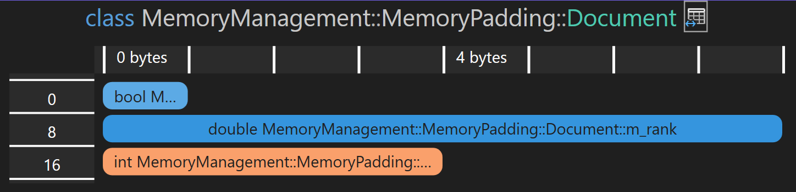
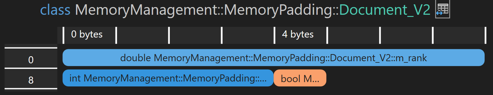

# Ausrichtung und Abstand (*Alignment*) und *Padding*)

[Zurück](Readme_MemoryManagement.md)

---

## Inhalt
  
  * [Allgemeines](#link1)
  * [Ausrichtung von Variablen im Speicher (Memory Alignment)](#link2)
    * [`alignof()`](#link3)
    * [`alignas`](#link4)
    * [`std::align`](#link5)
    * [`std::max_align_t` ](link6)
  * [Padding](#link7)

---

#### Quellcode

[*MemoryManagement_Alignment_Padding.cpp*](MemoryManagement_Alignment_Padding.cpp)<br />

---

## Allgemeines <a name="link1"></a>

---

## Ausrichtung von Variablen im Speicher (Memory Alignment) <a name="link2"></a>

Vorab einige Begrifflichkeiten:

Jedes Objekt im Speicher besitzt eine so genannte *Ausrichtung* (*Alignment*),
die ihm durch Anforderungen des entsprechenden Typs auferlegt werden.

Die Ausrichtung ist immer eine Potenz von 2 und Objekte mit einer entsprechenden Ausrichtung
können immer nur an Speicheradressen platziert werden,
die ein Vielfaches dieser Ausrichtung sind.

### `alignof()` <a name="link3"></a>

Liefert die Ausrichtung des Arguments (Datentyp) `alignof()` im Speicher zurück.

Für elementare Datentypen `T` kann man die Aussage treffen, dass stets `sizeof(T)` gleich `alignof(T)` gilt:

*Beispiel*:

```cpp
01: void test() {
02: 
03:     std::println("alignof (char)        {}", alignof (char));
04:     std::println("alignof (short)       {}", alignof (short));
05:     std::println("alignof (int)         {}", alignof (int));
06:     std::println("alignof (long)        {}", alignof (long));
07:     std::println("alignof (long long)   {}", alignof (long long));
08:     std::println("alignof (float)       {}", alignof (float));
09:     std::println("alignof (double)      {}", alignof (double));
10:     std::println("alignof (long double) {}", alignof (long double));
11: }
```

*Ausführung*:

```
alignof (char)        1
alignof (short)       2
alignof (int)         4
alignof (long)        4
alignof (long long)   8
alignof (float)       4
alignof (double)      8
alignof (long double) 8
```

Etwas komplizierter wird es, wenn wir die Ausrichtung von Strukturen betrachten,
siehe hierzu weiter unten den Abschnitt zu [Padding](#link11).


*Bemerkung*:

In der &bdquo;*Type Traits*&rdquo;-Metaprogramming Bibliothek der STL gibt es ein Klassentemplate `std::alignment_of<T>`.
Dessen Arbeitsweise ist weitestgehend identisch mit dem des Operators `alignof()`, es wird die Ausrichtung des Typs `T` zurückgeliefert.
Von Ausnahmen abgesehen kann man also immer mit dem Operator `alignof()` arbeiten.

### `alignas` <a name="link4"></a>

Legt die Anforderung an die Ausrichtung eines Typs oder Objekts im Speicher fest.

`alignas` ist ein *Spezifizierer*, d. h. er findet Anwendung zur Übersetzungszeit.


*Beispiel*:

```cpp
01: void test()
02: {
03:     alignas(16) int a {};
04:     alignas(1024) int b {};
05: 
06:     std::cout << &a << std::endl;
07:     std::cout << &b << std::endl;
08: 
09:     printBinary("a", &a);
10:     printBinary("b", &b);
11: }
```

*Ausführung*:

```
00000092387BE810
00000092387BEC00
a: 0000000000000000000000001001001000111000011110111110100000010000
b: 0000000000000000000000001001001000111000011110111110110000000000
```

Man beachte bei der Ausgabe die letzten Stellen der Adressen in binärer Darstellung:
Bei einer Ausrichtungsanforderung von 16 (entspricht 2<sup>4</sup>) finden wir 4 Nullen am Ende vor,
bei der Ausrichtungsanforderung von 1024 (entspricht 2<sup>10</sup>) entsprechend 10 Nullen.

### `std::align` <a name="link5"></a>

Legt die Anforderung an die Ausrichtung eines Typs oder Objekts im Speicher fest.

`std::align` ist eine STL-Bibliotheksfunktion, sie berechnet ausgerichtete Adressen
in vorgegebenen Pufferbereichen zur Laufzeit.

```cpp
01: static void test_examine_alignment_07()
02: {
03:     std::byte buffer[32] = {};
04: 
05:     std::cout << "Buffer Address:                 " << buffer << std::endl;
06:     std::cout << "Buffer Size:                    " << sizeof(buffer) << std::endl;
07: 
08:     size_t alignof_int64_t{ alignof(int64_t) };     // requested alignment
09:     size_t sizeof_int64_t{ sizeof(int64_t) };       // requested storage size
10: 
11:     void* ptr{ buffer + 2 };     // not properly aligned for int64_t
12:     size_t size{ 32 - 2 };       // remaining space in place3
13: 
14:     std::cout << "Modified Buffer Address:        " << ptr << std::endl;
15: 
16:     size_t oldSize{ size };      // want to compare old size with new calculated size
17:     void* oldPtr{ ptr };         // want to compare old ptr with new calculated pointer
18: 
19:     void* p = std::align(
20:         alignof_int64_t,         // desired alignment
21:         sizeof_int64_t,          // size of the storage to be aligned
22:         ptr,                     // pointer to contiguous storage(a buffer) in which to operate
23:         size                     // buffer size
24:     );
25: 
26:     std::cout << "Aligned Buffer Address:         " << ptr << std::endl;
27:     std::cout << "Size of new Buffer :            " << size << std::endl;
28: 
29:     assert(p == ptr);
30: 
31:     auto diff = reinterpret_cast<uint8_t*>(ptr) - reinterpret_cast<uint8_t*>(oldPtr);
32: 
33:     std::cout << "Number of skipped Bytes:        " << diff << std::endl;
34: }
```

*Ausführung*:

```
Buffer Address:                 000000A73F38F548
Buffer Size:                    32
Modified Buffer Address:        000000A73F38F54A
Aligned Buffer Address:         000000A73F38F550
Size of new Buffer :            24
Number of skipped Bytes:        6
```


### `std::max_align_t` <a name="link6"></a>


`std::max_align_t` beschreibt eine Ausrichtungsanforderung,
die mindestens so streng ist wie die von skalaren Typen.

Auf meinem Rechner ist `std::max_align_t` wie folgt definiert:

```cpp
using max_align_t = double; // most aligned type
```

Der typische Anwendungsfall im Gebrauch von `std::max_align_t`
besteht beim Deklarieren einer Variablen mit dem Spezifizierer `alignas`.
Hier kann man nun eine benutzerdefinierte Ausrichtungsanforderung angeben,
die strenger ist als die Standardausrichtung.

*Beispiel*:

```cpp
01: void test()
02: {
03:     alignas(std::max_align_t) char buffer[512] = {};  // typical use
04:     printBinary("a", buffer);
05: }
```

*Ausführung*:

```
a: 0000000000000000000000001100101010001101000110111111001000111000
```

Man beachte wiederum die Anzahl der Nullen am Ende der Binärdarstellung.

---

## Padding <a name="link7"></a>

In benutzerdefinierten Typen (Klassen, Strukturen) muss der Übersetzer manchmal zusätzliche Bytes (Padding) hinzufügen.
Zunächt einmal muss der Übersetzer die Elemente in der im Quellcode definierten Reihenfolge platzieren.

Er muss jedoch auch sicherstellen, dass die Datenelemente innerhalb der Klasse (Struktur) korrekt ausgerichtet sind.
Daher fügt er bei Bedarf *Padding* (Füllbytes) zwischen den Datenelementen hinzu.

*Beispiel*:

```cpp
01: class Document
02: {
03:     bool       m_isCached;
04:     double     m_rank;
05:     int        m_id;
06: };
```

Mit der Anweisung

```cpp
std::println("sizeof(Document): {}", sizeof(Document));
```

erhalten wir die Ausgabe:

```
sizeof(Document): 24
```

Der Grund für die mögliche Ausgabe von 24 liegt darin, dass der Compiler nach `bool` und `int` Füllbytes einfügt,
um die Alignment-Anforderungen der einzelnen Datenelemente und der gesamten Klasse zu erfüllen.

Der Compiler konvertiert die Klasse `Dokument` in etwa wie folgt:


```cpp
01: class Document_Behind_the_Scenes {
02:     bool       m_isCached;
03:     std::byte  m_padding1[7]; // invisible padding inserted by compiler
04:     double     m_rank_;
05:     int        m_id_;
06:     std::byte  m_padding2[4]; // invisible padding inserted by compiler
07: };
```

Im Visual Stdio gibt es für Klassen einen &bdquo;*Memory Layout Viewer*&rdquo;, der uns von der Original-Klasse folgende Darstellung liefert:



*Abbildung* 4: &bdquo;*Memory Layout Viewer*&rdquo; auf Klasse `Document` angewendet.

  * Der erste Abstand zwischen `bool` und `double` beträgt 7 Byte, da das `m_rank`-Datenelement
  des Typs `double` eine Ausrichtung von 8 Byte hat.
  * Der zweite Abstand nach `int` beträgt 4 Byte.
  * Dies ist erforderlich, um die Ausrichtungsanforderungen der Klasse `Document` selbst zu erfüllen.
  * Das Element mit der größten Ausrichtungsanforderung bestimmt auch die Ausrichtungsanforderung für die gesamte Datenstruktur.

In unserem Beispiel bedeutet dies, dass die Gesamtgröße der Klasse `Document` ein Vielfaches von 8 sein muss,
da sie einen `double`-Wert mit 8-Byte-Ausrichtung enthält.

Natürlich können wir die Reihenfolge der Datenelemente in der Klasse `Document` auch ändern,
um die vom Compiler eingefügten Füllbytes zu minimieren.

Wir beginnen hierzu am besten mit den Datentypen, die die größten Ausrichtungsanforderungen besitzen.
Wir erstellen eine neue Version der Klasse `Document`:

```cpp
01: class Document_V2
02: {
03:     double     m_rank;
04:     int        m_id;
05:     bool       m_isCached;
06: };
```



*Abbildung* 5: Die Datenelemente der `Document`-Klasse neu arrangiert.

Die Größe der neuen `Document`-Klasse beträgt nun nur noch 16 Bytes, verglichen mit 24 Bytes in der ersten Version.

**Generell** gilt:<br />Die größten Datenelemente sollten am Anfang und die kleinsten am Ende platziert werden.
Auf diese Weise lässt sich der durch das Padding verursachte Speicheraufwand minimieren.

---

[Zurück](Readme_MemoryManagement.md)

---
