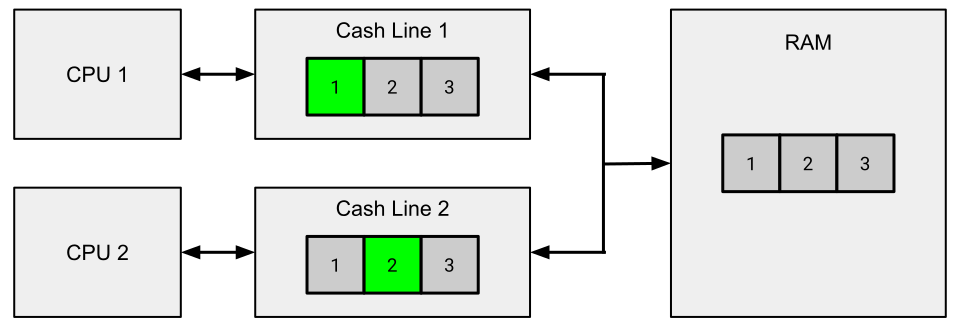
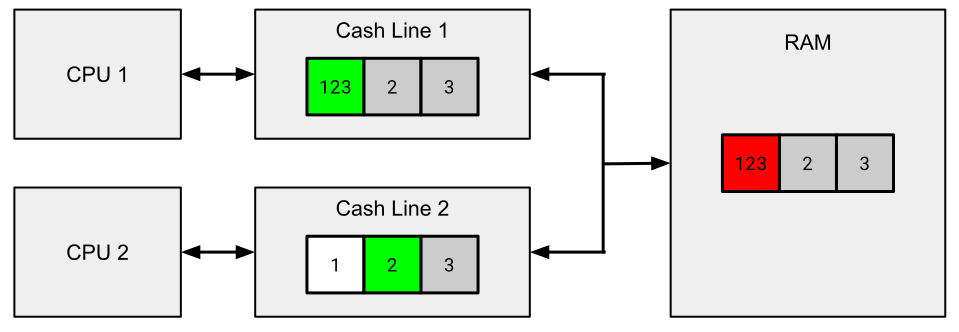
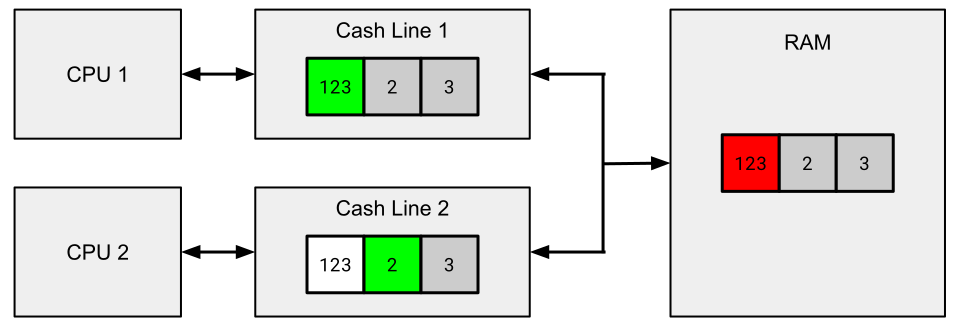

# Das &bdquo;False Sharing&rdquo; Problem

[Zurück](Readme_MemoryManagement.md)

---

## Inhalt

  * [Allgemeines](#link1)
  * [*False Sharing* und C++ 17](#link2)
  * [Beispiele zu *False Sharing*](#link3)
  * [Literatur](#link4)

---

#### Quellcode

[*MemoryManagement_Cache_False_Sharing.cpp*](MemoryManagement_False_Sharing.cpp)<br />

---
 
## Allgemeines <a name="link1"></a>

Wir beginnen mit dem *Sharing*-Aspekt von *False Sharing*:

Beim Lesen von Daten aus dem RAM lädt die CPU einen Speicherblock (*Cache Line*)
in ihren eigenen Cache.

Dadurch soll die *Datenlokalität* optimal genutzt werden:
Wenn Sie auf Daten zugreifen, greifen Sie höchstwahrscheinlich auch auf andere Daten zu,
die sich in der Nähe befinden.

Was passiert, wenn eine CPU den Inhalt einer Cache Line ändert, die aktuell mit anderen CPUs geteilt wird?
Die Caches der anderen CPUs müssen **neu geladen** werden,
bevor die auf diesen CPUs laufenden Prozesse (Threads) fortgesetzt werden können, wodurch diese **blockiert** werden.

Dieser Mechanismus ermöglicht den verschiedenen Threads in einem Prozess eine zusammenhängende Ansicht des Speichers.

Betrachten wir nun den *False*-Aspekt von *False Sharing*:

Dieser tritt auf, wenn zwei oder mehr Prozesse (Threads) **unabhängige** Daten in **derselben** Cache Line lesen und ändern.
In diesem Fall wird der zuvor beschriebene Cache-Kohärenzmechanismus zum Problem:
Eine CPU wird blockiert und wartet auf ein völlig nutzloses Update.

Betrachten Sie zu diesem Zweck nachfolgend die *Abbildungen* 3, 4 und 5:



*Abbildung* 3: Ausgangsszenario zweier CPUs mit *Cache Lines*.

In *Abbildung* 3 arbeitet CPU 1 ausschließlich auf der Zelle, die den Wert &bdquo;1&rdquo; enthält,
CPU 2 wiederum ausschließlich auf der Zelle, die den Wert &bdquo;2&rdquo; enthält.



*Abbildung* 4: CPU 1 ändert eine Zelle in ihrem Cache.

CPU 1 hat den Wert in &bdquo;ihrer&rdquo; Zelle von &bdquo;1&rdquo; auf &bdquo;123&rdquo; geändert.

CPU 2 erleidet einen Cache-Fehler (*Cache Miss*), der Cache muss neu geladen werden.



*Abbildung* 5: Der Cache von CPUs muss aktualisiert werden.

Der Cache von CPU 2 wurde neu geladen. CPU 2 kann nun die Arbeit fortsetzen.

*False Sharing* kann in der Regel auf zwei Arten behoben werden:

  * Stellen Sie sicher, dass Daten, die nicht zueinander in Beziehung stehen, in unterschiedlichen Cache Lines gespeichert werden.
  * Verwenden Sie lokale Daten für Zwischenberechnungen und greifen Sie erst am Ende auf den gemeinsam genutzten Speicher zu.


### *False Sharing* und C++ 17 <a name="link2"></a>

Mit C++ 17 gibt es Unterstützung für *False Sharing*,
der Header <new> enthält neue Konstanten:

```cpp
inline constexpr size_t hardware_destructive_interference_size  = 64;
inline constexpr size_t hardware_constructive_interference_size = 64;
```

Die Konstante `std::hardware_destructive_interference_size` gibt den garantierten Mindestabstand
in Bytes zwischen zwei Speicherpositionen an,
um einen *False Sharing* Zugriff zu vermeiden.

Mit `alignas` lassen sich Variablen an diesem Mindestabstand entsprechend ausrichten.

*Beispiel*:

```cpp
01: struct DataWithAlignment {
02:     alignas(std::hardware_destructive_interference_size) int x{};
03:     alignas(std::hardware_destructive_interference_size) int y{};
04: };
```

Neben `std::hardware_destructive_interference_size` gibt es eine zweite Konstante: `std::hardware_constructive_interference_size`:

Diese Konstante gibt den garantierten Mindestabstand in Bytes zwischen zwei Speicherorten an,
der &bdquo;*konstruktive Interferenz*&rdquo; gewährleistet.

&bdquo;*Konstruktive Interferenz*&rdquo; tritt auf,
wenn zwei Speicherorte nahe beieinander liegen, aber Zugriffe sich nicht gegenseitig stören.


### Beispiele zu *False Sharing* <a name="link3"></a>

*Beispiel* 1:

```cpp
01: const std::size_t Iterations = 100'000'000;  // 10000000
02: 
03: struct Data {
04:     int x{};
05:     int y{};
06: };
07: 
08: struct DataWithAlignment {
09:     alignas(std::hardware_destructive_interference_size) int x{};
10:     alignas(std::hardware_destructive_interference_size) int y{};
11: };
12: 
13: template <typename TData>
14: void updateData(TData& data, int id) {
15: 
16:     for (int i = 0; i < Iterations; ++i) {
17:         if (i % 2 == 0) {
18:             data.x += id;
19:         }
20:         else {
21:             data.y += id;
22:         }
23:     }
24: }
25: 
26: void test_false_sharing_with_false_sharing()
27: {
28:     Data data1;
29:     Data data2;
30: 
31:     std::thread t1(updateData<Data>, std::ref(data1), 1);
32:     std::thread t2(updateData<Data>, std::ref(data2), 2);
33: 
34:     {
35:         ScopedTimer watch{};
36: 
37:         t1.join();
38:         t2.join();
39:     }
40: }
41: 
42: void test_false_sharing_no_false_sharing()
43: {
44:     DataWithAlignment data1;
45:     DataWithAlignment data2;
46: 
47:     std::thread t1(updateData<DataWithAlignment>, std::ref(data1), 1);
48:     std::thread t2(updateData<DataWithAlignment>, std::ref(data2), 2);
49: 
50:     {
51:         ScopedTimer watch{};
52: 
53:         t1.join();
54:         t2.join();
55:     }
56: }
```

*Beispiel* 2:

```cpp
01: void test() {
02: 
03:     constexpr std::size_t numProcessors = 8;
04:     constexpr std::size_t numIter = 40'000'000;
05: 
06: #if FALSE_SHARING
07:     std::cout << "With false sharing \n";
08:     struct resultType {
09:         int val;
10:     };
11: #else
12:     std::cout << "Without false sharing\n";
13:     struct resultType {
14:         alignas(std::hardware_destructive_interference_size) int val;
15:     };
16: #endif
17:     std::println("Sizeof: {}", sizeof(struct resultType));
18: 
19:     std::array<resultType, numProcessors> results{ 0 };
20:     std::array<std::thread, numProcessors> threads;
21: 
22:     {
23:         ScopedTimer watch{};
24: 
25:         for (std::size_t i = 0; i < numProcessors; ++i) {
26: 
27:             auto& result = results[i];
28: 
29:             threads[i] = std::thread{
30:                 [&result, numIter]() mutable {
31:                     for (std::size_t j = 0; j < numIter; ++j) {
32:                         result.val = (result.val + std::rand() % 10) % 50;
33:                         // std::println("val: {}", result.val);
34:                     }
35:                 }
36:             };
37:         }
38: 
39:         std::for_each(
40:             begin(threads),
41:             end(threads),
42:             [](std::thread& t) { t.join(); }
43:         );
44:     }
45: }
```

---

## Literatur <a name="link4"></a>


Anregungen zum *False Sharing* finden Sie beispielsweise unter

[Caches and the problem of false sharing, a primer in C++17](https://medium.com/@joao_vaz/caches-and-the-problem-of-false-sharing-a-primer-in-c-17-1177ad07a625)

[Understanding False Sharing](https://parallelcomputing2017.wordpress.com/2017/03/17/understanding-false-sharing/)

und

[C++17 and False Sharing](https://curiouslyrecurringthoughts.home.blog/2019/06/10/c17-and-false-sharing/)

---

[Zurück](Readme_MemoryManagement.md)

---
