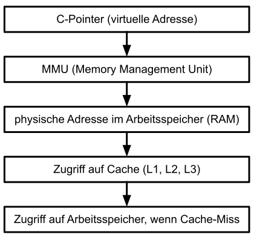

# CPU-Arbeitsspeicher (RAM)

[Zurück](Readme_MemoryManagement.md)

---

## Inhalt
  
  * [Allgemeines](#link1)
  * [Zugriff auf Variablen im Speicher](#link2)

---

## Allgemeines <a name="link1"></a>

Die Sprachen C und C++ bieten die Möglichkeit, über Adressen auf Variablen in einem Programm zugreifen zu können,
zum Beispiel so:

```cpp
int x = 123;
int *ptr = &x;
*ptr = 456;
```

Da wir nachfolgend noch das Thema &bdquo;Cache&rdquo; betrachten werden, sollten wir zunächst ein klares Verständnis davon haben,
wofür eine Adresse eines Zeigers (Pointers) in einem C/C++ Programm wirklich steht.

---

## Zugriff auf Variablen im Speicher <a name="link2"></a>

Bei Adressen in einem C/C++ Programm handelt es sich fast ausschließlich um &bdquo;virtuelle Adressen&rdquo;.
Eine virtuelle Adresse zeigt weder auf eine konkrete RAM-Speicherzelle (physische Adresse) noch auf einen Cache-Eintrag,
daher auch ihr Name. 

Der Hauptunterschied liegt darin,
wie der Computer den Speicher aus Sicht der Software (virtuell) im Vergleich zur tatsächlichen Hardware (physisch) organisiert:

  * Virtuelle Adresse:<br />Dies ist die Adresse, die ein Pointer in deinem C-Programm tatsächlich enthält (z. B. `0x7ffee33ca230`).
    Sie ist eine Abstraktion, die jedem Prozess vorgaukelt, er hätte einen eigenen, riesigen und zusammenhängenden Speicherbereich für sich allein.
  * Physische Adresse:<br />Dies ist der reale Ort auf dem RAM-Chip. Nur das Betriebssystem und die Hardware greifen direkt darauf zu. 


### Wie funktioniert die Umrechnung?

Wenn dein Programm auf einen Pointer zugreift, übersetzt die Memory Management Unit (MMU) der CPU die virtuelle Adresse
in die physische Adresse. Dieser Vorgang wird meist über *Paging* (Seitentabellen) gesteuert. 

Hinweis:<br />Auf modernen Betriebssystemen (Windows, Linux, macOS) kann man nicht einfach die physische Adresse eines Pointers ermitteln
oder direkt darauf zugreifen, da dies aus Sicherheitsgründen blockiert wird.
Direkte physische Adressierung findet man heute fast nur noch in der Embedded-Programmierung (z. B. Mikrocontroller ohne MMU). 


### Zusammenspiel mit einem Cache

Um nun noch einen Cache ins Spiel zu bringen, betrachten wir hierzu ein Schichtenmodell.
Wir wiederholen das Beispiel von oben:


```cpp
int x = 123;
int *ptr = &x;
```

In diesem Fall zeigt `ptr` auf eine virtuelle Adresse, also nicht direkt auf eine konkrete RAM-Speicherzelle oder einen Cache-Eintrag.

Was bedeutet das nun konkret?

#### Ein Pointer enthält eine virtuelle Adresse

  * Jeder Prozess besitzt einen eigenen Adressraum.
  * Ein Pointer ist nur eine Zahl innerhalb dieses Adressraums.
  * *Beispiel*: `0x7ffeefbff5ac`: Diese Adresse sieht in der Tat nach einer physischen RAM-Adresse aus, aber es ist eine virtuelle Adresse!


#### MMU: Übersetzung einer virtuellen Adresse in eine physische RAM-Adresse

  * Eine CPU besitzt eine MMU (*Memory Management Unit*).
  * Diese übersetzt: virtuelle Adresse &RightArrow; physische RAM-Adresse
  * Das passiert automatisch bei jedem Zugriff.


#### Ein Cache wird automatisch benutzt

Bevor der RAM (Arbeitsspeicher) angesprochen wird:

  * CPU schaut in den L1 Cache
  * dann in den L2 Cache
  * dann in den L3 Cache
  * erst dann in den RAM


*Beachte*:<br />
  * Der Cache hat keine eigenen Adressen aus Sicht von C.
  * Er repräsentiert nur eine Kopie von RAM-Daten.

Wir können auch sagen, dass ein Cache vollständig hardware-verwaltet ist. Es ist also in C nicht möglich zu sagen,
&bdquo;Gib mir eine Adresse aus dem L1 Cache&rdquo;.

*Zusammenfassung*:

Wir können nun in *Abbildung* 1 betrachten, wie in Wirklichkeit der Zugriff auf den physikalischen Arbeitsspeicher erfolgt,
wenn wir in einem C-Pointer eine (virtuelle) Adresse vorliegen haben:



*Abbildung* 1: Zugriff eines C-Zeigers auf RAM.


### Warum ist der Cache so wichtig?

Auch wenn wir den Cache in einem C/C++ Programm nicht direkt ansprechen können, ist er auf Grund seiner Performance bedeutsam:

  * Zugriff auf Cache: ~1–5 Zyklen
  * Zugriff auf RAM: ~100+ Zyklen

Auf den Begriff der &bdquo;Cache-Lokalität&rdquo; gehen wir noch im Detail ein.
Kurz formuliert besagt der Begriff:

  * Arrays linear durchlaufen = schnell
  * Wildes Pointer-Hopping = langsam

---

[Zurück](Readme_MemoryManagement.md)

---
