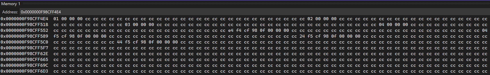
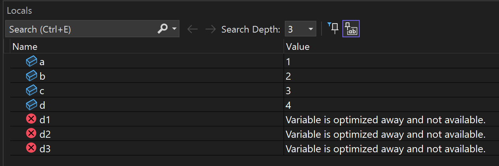
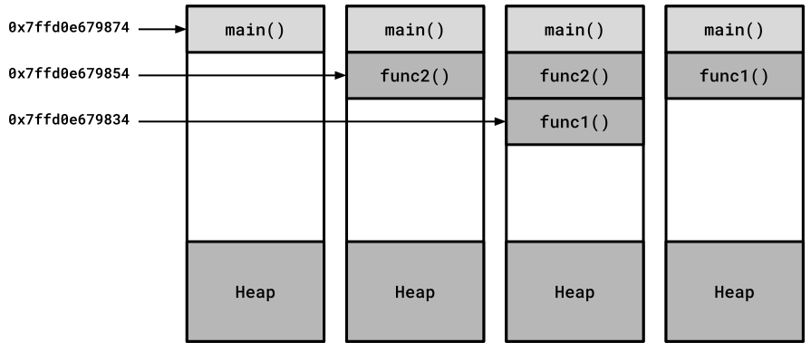

# Der Stapel (*Stack*)

[Zurück](Readme_MemoryManagement.md)

---

## Inhalt
  
  * [Allgemeines](#link1)
  * [Unterschiede des Stapels im Debug- und Relase-Modus](#link2)
  * [Ausdehnung des Stapels](#link3)
  * [Größe des Stapels bestimmen](#link4)
  * [Literatur](#link5)

---

#### Quellcode

[*MemoryManagement_Stack.cpp*](MemoryManagement_Stack.cpp)<br />

---

## Allgemeines <a name="link1"></a>

---

### Unterschiede des Stapels im Debug- und Relase-Modus <a name="link2"></a>

Bei der Suche nach Fehlern versorgt uns die Visual Stdio IDE mit einer Reihe von unterstützenden Tools.
Ein simples Tool sind *Memory Windows*:

```cpp
01: int a = 1;
02: int b = 2;
03: int c = 3;
04: int d = 3;
05: 
06: int* ap = &a;
07: int* bp = &b;
08: int* cp = &c;
09: int* dp = &d;
10: 
11: unsigned long long d1 = (unsigned long long)bp - (unsigned long long)ap;
12: unsigned long long d2 = (unsigned long long)cp - (unsigned long long)bp;
13: unsigned long long d3 = (unsigned long long)dp - (unsigned long long)cp;
14: 
15: std::cout << "&a:  " << &a << std::endl;
16: std::cout << "&b:  " << &b << std::endl;
17: std::cout << "&c:  " << &c << std::endl;
18: std::cout << "&d:  " << &d << std::endl;
19: 
20: std::println("Diff a <=> b: {}", d1);
21: std::println("Diff b <=> c: {}", d2);
22: std::println("Diff c <=> d: {}", d3);
```

Die Inhalte der Variablen `a`, `b`, `c`, und `d` kann man in einem solchen *Memory Window* ansehen:



*Abbildung* 1: &bdquo;*Memory*&rdquo;-Fenster für lokale Variablen.

Hmmm, fällt Ihnen an der Ausgabe im Fenster etwas auf?
Richtig gesehen, die vier `int`-Variablen liegen in einem Abstand von 32-Bytes voneinander entfernt im Speicher.

Die Ausgaben in der Konsole bestätigen uns in dieser Vermutung:

```
&a:  0000003A9CEFF7E4
&b:  0000003A9CEFF804
&c:  0000003A9CEFF824
&d:  0000003A9CEFF844
Diff a <=> b: 32
Diff b <=> c: 32
Diff c <=> d: 32
```

Im Release-Modus haben die Variablen den erwarteten Abstand von 8 Bytes.
Dies lässt sich nicht ohne Weiteres durch die Ausgaben bestätigen, da der Compiler/Optimizer
offensichtlich an der Reihenfolge der Variablen bzgl. ihrer Ablage im Speicher Änderungen vornimmt.
Damit werden die Ausgaben sinnlos,
dies bestätigt auch ein Blick in das Fenster der lokalen Variablen:



*Abbildung* 2: Nicht jede im Programm deklarierte Variable findet Einzug in das endgültige Programm (*Release*-Modus).

Aber bleiben wir beim Debug-Modus. Warum ist das so? Hierzu finden sich wenige Hinweise im Netz,
immerhin gibt es bei [SO](https://stackoverflow.com/questions/60419126/why-does-vs-debug-build-allocates-variables-so-far-apart) eine Erklärung hierzu:

&bdquo;Die Debug-Version allokiert den Speicher anders als die Release-Version.
Insbesondere allokiert die Debug-Version zusätzlich Speicherplatz am Anfang und Ende jedes Speicherblocks,
den eine Variable benötigt, und füllt diesen mit einem bestimmten Allokationsmuster,
dass man auf etwaige Beschädigungen hin überprüfen kann&rdquo;.

In *Abbildung* 1 kann man erkennen, dass im &bdquo;toten&rdquo; Bereich der Wert `0xCC` vorhanden ist.

Die Speicherallokation erfolgt in quantisierten Blöcken, wobei die Länge eines Quantums nicht dokumentiert ist,
sie könnte 16 oder 32 Bytes betragen.

Wenn Sie beispielsweise vier `int`-Variablen auf dem Stack allokieren
(Größe = 4 * `sizeof(int)` Bytes = 4 * 4 = 16 Bytes),
belegt der Allokator im Debug-Modus tatsächlich 128 Bytes (vier 32-Byte Quanten).

Wenn Sie nun über den zulässigen Speicherplatz hinausschreiben
(das ginge in diesem Beispiel nur mit Typwandlungsoperationen),
überschreiben Sie einen Teil des &bdquo;toten Speicherplatzes&rdquo; und beschädigen das vorhandene Bitmuster. 

Beim Verlassen eines Unterprogramms im Debug-Modus können Testroutinen des Debuggers überprüfen,
ob Beschädigungen in den flankierenden Speicherbereichen vorhanden sind und, wenn ja,
Laufzeitfehlermeldungen generieren.


### Ausdehnung des Stapels <a name="link3"></a>

Wir analysieren den Stack an einem kleinen Beispiel, um herausfinden,
in welche Richtung er wächst. Dazu vergleichen wir die Adressen von Variablen, die sich auf dem Stapel befinden.

Das folgende Beispiel zeigt, auf welche Weise der Stapel beim Betreten und Verlassen von Funktionen wächst und schrumpft:

```cpp
01: static void func1()
02: {
03:     auto i{ 1 };
04:     std::cout << "func1(): " << std::addressof(i) << " - i: " << i << '\n';
05: }
06: 
07: static void func2()
08: {
09:     auto i{ 2 };
10:     std::cout << "func2(): " << std::addressof(i) << " - i: " << i << '\n';
11:     func1();
12: }
13: 
14: static void test_examine_stack() {
15: 
16:     auto i{ 0 };
17:     std::cout << "main():  " << std::addressof(i) << " - i: " << i << '\n';
18:     func2();
19:     func1();
20: }
```

*Bemerkung*:<br />
Die Ausgaben wurden mit dem GCC-Compiler erzeugt.

*Ausgabe*:

```
main():  0x7ffd0e679874 - i: 0
func2(): 0x7ffd0e679854 - i: 2
func1(): 0x7ffd0e679834 - i: 1
func1(): 0x7ffd0e679854 - i: 1
```

Indem wir die Adressen der auf dem Stapel abgelegten `int`-Variablen als ganze Zahl ausgeben,
können wir analysieren, wie stark und in welche Richtung der Stapel auf einem Rechner wächst.

Wir beobachten jedes Mal 32 Bytes, wenn wir entweder `func1()` oder `func2()` aufrufen.
Die `int`-Variable `i`, die auf Stapel liegt, ist allerdings nur 4 Bytes (auf meinem Rechner) groß.

Die verbleibenden 28 Bytes enthalten Daten, die benötigt werden, wenn die Funktion endet, wie etwa die Rücksprungadresse und möglicherweise etwas *Padding*-Bytes zur Ausrichtung.



*Abbildung* 3: Der Stapel wächst und schrumpft, wenn Funktionen aufgerufen und verlassen werden.

---

### Die Größe des Stapels bestimmen <a name="link4"></a>

Wir versuchen, ein Programm zu schreiben, das die Größe des Stacks auf einem Rechner bestimmt.
Dies lässt sich allerdings nur im Rahmen einer Schätzung durchführen.

Wir schreiben zu diesem Zweck eine Funktion `func`, an die wir beim Aufruf die Adresse einer Variablen übergeben,
die auf dem Stack abgelegt ist.
Die Funktion `func` selbst tut zwei Dinge: Zum einen allokiert sie pro Aufruf 1024 Bytes auf dem Stack,
zum anderen berechnet sie &ndash; pro rekursivem Aufruf &ndash; den Abstand dieses Felds zur ursprünglichen Variablen,
deren Adresse wir uns beim ersten Aufruf gemerkt haben und die wir an jeden Aufruf von `func` weiterreichen.

Auf diese Weise nähern wir uns der tatsächlichen Größe des Stapels, bis es auf Grund eines Stacküberlaufs
zu einem Absturz des Programms kommt. Dies entspricht nicht ganz der feinen englischen Art,
ist aber eine unkonventionelle Vorgehensweise, um die ungefähre Größe des Stapels zu berechnen.


```cpp
01: void func (const std::byte* stack_bottom_addr) {
02:     std::byte data[1024] = {};
03:     std::cout << stack_bottom_addr - data << '\n';
04: 
05:     func(stack_bottom_addr);
06: }
07: 
08: void test() {
09: 
10:     std::byte b{};
11:     func(&b);
12: }
```

Auf einem Windows Rechner erhalten wir folgende Ausgaben &ndash; im Mittelteil der Ausführung verkürzt dargestellt:


```
1684
3380
5076
6772
8468
10164
11860
13556
15252
16948
18644
20340
...
993844
995540
997236
998932
1000628
1002324
1004020
1005716
1007412
1009108
1010804
1012500
1014196
1015892
1017588
1019284
1020980
```

Unter Windows ist die Standardgröße des Stacks normalerweise auf 1 MB eingestellt.
Die Ausgaben des Programms bestätigen dies in etwa &ndash; der Wert 1.020.980 ist
nicht weit von 1.048.576 (1.024 * 1.024) entfernt.

---

## Literatur <a name="link5"></a>

Hinweise auf das Vorhandensein von Extra-Speicher im Debug-Modus zu Kontrollzwecken kann man hier nachlesen:

[Why does VS Debug build allocates variables so far apart?](https://stackoverflow.com/questions/60419126/why-does-vs-debug-build-allocates-variables-so-far-apart)

---

[Zurück](Readme_MemoryManagement.md)

---
