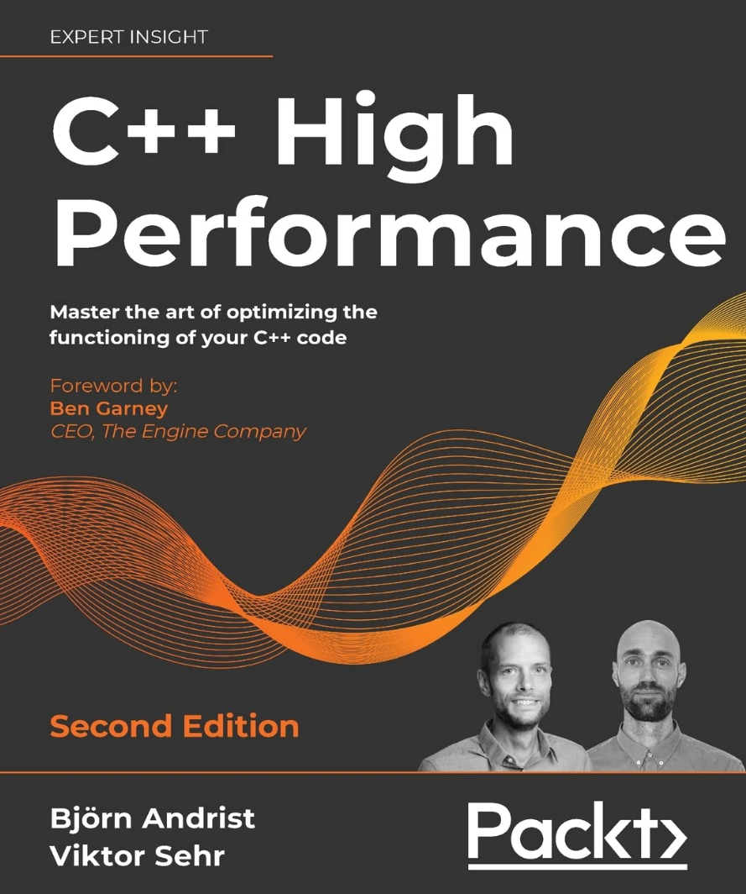
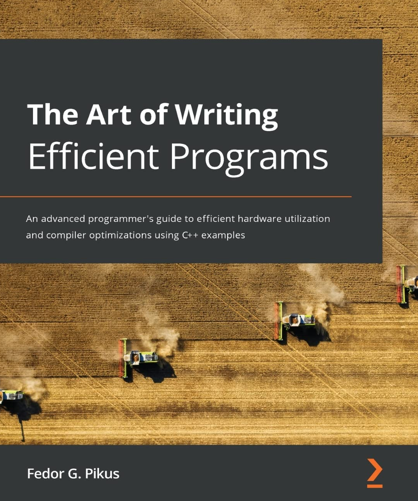
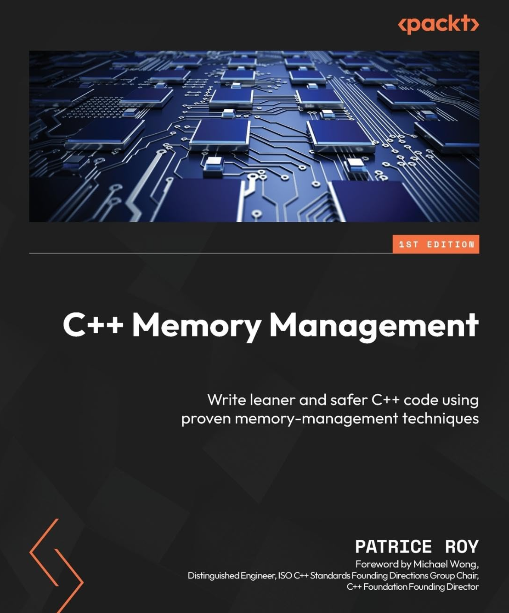
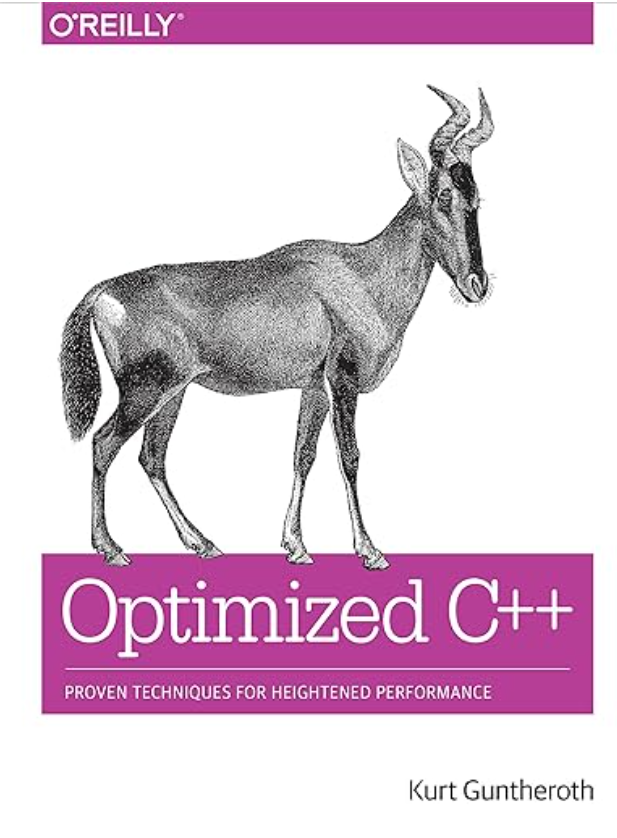
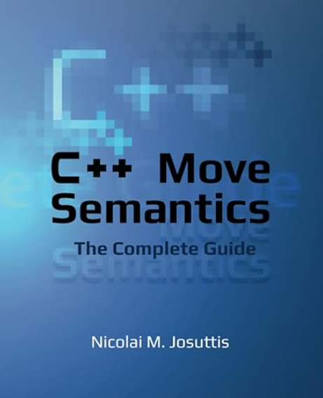
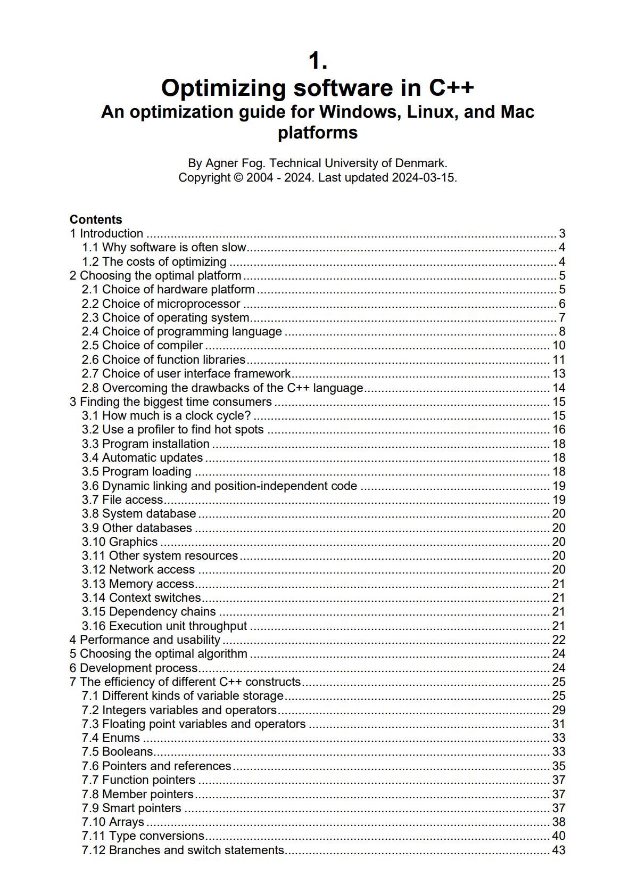

# Literatur

[Zurück](./Readme_Performance_Optimization.md)

---

## Performance and Optimization

---

  * Björn Andrist, Viktor Sehr &bdquo;*C++ High Performance (2. Auflage)*&rdquo;. 
    Packt Publishing (21. Dezember 2020), 544 Seiten. Sprache: Englisch. ISBN-13: 978-1839216541, ISBN-10: 1839216549.

    

---

  * Pikus, Fedor G. &bdquo;*The Art of Writing Efficient Programs*&rdquo;. 
    Packt Publishing (22. Oktober 2021), 464 Seiten. Sprache: Englisch. ISBN-13: 978-1800208117, ISBN-10: 1800208111.

    

---

  * Roy, Patrice &bdquo;*C++ Memory Management (1. Auflage)*&rdquo;. 
    Packt Publishing (25. März 2025), 434 Seiten. Sprache: Englisch. ISBN-13: 978-1805129806, ISBN-10: 1805129805.

    

---

  * Guntheroth, Kurt &bdquo;*Optimized C++: Proven Techniques for Heightened Performance*&rdquo;. 
    Packt Publishing (21. Mai 2016), 388 Seiten. Sprache: Englisch. ISBN-13: 978-1491922064, ISBN-10: 9781491922064.

    

---

  * Josuttis, Nicolai M., &bdquo;*C++ Move Semantics &ndash; The Complete Guide*&rdquo;.  
    NicoJosuttis (30. August 2020), 262 Seiten. Sprache: Englisch. ISBN-10: 3967309002, ISBN-13: 978-3967309003.

    

---

  * Fog, Agner, &bdquo;Optimizing Software in C++ &ndash; An Optimization Guide for Windows, Linux, and Mac Platforms&rdquo;.  
    Technical University of Denmark, Copyright &copy; 2004 - 2024. Last updated 2024-03-15.

    

    [Verfügbar hier](https://www.agner.org/optimize/optimizing_cpp.pdf) 

---

  * [*Quick C++ Benchmark*](https://quick-bench.com/) 
    (abgerufen am 25.01.2025).

    Quick Bench ist ein Mikro-Benchmarking-Tool, mit dem die Leistung von zwei oder mehreren Code-Snippets schnell und einfach verglichen werden kann.

---

  * [*Daily bit(e) of C++ | Optimizing code to run 87x faster*](https://simontoth.substack.com/p/daily-bite-of-c-optimizing-code-to/) 
    (abgerufen am 10.03.2025).

    Die *One Billion Row Challenge* (*1BRC*) war ursprünglich eine Herausforderung für Java-Entwickler.
    Ziel war es, einen Parser für eine Datei mit einer Milliarde Datensätze zu entwickeln und zu optimieren.

    Obwohl die ursprüngliche Herausforderung für Java gedacht war, ist diese Herausforderung eine hervorragende Gelegenheit,
    die Optimierung von C++-Code und den zugehörigen Performance Tools zu demonstrieren.

---

  * [*Optimizing C++*](https://en.m.wikibooks.org/wiki/Optimizing_C%2B%2B) 
    (abgerufen am 29.06.2025).

    Wikibook Guidelines Website.

---

[Zurück](./Readme_Performance_Optimization.md)

---
