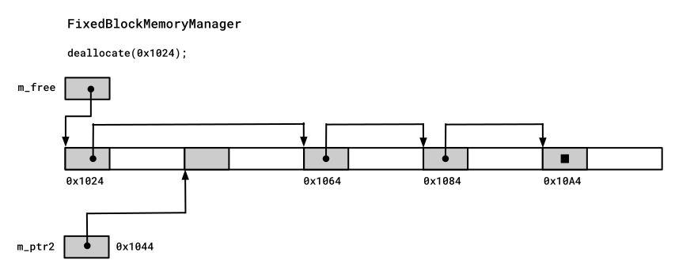
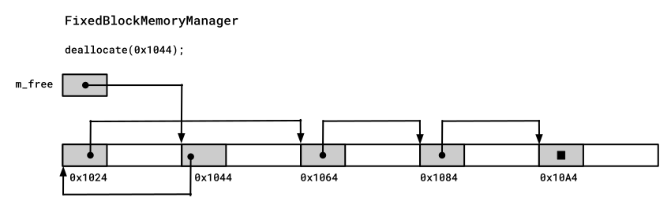

# Speichermanager für Blöcke mit fester Größe / *Fixed-Size-Block Memory Manager*

[Zurück](Readme_Performance_Optimization_Advanced.md)

---

## Inhalt
  
  * [Allgemeines](#link1)
  * [Klasse `FixedArenaController`](#link2)
  * [Klasse `FixedBlockMemoryManager`](#link3)
  * [Einfach verkettete Liste für freie Speicherblöcke](#link4)
  * [Klasse `FixedBlockAllocator`](#link5)
  * [Klassen mit klassenspezifischen `new` und `delete` Operatoren](#link6)
  * [Literatur](#link7)

---

## Voraussetzungen

  * *Placement New*
  * Speicher-Allokatoren (`std::allocator`)
  
---

#### Quellcode

[*FixedArenaController.h*](FixedArenaController.h)<br />
[*FixedBlockMemoryManager.h*](FixedBlockMemoryManager.h)<br />
[*FixedBlockAllocator.h*](FixedBlockAllocator.h)<br />

[*FixedArenaController_Test.cpp*](FixedArenaController_Test.cpp)<br />
[*FixedBlockMemoryManager_Test.cpp*](FixedBlockMemoryManager_Test.cpp)<br />
[*FixedBlockAllocator_Test.cpp*](FixedBlockAllocator_Test.cpp)<br />

---

## Allgemeines <a name="link1"></a>

In diesem Abschnitt stellen wir einen einfachen Speichermanager mit fester Blockgröße vor,
der Blöcke aus einem einzelnen, statisch deklarierten Speicherblock, einer sogenannten &bdquo;*Arena*&rdquo;, allokiert.

Derartige Speichermanager mit fester Blockgröße findet man häufig im Umfeld des *Embedded Programming* vor.

Die vorgestellten zwei Klassen `FixedArenaController` und `FixedBlockMemoryManager` sind intern sehr einfach aufgebaut:
Sie verwalten einzig und allein eine einfach verkettete Liste freier Speicherblöcke.
Dieses einfache Design ist es wert, im Detail betrachtet zu werden.

---

## Klasse `FixedArenaController` <a name="link2"></a>

```cpp
01: class FixedArenaController
02: {
03: public:
04:     template <int N>
05:     FixedArenaController(char(&a)[N]);
06: 
07:     ~FixedArenaController() = default;
08: 
09:     // public interface
10:     void*  allocate(size_t);
11:     size_t blockSize() const;
12:     size_t capacity() const;
13:     void   clear();
14:     bool   empty() const;
15:     void   dump() const;
16: 
17: private:
18:     void*  m_arena;
19:     size_t m_arenaSize;
20:     size_t m_blockSize;
21: };
```


---

## Klasse `FixedBlockMemoryManager` <a name="link3"></a>


```cpp
01: template <class TArena>
02: class FixedBlockMemoryManager
03: {
04: public:
05:     template <size_t N>
06:     FixedBlockMemoryManager(char(&a)[N]);
07: 
08:     ~FixedBlockMemoryManager() = default;
09: 
10:     // public interface
11:     void* allocate(size_t);
12:     size_t blockSize() const;
13:     size_t capacity() const;
14:     void   clear();
15:     void   deallocate(void*);
16:     bool   empty() const;
17: 
18: private:
19:     struct free_block {
20:         free_block* next;
21:     };
22: 
23:     free_block* m_freePtr;
24:     size_t      m_blockSize;
25:     TArena      m_arena;
26: };
```

*Hinweis*:<br />
Um die Definitionen von Klassentemplates übersichtlich zu halten, können Memberfunktionen der Template-Klasse außerhalb der Template-Klassendefinition definiert werden.

Dies kann in derselben Datei nach der Klassendefinition erfolgen
oder in einer ausgelagerten Datei,
die häufig die Ending &bdquo;*.inl*&rdquo; besitzt und nach der Klassendefinition inkludiert wird.

Wenn die Methodendefinitionen jedoch außerhalb der Template-Klassen erscheinen,
ist eine ausführlichere Syntax erforderlich, um dem Compiler die Verknüpfung der Definition mit der Deklaration im Template-Klassenrumpf zu erleichtern.

Die erste Zeile des vorherigen Beispiels, `template <class TArena>`, deklariert den Template-Parameter der Klasse.
Die fünfte Zeile, `template <size_t N>`, bezieht sich nur auf den Konstruktor selbst,
der eine so genannte *Template-Member-Methode* ist.

Wenn die Memberfunktionsdefinition außerhalb des Template-Klassenrumpfs erscheint,
muss das Schlüsselwort `inline` explizit angegeben werden, da eine Inline-Verknüpfung nur dann angenommen wird,
wenn die Definition innerhalb der Klasse erscheint.

---

## Einfach verkettete Liste für freie Speicherblöcke <a name="link4"></a>

Die interne Arbeitsweise der beiden Klassen `FixedArenaController` und `FixedBlockMemoryManager`
wollen wir an einem Szenario aufzeigen.


Zunächst wird die Arena initialisiert.
Die einzige Komplexität in der Klasse `FixedBlockAllocator` ergibt sich aus der Erstellung einer
einfach verkettete Liste für freie Speicherblöcke. Diese Liste besteht aus Adressen,
die *innerhalb* der freien Speicherblöcke abgelegt werden!

Diese Komplexität wird von der separaten Klasse `FixedArenaController` erbracht.

Diese Klasse verwaltet einen einzigen (statischen) Speicherblock,
der aber als verkettete Liste von vielen, gleich-großen kleineren Speicherblöcken angesehen wird
und aus dem nach Anfrage einzelne Blöcke zugewiesen werden können.


```cpp
01: char* ptr;
02: for (ptr = (char*) m_arena; count > 1; --count, ptr += m_blockSize) {
03:     *reinterpret_cast<char**>(ptr) = ptr + m_blockSize;
04: }
05: 
06: *reinterpret_cast<char**>(ptr) = nullptr;
```


Die Adresse des ersten freien Blocks ist in der Klasse `FixedArenaController`
in einer Variablen `m_arena` abgelegt.


*Abbildung* 1: Eine *Arena* im Grundzustand.

Nun kommt es zweimal zum Aufruf der Methode `allocate`:


*Abbildung* 2: Erster Aufruf der Methode `allocate`.


*Abbildung* 3: Zweiter Aufruf der Methode `allocate`.

Die beiden Blöcke werden nun in umgekehrter Reihenfolge wieder in die verkette Liste zurückgeführt.
Dies kann zur Folge haben, dass die Verkettung abweicht von der natürlichen Reihenfolge der Blöcke im Speicher.
Dies hat aber keinerlei Einfluss auf die Arbeitsweise des *Fixed-Size-Block Memory Managers*:



*Abbildung* 4: Erster Aufruf der Methode `deallocate`.



*Abbildung* 5: Zweiter Aufruf der Methode `deallocate`.

---

## Klasse `FixedBlockAllocator` <a name="link5"></a>

Die Containerklassen der STL nutzen den dynamischen Speicher intensiv.
Sie sind daher ein naheliegender Ort für Optimierungsmöglichkeiten,
einschließlich benutzerdefinierter Speichermanager wie den von uns
betrachteten *Fixed-Size-Block Memory Manager*.

Um die Realisierung des *Fixed-Size-Block Memory Managers* in Standard-Klassen der STL
(z.B. `std::forward_list`) einsetzen zu können, müssen wir diesen in einem
benutzerdefinierten Speicher-Allokator unterbringen.

Dazu implementieren wir eine Klasse `FixedBlockAllocator` wie folgt:


```cpp
01: template<typename T>
02: class FixedBlockAllocator {
03: public:
04:     using value_type = T;  // needed for container classes
05: 
06:     FixedBlockAllocator() = default;
07: 
08:     // needed for container classes to store a copy of the allocator
09:     template<typename U>
10:     constexpr FixedBlockAllocator(const FixedBlockAllocator<U>&) noexcept {}
11: 
12:     // public interface
13:     T* allocate(size_t n);
14:     void deallocate(T* p, size_t) noexcept;
15: 
16:     template<typename U, typename... TArgs>
17:     void construct(U* ptr, TArgs&&... args);
18: 
19:     template<typename U>
20:     void destroy(U* p) noexcept;
21: 
22:     friend bool operator== (const FixedBlockAllocator&, const FixedBlockAllocator&);
23:     friend bool operator!= (const FixedBlockAllocator&, const FixedBlockAllocator&);
24: };
```

*Bemerkung*:

Bei der Integration unseres *Fixed-Size-Block Memory Manager* in STL-Klassen wie z. B `std::list<T>`
gibt es jedoch ein Problem.

Die dynamisch allokierten Variablen in einem `std::list<T>`-Objekt sind *nicht* vom benutzerdefinierten Typ `T`.
Sie sind von einem versteckten Typ, wie z. B. `_list_item<T>` (Visual C++: `std::_Container_proxy>`),
der die Zeiger auf das vorherige und nächste Listenelement sowie den Nutzdatentyp `T` enthält.
Diese Klassenvorlagen sind in den vom Compiler bereitgestellten Header-Dateien verborgen.

Es sind mit in diesen Container-Klassen Objekte unterschiedlicher Größe abgelegt:

  * Objekte vom Typ `std::_Container_proxy>`
  * Objekte vom Typ `T`

Damit muss man vor der Entwicklung eines solchen benutzerdefinierten Speicher-Allokators eruieren,
welches die maximale Blockgröße ist, um alle derartigen Objekte ablegen zu können.


*Beispiel*:

```cpp
01: static void test_fixed_block_allocator_01()
02: {
03:     FixedBlockAllocator<double> alloc;
04: 
05:     std::forward_list<double, FixedBlockAllocator<double>> list{ alloc };
06: 
07:     list.push_front(1.5);
08:     list.push_front(2.5);
09:     list.push_front(3.5);
10:     list.push_front(4.5);
11:     list.push_front(5.5);
12: 
13:     for (auto elem : list) {
14:         std::println("{} ", elem);
15:     }
16: }
```

*Ausführung*:

```
FixedArenaController: N = 100
Start of Arena: 0X7FF789894C80
FixedBlockMemoryManager: N = 100
Allocating 16 bytes
Allocating 16 bytes
Constructing element
Allocating 16 bytes
Constructing element
Allocating 16 bytes
Constructing element
Allocating 16 bytes
Constructing element
Allocating 16 bytes
Constructing element
5.5
4.5
3.5
2.5
1.5
Destroying element
Deallocating memory
Destroying element
Deallocating memory
Destroying element
Deallocating memory
Destroying element
Deallocating memory
Destroying element
Deallocating memory
Deallocating memory
```

---

## Klassen mit klassenspezifischen `new` und `delete` Operatoren  <a name="link6"></a>

Neben der Injektion von benutzerdefinierten Speicher-Allokatoren in die Container-Klassen der STL
kann man in ausgewählten C++-Klassen den `new` und `delete` Operator auch direkt überladen bzw. durch
eine eigene Implementierung ersetzen.

An einem einfachen Bespiel einer Klasse `MemoryManagerTester` könnte dies so aussehen:

```cpp
01: class MemoryManagerTester
02: {
03: private:
04:     size_t m_contents;
05: 
06: public:
07:     MemoryManagerTester(size_t contents) 
08:         : m_contents{ contents } 
09:     {}
10: 
11:     static void* operator new(size_t s)
12:     { 
13:         return memoryManager.allocate(s); 
14:     }
15: 
16:     static void  operator delete(void* p)
17:     {
18:         memoryManager.deallocate(p);
19:     }
20: };
```

`memoryManager` ist dabei eine globale Variable des Typs `FixedBlockMemoryManager<FixedArenaController>`.

Möchte man die ausgetauschten Operatoren `new` und `delete` verwenden ist quasi nichts zu tun,
im folgenden Beispiel wird der klassenspezifische `new`-Operator aufgerufen:

```
new MemoryManagerTester(0);
```

Der globale `new`-Operator ist nicht ganz aus dem Spiel,
mit der folgenden Syntax ist dieser ansprechbar:

```
::new MemoryManagerTester(0);
```

---

## Literatur <a name="link7"></a>

Die Realisierung dieses Speichermanagers für Blöcke mit fester Größe wurde wurde in dem Buch 
&bdquo;[*Optimized C++: Proven Techniques for Heightened Performance*](https://www.amazon.de/-/en/Optimized-Proven-Techniques-Heightened-Performance/dp/1491922060)&rdquo;
von Kurt Guntheroth vorgefunden.

---

[Zurück](Readme_Performance_Optimization_Advanced.md)

---
