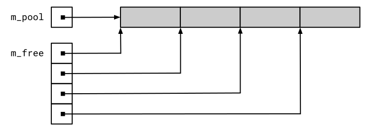
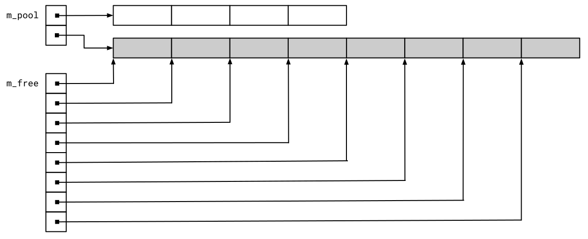

# Realisierung eines Objektpools / *Object Pool*

[Zurück](Readme_Performance_Optimization_Advanced.md)

---

## Inhalt
  
  * [Allgemeines](#link1)
  * [Zu den Details](#link2)
  * [Literatur](#link3)

---

## Voraussetzungen

  * *Placement New*
  * &bdquo;*Zeigerwäsche*&rdquo;: `std::launder`
  * Speicher-Allokatoren (`std::allocator`)
  
---

#### Quellcode

[*ObjectPool.h*](ObjectPool.h)<br />
[*ObjectPool.cpp*](ObjectPool.cpp)<br />
[*ObjectPool_Test.cpp*](ObjectPool_Test.cpp)

---

## Allgemeines <a name="link1"></a>

In diesem Abschnitt beschreiben wir die Implementierung
einer Object Pool Klasse, die sehr wohl für einen produktiven Einsatz
geeignet ist.

---

## Zu den Details <a name="link2"></a>

Die Implementierung des Objektpools verwaltet einen Vektor mit Objektblöcken vom Typ `T`.
Nach dem Start gibt es in diesem Vektor nur ein Element (Zeiger).
Dieser Zeiger verweist auf einen Speicherbereich,
der eine bestimmte Anzahl von Objekten (Typ `T`) aufnehmen kann, 
die dieser Pool verwaltet:

```cpp
std::vector<T*>  m_pool;
```

Zusätzlich werden freie Objekte in einem Vektor mit Zeigern auf alle freien Objekte protokolliert.

```cpp
std::vector<T*>  m_free;
```

Da zu Beginn alle Objekte im Pool verfügbar sind,
sind hier alle Adressen verfügbar, die durch den ersten Block
im Pool angesprochen werden können.


Wir versuchen, in den beiden folgenden Abbildungen das Szenario im
Objektpool &bdquo;bildlich&rdquo; darzustellen.

Zu Beginn wird im Pool eine bestimmte Menge an freien Objektblöcken eingerichtet.
Da alle diese Blöcke verfügbar sind, sind deren Anfangsadressen 
in der zweiten Liste `m_free` aller verfügbaren Objekte eingetragen.



*Abbildung* 1: `m_pool` und `m_free` nach dem Start.

Jetzt stellen wir uns vor, dass zwei Objektblöcke der Anwendung
zur Verfügung gestellt wurden. In *Abbildung* 2 erkennen wir, 
dass am Ende von `m_free` zwei Adressen fehlen: Diese Adressen
sind nun in der Obhut der Anwendung, sie können allerdings,
wenn die Anwendung die Objekte nicht mehr benötigt,
in der `m_free`-Liste wieder eingereiht werden.


*Abbildung* 2: `m_pool` und `m_free` nach Zuteilung zweier Objekte.

Sind alle Objekte des Pools zugeteilt, erkennen wir in
Abbildung 3, dass die Liste  `m_free` leer ist.
Es gibt keine freien Blöcke mehr.


*Abbildung* 3: Ein Pool ohne freie Objekte.


Wird jetzt ein neues Objekt angefordert,
muss zunächst der Pool an sich wieder nachladen.

Die grafische Darstellung wird nun ein wenig komplexer.
In *Abbildung* 4 erkennen wir, dass zunächst der Pool
neuen Speicher bekommen hat. Dieser wird komplett in die Liste
der freien Blöcke aufgenommen und neue Blöcke sind wieder verfügbar.



*Abbildung* 4: Ein Pool mit neuen Chunks.

---

Der Pool stellt Objekte über die Memberfunktion `acquireObject()` zur Verfügung.
Wird `acquireObject()` aufgerufen und sind aber keine freien Objekte mehr vorhanden,
allokiert der Pool einen weiteren Vektor mit Objektblöcken vom Typ `T`.

Die Klasse `ObjectPool` ist ein Klassentemplate.
Die beiden Templateparameter `T` und `TAllocator` parametrisieren
die im Pool zu speichernden Typen und den Typ des Allokators,
der für die Allokation und Freigabe von Speicherblöcken verwendet wird.

```cpp
template <typename T, typename TAllocator = std::allocator<T>>
class ObjectPool final
```

Die Memberfunktion `addChunk()` zum Zuweisen eines neuen Chunks ist wie folgt implementiert.
Der erste Teil von `addChunk()` führt die eigentliche Zuweisung eines neuen Chunks durch.
Ein „Chunk“ ist ein nicht initialisierter Speicherblock, der mithilfe eines Allocators zugewiesen wird und groß genug ist,
um `m_newChunkSize` Instanzen von `T` aufzunehmen.

Durch das Hinzufügen eines Objekt-Chunks werden noch keine Objekte erstellt;
d.h. es werden keine Objektkonstruktoren aufgerufen.
Dies geschieht später in `acquireObject()`, wenn Instanzen vergeben werden.

Der zweite Teil von `addChunk()` erstellt Zeiger auf die neuen Instanzen von `T`. 
Er verwendet den `iota()`-Algorithmus, definiert in der Datei `<numeric>`.

Zur Erinnerung: `iota()` füllt einen durch die ersten beiden Argumente vorgegebenen Bereich mit Werten.

Die Werte beginnen mit dem Wert des dritten Arguments und werden für jeden nachfolgenden Wert um Eins erhöht.

Da wir mit `T*`-Zeigern arbeiten, springt das Erhöhen eines `T*`-Zeigers um Eins
zum nächsten `T` im Speicherblock. Abschließend wird der Wert von `m_newChunkSize` verdoppelt,
sodass der nächste hinzugefügte Block doppelt so groß ist wie der aktuelle Block.

Dies geschieht aus Performancegründen und folgt dem Prinzip von `std::vector`.

---

## Literatur <a name="link3"></a>

Die Realisierung des Object Pools wurde in dem Buch 
&bdquo;[*Professional C++*](https://www.amazon.de/Professional-C-Marc-Gregoire/dp/1394193173)&rdquo; von Marc Gregoire
vorgefunden.

---

[Zurück](Readme_Performance_Optimization_Advanced.md)

---
