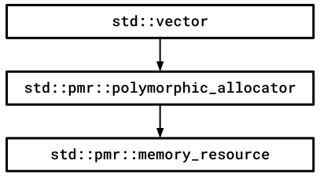

# Überblick

---

[Zurück](Readme_Performance_Optimization_Advanced_PMR.md)

---

### Allgemeines <a name="link1"></a>

Seit den frühen Versionen von C++ unterstützt die Standardbibliothek (STL) die Möglichkeit,
die Speicherverwaltung von Klassen zu konfigurieren.
Aus diesem Grund verfügen fast alle Typen in der Standardbibliothek, die Speicher allokieren, über einen zusätzlichen Parameter für einen Speicherallokator.
Siehe hier beispielsweise eine entsprechende Definition der Klasse `std::vector<T>`:

```cpp
namespace std {
    template<class T, class Allocator = std::allocator<T>>
    class vector;
}
```

So lässt sich die Speicherverwaltung von Containern, Zeichenketten (`std::string`) und anderen Typen konfigurieren,
falls man mit der standardmäßigen Allokation nicht einverstanden ist.
Diese allokiert den Speicher vom Heap. Es gibt jedoch verschiedene Gründe, dieses Standardverhalten zu ändern:

  * Man kann mit einer eigenen Realisierung der Speicherzuweisung das Ziel erreichen, die Anzahl der Systemaufrufe zu reduzieren.
  * Man kann sicherstellen, dass der zugewiesene Speicher nebeneinander liegt, um vom CPU-Caching zu profitieren.
  * Man kann die Speicherallokationen so umleiten, dass vorhandener Speicher auf dem Stack oder im globalen Datenbereich genutzt wird.
    Im Umfeld des *Embedded Programming* ist dies häufig erwünscht.

Ein erster Ansatz für eine Bereitstellung in der Realisierung benutzerdefinierter Allokatoren war mit einigen Nachteilen behaftet.
Mit den so genannten &bdquo;*polymorphen Ressourcen*&rdquo; hat man ab C++ 17 einen zweiten, leichter hantierbaren Lösungsvariante geschaffen,
wenn man so möchte, mit dem Preis einer zusätzlichen Indirektionsebene.
Alle Standardcontainer im Namensraum `std::pmr` verwenden jetzt denselben Allokator,
nämlich eine Instanz der Klasse `std::pmr::polymorphic_allocator` (erste Ebene),
die alle Allokations- und Freigabeanforderungen an ein unterlagertes Ressourcenobjekt für Speicher weiterleitet
(zweite Ebene).

Anstatt neue benutzerdefinierte Speicherallokatoren zu schreiben,
können wir den allgemeinen polymorphen Speicherallokator `std::pmr::polymorphic_allocator` verwenden und 
neue benutzerdefinierte Klassen für Speicherressourcen definieren,
die dem polymorphen Allokator während der Konstruktion übergeben werden.

Als Speicherressourcenklasse kann man sich beispielsweise eine Arena-Klasse vorstellen,
der polymorphe Allokator ist die zusätzliche Indirektionsebene, die einen Zeiger auf ein Ressourcenobjekt enthält.

Das folgende Diagramm zeigt den Kontrollfluss, wenn ein `std::vector`-Objekt Speicheranforderungen an seine Allokatorinstanz delegiert,
und dieser Allokator wiederum entsprechende Anforderungen an eine unterlagerte Speicherressource weiterreicht:




*Abbildung* 1: Speicherzuweisung mit einem polymorphen Allokator.

---

[Zurück](Readme_Performance_Optimization_Advanced_PMR.md)

---