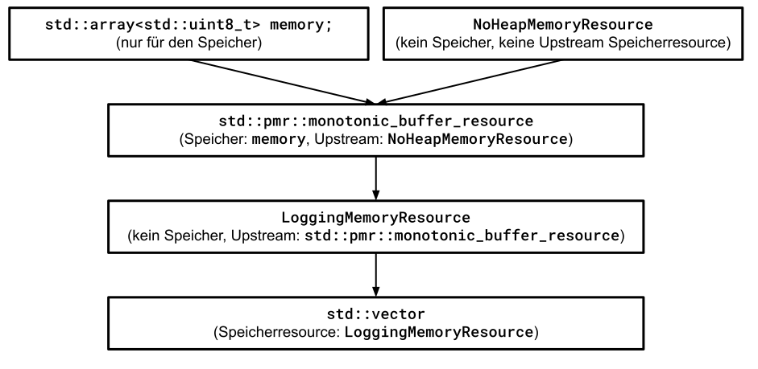

# Implementierung einer benutzerdefinierten Speicherressource

---

[Zurück](Readme_Performance_Optimization_Advanced_PMR.md)

---

## Inhalt
  
  * [Allgemeines](#link1)
  * [Erstes Beispiel: Verkettung von Speicherressourcen](#link2)
  * [Zweites Beispiel: Implementierung eines Arena-basierten Speichermanagers](#link3)
  * [Drittes Beispiel: Verkettung von Speicherressourcen](#link4)

---

#### Quellcode

[*PMR_06.cpp*](PMR_06.cpp)<br />

---

### Allgemeines <a name="link1"></a>

Die Implementierung einer benutzerdefinierten Speicherressource kann recht einfach sein. Wir müssen öffentlich von der Klasse `std::pmr::memory_resource` erben
und anschließend drei rein virtuelle Funktionen implementieren, die wiederum von der Basisklasse aufgerufen werden.

## Erstes Beispiel: Verkettung von Speicherressourcen <a name="link2"></a>

Wir demonstrieren das Implementieren einer benutzerdefinierten Speicherressource an einem einfachen Beispiel.
Zu diesem Zweck schreiben wir eine Speicherressource zum Loggen aller eingehenden Anforderungen.
Die eigentliche Reservierung und Freigabe des Speichers wird an eine reale Speicherressource delegiert,
die zu diesem Zweck bei der Konstruktion an die Logging-Speicherressource übergeben werden muss.

So gesehen haben wir in diesem ersten Beispiel nicht wirklich eine Speicherressource realisiert,
da ja die tatsächlichen Allokations- und Deallokationsanforderungen an eine vorhandene Speicherresource weitergeleitet werden.

> Datei PMR_Allocator_12.cpp


```cpp
01: class LoggingResource : public std::pmr::memory_resource
02: {
03: private:
04:     std::pmr::memory_resource* m_res;
05: 
06: public:
07:     LoggingResource()
08:         : m_res{ std::pmr::null_memory_resource() }
09:     {}
10: 
11:     LoggingResource(std::pmr::memory_resource* res) 
12:         : m_res{ res }
13:     {}
14: 
15: private:
16:     void* do_allocate(std::size_t bytes, std::size_t alignment) override {
17:         auto* ptr{ m_res->allocate(bytes, alignment) };
18:         std::println("[do_allocate]   {:6} bytes (alignment {}) at   {:#X}", bytes, alignment, reinterpret_cast<intptr_t>(ptr));
19:         return ptr;
20:     }
21: 
22:     void do_deallocate(void* ptr, std::size_t bytes, std::size_t alignment) override {
23:         std::println("[do_deallocate] {:6} bytes (alignment {}) from {:#X}", bytes, alignment, reinterpret_cast<intptr_t>(ptr));
24:         m_res->deallocate(ptr, bytes, alignment);
25:     }
26: 
27:     bool do_is_equal(const std::pmr::memory_resource& other) const noexcept override {
28:         std::println("[do_is_equal]");
29:         return this == &other;
30:     }
31: };
```


*Anwendungsbeispiel*:

```cpp
01: void test()
02: {
03:     constexpr std::size_t NumBytes = 128;
04: 
05:     std::array<std::uint8_t, NumBytes> memory{};
06: 
07:     std::pmr::monotonic_buffer_resource resource{
08:         memory.data(), memory.size(), std::pmr::null_memory_resource()
09:     };
10: 
11:     LoggingResource loggingResource{ &resource };
12: 
13:     std::pmr::vector<std::uint32_t> numbers{ &loggingResource };
14: 
15:     for (std::uint32_t n{}; n != 5; ++n)
16:     {
17:         std::uint32_t value{ 2 * (n + 1) };
18:         std::println("before push_back {}", value);
19:         numbers.push_back(value);
20:     }
21: 
22:     numbers.clear();
23: }
```

An diesem Beispiel kann man sehr schön die Verkettung der einzelnen Speicherressourcen erkennen:

`LoggingResource` &Rightarrow; `std::pmr::monotonic_buffer_resource` &Rightarrow; `std::pmr::null_memory_resource` &Rightarrow; `std::pmr::memory_resource`


*Ausgabe*:

```
[do_allocate]       16 bytes (alignment 8) at   0X18A0CFF2F0   // Reservierung von 16 Bytes (interne Zwecke des std::pmr::vector<> Containers) 
before push_back 2
[do_allocate]        4 bytes (alignment 4) at   0X18A0CFF300   // Reservierung von 4 Bytes (eine <std::uint8_t Variable)
before push_back 4
[do_allocate]        8 bytes (alignment 4) at   0X18A0CFF304   // Reservierung von 8 Bytes (zwei <std::uint8_t Variablen)
[do_deallocate]      4 bytes (alignment 4) from 0X18A0CFF300   // Freigabe reservierten Speichers (eine <std::uint8_t Variable)
before push_back 6
[do_allocate]       12 bytes (alignment 4) at   0X18A0CFF30C   // Reservierung von 12 Bytes (drei <std::uint8_t Variablen)
[do_deallocate]      8 bytes (alignment 4) from 0X18A0CFF304   // Freigabe reservierten Speichers (zwei <std::uint8_t Variablen)
before push_back 8
[do_allocate]       16 bytes (alignment 4) at   0X18A0CFF318   // Reservierung von 16 Bytes (vier <std::uint8_t Variablen)
[do_deallocate]     12 bytes (alignment 4) from 0X18A0CFF30C   // Freigabe reservierten Speichers (drei <std::uint8_t Variablen)
before push_back 10
[do_allocate]       24 bytes (alignment 4) at   0X18A0CFF328   // Reservierung von 24 Bytes (sechs <std::uint8_t Variablen)
[do_deallocate]     16 bytes (alignment 4) from 0X18A0CFF318   // Freigabe reservierten Speichers (vier <std::uint8_t Variablen)
[do_deallocate]     24 bytes (alignment 4) from 0X18A0CFF328   // Freigabe reservierten Speichers (sechs <std::uint8_t Variablen)
[do_deallocate]     16 bytes (alignment 8) from 0X18A0CFF2F0   // Freigabe von 16 Bytes (interne Zwecke des std::pmr::vector<> Containers)
```

Die Ausgaben wurden von mir durch Kommentare ergänzt.
Daran kann man gut erkennen, dass das `std::pmr::vector<std::uint32_t>`-Objekt
bei nicht vorhandener Anfangsreservierung permanent Speicher allokieren und deallokieren muss.

Würden wir das Testprogramm um die Anweisung

```
numbers.reserve(5);
```

ergänzen, würden wir weniger Ausgaben erhalten:

```
[do_allocate]       16 bytes (alignment 8) at   0XDD86FF430   // Reservierung von 16 Bytes für interne Zwecke des std::pmr::vector<std::uint32_t> Containers 
[do_allocate]       20 bytes (alignment 4) at   0XDD86FF440   // Reservierung von 20 Bytes für fünf <std::uint8_t Variablen
before push_back 2
before push_back 4
before push_back 6
before push_back 8
before push_back 10
[do_deallocate]     20 bytes (alignment 4) from 0XDD86FF440   // Freigabe reservierten Speichers für fünf <std::uint8_t Variablen
[do_deallocate]     16 bytes (alignment 8) from 0XDD86FF430   // Freigabe von 16 Bytes (interne Zwecke des std::pmr::vector<std::uint32_t> Containers)
```

Man sieht, dass das Vorab-Reservieren von Speicher erhebliche Einsparungen an unnützen Zwischenallokationen zur Folge hat.

## Zweites Beispiel: Implementierung eines Arena-basierten Speichermanagers <a name="link3"></a>

> Datei PMR_Allocator_17.cpp

Das erste Beispiel ist der Realisierung einer benutzerdefinierten Speicherressource noch aus dem Weg gegangen.
Es hatte sich mehr um eine benutzerdefinierte Speicherressource
im Sinne einer &bdquo;Intervening Memory Resource&rdquo; oder auch &bdquo;Intercepting Memory Resource&rdquo; gehandelt,
die sich der Vor- und auch Nachbearbeitung von Anforderungen (&bdquo;Request&rdquo;) an die eigentliche Speicherressource widmet.

In dem nun folgenden Beispiel betrachten wir eine echte Realisierung einer benutzerdefinierten Speicherressource,
einen so genannten Arena-basierten Speichermanager (auch *Arena Allocator*, *Region-based Allocator* oder *Linear Allocator* genannt).

Diese Art von Speichermanagern verfolgen eine Strategie zur Speicherverwaltung,
bei der ein großer zusammenhängender Speicherblock (die &bdquo;Arena&rdquo;) im Voraus reserviert wird. 
Anstatt für jedes kleine Objekt einzeln den vergleichsweise langsamen System-Heap (via `malloc` oder `new`) anzufragen,
schneidet der Arena-Manager einfach kleine Stücke aus diesem großen Block heraus. 

<b>Funktionsweise</b>:<br />
  * Reservierung:<br />Zu Beginn wird ein großer Speicherbereich allokiert (z. B. auf dem Heap oder auch im globalen Datensegment).
  * Zuweisung:<br />Ein interner Zeiger (so genannter *Bump Pointer*) markiert das Ende des aktuell genutzten Bereichs. Jede neue Anfrage verschiebt diesen Zeiger einfach um die benötigte Größe nach vorne. Dies ist extrem schnell.
  * Freigabe:<br />Einzelne Objekte können in der Regel nicht separat freigegeben werden. Stattdessen wird der gesamte Arena-Block am Ende einer Lebensdauer in einem einzigen Schritt geleert oder freigegeben. 


Typische Einsatzgebiete für solche Speichermanager sind Situationen, in denen eine bestimmte Menge von Objekten
für eine kurze Zeitdauer relevant sind, diese nach der Bearbeitung aber alle wieder freigegeben werden können,
z. B. ein Frame in einem Videospiel oder ein Request in einem Webserver.

*Realisierung*:

```cpp
01: class FixedArenaResource : public std::pmr::memory_resource
02: {
03: private:
04:     std::uint8_t* m_begin;
05:     std::uint8_t* m_current;
06:     std::uint8_t* m_end;
07: 
08: public:
09:     FixedArenaResource(void* buffer, std::size_t size) noexcept :
10:         m_begin{ static_cast<std::uint8_t*>(buffer) },
11:         m_current{ m_begin },
12:         m_end{ m_begin + size }
13:     {
14:     }
15: 
16:     void reset() noexcept
17:     {
18:         m_current = m_begin;
19:     }
20: 
21:     std::size_t used() const noexcept
22:     {
23:         return static_cast<std::size_t>(m_current - m_begin);
24:     }
25: 
26:     std::size_t capacity() const noexcept
27:     {
28:         return static_cast<std::size_t>(m_end - m_begin);
29:     }
30: 
31: protected:
32:     void* do_allocate(std::size_t bytes, std::size_t alignment) override
33:     {
34:         std::uint8_t* aligned{ alignAddress(m_current, alignment) };
35: 
36:         if (aligned + bytes > m_end) {
37:             throw std::bad_alloc();  // no upstream resource
38:         }
39: 
40:         m_current = aligned + bytes;
41:         return aligned;
42:     }
43: 
44:     void do_deallocate(void*, std::size_t, std::size_t) override
45:     {
46:         // Arena based behaviour - no deallocation
47:     }
48: 
49:     bool do_is_equal(const std::pmr::memory_resource& other) const noexcept override
50:     {
51:         return this == &other;
52:     }
53: 
54: private:
55:     static std::uint8_t* alignAddress(std::uint8_t* ptr, std::size_t alignment)
56:     {
57:         auto addr{ reinterpret_cast<std::uintptr_t>(ptr) };
58:         auto aligned{ (addr + alignment - 1) & ~(alignment - 1) };
59:         return reinterpret_cast<std::uint8_t*>(aligned);
60:     }
61: };
```

In dieser Implementierung ist eine einzige Methode erwähnenswert, da sie mit sehr rudimentären Mitteln
versucht, hochperformant ihr Ergebnis zu berechnen: Die Hilfsmethode `alignAddress`.

Deshalb folgen einige Ergänzungen zu ihrer Realisierung:
Diese Funktion nutzt eine bitweise Rechenoperation, um einen Zeiger auf das nächste Vielfache einer bestimmten Alignment-Größe
(z. B. 4, 8 oder 16 Bytes) aufzurunden.

  * `addr + alignment - 1`:<br />Dies &bdquo;schiebt&rdquo; die Adresse so weit nach vorne, dass sie &ndash; sofern sie nicht schon perfekt ausgerichtet ist &ndash; den Bereich des nächsten Vielfachen erreicht.
  * `~(alignment - 1)`:<br />Dies erstellt eine Bitmaske. Bei einem Alignment von 8 (binär 1000) ist `alignment - 1` gleich 7 (`0111`). Das Komplement `~` invertiert dies zu `...11111000`.
  * `&` (Bitweises AND):<br />Die Maske löscht die untersten Bits der Adresse. Da diese Bits die &bdquo;Reste&rdquo; unterhalb des Alignments darstellen, wird die Adresse effektiv auf das nächste Vielfache abgerundet. 

Wichtige Voraussetzung: Dieser Trick funktioniert nur, wenn `alignment` eine Zweierpotenz (2, 4, 8, 16...) ist.

Es gibt aber auch eine &bdquo;einfachere&rdquo; mathematische Version:

Wer diese Bitmaskenlogik zu schwer lesbar findet, kann den Modulo-Operator verwenden.
Das ist zwar minimal langsamer, aber oft verständlicher: 

```cpp
static std::uint8_t* alignAddress(std::uint8_t* ptr, std::size_t alignment)
{
    auto addr{ reinterpret_cast<std::uintptr_t>(ptr) };
    auto remainder{ addr % alignment };
    if (remainder != 0) {
        addr += (alignment - remainder);
    }
    return reinterpret_cast<std::uint8_t*>(addr);
}
```

*Testbeispiel*:

```cpp
01: void benchmark_std()
02: {
03:     for (std::size_t n{}; n != Iterations; ++n)
04:     {
05:         std::vector<std::string> vec;
06: 
07:         vec.reserve(VectorCapacity);
08: 
09:         for (std::size_t i{}; i != VectorCapacity; ++i)
10:         {
11:             std::size_t len{ random_length() };
12: 
13:             std::string s{};
14:             s.reserve(len);
15: 
16:             for (std::size_t j{}; j != len; ++j) {
17:                 s.push_back('a');
18:             }
19: 
20:             vec.push_back(std::move(s));
21:         }
22: 
23:         vec.clear();
24:     }
25: }
26: 
27: 
28: static std::array<std::uint8_t, 18 * 1024 * 1024> backing{};
29: 
30: void benchmark_pmr()
31: {
32:     FixedArenaResource pool{ backing.data(), backing.size() };
33: 
34:     for (std::size_t n{}; n != Iterations; ++n)
35:     {
36:         pool.reset();
37: 
38:         std::pmr::vector<std::pmr::string> vec{ &pool };
39: 
40:         vec.reserve(VectorCapacity);
41: 
42:         for (std::size_t i{}; i != VectorCapacity; ++i)
43:         {
44:             std::size_t len{ random_length() };
45: 
46:             std::pmr::string& s = vec.emplace_back();
47: 
48:             s.reserve(len);
49: 
50:             for (std::size_t j{}; j != len; ++j) {
51:                 s.push_back('a');
52:             } 
53:         }
54: 
55:         vec.clear();
56:     }
57: }
```

*Ausgabe*:

```
Elapsed time: 915 milliseconds.  // Classic
Elapsed time: 630 milliseconds.  // PMR
```

## Drittes Beispiel: Verkettung von Speicherressourcen <a name="link4"></a>

In diesem dritten Beispiel geht es noch einmal um die Verschachtelung (oder Verkettung) von Speicherressourcen.
Es sind zwei Zielsetzungen erwünscht:

  * Der Speicher soll aus einem Fixed-Size Memory Block entnommen werden.
  * Ist kein Speicher mehr vorhanden, soll dies durch eine Exception erkennbar werden.

Die nächste Abbildung skizziert, wie zwei Speicherressourcen `LoggingMemoryResource` und `NoHeapMemoryResource` zu verschalten sind:



*Abbildung* 1: Speicherzuweisung mit einem polymorphen Allokator.

Der Quellcode der zwei Speicherressourcen ist vergleichsweise einfach:

```cpp
01: class LoggingMemoryResource : public std::pmr::memory_resource
02: {
03: private:
04:     std::pmr::memory_resource* m_upstream;
05: 
06: public:
07:     LoggingMemoryResource(std::pmr::memory_resource* upstream)
08:         : m_upstream{ upstream }
09:     {
10:     }
11: 
12: protected:
13:     void* do_allocate(std::size_t bytes, std::size_t alignment) override {
14:         void* ptr{ m_upstream->allocate(bytes, alignment) };
15:         std::println("[do_allocate]   {:6} bytes (alignment {}) at   {:#X}", bytes, alignment, reinterpret_cast<intptr_t>(ptr));
16:         return ptr;
17:     }
18: 
19:     void do_deallocate(void* ptr, std::size_t bytes, std::size_t alignment) override {
20:         std::println("[do_deallocate] {:6} bytes (alignment {}) from {:#X}", bytes, alignment, reinterpret_cast<intptr_t>(ptr));
21:         m_upstream->deallocate(ptr, bytes, alignment);
22:     }
23: 
24:     bool do_is_equal(const std::pmr::memory_resource& other) const noexcept override {
25:         std::println("[do_is_equal]");
26:         return this == &other;
27:     }
28: };
```

und 

```cpp
01: class NoHeapMemoryResource : public std::pmr::memory_resource
02: {
03: protected:
04:     void* do_allocate(std::size_t bytes, std::size_t alignment) override {
05:         std::println("[NoHeapMemory] do_allocate => {:6} bytes (alignment {})", bytes, alignment);
06:         throw std::bad_alloc();  // forbid heap fallback
07:     }
08: 
09:     void do_deallocate(void* ptr, std::size_t, std::size_t) override {}
10: 
11:     bool do_is_equal(const std::pmr::memory_resource& other) const noexcept override {
12:         return this == &other;
13:     }
14: };
```

Nun müssen wir uns nur an *Abbildung* 1 halten und die beteiligten Objekte entsprechend miteinander verschalten:

```cpp
01: void test()
02: {
03:     // bottom layer: forbidding dynamic memory
04:     NoHeapMemoryResource NoHeapMemoryResource{};
05: 
06:     // middle layer: create monotonic allocator using only the low-level memory buffer
07:     std::pmr::monotonic_buffer_resource monotonic {
08:         g_memory.data(),
09:         g_memory.size(),
10:         & NoHeapMemoryResource  // upstream resource: preventing any heap access
11:     };
12: 
13:     // top layer: logging every allocation request
14:     LoggingMemoryResource logging{ &monotonic };
15: 
16:     // STL container using the logging layer
17:     std::pmr::vector<std::size_t> vec{ &logging };
18: 
19:     for (std::size_t i{}; i != 10; ++i) {
20:         vec.push_back(i);
21:     }
22: }
```

Ausgabe:

```
Start
[do_allocate]       16 bytes (alignment 8) at   0X7FF67C0E1740
[do_allocate]        8 bytes (alignment 8) at   0X7FF67C0E1750
[do_allocate]       16 bytes (alignment 8) at   0X7FF67C0E1758
[do_deallocate]      8 bytes (alignment 8) from 0X7FF67C0E1750
[do_allocate]       24 bytes (alignment 8) at   0X7FF67C0E1768
[do_deallocate]     16 bytes (alignment 8) from 0X7FF67C0E1758
[do_allocate]       32 bytes (alignment 8) at   0X7FF67C0E1780
[do_deallocate]     24 bytes (alignment 8) from 0X7FF67C0E1768
[do_allocate]       48 bytes (alignment 8) at   0X7FF67C0E17A0
[do_deallocate]     32 bytes (alignment 8) from 0X7FF67C0E1780
[do_allocate]       72 bytes (alignment 8) at   0X7FF67C0E17D0
[do_deallocate]     48 bytes (alignment 8) from 0X7FF67C0E17A0
[do_allocate]      104 bytes (alignment 8) at   0X7FF67C0E1818
[do_deallocate]     72 bytes (alignment 8) from 0X7FF67C0E17D0
[do_deallocate]    104 bytes (alignment 8) from 0X7FF67C0E1818
[do_deallocate]     16 bytes (alignment 8) from 0X7FF67C0E1740
Done.
```

---

[Zurück](Readme_Performance_Optimization_Advanced_PMR.md)

---
