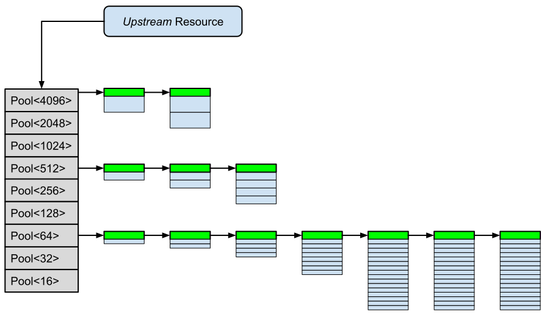

# Pool-Allokatoren: Klasse `std::pmr::unsynchronized_pool_resource`

---

[Zurück](Readme_Performance_Optimization_Advanced_PMR.md)

---

## Inhalt
  
  * [Allgemeines](#link1)
  * [Kernkonzepte und Funktionsweise](#link2)
  * [Struktur `std::pmr::pool_options`](#link3)
  * [Erstes Beispiel](#link4)
  * [Wieder eine Stolperfalle](#link5)
  * [Zweites Beispiel: Histogramme](#link6)

---

#### Quellcode

[*PMR_09.cpp*](PMR_09.cpp)<br />

---

### Allgemeines <a name="link1"></a>

Die Klasse `std::pmr::unsynchronized_pool_resource` steht für Speicherressourcen,
die eine effiziente Verwaltung von Speicher durch Pool-Allokationen vornehmen.

Sie ist Teil des &bdquo;*Polymorphic Memory Resources*&rdquo;-APIs (PMR) und ist eine optimierte Implementierung für Speicher-Allokatoren,
bei denen viele Objekte ähnlicher Größe angefordert werden.

## Kernkonzepte und Funktionsweise <a name="link2"></a>

  * Pool-Struktur:<br />`std::pmr::unsynchronized_pool_resource`-Objekte verwalten eine Sammlung von Pools,
wobei jeder Pool für eine bestimmte Blockgröße zuständig ist.

  * &bdquo;*Chunk*&rdquo;-Management:<br />Ist ein Pool erschöpft ist, fordert er einen neuen, größeren Speicherblock (so genannter *Chunk*) von einem *Upstream*-Allocator (z. B. dem Heap) an
und teilt diesen in neue Blöcke auf.

  * Geometrisches Wachstum:<br />Die Größe der angeforderten Chunks wächst in der Regel geometrisch an, um die Anzahl der laufzeitintensiven Systemaufrufe
zum *Upstream*-Allokator zu minimieren.

  * Zuständigkeit:<br />Allokationen, die die maximale Pool-Blockgröße überschreiten, werden direkt an den *Upstream*-Allocator weitergereicht.
Auf diese Weise kann nicht der Fall eintreten, dass bestimmte Anforderungen abgewiesen werden.

In *Abbildung* 1 werden die zentralen Aspekte in der Architektur einer Pool-Speicherresource dargestellt:



*Abbildung* 1: Architektur einer Pool-Speicherresource.

*Bemerkung*:<br />
Im Original ist die Darstellung aus *Abbildung* 1 [hier](https://www.open-std.org/jtc1/sc22/wg21/docs/papers/2014/n4023.html#fig:memory.resource.pool.resources) vorzufinden.


Beachten Sie einige der Details, die in *Abbildung* 1 zum Ausdruck kommen sollen:

  * Die Blöcke des Pools &bdquo;4096&rdquo; sind größer als beispielsweise die aus dem &bdquo;64&rdquo;-Pool.
Dies soll in der Abbildung durch größere Kästchen beim  &bdquo;4096&rdquo;-Pool erkennbar sein.

  * Jeder Chunk besitzt Verwaltungsinformationen, diese sind jeweils durch ein grünes Kästchen dargestellt.

  * Wenn dieser Pool Blöcke mit maximal 4096 Bytes verwalten können soll, kann dies in der  `std::pmr::pool_options`-Struktur durch
den `largest_required_pool_block`-Eintrag festgelegt werden.

  * Der Wert **16** für Blöcke mit der kleinsten Größe ist nicht von außen einstellbar.

  * Die maximale Anzahl von Blöcken in einem Chunk ist einstellbar (Wert `max_blocks_per_chunk`), aus diesem Grund
stagniert in der Abbildung die Anzahl der Blöcke im &bdquo;64&rdquo;-Pool.


## Struktur `std::pmr::pool_options` <a name="link3"></a>


`std::pmr::unsynchronized_pool_resource`-Objekte verwalten intern mehrere Pools mit einer einheitlichen Blockgröße.
Jede Allokations-Anforderung wird an den Pool mit der kleinsten Blockgröße weitergeleitet, die sie erfüllen kann.

Es gibt eine Datenstruktur `std::pmr::pool_options`, mit der man geringfügig auf einige Parameter
in der Pool-Administration Einfluss nehmen kann. Diese konfigurierbaren Parameter sind

  * `max_blocks_per_chunk`: Maximale Anzahl von Blöcken in einem so genannten *Chunk*.
  * `largest_required_pool_block`: Maximale Größe eines Blocks, die vom Allokator bedient werden kann (*nicht*: Anzahl der unterschiedlichen Blockgrößen).

*Beispiel*:

```cpp
std::pmr::pool_options options{
    .max_blocks_per_chunk = 64,
    .largest_required_pool_block = 128 
};

std::pmr::unsynchronized_pool_resource pool{ options };
std::pmr::pool_options actual{ pool.options() };
```

Das bedeutet:

  * Allokations-Anforderungen &leq; 128 Byte werden auf einen Block in einem der Speicherpools abgebildet.
  * Allokations-Anforderungen &gt; 128 Byte werden direkt an die *Upstream*-Speicherresource weitergeleitet.

*Bemerkung*:<br />
Man kann in einem Pool die maximale Größe eines Blocks festlegen (Parameter `largest_required_pool_block`), aber nicht die minimale Größe.
Man kann also *nicht* jede einzelne Blockgröße explizit definieren (z. B. durch eine Liste mit Werten wie 16, 32, 64, etc.).

Auch sind die Werte, die in einer `std::pmr::pool_options`-Struktur an den Pool übergeben werden, lediglich Wünsche.
Die jeweilige Implementierung (z. B. GCC, Clang oder MSVC) kann diese Werte aufrunden oder Standardwerte einsetzen.
Man kann aber die tatsächlich genutzten Werte über die Methode `options` auslesen:


*Beispiel*:

```cpp
01: void test()
02: {
03:     std::pmr::pool_options options{
04:         .max_blocks_per_chunk = 64,
05:         .largest_required_pool_block = 128 
06:     };
07: 
08:     std::pmr::unsynchronized_pool_resource pool{ options };
09: 
10:     std::pmr::pool_options actual{ pool.options() };
11: 
12:     std::println("largest_required_pool_block: {}", actual.largest_required_pool_block);
13:     std::println("max_blocks_per_chunk: {}", actual.max_blocks_per_chunk);
14: }
```

*Ausgabe*:

```
largest_required_pool_block: 128
max_blocks_per_chunk: 64
```

## Erstes Beispiel <a name="link4"></a>

Wir vergleichen zwei geschachtelte `std::vector`-Objekte:

```cpp
std::vector<std::vector<std::size_t>> container;
```

versus

```cpp
std::pmr::unsynchronized_pool_resource pool;
std::pmr::vector<std::pmr::vector<std::size_t>> container(&pool);
```


Die beiden Vergleichsmethoden sehen so aus:

```cpp
01: #ifdef _DEBUG
02: static constexpr int OuterIterations = 2'000;
03: static constexpr int InnerIterations = 200;
04: static constexpr int NumPushBacks = 20; 
05: #else
06: static constexpr int OuterIterations = 20000;
07: static constexpr int InnerIterations = 200;
08: static constexpr int NumPushBacks = 20;
09: #endif
10: 
11: void test()
12: {
13:     std::println("Using std::vector<std::vector<std::size_t>>");
14: 
15:     for (std::size_t i{}; i != OuterIterations; ++i)
16:     {
17:         std::vector<std::vector<std::size_t>> container;
18: 
19:         for (std::size_t j{}; j != InnerIterations; ++j)
20:         {
21:             std::vector<std::size_t> v;
22: 
23:             for (std::size_t k{}; k != NumPushBacks; ++k) {
24:                 v.push_back(k);
25:             }
26: 
27:             container.push_back(std::move(v));
28:         }
29:     }
30: }
31: 
32: void test_pmr()
33: {
34:     std::println("Using std::pmr::vector<std::pmr::vector<std::size_t>>");
35: 
36:     std::pmr::unsynchronized_pool_resource pool;
37: 
38:     for (std::size_t i{}; i != OuterIterations; ++i)
39:     {
40:         {
41:             std::pmr::vector<std::pmr::vector<std::size_t>> container(&pool);
42: 
43:             for (std::size_t j{}; j != InnerIterations; ++j)
44:             {
45:                 std::pmr::vector<std::size_t> v(&pool);
46: 
47:                 for (std::size_t k{}; k != NumPushBacks; ++k) {
48:                     v.push_back(k);
49:                 }
50: 
51:                 container.push_back(std::move(v));
52:             }
53:         }
54: 
55:         pool.release(); // reuse memory for next iteration
56:     }
57: }
```

Ausführung:

```
Using std::vector<std::vector<std::size_t>>
Elapsed time: 1233 milliseconds.
Using std::pmr::vector<std::pmr::vector<std::size_t>>
Elapsed time: 687 milliseconds.
```

## Wieder eine Stolperfalle <a name="link5"></a>

Wenn wir STL-Containerklassen mit PMR Speicherresourcen ausstatten, müssen wir bei der &bdquo;Freigabe&rdquo; des reservierten Speicher vorsichtig sein.
Wie ist diese Aussage zu verstehen? Betrachten wir dazu das folgende Code-Fragment:

```cpp
01: void test()
02: {
03:     std::pmr::unsynchronized_pool_resource pool;
04:     std::pmr::vector<std::size_t> container(&pool);
05: 
06:     for (std::size_t k{}; k != 10; ++k)
07:     {
08:         container.push_back(k);
09:     }
10: 
11:     pool.release();
12: }
```

Die `test`-Funktion sieht unauffällig aus, nur: Sie stürzt ab!

Warum?

Jetzt müssen wir uns dem Begriff &bdquo;Freigabe&rdquo; genauer zuwenden:

Wir müssen die `test`-Funktion genauer betrachten: In Zeile 11 geben wir den Speicher in der `pool`-Speicherresource frei (Aufruf von `pool.release()`), 
das Vektorobjekt `container` ist aber noch gültig.

Gibt ein `std::pmr::vector` nicht auf den vom ihm belegten Speicher frei?

Doch, das tut er &ndash; und zwar am Ende der `test`-Funktion, also in der Nähe von Zeile 12.

Nur ist zu diesem Zeitpunkt der vom `std::pmr::vector`-Objekt gar nicht mehr vorhanden, da dieser mit `pool.release()` bereits freigegeben worden ist.
Was etwas unverfänglich klingt, bedeutet nichts anderes, als dass die `clear`-Methode des Vektors auf ungültige Adressen zugreift,
es kommt zum Absturz.

Wenn wir mit `release` Speicherresourcen freigeben wollen, müssen wir folgende Regel beachten:

> Rufe `memory_resource::release()` niemals auf, solange Objekte existieren, die diese Ressource verwenden.

  * Korrekte Reihenfolge:<br />
Objekte, die die Ressource verwenden, werden zerstört &Rightarrow; `resource.release()`

  * Falsche Reihenfolge (Absturz):<br />
`resource.release()` &Rightarrow; Objekt(e) wird/werden zerstört.

Wie ist nun eine Funktion wie die zuvor gezeigte `test`-Funktion zu korrigieren?
Zum Beispiel mit einem inneren Block:

```cpp
01: void test()
02: {
03:     std::pmr::unsynchronized_pool_resource pool;
04: 
05:     {
06:         std::pmr::vector<std::size_t> container(&pool);
07: 
08:         for (std::size_t k{}; k != 10; ++k)
09:         {
10:             container.push_back(k);
11:         }
12:     }
13: 
14:     pool.release(); // reuse memory for next job
15: }
```

Auch wenn die Zeilen 5 und 12 etwas merkwürdig aussehen: Durch den inneren Block wird ein Aufruf der `clear`-Methode am `container`-Objekt erzwungen,
bevor es zum `release`-Aufruf an der Speicherresource kommt. Die Funktion wird fehlerfrei ausgeführt.

---

## Zweites Beispiel: Histogramme <a name="link6"></a>

Wir wollen die Klasse `std::pmr::unsynchronized_pool_resource` auch in einem *Real-World*-Beispiel betrachten.
Zu diesem Zweck erstellen wir Histogramme. Darunter versteht man Tabellen, die die Häufigkeiten von Wörtern 
in einem Text zählen.

Wir stellen eine Klasse `Histogram` vor. Diese muss zunächst den Zugang zu einer Textdatei herstellen,
aus der sie die einzelnen Zeilen und dann anschließend in einem zweiten Schritt die einzelnen Wörter extrahiert.

Dann fügen wir die gefundenen Wörter in ein `std::unordered_map`-Objekt ein:

```cpp
std::unordered_map<std::string, std::size_t> m_frequenciesMap;
```

Die Schlüssel entsprechen den Wörtern aus dem Text, die jeweils dazugehörigen Werte den Häufigkeiten der Wörter.

Es ist offensichtlich, dass es hier viele Ansätze gibt, Container und `std::string`-Objekte der STL
auch in ihren polymorphen Pendants zu verwenden. Die Details überlasse ich Ihnen als Übung:


```cpp
01: namespace std
02: {
03:     template<>
04:     struct greater<std::pair<std::string, std::size_t>>
05:     {
06:         bool operator() (const std::pair<std::string, std::size_t>& lhs, const std::pair<std::string, std::size_t>& rhs) const {
07:             return lhs.second > rhs.second;
08:         }
09:     };
10: }
11: 
12: class Histogram
13: {
14: private:
15:     std::unordered_map<std::string, std::size_t> m_frequenciesMap;
16: 
17: public:
18:     void add(const std::string& word) {
19:         // if word does not exist, it is automatically inserted with value 0
20:         ++m_frequenciesMap[word];
21:     }
22: 
23:     void printTopScore(std::size_t top) const {
24: 
25:         std::vector<std::pair<std::string, std::size_t>> popular(m_frequenciesMap.begin(), m_frequenciesMap.end());
26: 
27:         std::partial_sort(popular.begin(), popular.begin() + top, popular.end(), std::greater{});
28: 
29:         for (std::size_t n{}; const auto& elem : popular) {
30:             std::println("{}: {}", elem.first, elem.second);
31: 
32:             ++n;
33:             if (n == top)
34:                 break;
35:         }
36:     }
37: 
38:     void readWords() {
39: 
40:         std::string m_fileName{ "LoremIpsumHuge.txt" };
41: 
42:         if (m_fileName.empty()) {
43:             std::println("No Filename specified!");
44:             return;
45:         }
46: 
47:         std::ifstream file{ m_fileName.data() };
48:         if (!file.good()) {
49:             std::println("File not found!");
50:             return;
51:         }
52: 
53:         std::println("File {}", m_fileName);
54:         std::println("Starting [Standard Classes] ...");
55: 
56:         std::string line;
57:         while (std::getline(file, line))
58:         {
59:             // process single line
60:             std::string_view sv{ line };
61: 
62:             std::size_t begin{};
63:             std::size_t end{};
64: 
65:             while (end != sv.size()) {
66: 
67:                 while (std::isalpha(sv[end]))
68:                     ++end;
69: 
70:                 std::string_view word{ sv.substr(begin, end - begin) };
71: 
72:                 std::string s{ word };
73:                 if (std::isupper(s[0])) {
74:                     s[0] = std::tolower(s[0]);
75:                 }
76: 
77:                 add(s);
78: 
79:                 while (end != sv.size() && (sv[end] == ' ' || sv[end] == '.' || sv[end] == ','))
80:                     ++end;
81: 
82:                 begin = end;
83:             }
84:         }
85: 
86:         std::println("Done Reading Dictionary");
87:     }
88: };
```

Ein Laufzeitvergleich sieht auf meinem Rechner so aus:


```
File LoremIpsumHuge.txt
Starting [Standard Classes] ...
Done Reading Dictionary
vulputateportapellentesque: 566
volutpatintegerfinibus: 559
Elapsed time: 320 milliseconds.

File LoremIpsumHuge.txt
Starting [PMR Classes] ...
Done Reading Dictionary
vulputateportapellentesque: 566
volutpatintegerfinibus: 559
Elapsed time: 251 milliseconds.
```

---

[Zurück](Readme_Performance_Optimization_Advanced_PMR.md)

---
