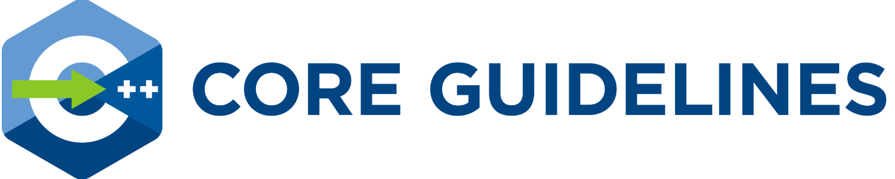
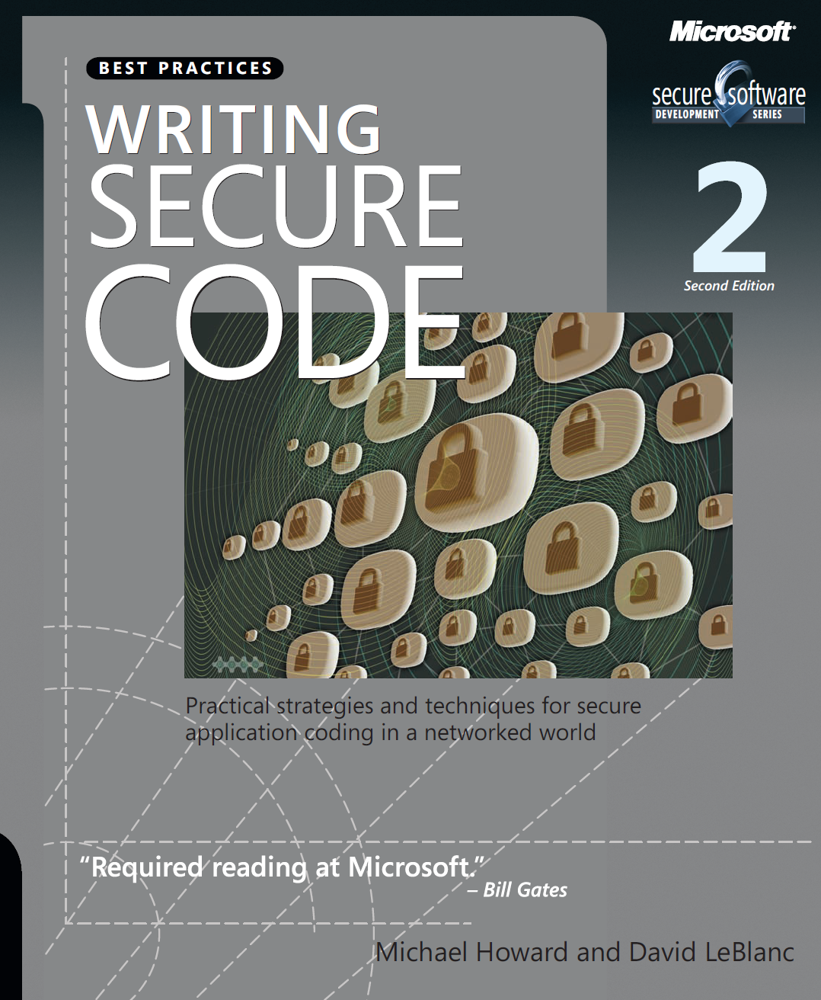

# Literatur

[Zurück](./Readme_Secure_Programming.md)

---

## *Websites* / *Coding Standards*

### *Common Weakness Enumeration (CWE)*

  * Die [*Common Weakness Enumeration (CWE)*](https://cwe.mitre.org/index.html) ist eine frei zugängliche Auflistung typischer Schwachstellen in Software und Hardware. Sie kategorisiert die Schwachstellen und dient als Basis und gemeinsame Plattform zur Identifizierung sicherheitsrelevanter Schwächen.

  * Wichtigstes Ziel der Common Weakness Enumeration ist es, durch Auflistung der Schwachstellen die typischen Fehler und Schwächen in Hard- und Software zu vermeiden, noch bevor die betroffenen Produkte in Umlauf kommen. Sicherheitsanalysten, Programmierer oder Entwickler können sich der Liste bedienen und sie für ihre Arbeit verwenden.

---

### *C++ Core Guidelines*

  * Diese Website stellt eine Reihe von Kernrichtlinien für modernes C++ zusammen.

  * Ziel ist es, C++-Programmierern zu helfen, einfacheren, effizienteren und wartungsfreundlicheren Code zu schreiben.

[*C++ Core Guidelines Introduction*](https://isocpp.github.io/CppCoreGuidelines/)

[*C++ Core Guidelines*](https://isocpp.github.io/CppCoreGuidelines/CppCoreGuidelines)

  * Einziger Wermutstropfen dieser exzellenten Website:
    Nicht alle Guidelines sind einfach zu Lesen, eine gewisse Erfahrung
    in der C++&ndash;Programmierung ist Vorraussetzung.

---

### *Software Engineering Institute (SEI)*

[*Software Engineering Institute (SEI) &ndash; External Wiki Home*](https://wiki.sei.cmu.edu/confluence/)

[*SEI CERT C Coding Standard*](https://wiki.sei.cmu.edu/confluence/display/c/SEI+CERT+C+Coding+Standard)

[*SEI CERT C++ Coding Standard*](https://wiki.sei.cmu.edu/confluence/pages/viewpage.action?pageId=88046682)

  * Der *SEI CERT C bzw. C++ Coding* Standard enthält Regeln für sicheres Programmieren in den Programmiersprache C und C++.

  * Ziel dieser Regeln und Empfehlungen ist die Entwicklung sicherer, zuverlässiger und geschützter Systeme, beispielsweise durch die Beseitigung undefinierter Verhaltensweisen, die zu undefiniertem Programmverhalten und ausnutzbaren Schwachstellen führen können.

  * Die Einhaltung der in diesem Standard definierten Programmierregeln ist notwendig (aber nicht ausreichend), um die Sicherheit und Zuverlässigkeit von in der Programmiersprache C entwickelten Softwaresystemen zu gewährleisten.

  * Notwendig ist beispielsweise auch ein sicheres Design.

  * Sicherheitskritische Systeme unterliegen in der Regel strengeren Anforderungen als dieser Programmierstandard, beispielsweise der Anforderung, dass der gesamte Speicher statisch zugewiesen werden muss.

  * Die Anwendung dieses Programmierstandards führt jedoch zu hochwertigen Systemen, die zuverlässig, robust und widerstandsfähig gegen Angriffe sind.

---

### *MISRA*

#### *MISRA C:2023 Third Edition, Second Revision*

  * MISRA C:2023 Richtlinien für die Verwendung der Sprache C in kritischen Systemen.
  Aktualisiert im April 2023, ist diese dritte Ausgabe, zweite Revision die aktuelle Version von MISRA C.

    

#### *MISRA C++:2023*

  * MISRA C++:2023 Richtlinien für die Verwendung von C++:17 in kritischen Systemen. 
    Dies ist die neueste und aktuelle Ausgabe von MISRA C++, die im Oktober 2023 veröffentlicht wurde.
    Sie zielt speziell auf die Sprachversion 2017 (C++:17) gemäß ISO/IEC 14882:2017 ab.

    

---

## Bücher

  * SEI, Carnegie Mellon University &bdquo;*SEI CERT C Coding Standard*&rdquo;. 
    2016 Edition, 528 Seiten. Sprache: Englisch.

    

---

  * SEI, Carnegie Mellon University &bdquo;*SEI CERT C++ Coding Standard*&rdquo;. 
    2016 Edition, 429 Seiten. Sprache: Englisch.

    

---

  * Barr, Michael, &bdquo;*Embedded C Coding Standard Taschenbuch*&rdquo;.  
    Barr Group (The Embedded System Experts) (12. Juni 2018), 84 Seiten. Sprache: Englisch. ISBN-10: 1721127984, ISBN-13: 978-1721127986.

    

---

  * LeBlanc, David und Howard, Michael, &bdquo;*Writing Secure Code*&rdquo;.  
    Microsoft Press (1. Dezember 2001), 477 Seiten. Sprache: Englisch. ISBN-10: 0735615888, ISBN-13: 978-0735615885.

    

---

## *YouTube*

[NDC Conferences / Oslo / Secure Programming Practices in C++ - Patricia Aas](https://www.youtube.com/watch?v=gHGMDFm2MVs)

Begleitmaterial:

[(In)Secure C++ &ndash; Secure Coding Practices in C++](https://github.com/patricia-gallardo/insecure-coding-examples)

---

## *Verschiedenes*

[C++ Performance Optimization: Best Practices](https://hackernoon.com/c-performance-optimization-best-practices) von Ivan Chiklikchi. 
(abgerufen am 17.2.2025)

[Format String Exploitation-Tutorial](https://www.exploit-db.com/docs/english/28476-linux-format-string-exploitation.pdf) von Saif El-Sherei. 
(abgerufen am 17.2.2025)

[Secure Programming in C](https://ocw.mit.edu/courses/6-s096-effective-programming-in-c-and-c-january-iap-2014/df281b9bb8aa5c4377567454bb839676_MIT6_S096IAP14_Lecture3S.pdf) von Lef Ioannidis oder auch [hier](Secure_Programming_in_C_Lef_Ioannidis.pdf). 
(abgerufen am 22.2.2025)

---

[Zurück](./Readme_Secure_Programming.md)

---
