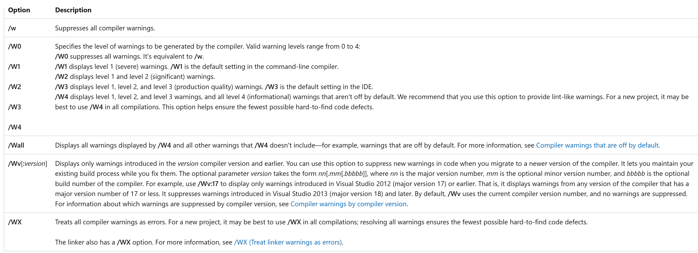

# Schutzmaßnahmen für *Secure Programming*

[Zurück](./Readme_Secure_Programming.md)

---

## Inhalt

#### Einige Schutzmaßnahmen

  * [Don't use C &ndash; use C++](#link)
  * [Verwende mehrere Compiler](#link)
  * [*Warnings* und *Errors*](#link)
  * [Warning Level](#link)
  * [Ein Tipp für Überlauf: `std::midpoint`](#link)
  * [Verwenden Sie STL-Algorithmen](#link)
  * [Achte auf sicheres *Downcasting*](#link)
  * [Verzichte auf die direkte Verwendung des `new`-Operators](#link)
  * [Deklariere Konstruktoren mit einem einzigen Argument mit `explicit`](#link)
  * [Elementare Datentypen haben keine Bedeutung (*Semantics*), nur Wertebereiche](#link)
  * [Benutzerdefinierte Literale: Elementare Datentypen &bdquo;mit Bedeutung&rdquo;](#link)
  * [Verwenden `std::string` Literale](#link)
  * [Der Datentyp `size_t`](#link)
  * [Virtuelle Methoden sollten genau eines der drei Schlüsselwörter `virtual`, `override` oder `final` verwenden.](#link)
  * [Setze standardmäßig Methoden auf `const`, soweit möglich](#link)
  * [Setze standardmäßig Memberfunktionen auf `const`, soweit möglich](#link)
  * [Verwende das Attribut `[[nodiscard]]`](#link)

---

#### Quellcode

[*SecureProgrammingAdvices.cpp*](SecureProgrammingAdvices.cpp)<br />

---

## Don't use C &ndash; use C++

*Beschreibung*:

[CPL.1: Prefer C++ to C](https://isocpp.github.io/CppCoreGuidelines/CppCoreGuidelines#cpl1-prefer-c-to-c)

Sollten Sie die Wahl haben: Verwenden Sie C++ und nicht C.

Warum: C++ bietet bessere Typprüfungsmöglichkeiten und attraktivere Möglichkeiten in der Formulierung von Quellcode.
Es bietet bessere Unterstützung für die Programmierung auf höherer Ebene
und generiert häufig schnelleren Code.

Diese Aussage findet sich auch in den [C++ Core Guidelines](https://isocpp.github.io/CppCoreGuidelines/CppCoreGuidelines)
wieder: *Prefer C++ to C* (*CPL.1*).

Zur Illustration vergleiche man das Konkatenieren zweier Zeichenketten:
Einmal in C++ geschrieben und ein zweites Mal in C:

*Beispiel*: C++

```c
01: std::string first{ "Hello " };
02: std::string second{ "World" };
03: std::string result{ first + second };
04: std::println("{}", result);
```

*Beispiel*: C

```cpp
01: char first[] = "Hello ";
02: char second[] = "World";
03: char result[20];
04: 
05: strcpy_s(result, 20, first);
06: strcat_s(result, 20, second);
07: std::printf("%s\n", result);
```

---

## Verwende mehrere Compiler

Alle C/++ Compiler übersetzen lt. Definition C/C++&ndash;Quellcode in Maschinencode.
Dennoch bedeutet das noch lange nicht, dass es hier keine Unterschiede gibt.

Je komplexeren Quellcode Sie schreiben, umso mehr kann es sein, dass ein Compiler ein Programm ohne Warnungen und Fehlermeldungen
akzeptiert und übersetzt, ein anderer Compiler hingegen mit Warnungen oder im Extremfall sogar mit Fehlermeldungen reagiert.

Es empfiehlt sich daher, eine Code-Basis mit mehreren Compiler übersetzungsfähig zu halten.
Dies minimiert mögliche Nischenprobleme des einen oder anderen Übersetzers.
 
---

## *Warnings* und *Errors*

Vermutlich durften Sie diesen Hinweis schon oft über sich ergehen lassen:
Vermeiden Sie &ndash; so gut es geht &ndash; jegliche Warnungen, die ihr Übersetzer in ihrem Projekt erzeugt.
In den allermeisten Fällen ist eine Warnung ein Hinweis, dass mit Ihrem Quellcode an dieser Stelle etwas nicht in Ordnung ist.
Nehmen Sie Warnungen nicht auf die leichte Schulter:

Eine Kostprobe:

```
Warning C4047 : '=': 'int' differs in levels of indirection from 'int *'
```

Dies wird zwar vom C/C++ Compiler als Warnung eingestuft, es handelt sich hierbei aber um einen beinharten Fehler!

*Bemerkung*:<br />
Über *Errors* müssen wir nicht so viel reden: Bei Vorhandensein von Fehlern ist ein Programm überhaupt nicht übersetzungsfähig!

---

## Warning Level

Der *Warning Level* gibt an, welche Compilerwarnungen angezeigt werden sollen und welches Warnverhalten während der gesamten Kompilierung gelten soll.

Je höher Sie den *Warning Level* einstellen, desto mehr Warnungen werden angezeigt:



*Abbildung* 1: Unterschiedliche *Warning Level* des Visual C++ Compilers.

Sicherlich machen Sie die Beobachtung, dass bei vergleichsweise großem Warning Level sehr viele bisweilen pedantische Warnungen erzeugt werden.
Hier muss man sich für eine Gratwanderung entscheiden: Ein zu kleiner Warning Level ist schlecht für die Qualität des Programms,
ein zu großer Warning Level kann zu viele Warnungen erzeugen, die nicht unbedingt hilfreich sind.

---

## Ein Tipp für Überlauf: `std::midpoint`

Die Funktion `std::midpoint()` berechnet den Mittelpunkt von zwei ganzen Zahlen
oder zwei Gleitkommazahlen:

*Beispiel*:

```cpp
01: void test() {
02: 
03:     std::uint32_t a = std::numeric_limits<std::uint32_t>::max();
04:     std::uint32_t b = std::numeric_limits<std::uint32_t>::max() - 2;
05: 
06:     std::println("a:                                 {}", a);
07:     std::println("b:                                 {}", b);
08:     std::println("Incorrect (overflow and wrapping): {}", (a + b) / 2);
09:     std::println("Correct:                           {}", std::midpoint(a, b));
10: }
```


*Ausgabe*:

```
a:                                 4294967295
b:                                 4294967293
Incorrect (overflow and wrapping): 2147483646
Correct:                           4294967294
```


---

## Verwenden Sie STL-Algorithmen

Algorithmen der STL sind robuster im Gebrauch als CRT-Bibliotheksfunktionen oder selbst geschriebene Funktionen.

*Beispiel*:

```cpp
01: std::string str{ "Hello World" }; // use also "Hello:World"
02: std::println("{}", str);
03: 
04: auto isColon = [] (int ch) { return ch == ':'; };
05: 
06: auto pos = std::find_if(str.begin(), str.end(), isColon);
07: 
08: // if found - delete everything afterwards
09: if (pos != str.end()) {
10:     str.erase(pos, str.end());
11: }
12: 
13: std::println("{}", str);
```


*Beispiel*:

```c
01: char str[] = "Hello World";    // use also "Hello:World"
02: std::printf("%s\n", str);
03: 
04: const char* pos = strstr(str, ":");
05: 
06: if (pos != NULL) {
07: 
08:     // if found - poke '\0' into string - this deletes everything afterwards
09:     size_t ofs = pos - str;
10:     str[ofs] = '\0';
11: }
12: 
13: std::printf("%s\n", str);
```

*Hinweis*:
Vermeiden Sie generell *manuelle* Wiederholungsschleifen!

Verwenden Sie Algorithmen der STL und, wenn es eine Wiederholungsschleife sein muss, die so genannten C++ *Range-based Loop*:
Beide kommen ohne Schleifen-Indizes aus, die eine häufige Ursache von Fehlerquellen sind.

---

## Achte auf sicheres *Downcasting*

An Stelle der unsicheren C-Cast Operatoren sollten man die sicheren C++-Cast Operatoren verwenden.

Ein Beispiel ist der Gebrauch von `static_cast`:

*Beispiel*:

```cpp
01: class Spiderman {};
02: class Ironman {};
03: 
04: void test() {
05: 
06:     Spiderman* ptr = new Spiderman;
07:     Ironman* ptr2 = nullptr;
08: 
09:     // compile error: 'static_cast': cannot convert from 'Spiderman *' to 'Ironman *'
10:     ptr2 = static_cast<Ironman*>(ptr);
11: }
```

*Beispiel*:

```c
01: class Spiderman {};
02: class Ironman {};
03: 
04: void test() {
05: 
06:     Spiderman* ptr = new Spiderman;
07:     Ironman* ptr2 = NULL;
08: 
09:     // compiles (!)
10:     ptr = (Spiderman*) ptr;
11: }
```

---

## Verzichte auf die direkte Verwendung des `new`-Operators

Siehe hierzu das entsprechende 
[C++ Core Guideline](https://isocpp.github.io/CppCoreGuidelines/CppCoreGuidelines)
mit dem Titel *Avoid calling new and delete explicitly* (*R.11*).


*Abbildung* 2: `std::unique_ptr`-Variablen haben Charme.


*Abbildung* 3: Stack-Variablen haben Charme.

Am Ende des Tages stellt sich bei einem mit `new` erzeugten Zeiger immer die Frage:
Wer hat wann und wo `delete` aufgerufen?

---

## Deklariere Konstruktoren mit einem einzigen Argument mit `explicit`

Standardmäßig sollten Konstruktoren mit einem Argument als  `explicit` deklariert werden.
Damit kann man unbeabsichtige Konvertierungen &ndash; und damit Überraschungen &ndash; vermeiden:

```cpp
01: class String {
02: public:
03:     String(size_t length) : m_length{ length } {};   // Surprise :)
04:     // ...
05: 
06: private:
07:     size_t m_length;
08:     // ...
09: };
10:     
11: void test() {
12: 
13:     String s = '!';  // Uhhh: String of length 33
14: }
```

Fügt man das Schlüsselwort vor dem Konstruktor hinzu, ist die `test`-Funktion nicht mehr übersetzungfähig:

```cpp
explicit String(size_t length) : m_length{ length } {}; 
```

---

## Elementare Datentypen haben keine Bedeutung (*Semantics*), nur Wertebereiche

Ein Datentyp wie `int` hat keine Bedeutung (*Semantik*).

Man kann nicht sagen, dass man das Alter eines Angestellten in einer `Employee`-Klasse mit
dem Typ `int` definieren sollte. `int`-Werte können sehr groß sein als auch negativ.
`size_t_`-Werte wiederum sind nicht negativ, aber können wieder extrem große Werte annehmen.

Es gibt die eine oder andere Möglichkeit, Werte mit einer Semantik zu verbinden:

  * Aufzählungstypen
  * `std::string` Literals
  * Benutzerdefinierte Literale
  * `size_t`

Enum-Klassen sind typsichere Klassen.
 
---

## Benutzerdefinierte Literale: Elementare Datentypen &bdquo;mit Bedeutung&rdquo;

In C++ lassen sich `int`-Werte (oder auch Werte anderen Datentyps) durch die so genannte *User Defined Literal* Syntax
erheblich lesbarer gestalten:

*Beispiel*:

```cpp
01: auto h = 23_hours;
02: auto d = 7_days;
03: // auto wrong = h + d;   // doesn't compile: Error
```

Dazu bedarf es der Implementierung des so genannten *Literal*-Operators:

```cpp
01: class Hours{
02: private:
03:     unsigned long long m_hours = 0;
04: 
05: public:
06:     Hours() : Hours(0) {}
07:     explicit Hours (unsigned long long hours) : m_hours(hours) {}
08: };
09:         
10: struct Days {
11: private:
12:     unsigned long long m_hours = 0;
13: 
14: public:
15:     Days() : Days(0) {}
16:     explicit Days(unsigned long long hours) : m_hours(hours) {}
17: };
18: 
19: static Hours operator"" _hours(unsigned long long hours) {
20:     return Hours{ hours };
21: }
22: 
23: static Days operator"" _days(unsigned long long hours) {
24:     return Days{ hours };
25: }
```

*Hinweis*:<br />
Es ist also nicht möglich, &bdquo;Stunden&rdquo; und &bdquo;Tage&rdquo; zu addieren.


Möchte man mit derartigen Konstanten auch Arithmetik betreiben können, geht das auch.
Man muss in diesem Fall die *Literal*-Operatoren nur anders definieren:

```cpp
01: using hours = unsigned long long;
02: 
03: static constexpr hours operator"" _hours(unsigned long long hours) {
04:     return hours;
05: }
06: 
07: static constexpr hours operator"" _days(unsigned long long hours) {
08:     return hours * 24;
09: }
10: 
11: static constexpr hours operator"" _weeks(unsigned long long hours) {
12:     return hours * 7 * 24;
13: }
14: 
15: void test() {
16: 
17:     auto hours = 12_hours;
18:     auto days = 2_days;
19:     auto weeks = 3_weeks;
20:     auto totalHours = weeks + days + hours;
21: }
```

---

## Der Datentyp `size_t`

Der Name `size_t` bedeutet im Wesentlichen &bdquo;*size type*&rdquo;,
und man verwendet diesen Datentyp normalerweise dann,
um die Größe oder Länge von Dingen anzugeben &ndash; wie beispielsweise die Länge einer C-Zeichenfolge,
die von der Funktion `strlen()` zurückgegeben wird.

`size_t` ist keiner der &bdquo;integrierten&rdquo; Datentypen von C/C++.
Stattdessen wird er im Regelfall in Headerdateien mit `typedef` oder `using` definiert.

Der genaue Datentyp ist implementierungsspezifisch, ist aber normalerweise eine Form eines vorzeichenlosen ganzzahligen Datentyps.

Man sollte `size_t` einsetzen

  * für etwaige Größenangaben von Objekten
  * für Container-ähnliche Objekte und deren Größe
  * für Array-Indizierung und Schleifenzähler

---

## Virtuelle Methoden sollten genau eines der drei Schlüsselwörter `virtual`, `override` oder `final` verwenden.

*Beschreibung*:

[C.128: Virtual functions should specify exactly one of `virtual`, `override`, or `final`](https://isocpp.github.io/CppCoreGuidelines/CppCoreGuidelines#c128-virtual-functions-should-specify-exactly-one-of-virtual-override-or-final)

*Beispiel*:

```c
01: struct Button {
02:     // ...
03:     virtual void onClick() { 
04:         std::println("Button!");
05:     }
06: };
07: 
08: struct SuperButton : public Button {
09:     // ...
10:     void onClick() override {
11:         std::println("Super Button!");
12:     }
13: };
14: 
15: static void test_use_override() {
16:     Button button;
17:     button.onClick();
18: 
19:     SuperButton superButton;
20:     superButton.onClick();
21: }
```

---

## Setze standardmäßig Methoden auf `const`, soweit möglich

*Beschreibung*:

[Con.2: By default, make member functions `const`](https://isocpp.github.io/CppCoreGuidelines/CppCoreGuidelines#con2-by-default-make-member-functions-const)

*Beispiel*:

```c
01: class Point {
02: private:
03:     int m_x = 0;
04:     int m_y = 0;
05: 
06: public:
07:     Point() : Point{ 0, 0 } {};
08:     Point(int x, int y) : m_x{ x }, m_y{ y } {}
09: 
10:     int x() const { return m_x; }
11:     int y() const { return m_y; }
12: 
13:     bool is_valid() const {
14:         return m_x >= 0 && m_y >= 0;
15:     }
16: };
17: 
18: void test() {
19:     Point point;
20:     point.is_valid();
21: }
```

---

## Setze standardmäßig Memberfunktionen auf `const`, soweit möglich

*Beschreibung*:

[Con.2: By default, make member functions `const`](https://isocpp.github.io/CppCoreGuidelines/CppCoreGuidelines#con2-by-default-make-member-functions-const)

*Beispiel*:

```c
01: class Point {
02: private:
03:     int m_x = 0;
04:     int m_y = 0;
05: 
06: public:
07:     Point() : Point{ 0, 0 } {};
08:     Point(int x, int y) : m_x{ x }, m_y{ y } {}
09: 
10:     int x() const { return m_x; }
11:     int y() const { return m_y; }
12: 
13:     bool is_valid() const {
14:         return m_x >= 0 && m_y >= 0;
15:     }
16: };
17: 
18: void test() {
19:     Point point;
20:     point.is_valid();
21: }
```

---

## Verwende das Attribut `[[nodiscard]]`

*Beschreibung*:

Die Idee von `[[nodiscard]]` ist, dass, wenn es nur dann sinnvoll ist, eine Funktion/Methode aufzurufen *und*
ihren Rückgabewert zu übernehmen, für Aufrufe dieser Funktion ohne Zuweisung des Rückgabewerts ein Programmierfehler gemeldet wird.

Die Annotation `[[nodiscard]]` hilft Programmierern, die mit Ihrem Code interagieren, diesen Fehler zu vermeiden.

*Beispiel*:

```c
01: class Point {
02: private:
03:     int m_x = 0;
04:     int m_y = 0;
05: 
06: public:
07:     Point() : Point{ 0, 0 } {};
08:     Point(int x, int y) : m_x{ x }, m_y{ y } {}
09: 
10:     int x() const { return m_x; }
11:     int y() const { return m_y; }
12: 
13:     [[nodiscard]] bool is_valid() const {
14:         return m_x >= 0 && m_y >= 0;
15:     }
16: };
17: 
18: static void test_use_const() {
19:     Point point;
20:     point.is_valid();     // warning: ignoring return value
21: }
```

---

[Zurück](./Readme_Secure_Programming.md)

---