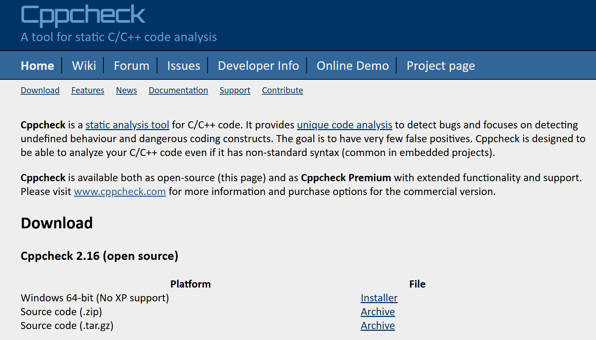
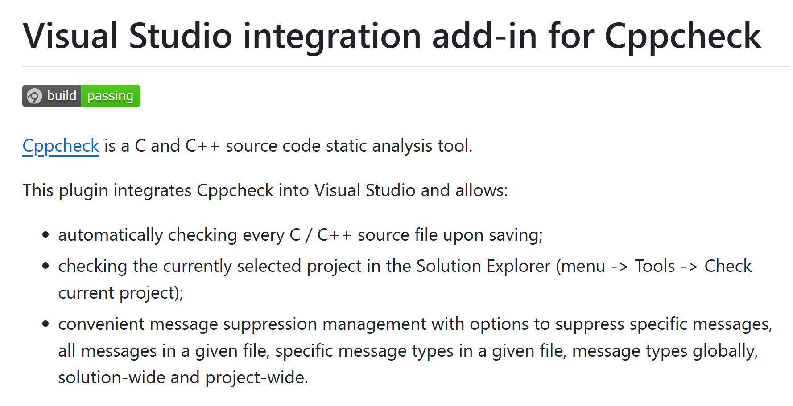
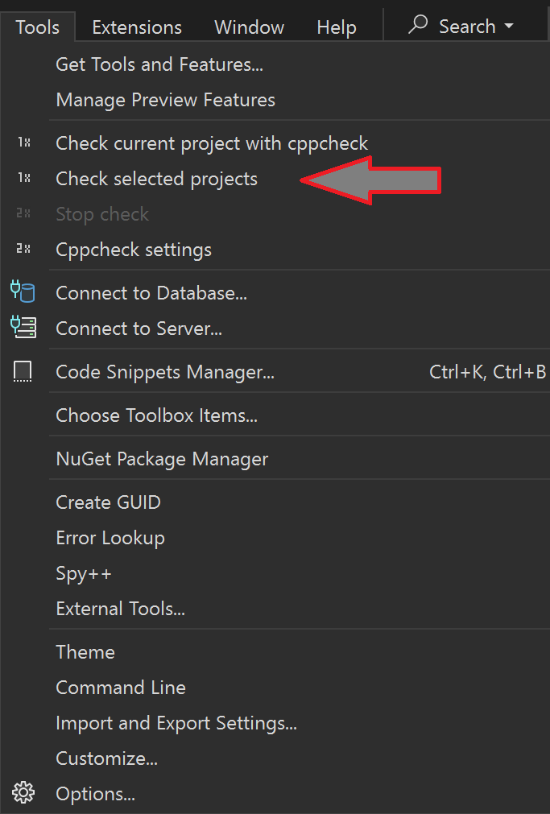
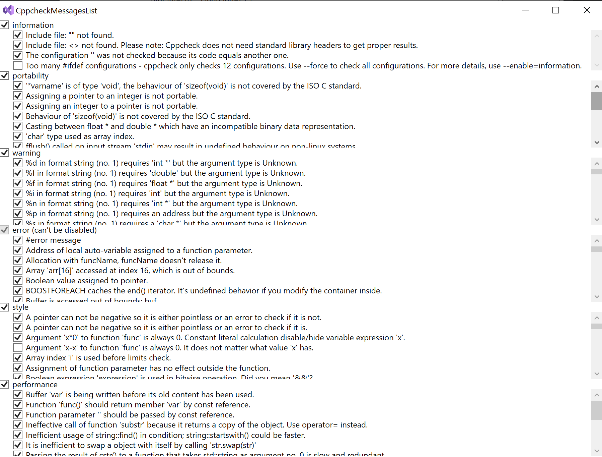
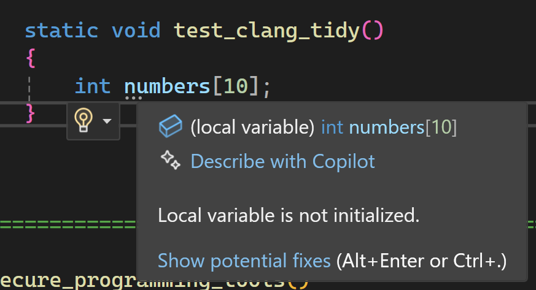

# Tools für Code-Analyse und -Bewertung

[Zurück](./Readme_Secure_Programming.md)

---

## Inhalt

#### Tools / Code-Analyse und -Bewertung
  
  * [Tool *Cppcheck*](#link1)
  * [Visual Studio Integration Add-In für *Cppcheck*](#link2)
  * [Visual Studio Address Sanitizer](#link3)
  * [Clang-Tidy](#link4)

---

#### Quellcode

[*SecureProgrammingTools.cpp*](SecureProgrammingTools.cpp) 

---

## Tool *Cppcheck* 

*Cppcheck* ist ein statisches Analysetool für C/C++-Quellcode.
Es bietet eine einzigartige Codeanalyse zum Erkennen von Fehlern und konzentriert sich auf das Erkennen undefinierten Verhaltens
und gefährlicher Codekonstrukte.

Das Ziel besteht darin, möglichst wenige Fehlalarme zu haben.
Cppcheck ist so konzipiert, dass es C/C++-Code analysieren kann,
auch wenn er eine nicht standardmäßige Syntax aufweist (was häufig bei Embedded C++ Projekten der Fall ist).

Mehrere Möglichkeiten zum Download finden sich [hier](https://cppcheck.sourceforge.io).

*Abbildung* 1: [https://cppcheck.sourceforge.io](https://cppcheck.sourceforge.io) Website.

*Cppcheck* ist sowohl als Open Source ([hier](https://cppcheck.sourceforge.io)) als auch als *Cppcheck Premium Paket*
mit erweiterter Funktionalität verfügbar.

Weitere Informationen und Kaufoptionen für die kommerzielle Version finden Sie unter [www.cppcheck.com](https://www.cppcheck.com/).

---

## Visual Studio Integration Add-In für Cppcheck 

Um *Cppcheck* mit Visual Studio zusammen betreiben zu können, greift man am besten auf
das [Visual Studio Integration Add-In](https://github.com/VioletGiraffe/cppcheck-vs-addin) für Cppcheck zurück.

*Abbildung* 2: [https://github.com/VioletGiraffe/cppcheck-vs-addin](https://github.com/VioletGiraffe/cppcheck-vs-addin) Website.

*Hinweis*:

Das Add-In stellt keine Installation des *Cppcheck*-Tools -bereit.
Bevor man dieses Add-In installiert, muss eine *Cppcheck*-Installation erfolgt sein.

Das Add-In fügt an diversen Stellen im Visual Studio neue Menüeinträge hinzu,
um das aktuelle Projekt überprüfen zu können:

*Abbildung* 3: Erweiterungen im Menü &bdquo;*Tools*&rdquo;

Zum Abschluss finden Sie in *Abbildung* 4 das *Settings*-Dialogfenster vor:

*Abbildung* 4: Spezifische Parametrierung des *Cppcheck*-Tools.

In diesem Fenster kann man spezifische Einstellungen vornehmen,
welche Meldungen man haben möchte &ndash; und welche vielleicht auch nicht.

---

## Visual Studio Address Sanitizer 

Für den Visual Studio Address Sanitizer gibt es bereits einen eigenen Abschnitt in diesem Repository,
siehe [hier](../Secure_Programming_Address_Sanitizer/Readme_Address_Sanitizer.md).

---

## Clang-Tidy 

*Clang-Tidy* ist ein Clang-basiertes C++-Linter-Tool.
Es bietet ein erweiterbares Framework zur Diagnose und Behebung typischer Programmierfehler,
wie z. B. Stilverstöße, Schnittstellenmissbrauch oder Fehler, die durch statische Analyse abgeleitet werden können.

Die Visual C++ Codeanalyse unterstützt Clang-Tidy nativ für MSBuild- und CMake-Projekte,
unabhängig davon, ob Clang- oder MSVC-Toolsets verwendet werden.

*Clang-Tidy*-Prüfungen werden im Rahmen der Codeanalyse im Hintergrund ausgeführt.

Sie werden als Warnungen im Editor (&bdquo;*Squiggles*&rdquo;, Schnörkel) und in der Fehlerliste angezeigt.

Clang-Tidy-Unterstützung ist ab Visual Studio 2019 Version 16.4 verfügbar.
Sie wird automatisch aktiviert, wenn Sie im Visual Studio Installer eine C++-Workload auswählen.

*Abbildung* 7: Beispiel einer *Clang-Tidy*-Meldung mit &bdquo;*Squiggles*&rdquo;.

---

[Zurück](./Readme_Secure_Programming.md)

---
