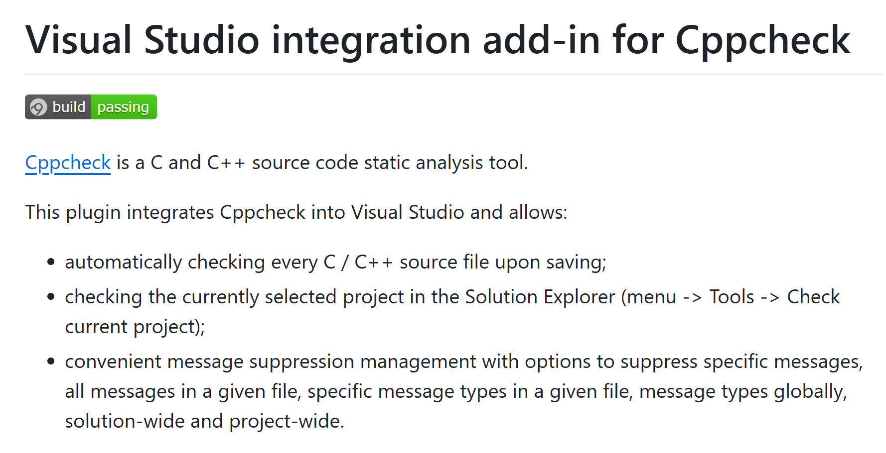
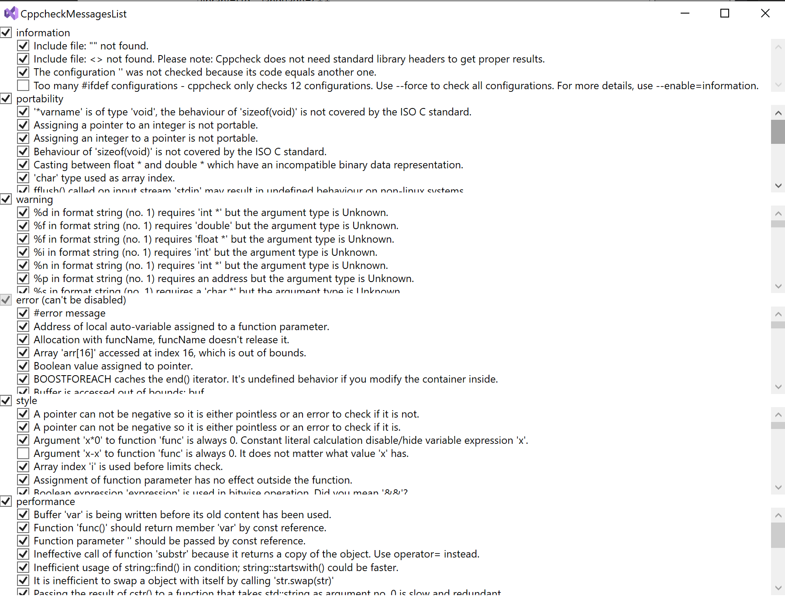
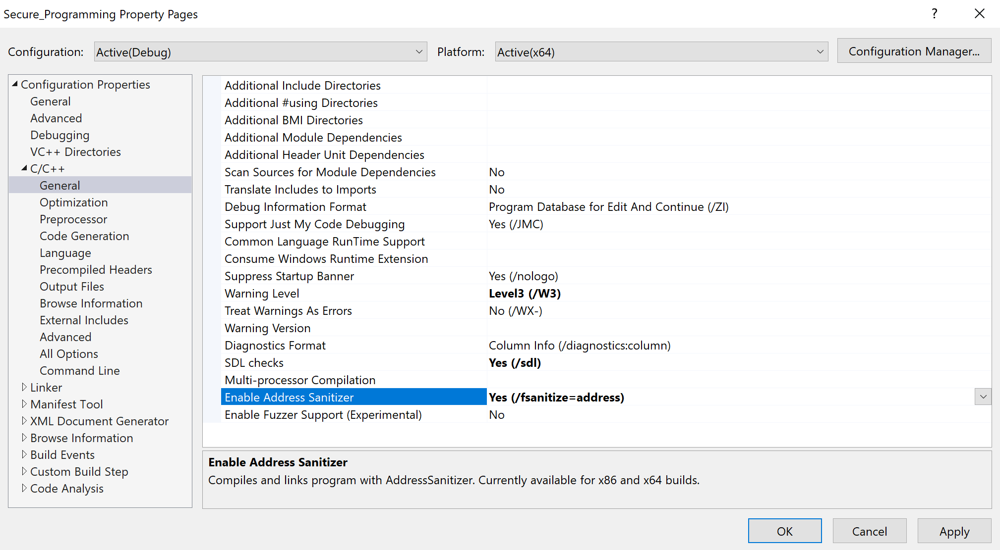

# Tools für Code-Analyse und -Bewertung

[Zurück](./Readme_Secure_Programming.md)

---

## Inhalt

#### Tools / Code-Analyse und -Bewertung
  
  * [Tool *Cppcheck*](#link1)
  * [Visual Studio Integration Add-In für *Cppcheck*](#link2)
  * [Visual Studio Address Sanitizer](#link3)
  * [Installation des Address Sanitizers](#link4)
  * [Clang-Tidy](#link5)

---

#### Quellcode

[*SecureProgrammingTools.cpp*](SecureProgrammingTools.cpp)<br />

---

## Tool *Cppcheck* <a name="link1"></a>

*Cppcheck* ist ein statisches Analysetool für C/C++-Quellcode.
Es bietet eine einzigartige Codeanalyse zum Erkennen von Fehlern und konzentriert sich auf das Erkennen undefinierten Verhaltens
und gefährlicher Codekonstrukte.

Das Ziel besteht darin, möglichst wenige Fehlalarme zu haben.
Cppcheck ist so konzipiert, dass es C/C++-Code analysieren kann,
auch wenn er eine nicht standardmäßige Syntax aufweist (was häufig bei Embedded C++ Projekten der Fall ist).

Mehrere Möglichkeiten zum Download finden sich [hier](https://cppcheck.sourceforge.io).


*Abbildung* 1: [https://cppcheck.sourceforge.io](https://cppcheck.sourceforge.io) Website.

*Cppcheck* ist sowohl als Open Source ([hier](https://cppcheck.sourceforge.io)) als auch als *Cppcheck Premium Paket*
mit erweiterter Funktionalität verfügbar.

Weitere Informationen und Kaufoptionen für die kommerzielle Version finden Sie unter [www.cppcheck.com](www.cppcheck.com).

---

## Visual Studio Integration Add-In für Cppcheck <a name="link2"></a>

Um *Cppcheck* mit Visual Studio zusammen betreiben zu können, greift man am besten auf
das [Visual Studio Integration Add-In](https://github.com/VioletGiraffe/cppcheck-vs-addin) für Cppcheck zurück.



*Abbildung* 2: [https://github.com/VioletGiraffe/cppcheck-vs-addin](https://github.com/VioletGiraffe/cppcheck-vs-addin) Website.

*Hinweis*:

Das Add-In stellt keine Installation des *Cppcheck*-Tools -bereit.
Bevor man dieses Add-In installiert, muss eine *Cppcheck*-Installation erfolgt sein.

Das Add-In fügt an diversen Stellen im Visual Studio neue Menüeinträge hinzu,
um das aktuelle Projekt überprüfen zu können:


*Abbildung* 3: Erweiterungen im Menü &bdquo;*Tools*&rdquo;

Zum Abschluss finden Sie in *Abbildung* 4 das *Settings*-Dialogfenster vor:



*Abbildung* 4: Spezifische Parametrierung des *Cppcheck*-Tools.

In diesem Fenster kann man spezifische Einstellungen vornehmen,
welche Meldungen man haben möchte &ndash; und welche vielleicht auch nicht.

---

## Visual Studio Address Sanitizer <a name="link3"></a>

So genannte *Address Sanitizer* sind eine Compiler- und Laufzeittechnologie,
die schwer zu findende Fehler aufdecken.

Address Sanitizer wurde ursprünglich von Google eingeführt
und bieten Technologien zur Laufzeitfehlersuche,
die das vorhandene Build-System und die vorhandenen Testressourcen direkt nutzen.

Der Visual C++ Sanitizer kann folgende Fehlerursachen aufspüren:

 * Alloc/dealloc mismatches and new/delete type mismatches
 * Allocations too large for the heap
 * `calloc` overflow and `alloca` overflow
 * *Double free* and use after free
 * Global variable overflow
 * Heap buffer overflow
 * Invalid alignment of aligned values
 * `memcpy` and `strncat` parameter overlap
 * Stack buffer overflow and underflow
 * Stack use after return and use after scope
 * Memory use after it's poisoned

#### Installation des Address Sanitizers <a name="link4"></a>

Zur Installation des Address Sanitizers finden sich [hier](https://learn.microsoft.com/en-us/cpp/sanitizers/asan?view=msvc-170) Hinweise.

Grundlegende Vorraussetzung ist natürlich, dass der Sanitizer bei der Visual Studio Installation mit berücksichtigt wurde:


*Abbildung* 5: Installation des Address Sanitizers in den Einstellungen des *Visual Studio Installers*.

Dann muss man den Sanitizer pro Projekt in den *Projekt Eigenschaften* aktivieren:



*Abbildung* 6: *Enable Address Sanitizer*-Einstellung in den Einstellungen des Projekts.


*Hinweis*:<br />
Bei Ausführung des Sanitizers auf meinem Rechner kommt es bei
den Ausgaben des Sanitizers zu einer Fehlermeldung:

*Visual Studio 22 - Asan - Failed to use and restart external symbolizer*

In *Stackoverflow* kann man
[hier](https://stackoverflow.com/questions/76781556/visual-studio-22-asan-failed-to-use-and-restart-external-symbolizer) nachlesen,
wie man den Fehler behebt.

Es muss &ndash; und das ist etwas schlecht in *SO* beschrieben &ndash;,
der zweite Pfad entfernt werden:

```
PATH=$(VC_ExecutablePath_x64);%PATH%
ASAN_SYMBOLIZER_PATH=$(VC_ExecutablePath_x64)
```
   
Es folgt ein Beispiel, um den Address Sanitizer zu testen:

```cpp
01: static int x[100];
02: 
03: void test() {
04:     
05:     std::println("Hello!");
06:     x[100] = 5; // Boom!
07:     std::println("Boom!");
08: }
```

Die Ausgaben in der Konsole sehen nun so aus:


```
Hello!
=================================================================
==16452==ERROR: AddressSanitizer: global-buffer-overflow on address 0x7ff604745af0 at pc 0x7ff60472111d bp 0x00576738fa10 sp 0x00576738fa18
WRITE of size 4 at 0x7ff604745af0 thread T0
    #0 0x7ff60472111c in SecureProgrammingPractices::UsingAddressSanitizer::test_address_sanitizer C:\Development\GitRepositoryCPlusPlus\Cpp_Clean_Performant_Code\Clean_Performant_Code\Secure_Programming\SecureProgramming.cpp:90
    #1 0x7ff604721184 in secure_programming_practices(void) C:\Development\GitRepositoryCPlusPlus\Cpp_Clean_Performant_Code\Clean_Performant_Code\Secure_Programming\SecureProgramming.cpp:107
    #2 0x7ff604721054 in main C:\Development\GitRepositoryCPlusPlus\Cpp_Clean_Performant_Code\Clean_Performant_Code\Secure_Programming\Program.cpp:9
    #3 0x7ff60472dcc8 in invoke_main D:\a\_work\1\s\src\vctools\crt\vcstartup\src\startup\exe_common.inl:78
    #4 0x7ff60472dc11 in __scrt_common_main_seh D:\a\_work\1\s\src\vctools\crt\vcstartup\src\startup\exe_common.inl:288
    #5 0x7ff60472dacd in __scrt_common_main D:\a\_work\1\s\src\vctools\crt\vcstartup\src\startup\exe_common.inl:330
    #6 0x7ff60472dd3d in mainCRTStartup D:\a\_work\1\s\src\vctools\crt\vcstartup\src\startup\exe_main.cpp:16
    #7 0x7ffce42d7373  (C:\WINDOWS\System32\KERNEL32.DLL+0x180017373)
    #8 0x7ffce521cc90  (C:\WINDOWS\SYSTEM32\ntdll.dll+0x18004cc90)

0x7ff604745af0 is located 0 bytes after global variable 'SecureProgrammingPractices::x' defined in 'SecureProgramming.cpp:83:15' (0x7ff604745960) of size 400
SUMMARY: AddressSanitizer: global-buffer-overflow C:\Development\GitRepositoryCPlusPlus\Cpp_Clean_Performant_Code\Clean_Performant_Code\Secure_Programming\SecureProgramming.cpp:90 in SecureProgrammingPractices::UsingAddressSanitizer::test_address_sanitizer
Shadow bytes around the buggy address:
  0x7ff604745800: 00 00 00 00 00 00 00 00 00 00 00 00 00 00 00 00
  0x7ff604745880: 00 00 00 00 00 00 00 00 00 00 00 00 00 00 00 00
  0x7ff604745900: 00 00 00 00 00 00 00 00 04 f9 f9 f9 00 00 00 00
  0x7ff604745980: 00 00 00 00 00 00 00 00 00 00 00 00 00 00 00 00
  0x7ff604745a00: 00 00 00 00 00 00 00 00 00 00 00 00 00 00 00 00
=>0x7ff604745a80: 00 00 00 00 00 00 00 00 00 00 00 00 00 00[f9]f9
  0x7ff604745b00: f9 f9 f9 f9 f9 f9 f9 f9 f9 f9 f9 f9 00 00 00 00
  0x7ff604745b80: 00 00 00 00 00 00 00 00 00 00 00 00 00 00 00 00
  0x7ff604745c00: 00 00 00 00 00 00 00 00 00 00 00 00 00 00 00 00
  0x7ff604745c80: 00 00 00 00 00 00 00 00 00 00 00 00 00 00 00 00
  0x7ff604745d00: 00 00 00 00 00 00 00 00 00 00 00 00 00 00 00 00
Shadow byte legend (one shadow byte represents 8 application bytes):
  Addressable:           00
  Partially addressable: 01 02 03 04 05 06 07
  Heap left redzone:       fa
  Freed heap region:       fd
  Stack left redzone:      f1
  Stack mid redzone:       f2
  Stack right redzone:     f3
  Stack after return:      f5
  Stack use after scope:   f8
  Global redzone:          f9
  Global init order:       f6
  Poisoned by user:        f7
  Container overflow:      fc
  Array cookie:            ac
  Intra object redzone:    bb
  ASan internal:           fe
  Left alloca redzone:     ca
  Right alloca redzone:    cb
==16452==ABORTING
```

---

## Clang-Tidy <a name="link5"></a>

*Clang-Tidy* ist ein Clang-basiertes C++-Linter-Tool.
Es bietet ein erweiterbares Framework zur Diagnose und Behebung typischer Programmierfehler,
wie z. B. Stilverstöße, Schnittstellenmissbrauch oder Fehler, die durch statische Analyse abgeleitet werden können.

Die Visual C++ Codeanalyse unterstützt Clang-Tidy nativ für MSBuild- und CMake-Projekte,
unabhängig davon, ob Clang- oder MSVC-Toolsets verwendet werden.

*Clang-Tidy*-Prüfungen werden im Rahmen der Codeanalyse im Hintergrund ausgeführt.

Sie werden als Warnungen im Editor (&bdquo;*Squiggles*&rdquo;, Schnörkel) und in der Fehlerliste angezeigt.

Clang-Tidy-Unterstützung ist ab Visual Studio 2019 Version 16.4 verfügbar.
Sie wird automatisch aktiviert, wenn Sie im Visual Studio Installer eine C++-Workload auswählen.


*Abbildung* 7: Beispiel einer *Clang-Tidy*-Meldung mit &bdquo;*Squiggles*&rdquo;.

---

[Zurück](./Readme_Secure_Programming.md)

---
