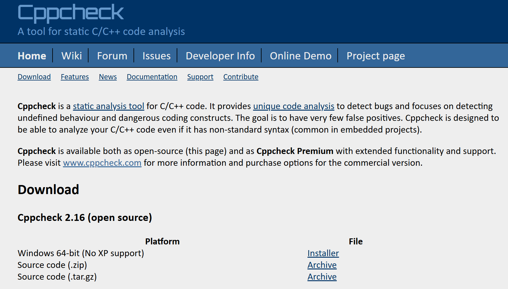
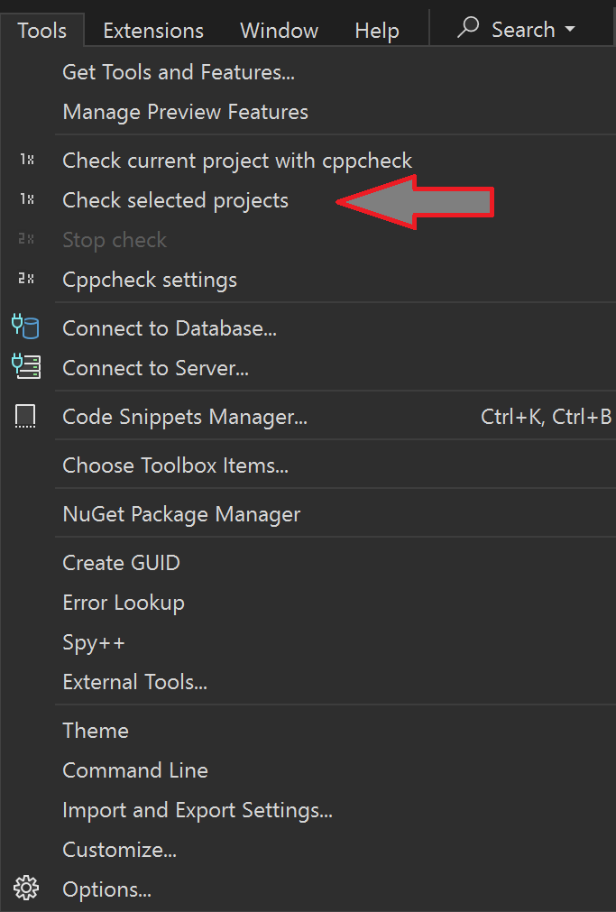

# Secure Programming

[Zurück](../../Markdown/Readme_Performance_Optimization.md)

---

## Inhalt

  * [Puffer Über-/Unterlauf (*Buffer Overflows/Underflows*)](#link)
  * [Speicherlecks (*Memory Leaks*)](#link)
  * [Race Conditions](#link)
  * [Arithmetischer Über-/Unterlauf (*Integer overflow/underflow*)](#link)
  * [Injection attacks](#link)
  * [Sicherer Umgang mit Pointern](#link)
  * [Input validation and sanitization](#link)
  * [Memory management](#link)
  * [Miscellaneous Secure coding techniques](#link)
  * [Error handling and logging](#link)
  * [Nutzung sicherer Bibliotheken und Funktionen](#link)
  * [Incorrect type conversion / Type Punning](#link)
  * [Type Punning](#link)
  * [XXX](#link)
  * [XXX](#link)
  * [Literatur](#link6)


  * [Unsigned Integer Wraparound](#link)
  * [Signed Integer Overflow](#link)
  * [Numeric Truncation](#link)
  * [Stack Buffer Overflow](#link)
  * [Heap Buffer Overflow](#link)
  * [Buffer Underflow](#link)
  * [Use after Free](#link)
  * [Double Free](#link)
  * [Incorrect Type Conversion](#link)
  * [Uncontrolled Format String](#link)

  
  Tools / Code-Analyse und -Bewertung
  
  * [Clang-Tidy](#link)
  * [Cppcheck](#link)


  Coding Standards:

  CERT C++ Secure Coding Standard
  MISRA C++
  C++ Core Guidelines


  https://www.youtube.com/watch?v=gHGMDFm2MVs

  Infinite Loop  // Sanitizer

  Optimizations : Disapperaing memset 9:30

  memset_s ???? _s Family of Functions ....

  12:00 Guter Überblick !!!


  https://github.com/patricia-gallardo/insecure-coding-examples/tree/main


---

## Einige Eigenschaften der Programmiersprache C

  * Passen C und &bdquo;Secure Programming&rdquo; zusammen? Nein!

  * Ist C als sichere, robuste Programmiersprache konzipert: Nein!

  * Ist es möglich, in C sichere und robuste Programme zu schreiben: Ja!

  * Gibt es ein Motto für C Programmierung: Ja: &bdquo;A Programmer knows what he does&rdquo;

  * Warum ist C so unglaublich erfolgreich: Weil man nahezu jedes erdenkliche Programm in C schreiben kann.

  * How to Shoot Yourself In the Foot using C: *You shoot yourself in the foot*.


---

## Einige Eigenschaften der Programmiersprache C++

  * Passen C++ und &bdquo;Secure Programming&rdquo; zusammen? Durchaus!

  * Ist C++ als sichere, robuste Programmiersprache konzipert: Ja!

  * Ist es möglich, in C++ sichere und robuste Programme zu schreiben: Ja!

  * Gibt es ein Motto für C++ Programmierung: Ja: &bdquo;Never trust a programmer who says he knows C++&rdquo;

  * Warum ist C++ so unglaublich erfolgreich: Preformance.

  * How to Shoot Yourself In the Foot using C: *You accidentally create a dozen instances of yourself and shoot them all in the foot. Providing emergency medical care is impossible since you can't tell which are bitwise copies and which are just pointing at others and saying &bdquo;that's me, over there.&rdquo;*.

---

## Sicherheitslücken versus Undefined Behaviour

In C/C++ gibt es sowohl Sicherheitslücken als auch das sogenannte *Undefined Behaviour* (kurz: *UB*).

Beide Begriffe liegen eng beieinander.

#### Beispiel für eine Sicherheitslücke: &bdquo;Use After Free&rdquo;

Es gibt den Datentyp Pointer in C/C++. Mit der Funktion `malloc` / dem Operator `new`
kann man Speicher reservieren, um ihn anschließend verwenden zu können.

Der Name &bdquo;Use After Free&rdquo; verrät eigentlich schon alles. Hierbei geht es darum, dass ein Zeiger auf eine Variable
nach seiner Freigabe weiterhin genutzt wird.

Es ist dem Compiler nicht möglich, zur Übersetzungszeit zu überprüfen,
ob Variablen, die nur via Zeiger erreichbar sind (`malloc`, `new`), noch verfügbar sind (`free`, `delete`).
Dies ist eine Sicherheitslücke in der Definition der Programmiersprache.

Andere Programmiersprachen gehen hier einen anderen Weg wie z. B. C# oder Java.
Hier wird vormals reservierter Speicher,
der im Programm keine Verwendung mehr findet, durch die Laufzeitumgtebung wieder freigegeben (*Garbage Collection*)

Die damit verbundene Anfälligkeit (Sicherheitslücke) hängt mit einem Fehler im Zusammenhang
mit dem Speichermanagement im Ablauf des Programms zusammen:

Aus der Nutzung der Variable nach ihrer Freigabe resultieren im Programm
unerwartete Aktionen oder andere unerwünschte Effekte. Dies bezeichnet man als *Undefined Behaviour*.
Häufig macht man die Beobachtung, dass *Undefined Behaviour* zu einem Absturz des Programms führt.

---


## *Type Punning*

Was bezeichnet man als *Type Punning*?

&bdquo;Eine Form des Zeigeraliasings, bei der zwei Zeiger auf dieselbe Stelle im Speicher verweisen,
diese Stelle aber aus der Sichtweise unterschiedlicher Datentypen betrachten.<br />
Der Compiler behandelt beide &bdquo;Punnings&rdquo; als nicht verwandte Zeiger.

*Type Punnings* können Abhängigkeitsprobleme für alle Daten verursachen, auf die über beide Zeiger zugegriffen wird.&rdquo;


---

#### Quellcode

[*BestPractices.cpp*](BestPractices.cpp)<br />

---

## Tool *Cppcheck*

*Cppcheck* ist ein statisches Analysetool für C/C++-Quellcode.
Es bietet eine einzigartige Codeanalyse zum Erkennen von Fehlern und konzentriert sich auf das Erkennen undefinierten Verhaltens
und gefährlicher Codekonstrukte.

Das Ziel besteht darin, möglichst wenige Fehlalarme zu haben.
Cppcheck ist so konzipiert, dass es C/C++-Code analysieren kann,
auch wenn er eine nicht standardmäßige Syntax aufweist (was häufig bei Embedded C++ Projekten der Fall ist).

Mehrere Möglichkeiten zum Download finden sich [hier](https://cppcheck.sourceforge.io).



*Abbildung* 1: [https://cppcheck.sourceforge.io](https://cppcheck.sourceforge.io) Website.

*Cppcheck* ist sowohl als Open Source ([hier](https://cppcheck.sourceforge.io) als auch als *Cppcheck Premium Paket*
mit erweiterter Funktionalität verfügbar.
Weitere Informationen und Kaufoptionen für die kommerzielle Version finden Sie unter [www.cppcheck.com](www.cppcheck.com).

---

## Visual Studio Integration Add-In für Cppcheck

Um *Cppcheck* mit Visual Studio zusammen betreiben zu können,
grift man am besten auf
das [Visual Studio Integration Add-In](https://github.com/VioletGiraffe/cppcheck-vs-addin) für Cppcheck zurück.


*Abbildung* 2: [https://github.com/VioletGiraffe/cppcheck-vs-addin](https://github.com/VioletGiraffe/cppcheck-vs-addin) Website.

*Hinweis*:

Das Add-In stellt keine Installation des *Cppcheck*-Tools -bereit.
Bevor man dieses Add-In installiert, muss eine *Cppcheck*-Installation erfolgt sein.

Das Add-In fügt an diversen Stellen im Visual Studio neue Menüeinträge hinzu,
um das aktuelle Projekt überprüfen zu können:



*Abbildung* 3: Erweiterungen im Menü &bdquo;*Tools*&rdquo;

Zum Abschluss finden Sie in *Abbildung* 4 das *Settings*-Dialogfenster vor:


*Abbildung* 4: Spezifische Parametrierung des *Cppcheck*-Tools.

In diesem Fenster kann man spezfische Einstellungen vornehmen,
welche Meldungen man haben möchte &ndash; und welche vielleicht auch nicht.

---

## Visual Studio Address Sanitizer

So genannte *Address Sanitizer* sind eine Compiler- und Laufzeittechnologie,
die schwer zu findende Fehler aufdecken.

Address Sanitizer wurde ursprünglich von Google eingeführt
und bieten Technologien zur Laufzeitfehlersuche,
die das vorhandene Build-Systeme und die vorhandenen Testressourcen direkt nutzen.

Der Visual C++ Sanitizer kann folgende Fehlerursachen aufspüren:

 * Alloc/dealloc mismatches and new/delete type mismatches
 * Allocations too large for the heap
 * calloc overflow and alloca overflow
 * Double free and use after free
 * Global variable overflow
 * Heap buffer overflow
 * Invalid alignment of aligned values
 * memcpy and strncat parameter overlap
 * Stack buffer overflow and underflow
 * Stack use after return and use after scope
 * Memory use after it's poisoned

 #### Installation des Address Sanitizers

Zur Installation des Address Sanitizers finden sich [hier](https://learn.microsoft.com/en-us/cpp/sanitizers/asan?view=msvc-170) Hinweise.

Grundlegende Vorraussetzung ist natürlich, dass der Sanitizer bei der Visual Studio Installation mit berücksichtigt wurde:


*Abbildung* 1: Installation des Address Sanitizers in den Einstellungen des *Visual Studio Installers*.

Dann muss man den Sanitizer pro Projekt in den *Projekt Eigenschgaften* aktivieren:


*Abbildung* 2: *Enable Address Sanitizer*-Einstellung in den Einstellungen des Projekts.


*Hinweis*:<br />
Bei Ausführung des Sanitizers auf meinem Rechner kommt es bei
den Ausgaben des Sanitizers zu einer Fehlermeldung:

*Visual Studio 22 - Asan - Failed to use and restart external symbolizer*

In *Stackoverflow* kann man
[hier](https://stackoverflow.com/questions/76781556/visual-studio-22-asan-failed-to-use-and-restart-external-symbolizer) nachlesen,
wie man den Fehler behebt.

Es muss &ndash; und das ist etwas schlecht in *SO* beschrieben &ndash;,
der zweite Pfad entfernt werden:

```
PATH=$(VC_ExecutablePath_x64);%PATH%
ASAN_SYMBOLIZER_PATH=$(VC_ExecutablePath_x64)
```
   
Es folgt ein Beispiel, um den Address Sanitizer zu testen:

```cpp
01: static int x[100];
02: 
03: void test() {
04:     
05:     std::println("Hello!");
06:     x[100] = 5; // Boom!
07:     std::println("Boom!");
08: }
```

Die Ausgaben in der Konsole sehen nun so aus:


```
Hello!
=================================================================
==16452==ERROR: AddressSanitizer: global-buffer-overflow on address 0x7ff604745af0 at pc 0x7ff60472111d bp 0x00576738fa10 sp 0x00576738fa18
WRITE of size 4 at 0x7ff604745af0 thread T0
    #0 0x7ff60472111c in SecureProgrammingPractices::UsingAddressSanitizer::test_address_sanitizer C:\Development\GitRepositoryCPlusPlus\Cpp_Clean_Performant_Code\Clean_Performant_Code\Secure_Programming\SecureProgramming.cpp:90
    #1 0x7ff604721184 in secure_programming_practices(void) C:\Development\GitRepositoryCPlusPlus\Cpp_Clean_Performant_Code\Clean_Performant_Code\Secure_Programming\SecureProgramming.cpp:107
    #2 0x7ff604721054 in main C:\Development\GitRepositoryCPlusPlus\Cpp_Clean_Performant_Code\Clean_Performant_Code\Secure_Programming\Program.cpp:9
    #3 0x7ff60472dcc8 in invoke_main D:\a\_work\1\s\src\vctools\crt\vcstartup\src\startup\exe_common.inl:78
    #4 0x7ff60472dc11 in __scrt_common_main_seh D:\a\_work\1\s\src\vctools\crt\vcstartup\src\startup\exe_common.inl:288
    #5 0x7ff60472dacd in __scrt_common_main D:\a\_work\1\s\src\vctools\crt\vcstartup\src\startup\exe_common.inl:330
    #6 0x7ff60472dd3d in mainCRTStartup D:\a\_work\1\s\src\vctools\crt\vcstartup\src\startup\exe_main.cpp:16
    #7 0x7ffce42d7373  (C:\WINDOWS\System32\KERNEL32.DLL+0x180017373)
    #8 0x7ffce521cc90  (C:\WINDOWS\SYSTEM32\ntdll.dll+0x18004cc90)

0x7ff604745af0 is located 0 bytes after global variable 'SecureProgrammingPractices::x' defined in 'SecureProgramming.cpp:83:15' (0x7ff604745960) of size 400
SUMMARY: AddressSanitizer: global-buffer-overflow C:\Development\GitRepositoryCPlusPlus\Cpp_Clean_Performant_Code\Clean_Performant_Code\Secure_Programming\SecureProgramming.cpp:90 in SecureProgrammingPractices::UsingAddressSanitizer::test_address_sanitizer
Shadow bytes around the buggy address:
  0x7ff604745800: 00 00 00 00 00 00 00 00 00 00 00 00 00 00 00 00
  0x7ff604745880: 00 00 00 00 00 00 00 00 00 00 00 00 00 00 00 00
  0x7ff604745900: 00 00 00 00 00 00 00 00 04 f9 f9 f9 00 00 00 00
  0x7ff604745980: 00 00 00 00 00 00 00 00 00 00 00 00 00 00 00 00
  0x7ff604745a00: 00 00 00 00 00 00 00 00 00 00 00 00 00 00 00 00
=>0x7ff604745a80: 00 00 00 00 00 00 00 00 00 00 00 00 00 00[f9]f9
  0x7ff604745b00: f9 f9 f9 f9 f9 f9 f9 f9 f9 f9 f9 f9 00 00 00 00
  0x7ff604745b80: 00 00 00 00 00 00 00 00 00 00 00 00 00 00 00 00
  0x7ff604745c00: 00 00 00 00 00 00 00 00 00 00 00 00 00 00 00 00
  0x7ff604745c80: 00 00 00 00 00 00 00 00 00 00 00 00 00 00 00 00
  0x7ff604745d00: 00 00 00 00 00 00 00 00 00 00 00 00 00 00 00 00
Shadow byte legend (one shadow byte represents 8 application bytes):
  Addressable:           00
  Partially addressable: 01 02 03 04 05 06 07
  Heap left redzone:       fa
  Freed heap region:       fd
  Stack left redzone:      f1
  Stack mid redzone:       f2
  Stack right redzone:     f3
  Stack after return:      f5
  Stack use after scope:   f8
  Global redzone:          f9
  Global init order:       f6
  Poisoned by user:        f7
  Container overflow:      fc
  Array cookie:            ac
  Intra object redzone:    bb
  ASan internal:           fe
  Left alloca redzone:     ca
  Right alloca redzone:    cb
==16452==ABORTING
```

---

## Literatur <a name="link6"></a>

---

[Zurück](../../Markdown/Readme_Performance_Optimization.md)

Die Anregungen zum konzeptionellen Beispiel finden Sie unter

[C++ Performance Optimization: Best Practices](https://hackernoon.com/c-performance-optimization-best-practices)

---
