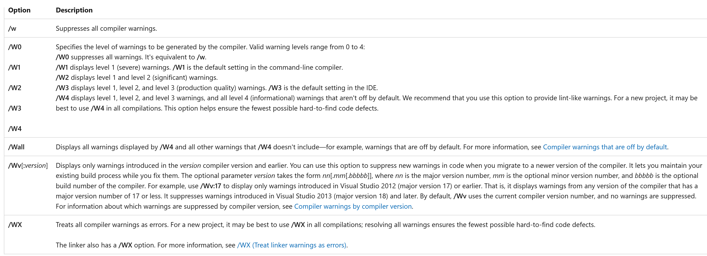

# Secure Programming Advices

[Zurück](../../Markdown/Readme_Secure_Programming.md)

---

## Inhalt

  * [Don't use C &ndash; Use C++](#link)
  * [Verwende mehrere Compiler](#link)
  * [*Warnings* und *Errors*](#link)
  * [Warning Level](#link)
  * [Verwenden Sie STL-Algorithmen](#link)
  * [Achte auf sicheres *Downcasting*](#link)
  * [Verzichte auf die direkte Verwendug des `new`-Operators](#link)
  * [Elementare Datentypen haben keine Bedeutung (*Semantics*), nur Wertebereiche](#link)


  * [Benutzerdefinierte Literale: Elementare Datentypen &bdquo;mit Bedeutung&rdquo;](#link)
  


  * 
 * [XXX](#link)
  * [XXX](#link)
  * [XXX](#link)
  * [XXX](#link)
  * [XXX](#link)
  * [XXX](#link)
  * [XXX](#link)


    
  Tools / Code-Analyse und -Bewertung
  
  * [Clang-Tidy](#link)
  * [Cppcheck](#link)


---

## Don't use C &ndash; Use C++

Sollten Sie die Wahl haben: Verwenden Sie C++ an Stelle von C.

Warum: C++ bietet bessere Typprüfungsmöglichkeiten und attraktivere Möglichkeiten in der Formulierung von Quellcode.
Es bietet bessere Unterstützung für die Programmierung auf höherer Ebene
und generiert häufig schnelleren Code.

Diese Aussage findet sich auch in den [C++ Core Guidelines](https://isocpp.github.io/CppCoreGuidelines/CppCoreGuidelines)
wieder: *Prefer C++ to C* (*CPL.1*).

Als Illustration vergleiche man das Konkatenieren von zwei Zeichenketten:
Einmal in C++ geschrieben und ein zweites Mal in C:

```c
01: std::string first{ "Hello " };
02: std::string second{ "World" };
03: std::string result{ first + second };
04: std::println("{}", result);
```

```cpp
01: char first[] = "Hello ";
02: char second[] = "World";
03: char result[20];
04: 
05: strcpy_s(result, 20, first);
06: strcat_s(result, 20, second);
07: std::printf("%s\n", result);
```

---

## Verwende mehrere Compiler

Alle C/++ Compiler übersetzen lt. Definition C/C++&ndash;Quellcode in Maschinencode.
Dennoch bedeutet das noch lange nicht, dass es hier keine Unterschiede.

Je komplexeren Quellcode Sie schreiben, kann es sein, dass der eine Compiler ein Programm ohne Warnungen und Fehlermeldungen
akzepetiert und übersetzt, ein anderer Compiler aber Warnungen oder im Extremfall sogar mit Fehlermeldungen reagiert.

Es empfiehlt sich daher, eine Code-Basis mit mehreren Compiler übersetzungsfähig zu halten.
Dies minimiert mögliche Nischenprobleme des einen oder anderen Übersetzers.
 
---

## *Warnings* und *Errors*

Vermutlich durften Sie diesen Hinweis schon oft über sich ergehen lassen:
Vermeiden Sie &ndash; so gut es geht &ndash; jegliche Warnungen, die ihr Übersetzer in ihrem Projekt erzeugt.
In den allermeisten Fällen ist eine Warning ein Hinweis, dass mit Ihrem Quellcode an dieser Stelle etwas nicht in Ordnung ist.
Nehmen Sie Warnungen nicht auf die leichte Schulter:

Eine Kostprobe:

```
Warning C4047 : '=': 'int' differs in levels of indirection from 'int *'
```

Dies wird zwar vom C/C++ Compiler als Warnung eingestuft, es handelt sich hierbei aber um einen beinharten Fehler!

*Bemerkung*:<br />
Über *Errors* müssen wir nicht so viel reden, weil bei Vorhandensein von Fehlern das Programm überhaupt nicht übersetzungsfähig ist.

---

## Warning Level

Der *Warning Level* gibt an, welche Compilerwarnungen angezeigt werden sollen und welches Warnverhalten während der gesamten Kompilierung gelten soll.

Je höher Sie den *Warning Level* einstellen, desto mehr Warnungen werden angezeigt:



*Abbildung* 3: Unterschiedliche *Warning Level* des Visual C++ Compilers.

---

## Verwenden Sie STL-Algorithmen

Algorithmen der STL sind robuster im Gebrauch als CRT-Bibliotheksfunktionen oder selbst geschriebene Funktionen.

*Beispiel*:

```cpp
01: std::string str{ "Hello World" }; // use also "Hello:World"
02: std::println("{}", str);
03: 
04: auto isColon = [] (int ch) { return ch == ':'; };
05: 
06: auto pos = std::find_if(str.begin(), str.end(), isColon);
07: 
08: // if found - delete everything afterwards
09: if (pos != str.end()) {
10:     str.erase(pos, str.end());
11: }
12: 
13: std::println("{}", str);
```


*Beispiel*:

```c
01: char str[] = "Hello World";    // use also "Hello:World"
02: std::printf("%s\n", str);
03: 
04: const char* pos = strstr(str, ":");
05: 
06: if (pos != NULL) {
07: 
08:     // if found - poke '\0' into string - this deletes everything afterwards
09:     size_t ofs = pos - str;
10:     str[ofs] = '\0';
11: }
12: 
13: std::printf("%s\n", str);
```

*Hinweis*:
Vermeiden Sie generell *manuelle* Wiederholungsschleifen!

Verwenden Sie Algorithmen der STL oder die C++ *Range-based Loop*:
Beide kommen ohne Schleifen-Indices aus, die eine häufige Ursache für Fehlerquellen sind.

---

## Achte auf sicheres *Downcasting*

An Stelle der unsicheren C-Cast Operatoren sollten man die sicheren C++-Cast Operatoren verwenden.

Ein Beispiel ist der Gebrauch von `static_cast`:

*Beispiel*:

```cpp
01: class Spiderman {};
02: class Ironman {};
03: 
04: void test() {
05: 
06:     Spiderman* ptr = new Spiderman;
07:     Ironman* ptr2 = nullptr;
08: 
09:     // compile error: 'static_cast': cannot convert from 'Spiderman *' to 'Ironman *'
10:     ptr2 = static_cast<Ironman*>(ptr);
11: }
```

*Beispiel*:

```c
01: class Spiderman {};
02: class Ironman {};
03: 
04: void test() {
05: 
06:     Spiderman* ptr = new Spiderman;
07:     Ironman* ptr2 = NULL;
08: 
09:     // compiles (!)
10:     ptr = (Spiderman*) ptr;
11: }
```

---

## Verzichte auf die direkte Verwendug des `new`-Operators

Siehe hierzu das entsprechende 
[C++ Core Guideline](https://isocpp.github.io/CppCoreGuidelines/CppCoreGuidelines)
mit dem Titel *Avoid calling new and delete explicitly* (*R.11*).


*Abbildung* 1: `std::unique_ptr`-Variablen haben Charme.


*Abbildung* 2: Stack-Variablen haben Charme.

Am Ende des Tages stellt sich bei einem mit `new` erzeugten Zeiger immer die Frage:
Wer hat wann und wo `delete` aufgerufen?

---

## Deklariere Konstruktoren mit einem einzigen Argument `explicit`


Standardmäßig sollten Konstruktoren mit einem Argument als  `explicit` deklariert werden.
Damit kann man unbeabsichtige Konvertierungen &ndash; und damit Überraschungen &ndash; vermeiden:

```cpp
01: class String {
02: public:
03:     String(size_t length) : m_length{ length } {};   // Surprise :)
04:     // ...
05: 
06: private:
07:     size_t m_length;
08:     // ...
09: };
10:     
11: void test() {
12: 
13:     String s = '!';  // Uhhh: String of length 33
14: }
```

Fügt man das Schlüsselwort vor dem Konstruktor hinzu, ist die `test`-Funktion nicht mehr übersetzungfähig:

```cpp
explicit String(size_t length) : m_length{ length } {}; 
```

---

## Elementare Datentypen haben keine Bedeutung (*Semantics*), nur Wertebereiche

Ein Datentyp wie `int` hat keine Bedeutung (*Semantik*).

Man kann nicht sagen, dass man das Alter eines Angestellten in einer `Employee`-Klasse mit
dem Typ `int` definieren sollte. `int`-Werte können sehr groß sein als auch negativ.
`size_t_`-Werte wiederum sind nicht negativ, aber können wieder extrem große Werte annehmen.

Es gibt die eine oder andere Möglichkeit, Werte mit einer Semantik zu verbinden:

  * Aufzählungstypen
  * `std::string` Literals
  * Benutzerdefinierte Literale
  * `size_t`

Enum-Klassen sind typsichere Klassen.
 
---

## Benutzerdefinierte Literale: Elementare Datentypen &bdquo;mit Bedeutung&rdquo;

In C++ lassen sich `int`-Werte (oder auch Werte anderen Datentyps) durch die so genannte *User Defined Literal* Syntax
erheblich lesbarer gestalten:

*Beispiel*:

```cpp
01: auto h = 23_hours;
02: auto d = 7_days;
03: // auto wrong = h + d;   // doesn't compile: Error
```

Dazu bedarf es der Implementierung des so genannten *Literal*-Operators:

```cpp
01: class Hours{
02: private:
03:     unsigned long long m_hours = 0;
04: 
05: public:
06:     Hours() : Hours(0) {}
07:     explicit Hours (unsigned long long hours) : m_hours(hours) {}
08: };
09:         
10: struct Days {
11: private:
12:     unsigned long long m_hours = 0;
13: 
14: public:
15:     Days() : Days(0) {}
16:     explicit Days(unsigned long long hours) : m_hours(hours) {}
17: };
18: 
19: static Hours operator"" _hours(unsigned long long hours) {
20:     return Hours{ hours };
21: }
22: 
23: static Days operator"" _days(unsigned long long hours) {
24:     return Days{ hours };
25: }
```

*Hinweis*:<br />
Es ist also nicht möglich, &bdquo;Stunden&rdquo; und &bdquo;Tage&rdquo; zu addieren.


Möchte man mit derartigen Konstanten auch Arithmetik betreiben können, geht das auch.
Man muss in diesem Fall die *Literal*-Operatoren nur anders definieren:

```cpp
01: using hours = unsigned long long;
02: 
03: static constexpr hours operator"" _hours(unsigned long long hours) {
04:     return hours;
05: }
06: 
07: static constexpr hours operator"" _days(unsigned long long hours) {
08:     return hours * 24;
09: }
10: 
11: static constexpr hours operator"" _weeks(unsigned long long hours) {
12:     return hours * 7 * 24;
13: }
14: 
15: void test() {
16: 
17:     auto hours = 12_hours;
18:     auto days = 2_days;
19:     auto weeks = 3_weeks;
20:     auto totalHours = weeks + days + hours;
21: }
```


---

## Datentyp `size_t`


Der Name `size_t` bedeutet im Wesentlichen &bdquo;*size type*&rdquo;,
und man verwendet diesen Datentyp normalerweise dann,
um die Größe oder Länge von Dingen anzugeben &ndash; wie beispielsweise die Länge einer C-Zeichenfolge,
die von der Funktion `strlen()` zurückgegeben wird.

`size_t` ist keiner der &bdquo;integrierten&rdquo; Datentypen von C/C++.
Stattdessen wird er im Regelfall in Headerdateien mit `typedef` oder `using` definiert.

Der genaue Datentyp ist implementierungsspezifisch, ist aber normalerweise eine Form eines vorzeichenlosen Integer-Typs.


  -----------------

  size_t für
  
  sizeof 

  Use it for object sizes
  Use is for container like objecst and their size
  Use it for array indexing and loop counting

  Controverse discussion


---


------------------


  Coding Standards:

  CERT C++ Secure Coding Standard
  MISRA C++
  C++ Core Guidelines


---

[Zurück](../../Markdown/Readme_Secure_Programming.md)

---
