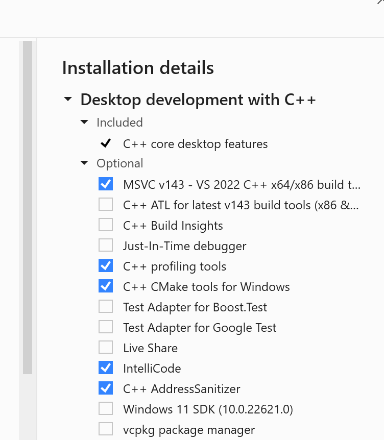
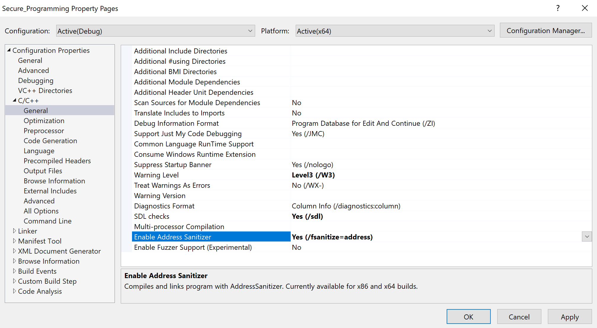

# Visual Studio Address Sanitizer

[Zurück](../Secure_Programming/Readme_Secure_Programming.md)

---

## Inhalt

#### Tools / Code-Analyse und -Bewertung
  	
  * [Allgemeines](#link1)
  * [Visual Studio Address Sanitizer](#link3)
  * [Installation des Address Sanitizers](#link4)
  * [Literatur](#link7)

---

#### Quellcode

[*XX.cpp*](XX.cpp)<br />

---

## Allgemeines <a name="link3"></a>

So genannte *Address Sanitizer* sind eine Compiler- und Laufzeittechnologie,
die schwer zu findende Fehler aufdecken.

Address Sanitizer wurde ursprünglich von Google eingeführt
und bieten Technologien zur Laufzeitfehlersuche,
die das vorhandene Build-System und die vorhandenen Testressourcen direkt nutzen.

Der Visual C++ Sanitizer kann folgende Fehlerursachen aufspüren:

 * Alloc/dealloc mismatches and new/delete type mismatches.
 * Allocations too large for the heap.
 * `calloc` overflow and `alloca` overflow.
 * *Double free* and use after free.
 * Global variable overflow.
 * Heap buffer overflow.
 * Invalid alignment of aligned values.
 * `memcpy` and `strncat` parameter overlap.
 * Stack buffer overflow and underflow.
 * Stack use after return and use after scope.
 * Memory use after it's poisoned.


## Debug- und Release-Build

In Visual Studio ist der Address Sanitizer sowohl im Debug- als auch im Release-Builds einsetzbar.

Die Wahl hängt jedoch von Ihrem spezifischen Ziel für die jeweilige Sitzung ab.

Verwende den Debug-Mode für die anfängliche Fehlersuche.

Dies ist der Standardansatz für die meisten Entwickler während der Programmierphase.

 * Voller Kontext: Man erhält präzise Zeilennummern und Variablennamen in den Fehlerberichten.
 * Keine Störung durch Optimierungen: Compiler &bdquo;optimieren&rdquo; manchmal fehlerhaften Code weg, wodurch es für ASan (Address Sanitizer) im Release-Modus schwieriger wird, diese Fehler zu erkennen.
 * Einfachere Einrichtung: ASan lässt sich im Debug-Modus oft leichter konfigurieren, da andere Debugging-Funktionen wie Assertions (`assert`) ergänzt werden.

Verwende den Release-Mode für &bdquo;versteckte&rdquo; oder leistungsintensive Fehler:

Wechseln Sie in diesen spezifischen Szenarien zu einem Release-Build mit ASan:

 * Fehler durch Optimierung: Manche Speicherprobleme treten nur dann auf, wenn der Compiler den Code in Bezg auf die Optimierung umstrukturiert hat.
 * Leistungsintensive Anwendungen: ASan verursacht einen erheblichen Mehraufwand (2- bis 3-mal langsamer). Wenn Ihre Anwendung im Debug-Modus zu langsam für Tests ist, kann ein Release-Build sie wieder nutzbar machen.
 * Continuous Integration (CI): Viele Teams erstellen eine spezielle &bdquo;Release-ASan&rdquo;-Konfiguration für automatisierte Tests, um sicherzustellen, dass der produktionsnahe Code-Pfad stabil ist.


## Installation des Address Sanitizers <a name="link4"></a>

Zur Installation des Address Sanitizers finden sich [hier](https://learn.microsoft.com/en-us/cpp/sanitizers/asan?view=msvc-170) Hinweise.

Grundlegende Voraussetzung ist natürlich, dass der Sanitizer bei der Visual Studio Installation mit berücksichtigt wurde:



*Abbildung* 1: Installation des *Address Sanitizers* in den Einstellungen des *Visual Studio Installers*.

Dann muss man den Sanitizer pro Projekt in den *Projekt Eigenschaften* aktivieren:



*Abbildung* 2: *Enable Address Sanitizer*-Einstellung in den Einstellungen des Projekts.


*Hinweis*:<br />
Bei Ausführung des Sanitizers auf meinem Rechner kommt es bei
den Ausgaben des Sanitizers zu einer Fehlermeldung:

*Visual Studio 22 - Asan - Failed to use and restart external symbolizer*

In *Stackoverflow* kann man
[hier](https://stackoverflow.com/questions/76781556/visual-studio-22-asan-failed-to-use-and-restart-external-symbolizer) nachlesen,
wie man den Fehler behebt.

Es muss &ndash; und das ist etwas schlecht in *SO* beschrieben &ndash;,
der zweite Pfad entfernt werden:

```
PATH=$(VC_ExecutablePath_x64);%PATH%
ASAN_SYMBOLIZER_PATH=$(VC_ExecutablePath_x64)
```
   

## Ein erstes Beispiel <a name="link4"></a>

Es folgt ein Beispiel, um den Address Sanitizer zu testen:

```cpp
01: int buffer[20];
02: 
03: void test_01_basic_global_buffer_overflow()
04: {
05:     std::println("Hello Global Buffer Overflow:");
06: 
07:     std::size_t n{ 20 };
08:     buffer[n] = 123; // Boom!
09: }
```

Die Ausgaben in der Konsole sehen nun so aus:


```
Hello Global Buffer Overflow:
=================================================================
==17760==ERROR: AddressSanitizer: global-buffer-overflow on address 0x7ff6391966b0 at pc 0x7ff6390b4f63 bp 0x000d5c6ffca0 sp 0x000d5c6ffca8
WRITE of size 4 at 0x7ff6391966b0 thread T0
    #0 0x7ff6390b4f62 in test_01_basic_global_buffer_overflow(void) C:\01_Basic_Global_Buffer_Overflow.cpp:15
    #1 0x7ff6390b4ea4 in main C:\Program.cpp:19
    #2 0x7ff639132628 in invoke_main D:\a\_work\1\s\src\vctools\crt\vcstartup\src\startup\exe_common.inl:78
    #3 0x7ff639132571 in __scrt_common_main_seh D:\a\_work\1\s\src\vctools\crt\vcstartup\src\startup\exe_common.inl:288
    #4 0x7ff63913242d in __scrt_common_main D:\a\_work\1\s\src\vctools\crt\vcstartup\src\startup\exe_common.inl:330
    #5 0x7ff63913269d in mainCRTStartup D:\a\_work\1\s\src\vctools\crt\vcstartup\src\startup\exe_main.cpp:16
    #6 0x7ff98b69e956  (C:\Windows\System32\KERNEL32.DLL+0x18002e956)
    #7 0x7ff98d36427b  (C:\Windows\SYSTEM32\ntdll.dll+0x18000427b)

0x7ff6391966b0 is located 0 bytes after global variable 'buffer' defined in '01_Basic_Global_Buffer_Overflow.cpp:7:4' (0x7ff639196660) of size 80
SUMMARY: AddressSanitizer: global-buffer-overflow C:\01_Basic_Global_Buffer_Overflow.cpp:15 in test_01_basic_global_buffer_overflow(void)
Shadow bytes around the buggy address:
  0x7ff639196400: 04 f9 f9 f9 00 f9 f9 f9 00 f9 f9 f9 00 f9 f9 f9
  0x7ff639196480: 00 f9 f9 f9 01 f9 f9 f9 00 00 00 00 f9 f9 f9 f9
  0x7ff639196500: 00 f9 f9 f9 00 f9 f9 f9 00 00 00 00 00 f9 f9 f9
  0x7ff639196580: f9 f9 f9 f9 00 00 00 00 00 f9 f9 f9 f9 f9 f9 f9
  0x7ff639196600: 00 00 00 00 00 f9 f9 f9 f9 f9 f9 f9 00 00 00 00
=>0x7ff639196680: 00 00 00 00 00 00[f9]f9 f9 f9 f9 f9 00 00 00 00
  0x7ff639196700: 00 00 00 00 00 00 00 00 00 00 00 00 00 00 00 00
  0x7ff639196780: 00 00 00 00 00 00 00 00 00 00 00 00 00 00 00 00
  0x7ff639196800: 00 00 00 00 00 00 00 00 00 00 00 00 00 00 00 00
  0x7ff639196880: 00 00 00 00 00 00 00 00 00 00 00 00 00 00 00 00
  0x7ff639196900: 00 00 00 00 00 00 00 00 00 00 00 00 00 00 00 00
Shadow byte legend (one shadow byte represents 8 application bytes):
  Addressable:           00
  Partially addressable: 01 02 03 04 05 06 07
  Heap left redzone:       fa
  Freed heap region:       fd
  Stack left redzone:      f1
  Stack mid redzone:       f2
  Stack right redzone:     f3
  Stack after return:      f5
  Stack use after scope:   f8
  Global redzone:          f9
  Global init order:       f6
  Poisoned by user:        f7
  Container overflow:      fc
  Array cookie:            ac
  Intra object redzone:    bb
  ASan internal:           fe
  Left alloca redzone:     ca
  Right alloca redzone:    cb
==17760==ABORTING
```

---

Fehler: alloc-dealloc-mismatch

Fassen Sie diesen Artikel für mich zusammen.
Address Sanitizer-Fehler: Diskrepanz zwischen Allokations- und Deallokations-APIs

Hinweise
Ermöglicht die Laufzeiterkennung von nicht übereinstimmenden Speicheroperationen, die zu undefiniertem Verhalten führen können – wie zum Beispiel:

`malloc` muss mit `free` gepaart werden, nicht mit `delete` oder `delete[]`.
`new` muss mit `delete` gepaart werden, nicht mit `free` oder `delete[]`.
`new[]` muss mit `delete[]` gepaart werden, nicht mit `delete` oder `free`.
Unter Windows ist die Fehlererkennung für `alloc-dealloc-mismatch` standardmäßig deaktiviert. Um sie zu aktivieren, setzen Sie die Umgebungsvariable `ASAN_OPTIONS=alloc_dealloc_mismatch=1`, bevor Sie Ihr Programm ausführen.


---


Literatur <a name="link7"></a>


https://learn.microsoft.com/en-us/cpp/sanitizers/asan?view=msvc-170


---

[Zurück](./Readme_Secure_Programming.md)

---
